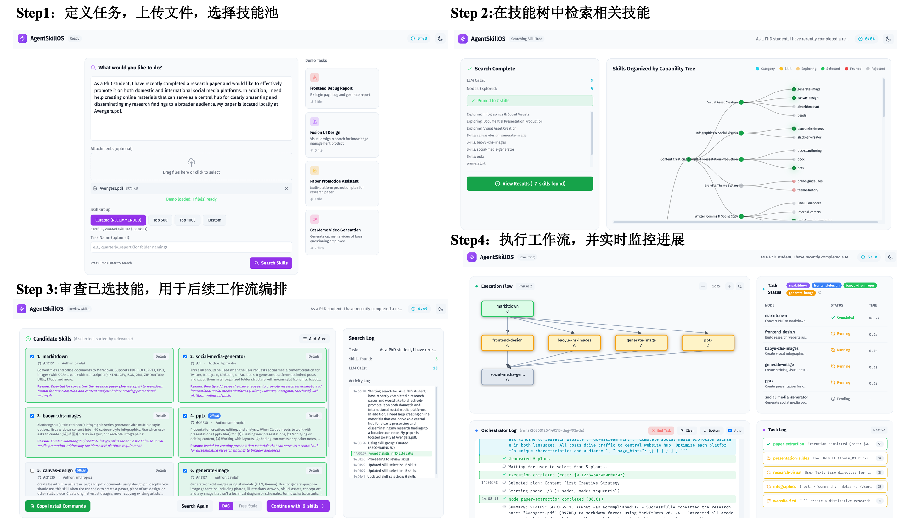
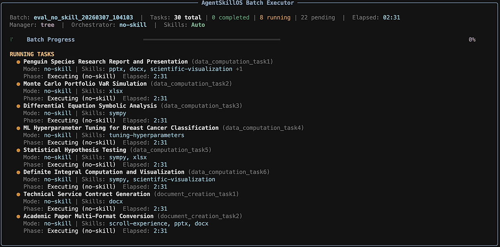
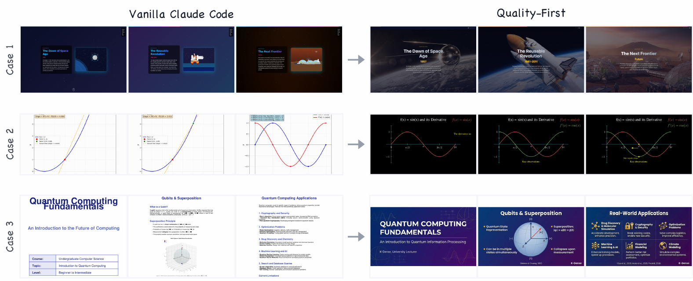
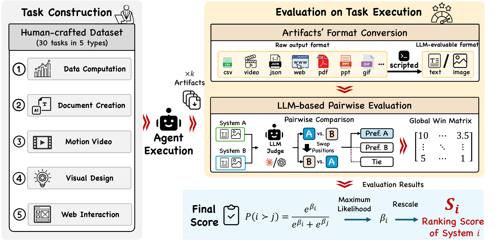
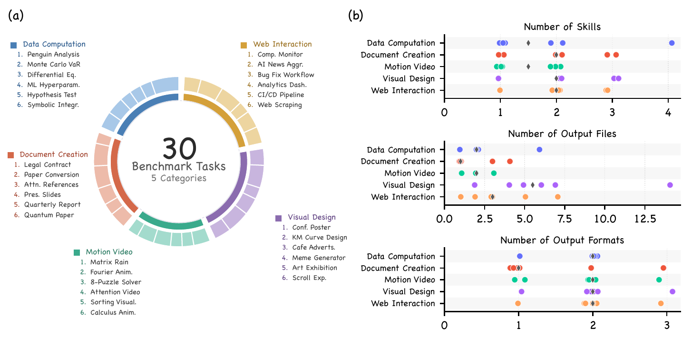
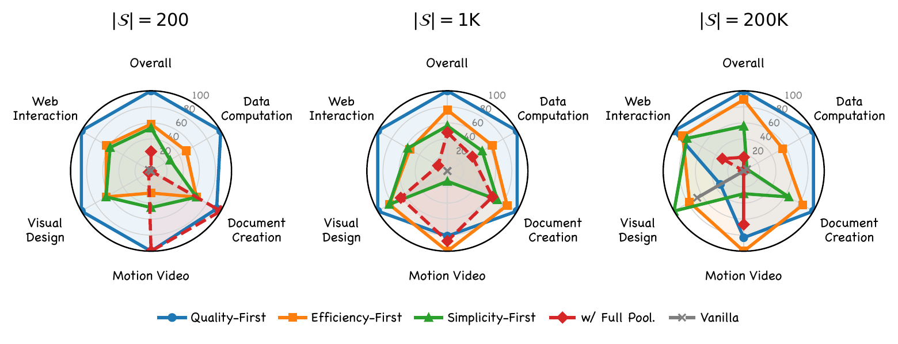
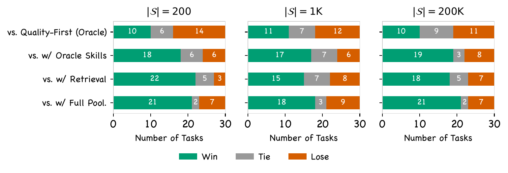
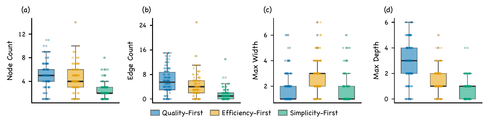

<p align="center">
  
</p>

<p align="center">
  <a href="README.md">English</a> | 简体中文
</p>

<h2 align="center">
  通过技能<ins>检索</ins>与<ins>编排</ins>，从 200,000+ 技能中构建Agent
</h2>


<p align="center">
  <a href="https://ynulihao.github.io/AgentSkillOS/"></a>
  <a href="https://www.python.org/downloads/"></a>
  <a href="https://opensource.org/licenses/MIT"></a>
  <a href="https://arxiv.org/abs/2603.02176"></a>
  <a href="https://huggingface.co/datasets/NPULH/agentskillos-benchmark"></a>

</p>

<p align="center">
  <a href="#️-方法"></a>
  <a href="#-benchmark"></a>
  <a href="#-示例"></a>
  <a href="#-使用方法"></a>
</p>

> **最新动态**
> - [2026/03] 我们的新版[项目主页](https://ynulihao.github.io/AgentSkillOS/)现已上线！
> - [2026/03] **Benchmark** 已发布 — 涵盖 5 大类别的 30 个多格式创意任务，采用 Bradley-Terry 成对评测。
> - [2026/03] **模块化架构**已上线 — 可插拔的检索/编排模块，详见 [ARCHITECTURE.md](ARCHITECTURE.md)。
> - [2026/03] **Batch CLI** 已发布 — 支持 YAML 配置的无界面并行批量执行，含断点续跑与 Rich 进度面板。

## 🌐 概述

<p align="center" style="font-size: 1.1em;">
  🔥 <b>Agent技能生态正在爆发式增长——目前已有超过 200,000+ 技能公开可用。</b>
</p>

<div align="center">

</div>

<p align="center">
  <i>
    但面对如此众多的选择，你如何找到适合任务的技能？当单个技能不够用时，你又该如何组合和编排多个技能来构建完整的工作流？<br>
    <br>
    <b>AgentSkillOS</b> 是Agent技能的操作系统——帮助你<b>发现、组合和端到端运行技能流水线</b>。
  </i>
</p>

<p align="center">
  <a href="https://www.youtube.com/watch?v=trh7doIZ3aA">
    
  </a>
</p>

<p align="center">
  
</p>

<p align="center">
  <sub><b>WEB UI</b> · 浏览器中的可视化工作流总览</sub>
</p>

<p align="center">
  
</p>

<p align="center">
  <sub><b>CLI</b> · 命令行中的无界面执行、进度与日志</sub>
</p>

 ## 🌟 核心亮点

- 🔍 **技能搜索与发现** — 通过技能树创造性地发现与任务相关的技能，技能树根据能力将技能组织成层次结构。
- 🔗 **技能编排** — 将多个技能组合编排成单一工作流，使用有向无环图自动管理执行顺序、依赖关系和跨步骤的数据流。
- 🖥️ **GUI（人机协作）** — 内置GUI支持在每个步骤进行人工干预，使工作流可控、可审计且易于引导。
- ⭐ **高质量技能池** — 精选的高质量技能集合，基于Claude的实现、GitHub星标数和下载量进行筛选。
- 📊 **可观测性与调试** — 通过日志和元数据追踪每个步骤，更快地调试并自信地迭代工作流。
- 🧩 **可扩展技能注册表** — 轻松插入新技能，通过灵活的注册表引入自定义技能。
- 📈 **Benchmark** — 涵盖 5 大类别的 30 个多格式创意任务，采用成对比较与 Bradley-Terry 聚合评测。

## 💡 示例

👉 [**在落地页查看详细工作流 →**](https://ynulihao.github.io/AgentSkillOS/)

📊 [**查看对比报告：AgentSkillOS vs. 无技能 →**](comparison_zh.md)


> 原始基线与 AgentSkillOS 质量优先输出的定性对比。

<table>
<tr>
<td width="50%" align="center">
<a href="https://ynulihao.github.io/AgentSkillOS/example-bug.html">

</a>
<br><b>示例 01 · Bug 诊断报告</b>
<br><sub>移动端问题定位、修复验证与可视化 Bug 报告生成（含修复前后证据）。</sub>
</td>
<td width="50%" align="center">
<a href="https://ynulihao.github.io/AgentSkillOS/example-ui.html">

</a>
<br><b>示例 02 · UI 设计研究</b>
<br><sub>面向知识软件的设计语言研究、报告生成与多方向概念稿输出。</sub>
</td>
</tr>
<tr>
<td width="50%" align="center">
<a href="https://ynulihao.github.io/AgentSkillOS/example-paper.html">

</a>
<br><b>示例 03 · 论文推广</b>
<br><sub>将学术论文转译为社交幻灯片、科研页面与平台适配推广内容。</sub>
</td>
<td width="50%" align="center">
<a href="https://ynulihao.github.io/AgentSkillOS/example-video.html">

</a>
<br><b>示例 04 · 病毒式短视频</b>
<br><sub>绿幕合成、字幕时序与多版本病毒式短视频生产。</sub>
</td>
</tr>
</table>

<!--
> Capability Tree organizes skills hierarchically → Complementarity-aware Retrieval selects diverse skill sets → Graph-based Orchestration executes them as DAG -->
## 🏗️ 方法
- 技能树构建：将超过 200,000+ 技能组织成能力树，提供结构化的粗到细访问，实现高效且创造性的技能发现。
- 技能检索：根据用户请求自动选择与任务相关的可用技能子集。
- 技能编排：将选定的技能组合成协调的计划（例如，基于DAG的工作流），以解决任何单个技能无法完成的任务。注意，我们也支持自由模式（即Claude Code）。


### 🌲 为什么使用技能树？


> **左图**：纯语义检索优先考虑文本相似性，经常遗漏那些在嵌入空间中看起来不相关但对实际解决任务至关重要的技能——导致技能使用狭窄、短视。
>
> **右图**：我们的LLM + 技能树导航能力层次结构，挖掘出非显而易见但功能相关的技能，实现更广泛、更具创造性和更有效的技能组合。

<table>
<tr>
<td align="center"><b>200 技能</b></td>
<td align="center"><b>1,000 技能</b></td>
<td align="center"><b>10,000 技能</b></td>
</tr>
<tr>
<td></td>
<td></td>
<td></td>
</tr>
</table>

## 📈 Benchmark

我们提出了一个包含 **30 个多格式创意任务**、涵盖 **5 大类别**的 Benchmark，采用成对比较与 Bradley-Terry 聚合进行评测。

三项核心特性：
- **多格式创意任务** — 任务要求输出面向终端用户的多格式产物，如 PDF、PPTX、DOCX、HTML、视频与图像。
- **成对评估** — 结果在双向顺序下比较，以降低位置偏差并获得稳定偏好信号。
- **Bradley-Terry 评分** — 将成对偏好聚合为连续排名分数，实现细粒度系统对比。

<table>
<tr>
<td width="50%" align="center">

</td>
<td width="50%" align="center">

</td>
</tr>
</table>

## 🧪 实验

在 200 / 1K / 200K 三个生态规模下评估，AgentSkillOS 展现出对基线的持续优势；消融实验证实检索与编排缺一不可；策略选择产生结构性不同的执行图。

**核心结论：**
- **在各规模下均大幅超越基线** — 三个 AgentSkillOS 变体在 200 / 1K / 200K 生态中均获得最高 Bradley-Terry 分数。将全部技能直接提供给 Agent 的 Full Pool 基线表现不佳，因为随着生态扩大，越来越多技能变得不可见——结构化检索与编排克服了这一可扩展性瓶颈。
- **消融实验：检索与编排缺一不可** — 逐步移除组件呈现清晰的退化梯度：缺少 DAG 编排时，仅靠检索不够；缺少检索时，即使给定 oracle 技能也无法弥补差距。与 oracle 上界对比，Quality-First 仅存微小差距且随生态扩大而缩小，验证了能力树检索可有效逼近 oracle 技能选择。
- **策略选择决定执行结构** — 每种编排策略都将设计意图忠实映射为不同的 DAG 拓扑。Quality-First 构建深层多阶段流水线；Efficiency-First 以宽度换深度来最大化并行；Simplicity-First 仅保留关键步骤。用户只需选择策略，即可真正控制质量-速度-简洁性的权衡。

<table>
<tr>
<td colspan="2" align="center">

<br><sub><b>类别雷达图</b> — 跨生态规模的类别级 Bradley-Terry 表现，展示稳定且全面的能力覆盖。</sub>
</td>
</tr>
<tr>
<td width="50%" align="center">

<br><sub><b>消融实验</b> — 拆分检索与编排贡献，验证两者都不可缺失。</sub>
</td>
<td width="50%" align="center">

<br><sub><b>DAG 结构指标</b> — 不同编排策略对应不同拓扑特征（深度、宽度、边数、节点数）。</sub>
</td>
</tr>
</table>

## 🚀 使用方法

<details>
<summary><b>安装与配置</b></summary>

### 前置条件
- Python 3.10+
- [Claude Code](https://github.com/anthropics/claude-code)（必须安装并添加到PATH）
- 使用 [cc-switch](https://github.com/farion1231/cc-switch) 切换到其他LLM提供商

### 安装与运行
```bash
git clone https://github.com/ynulihao/AgentSkillOS.git
cd AgentSkillOS
pip install -e .
cp .env.example .env  # 编辑并填入你的API密钥
python run.py --port 8765
```

### 下载预构建的技能树
| 技能树 | 技能数量 | 描述 |
|------|--------|-------------|
| 🌱 `skill_seeds` | ~50 | 精选技能集（默认） |
| 📦 `skill_200` | 200 | 200 个技能 |
| 🗃️ `skill_1000` | ~1,000 | 1,000 个技能 |
| 🏗️ `skill_10000` | ~10,000 | 10,000 个活跃技能 + 分层休眠技能 |

- [Google Drive](https://drive.google.com/file/d/1IHbnrv9aSnsnMGYHzVTZJ8EtQl0dJfUL/view?usp=sharing) | [百度网盘 (cei9)](https://pan.baidu.com/s/1Sg_a33PjLbYrBZj4hmsb-w?pwd=cei9)

### 配置
```bash
# .env
LLM_MODEL=openai/anthropic/claude-opus-4.5
LLM_BASE_URL=https://openrouter.ai/api/v1
LLM_API_KEY=your-key

EMBEDDING_MODEL=openai/text-embedding-3-large
EMBEDDING_BASE_URL=https://api.openai.com/v1
EMBEDDING_API_KEY=your-key
```

### 自定义技能组
1. 创建 `data/my_skills/skill-name/SKILL.md`
2. 在 `src/config.py` → `SKILL_GROUPS` 中注册
3. 构建：`python run.py build -g my_skills -v`

</details>

<details>
<summary><b>批量执行（无界面 CLI）</b></summary>

### 运行批量任务

无需 Web UI，并行执行多个任务：

```bash
python run.py cli --task config/batch.yaml
```

参见 [`config/eval/`](config/eval/) 获取预置的批量配置，涵盖不同的技能管理器（`tree`、`vector`）、编排器（`dag`、`free-style`）和技能池规模。

### 批量配置（YAML）

```yaml
batch_id: my_batch

defaults:
  skill_mode: auto          # "auto"（自动发现）或 "specified"（指定技能）
  skill_group: skill_200    # 使用的技能池
  output_dir: ./runs
  continue_on_error: true

execution:
  parallel: 2               # 最大并行任务数
  retry_failed: 0

tasks:
  - file: path/to/task1.json
  - file: path/to/task2.json
  - dir: path/to/tasks/     # 扫描目录
    pattern: "*.json"
```

### CLI 参数

| 参数 | 说明 |
|------|------|
| `--task PATH`, `-T` | 批量 YAML 配置文件路径（必填） |
| `--parallel N`, `-p` | 覆盖并行任务数 |
| `--resume PATH`, `-R` | 从中断的批次续跑 |
| `--output-dir PATH`, `-o` | 覆盖输出目录 |
| `--dry-run` | 仅预览，不实际执行 |
| `--verbose`, `-v` | 显示详细日志 |
| `--manager PLUGIN`, `-m` | 覆盖技能管理器（如 `tree`、`vector`） |
| `--orchestrator PLUGIN` | 覆盖编排器（如 `dag`、`free-style`） |

### 断点续跑

```bash
python run.py cli -T config/batch.yaml --resume ./runs/my_batch_20260306_120000
```

已完成的任务将被跳过，仅重新执行剩余任务。

### 输出结构

```
./runs/{batch_id}/
├── batch_result.json          # 批次汇总（指标、费用、评测分数）
└── {task_id}__{run_id}/       # 每个任务的目录
    ├── meta.json
    ├── result.json
    ├── evaluation.json
    └── artifacts/             # 任务产物（PDF、HTML、视频等）
```

</details>

## 🔮 未来计划
- [x] 配方生成与存储
- [ ] 交互式Agent执行
- [ ] 计划优化
- [ ] 自动技能导入
- [ ] 依赖检测
- [ ] 历史管理
- [ ] 多CLI支持（Codex、Gemini CLI、Cursor）


## 引用

如果你觉得AgentSkillOS有用，请考虑引用我们的论文：
```bibtex
@article{li2026organizing,
  title={Organizing, Orchestrating, and Benchmarking Agent Skills at Ecosystem Scale},
  author={Li, Hao and Mu, Chunjiang and Chen, Jianhao and Ren, Siyue and Cui, Zhiyao and Zhang, Yiqun and Bai, Lei and Hu, Shuyue},
  journal={arXiv preprint arXiv:2603.02176},
  year={2026}
}
```
