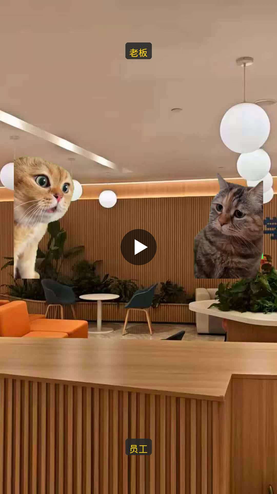
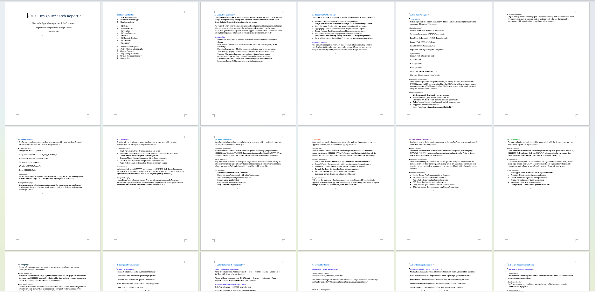
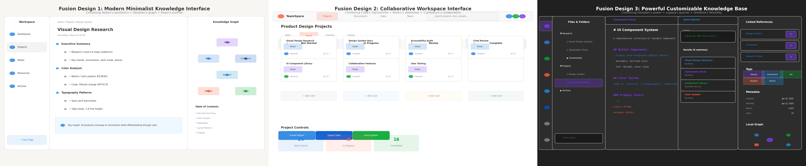
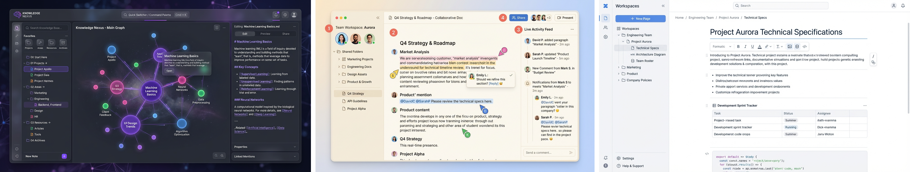
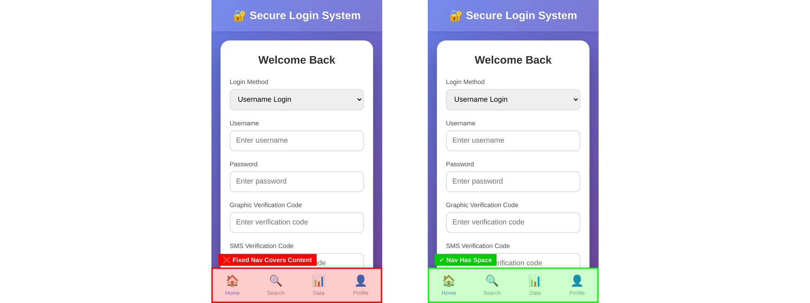
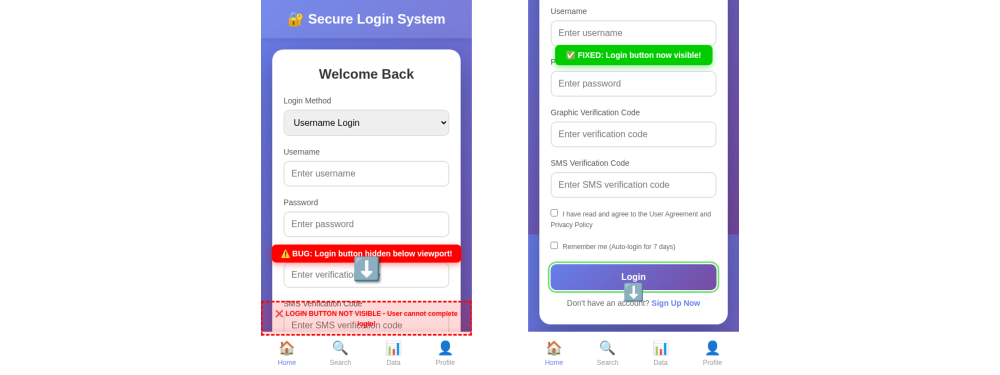
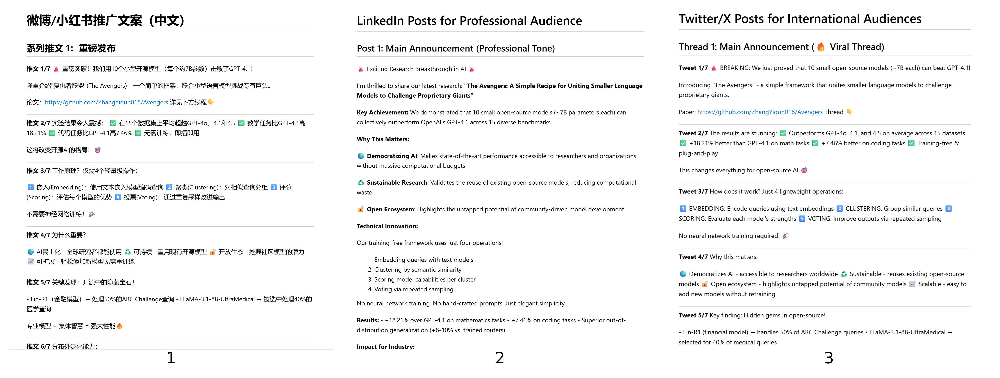
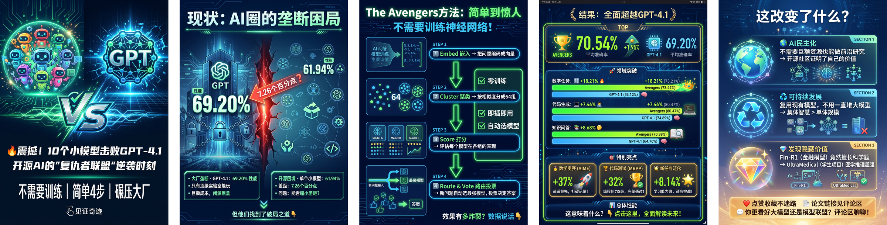
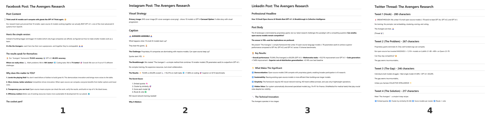
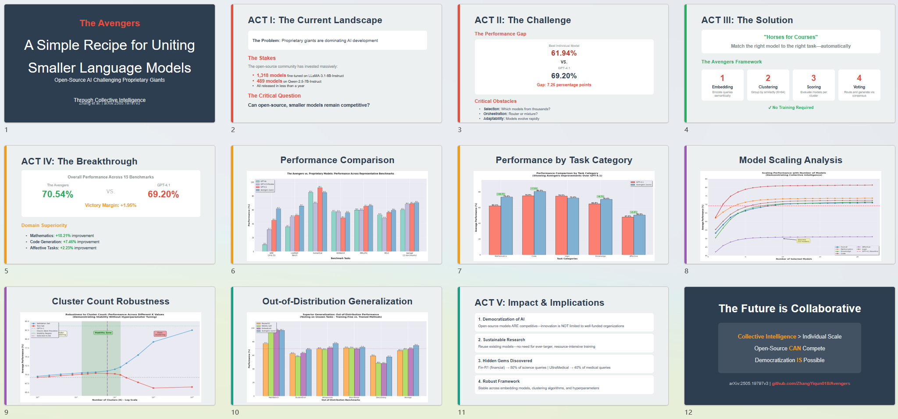

# AgentSkillOS vs. 无技能：对比分析

本文档展示了AI智能体在有无AgentSkillOS能力情况下的性能对比。每个案例都展示了专业技能如何实现更完整、更专业、更符合上下文的输出。

---

## 案例 1: 猫咪表情包视频生成

> **提示词：** 我是一名短视频创作者。生成一个猫咪表情包视频，展示老板（愤怒猫）质问员工（悲伤猫）工作进度，配上机智的回应。使用 `video.mp4`（绿幕素材）和 `background.jpg`。要求：去除绿幕、保持宽高比、添加"老板"/"员工"标签、字幕与猫叫声同步，并创作具有病毒传播潜力的幽默对话。

### 🥲 无技能

生成的视频**质量较差**，**无法直接使用**。

  

<!-- 

  

 -->

### 🥳 使用 AgentSkillOS

智能体成功处理了绿幕视频，将其合成到背景上，添加了同步字幕和幽默对话，并导出了一个**完整的、可直接分享的表情包视频**。

  

**关键差异：** AgentSkillOS 提供了视频处理能力（色度键去除、文字叠加、音频同步），这些是基础智能体无法实现的。

**AgentSkillOS 使用的技能：**
- `ffmpeg-color-grading-chromakey`: 使用FFmpeg进行绿幕去除和调色
- `media-processing`: 使用FFmpeg和ImageMagick进行视频、音频和图像处理
- `joke-engineering`: 使用系统思维诊断和改进幽默

---

## 案例 2: UI设计研究与概念生成

> **提示词：** 我是一名产品设计师，正在规划一款知识管理软件。研究Notion和Confluence等产品，然后创建一份包含截图的视觉设计风格报告（`report.docx`）。基于分析，生成三张融合其设计特点的设计概念图（`fusion_design_1/2/3.png`）。

### 🥲 无技能

智能体生成了一份**纯文本的Word文档**，没有任何视觉截图或设计模型。由Python代码生成的"设计概念"难以提供创意灵感。

**生成的报告（无截图）：**

**生成的图片（低质量）：**

### 🥳 使用 AgentSkillOS

智能体利用网页浏览和图像生成技能，生成了一份**包含实际产品截图的全面设计报告**和专业质量的设计概念渲染图。

**生成的设计风格报告：**

**生成的设计概念：**

**关键差异：** AgentSkillOS 结合了网页研究、截图捕获和AI图像生成技能，交付完整的设计研究成果，而基础智能体只能生成文本描述。

**AgentSkillOS 使用的技能：**
- `dev-browser`: 具有持久页面状态的浏览器自动化
- `docx`: 创建、编辑和分析Word文档
- `generate-image`: 使用AI模型（FLUX、Gemini）生成或编辑图像

---

## 案例 3: 前端Bug诊断与报告

> **提示词：** 我是一名前端开发者。用户反馈在移动设备上访问我的登录页面（`login_en.html`）时出现bug。请识别并修复该bug，然后生成一份包含修复前后截图的bug报告（`bug_report.md`），突出显示问题所在。

### 🥲 无技能

智能体成功识别并修复了bug，但**未能捕获显示修复效果的"修复后"截图**。没有视觉验证，bug报告是不完整的。

### 🥳 使用 AgentSkillOS

智能体利用浏览器自动化技能捕获了准确的修复前后截图，生成了一份**包含视觉证据的完整bug报告**，成功展示了修复效果。对比清楚地展示了UI的改进。

**关键差异：** AgentSkillOS 实现了正确的浏览器自动化以进行截图捕获，而基础智能体缺乏准确渲染和捕获网页的能力。

**AgentSkillOS 使用的技能：**
- `dev-browser`: 具有持久页面状态的浏览器自动化
- `frontend-design`: 创建独特的、生产级的前端界面

---

## 案例 4: 学术论文推广

> **提示词：** 作为一名博士生，我完成了一篇研究论文（`Avengers.pdf`），想在社交媒体平台上推广它。帮我创建推广材料，有效地向更广泛的受众展示我的研究成果。

### 🥲 无技能

智能体生成了适合复制粘贴的**纯文本帖子**，但没有任何视觉吸引力或平台特定的格式。内容缺乏能够推动社交媒体参与度的引人注目的图形。

### 🥳 使用 AgentSkillOS

智能体创建了一套**多格式推广套件**，包括：

**小红书视觉帖子：**

**跨平台社交媒体内容：**

**学术演示幻灯片：**

**关键差异：** AgentSkillOS 能够创建视觉吸引力强、针对平台优化的内容和适当的信息图，而基础智能体仅限于纯文本输出。

**AgentSkillOS 使用的技能：**
- `markitdown`: 将文件和Office文档转换为Markdown
- `baoyu-xhs-images`: 小红书信息图系列生成器
- `social-media-generator`: 创建针对平台优化的社交媒体内容
- `data-visualization`: 创建有效的数据可视化
- `generate-image`: 使用AI模型（FLUX、Gemini）生成或编辑图像
- `pptx`: 创建、编辑和分析PowerPoint演示文稿
- `data-storytelling`: 将数据转化为引人入胜的叙事

---

## 总结

| 能力 | 无技能 | 使用 AgentSkillOS |
|------------|----------------|--------------|
| **浏览器自动化** | 有限 | 完整的截图和交互 |
| **图像生成** | 基础/无 | 专业的AI生成视觉效果 |
| **文档创建** | 纯文本 | 包含截图的富媒体内容 |
| **视频处理** | 质量差 | 色度键、字幕、合成 |
| **网页研究** | 文本描述 | 实时截图和数据提取 |

**结论：** AgentSkillOS 通过提供多媒体创作、网页交互和内容生成的专业工具，大大扩展了AI智能体的能力。使用基础智能体无法完成或不完整的任务，通过正确的技能集成变得完全可行。
