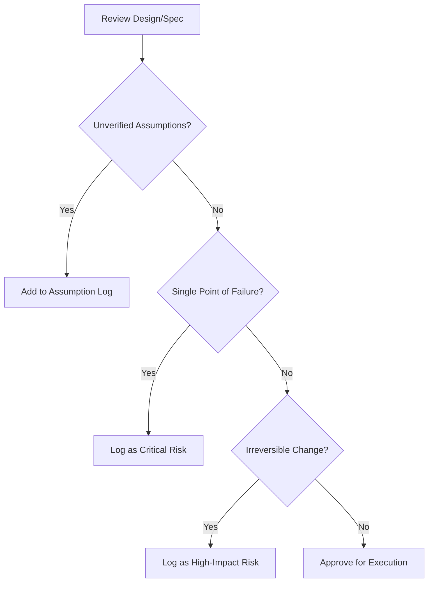

# Assumption and Risk Hunter

## Purpose

Acts as a "red team" for plans and specifications. It identifies what we *think* is true but haven't verified, and what could go wrong if those assumptions fail.

## When to use this skill
- After an initial MVP design or specification is drafted
- Before moving from "Planning" to "Execution" phase
- Before executing a high-risk migration or cutover

## Hunting Steps

1. **Surface Implicit Assumptions**: Look for phrases like "assuming X", "users will...", "it should...".
2. **Rank Risks**: Evaluate each risk based on its Probability and its Impact on the project goals.
3. **Identify Irreversible Decisions**: Flag "one-way doors" that are hard to undo once implemented.
4. **Do Not Solve Yet**: Stay in "Hunter" mode. The goal is detection, not remediation.

## Decision Tree

## Review Checklist

1. **Brutal Honesty**: Does the risk log include "taboo" risks (e.g., "The legacy API is completely broken")?
2. **Specifics**: Are risks tied to specific spec IDs or code modules?
3. **Externalities**: Are dependencies on 3rd party services or other teams accounted for?
4. **Validity**: Has the assumption been tested or is it just "developer intuition"?

## How to provide feedback
- **Be specific**: "The risk 'DB is slow' is too vague."
- **Explain why**: "Vague risks cannot be mitigated with a validation plan."
- **Suggest alternatives**: "Replace with: 'PostgreSQL instance version is outdated, may not support JSONB indexing used in REQ-4'."

Brutal honesty over optimism.
