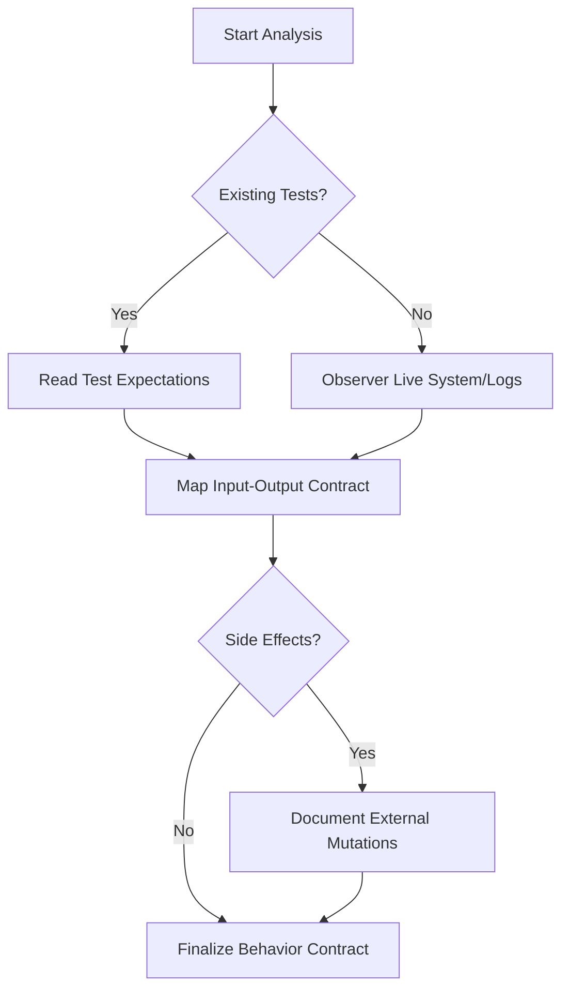

# Behavior First Analysis

## Purpose

Shifts focus from "how it's written" to "what it does". By analyzing behavior as a contract, this skill ensures that migrations and refactors preserve functionality without being tethered to legacy implementation choices.

## When to use this skill
- At the start of a migration project
- When planning a significant refactor of complex logic
- Before re-architecting a system with existing users

## Analysis Steps

1. **Define Inputs and Outputs**: Map the API or function signatures. What data enters? what data exits?
2. **Identify Side Effects**: Does it write to a database? Send an email? Publish a message?
3. **Capture Error Behaviors**: How does the system respond to invalid input or external failures?
4. **Ignore Implementation**: If the code uses a specific library or recursive algorithm, ignore it unless it affects the observable output.

## Decision Tree

## Review Checklist

1. **Abstraction**: Is the behavior described without mentioning specific variable names or libraries?
2. **Determinism**: Are non-deterministic outputs (timestamps, random IDs) accounted for?
3. **Completeness**: Are 4xx and 5xx error states documented?
4. **Boundary**: Is it clear where this behavior ends and the next begins?

## How to provide feedback
- **Be specific**: "The behavior description for 'Add to Cart' doesn't specify what happens if the item is out of stock."
- **Explain why**: "Without documenting this edge case, the new system might return a 500 error instead of a 409."
- **Suggest alternatives**: "Recommend adding: 'If inventory < requested, return 409 Conflict with current inventory level'."

Behavior deviations are bugs unless approved.
