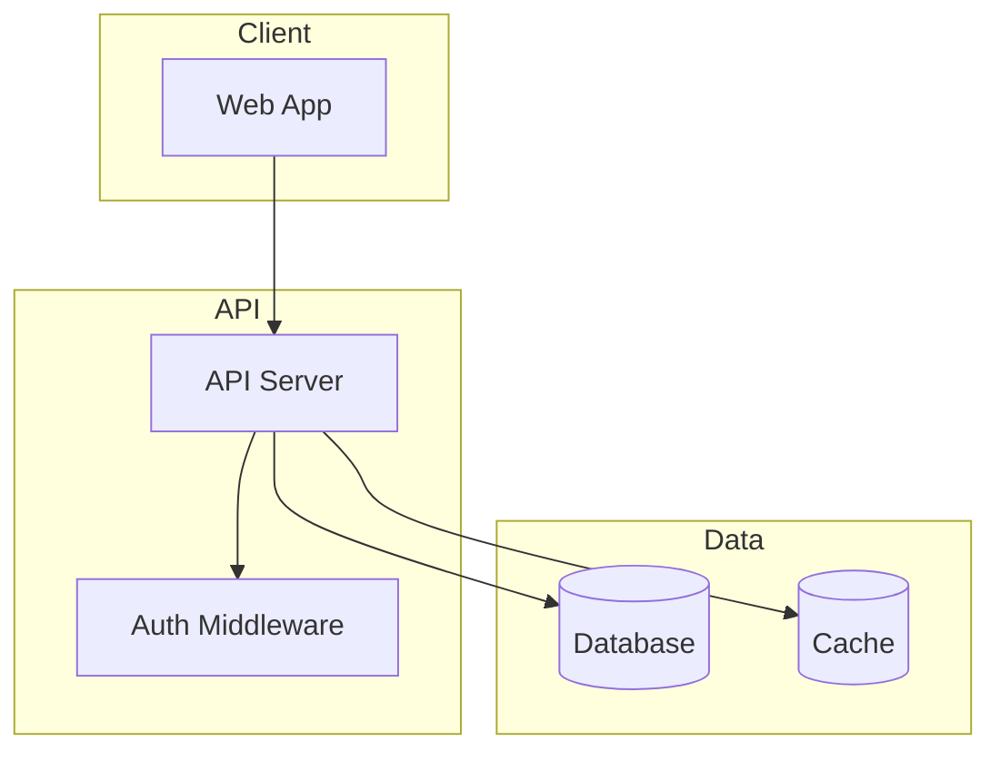
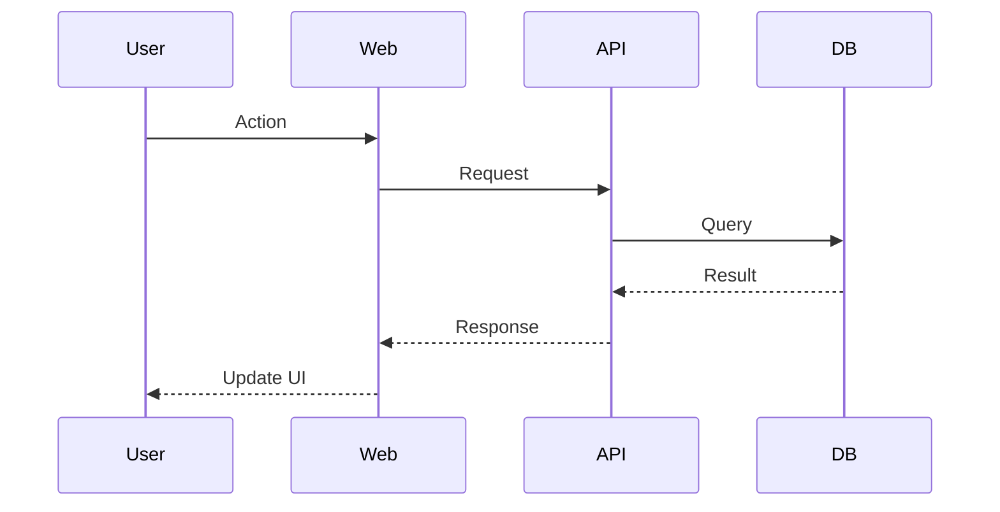

# Cartographer (Generic LLM Edition)

Maps codebases of any size using parallel subagents. Designed for any LLM, with **MiniMax-M2.1** as the preferred model for large context analysis.

## Model Configuration

| Model | Context Window | Budget per Subagent |
|-------|---------------|---------------------|
| **MiniMax-M2.1** (Preferred) | 1,000,000 | 500,000 |
| Claude Sonnet | 1,000,000 | 500,000 |
| GPT-4 Turbo | 128,000 | 60,000 |
| Gemini 1.5 Pro | 2,000,000 | 800,000 |
| Llama 3.1 405B | 128,000 | 60,000 |
| Other | 32,000 | 15,000 |

**CRITICAL: The orchestrating agent plans work and synthesizes reports. Subagents read and analyze files. Never have the orchestrator read large portions of the codebase directly.**

## Quick Start

1. Run the scanner script to get file tree with token counts
2. Plan subagent work assignments based on model context limits
3. Spawn subagents in parallel to read and analyze file groups
4. Synthesize subagent reports into `docs/CODEBASE_MAP.md`
5. Update project docs (CLAUDE.md, AGENTS.md, README) with summary

## Workflow

### Step 1: Check for Existing Map

Check if `docs/CODEBASE_MAP.md` exists:

**If it exists:**
1. Read the `last_mapped` timestamp from the map's frontmatter
2. Check for changes: `git log --oneline --since="<last_mapped>"` (if git available)
3. If significant changes detected, proceed to update mode
4. If no changes, inform user the map is current

**If it does not exist:** Proceed to full mapping.

### Step 2: Scan the Codebase

Run the scanner script:

```bash
# Option 1: With Python
python3 ./cartographer/scripts/scan-codebase.py . --format json

# Option 2: Direct execution
./cartographer/scripts/scan-codebase.py . --format json
```

If tiktoken is missing (optional, provides more accurate counts):
```bash
pip install tiktoken
```

Output provides:
- Complete file tree with token counts
- Total token budget needed
- Skipped files (binary, too large)

### Step 3: Plan Subagent Assignments

Analyze scan output to divide work:

**Grouping strategy:**
1. Group files by directory/module (keeps related code together)
2. Balance token counts across groups
3. Target 50% of model's context window per subagent (safety margin)

**For MiniMax-M2.1:** Target ~500,000 tokens per subagent

**Example assignment:**
```
Subagent 1: src/api/, src/middleware/ (~450k tokens)
Subagent 2: src/components/, src/hooks/ (~480k tokens)
Subagent 3: src/lib/, src/utils/, tests/ (~420k tokens)
```

**For small codebases (<100k tokens):** Still use a single subagent. The orchestrator plans, subagents read.

### Step 4: Spawn Subagents in Parallel

Spawn all subagents simultaneously for maximum efficiency.

**Each subagent prompt should:**
1. List specific files/directories to read
2. Request analysis of:
   - Purpose of each file/module
   - Key exports and public APIs
   - Dependencies (what it imports)
   - Dependents (what imports it)
   - Patterns and conventions used
   - Gotchas or non-obvious behavior
3. Request output as structured markdown

**Example subagent prompt:**

```
You are mapping part of a codebase. Read and analyze these files:
- src/api/routes.ts
- src/api/middleware/auth.ts
- src/api/middleware/rateLimit.ts
[... list all files in this group]

For each file, document:
1. **Purpose**: One-line description
2. **Exports**: Key functions, classes, types exported
3. **Imports**: Notable dependencies
4. **Patterns**: Design patterns or conventions used
5. **Gotchas**: Non-obvious behavior, edge cases, warnings

Also identify:
- How these files connect to each other
- Entry points and data flow
- Any configuration or environment dependencies

Return your analysis as markdown with clear headers per file/module.
```

### Step 5: Synthesize Reports

Once all subagents complete:

1. **Merge** all subagent reports
2. **Deduplicate** any overlapping analysis
3. **Identify cross-cutting concerns** (shared patterns, common gotchas)
4. **Build the architecture diagram** showing module relationships
5. **Extract key navigation paths** for common tasks

### Step 6: Write CODEBASE_MAP.md

Create `docs/CODEBASE_MAP.md`:

```markdown
---
last_mapped: YYYY-MM-DDTHH:MM:SSZ
total_files: N
total_tokens: N
model_used: MiniMax-M2.1
---

# Codebase Map

> Auto-generated by Cartographer. Last mapped: [date]

## System Overview



## Directory Structure

[Tree with purpose annotations]

## Module Guide

### [Module Name]

**Purpose**: [description]
**Entry point**: [file]
**Key files**:
| File | Purpose | Tokens |
|------|---------|--------|

**Exports**: [key APIs]
**Dependencies**: [what it needs]
**Dependents**: [what needs it]

[Repeat for each module]

## Data Flow



## Conventions

[Naming, patterns, style]

## Gotchas

[Non-obvious behaviors, warnings]

## Navigation Guide

**To add a new API endpoint**: [files to touch]
**To add a new component**: [files to touch]
**To modify auth**: [files to touch]
```

### Step 7: Update Project Documentation

Add or update codebase summary in relevant docs (CLAUDE.md, AGENTS.md, README):

```markdown
## Codebase Overview

[2-3 sentence summary]

**Stack**: [key technologies]
**Structure**: [high-level layout]

For detailed architecture, see [docs/CODEBASE_MAP.md](docs/CODEBASE_MAP.md).
```

## Update Mode

When updating an existing map:

1. Identify changed files from git or scanner diff
2. Spawn subagents only for changed modules
3. Merge new analysis with existing map
4. Update `last_mapped` timestamp
5. Preserve unchanged sections

## MiniMax-M2.1 Optimization Tips

MiniMax-M2.1's 1M token context makes it ideal for codebase mapping:

1. **Fewer subagents needed** - Can process more files per subagent
2. **Better cross-file analysis** - More context means better understanding of relationships
3. **Faster completion** - Fewer parallel tasks to orchestrate
4. **Higher accuracy** - Full module context reduces misunderstandings

For codebases under 800k tokens, a single MiniMax-M2.1 call can map everything.

## Troubleshooting

**Scanner fails with tiktoken error:**
```bash
pip install tiktoken
```
Or run without tiktoken (uses character-based estimation).

**Python not found:**
Try `python3`, `python`, or adjust path.

**Codebase too large even for subagents:**
- Increase number of subagents
- Focus on src/ directories, skip vendored code
- Use `--max-tokens` flag to skip huge files

**Git not available:**
- Fall back to file count/path comparison
- Store file list hash in map frontmatter for change detection
