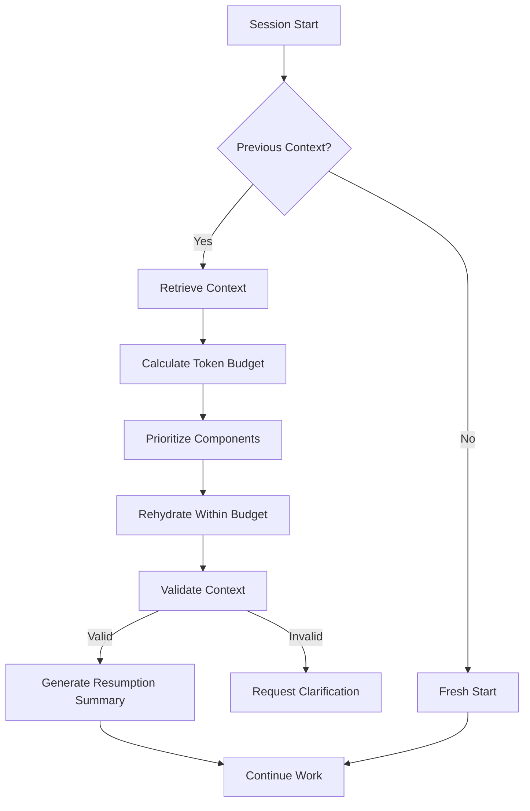

# Context Restore

Intelligent context retrieval, rehydration, and reconstruction for session continuity.

## Overview

Context Restore recovers project state across sessions:
- Semantic-aware context retrieval
- Token-budget-conscious rehydration
- Multi-source context merging
- Decision trail preservation

## Restoration Modes

| Mode        | Description                        | Use Case                  |
| ----------- | ---------------------------------- | ------------------------- |
| Full        | Complete context restoration       | New session, same project |
| Incremental | Partial context update             | Brief interruption        |
| Diff        | Compare and merge context versions | Conflict resolution       |
| Query       | Semantic search for specific info  | Targeted retrieval        |

## Token Budget Management

```python
def rehydrate_context(project_context, token_budget=8192):
    """Intelligent context rehydration with token budget management."""
    # Priority order for context components
    context_components = [
        ('session_intent', 1.0),      # Always include
        ('current_state', 0.95),      # Critical for continuation
        ('files_modified', 0.9),      # Artifact tracking
        ('decisions', 0.85),          # Decision context
        ('blockers', 0.8),            # Active issues
        ('next_steps', 0.75),         # Action items
        ('history', 0.5)              # Historical context
    ]

    restored_context = {}
    current_tokens = 0

    for component, priority in context_components:
        if component not in project_context:
            continue

        component_tokens = estimate_tokens(project_context[component])

        if current_tokens + component_tokens <= token_budget:
            restored_context[component] = project_context[component]
            current_tokens += component_tokens
        elif priority > 0.8:
            # Critical components: compress to fit
            compressed = compress_component(project_context[component])
            restored_context[component] = compressed
            current_tokens += estimate_tokens(compressed)

    return restored_context
```

## Semantic Vector Search

```python
def semantic_context_retrieve(project_id, query, top_k=5):
    """Semantically retrieve most relevant context vectors."""
    # Generate query embedding
    query_vector = embedding_model.encode(query)

    # Search vector database
    results = vector_db.search(
        query_vector,
        filter={'project': project_id},
        top_k=top_k
    )

    # Rank and filter by relevance
    return rank_and_filter_contexts(
        results,
        similarity_threshold=0.75
    )
```

## Relevance Filtering

```python
def rank_context_components(contexts, current_state):
    """Rank context components based on multiple relevance signals."""
    ranked_contexts = []

    for context in contexts:
        relevance_score = calculate_composite_score(
            semantic_similarity=context.semantic_score,
            temporal_relevance=calculate_temporal_decay(context.timestamp),
            historical_impact=context.decision_weight
        )
        ranked_contexts.append((context, relevance_score))

    return sorted(ranked_contexts, key=lambda x: x[1], reverse=True)

def calculate_temporal_decay(timestamp, half_life_days=7):
    """Recent context is more relevant."""
    age_days = (datetime.now() - timestamp).days
    return 0.5 ** (age_days / half_life_days)
```

## Context Merging

```python
def merge_contexts(base_context, new_context, strategy='latest_wins'):
    """Merge contexts with conflict resolution."""
    merged = base_context.copy()

    for key, value in new_context.items():
        if key not in merged:
            merged[key] = value
        elif strategy == 'latest_wins':
            merged[key] = value
        elif strategy == 'preserve_base':
            pass  # Keep base value
        elif strategy == 'merge_lists':
            if isinstance(value, list) and isinstance(merged[key], list):
                merged[key] = deduplicate(merged[key] + value)
            else:
                merged[key] = value

    return merged
```

## Session Reconstruction Workflow



## Validation and Integrity

```python
def validate_restored_context(context, current_codebase):
    """Validate context against current state."""
    issues = []

    # Check file references still exist
    for file_ref in context.get('files_modified', []):
        if not path_exists(file_ref['path']):
            issues.append(f"File no longer exists: {file_ref['path']}")

    # Check for stale decisions
    for decision in context.get('decisions', []):
        if is_outdated(decision):
            issues.append(f"Decision may be outdated: {decision['summary']}")

    # Check context fingerprint
    if context.get('fingerprint') != calculate_fingerprint(current_codebase):
        issues.append("Codebase has changed since context was saved")

    return {
        'valid': len(issues) == 0,
        'issues': issues,
        'confidence': 1.0 - (len(issues) * 0.2)
    }
```

## Resumption Summary Template

```markdown
## Session Resumption

**Project**: [project_name]
**Last Active**: [timestamp]
**Context Confidence**: [percentage]

### Where We Left Off
[Current state summary]

### Files You Were Working On
- `file1.ts`: [last changes]
- `file2.ts`: [last changes]

### Key Decisions Made
- [Decision 1]: [brief rationale]

### Next Steps
1. [Immediate next action]
2. [Following action]

### Potential Issues
- [Any validation warnings]
```

## Performance Optimization

| Optimization          | Technique                        | Impact           |
| --------------------- | -------------------------------- | ---------------- |
| Lazy loading          | Load components on-demand        | Faster startup   |
| Caching               | Cache recent contexts            | Reduced latency  |
| Streaming             | Stream large contexts            | Memory efficient |
| Probabilistic indexes | Bloom filters for quick checks   | O(1) lookups     |

## Guidelines

1. Prioritize critical components when budget-constrained
2. Validate context against current codebase state
3. Generate resumption summary for user orientation
4. Use semantic search for targeted retrieval
5. Implement incremental loading for large projects
6. Track context staleness and flag outdated info
7. Preserve decision trails for context continuity

## Related

- [Context Save](./context-save.md)
- [Context Compression](./context-compression.md)
- [Memory Systems](./memory-systems.md)
