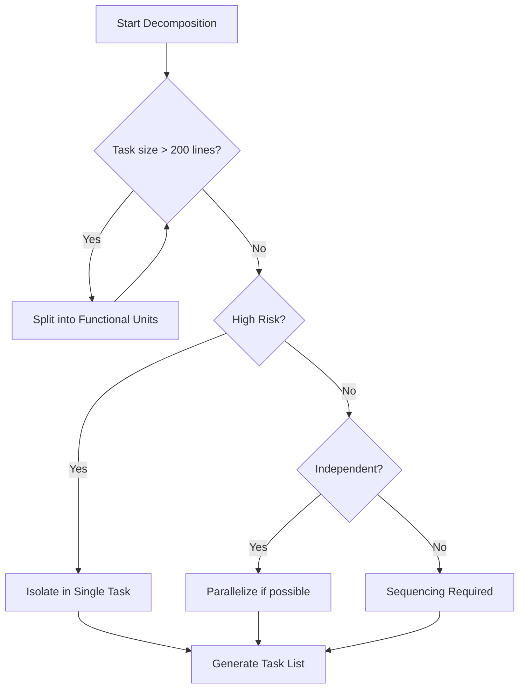

# Controlled Task Decomposition

## Purpose

Converts a large "What" (Spec) into several manageable "Hows" (Tasks). This skill ensures that implementation is incremental, testable, and doesn't overwhelm the Agent's context.

## When to use this skill
- During the transition from Planning to Execution
- When a task is found to be too complex to implement in one go
- When creating an `implementation_plan.md`

## Decomposition Steps

1. **Map Tasks to Spec Sections**: Every task MUST implement at least one spec ID (e.g., TASK-1 implements AUTH-001).
2. **Avoid Micro-Tasks**: Don't create tasks for minor things like "add import". Combine them into meaningful functional units.
3. **Define Acceptance Criteria**: Every task needs a clear "When is this done?" statement.
4. **Respect Dependencies**: Order tasks so that foundation components are built before items that depend on them.

## Decision Tree

## Review Checklist

1. **Traceability**: Can I trace every task back to a spec requirement?
2. **Verifiability**: Is there a test that can prove this task is complete?
3. **Context**: Can the agent complete this task without needing 10 other open files?
4. **Structure**: Does it follow the [task-template](../.agent/skills/_templates/task-template.md)?

## How to provide feedback
- **Be specific**: "Task #2 is 'Implement Auth', which covers 4 different spec IDs and 500 lines of code."
- **Explain why**: "Too much scope in one task leads to implementation errors and context loss."
- **Suggest alternatives**: "Split into 'Task 2a: JWT Logic' and 'Task 2b: Middleware Integration'."

Tasks must be independently verifiable.
