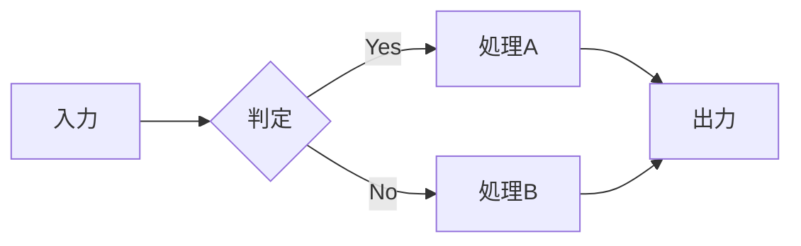
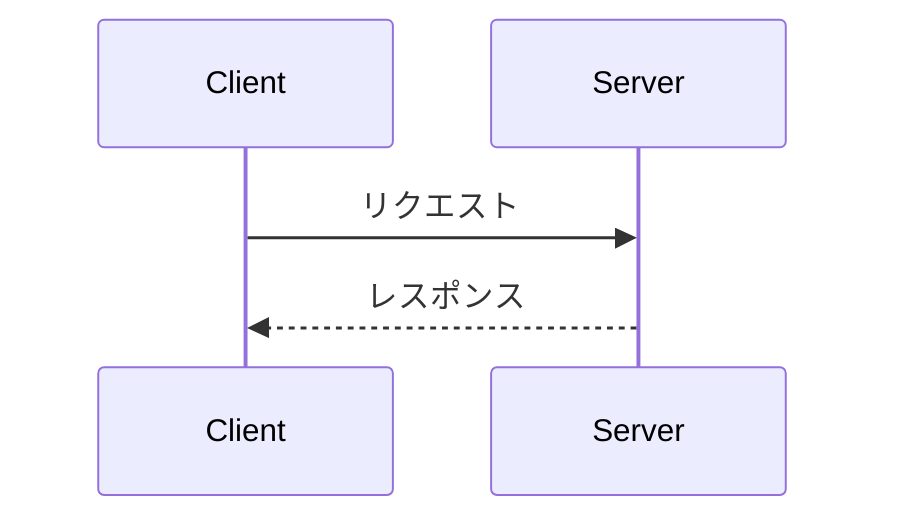
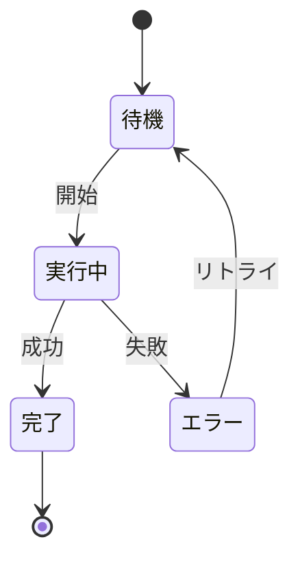

# ドキュメントテンプレート

このファイルはドキュメント作成時の参考用テンプレート集です。
目的に応じて適切な構成を選択してください。

---

## 概念説明テンプレート

「〜とは何か」「なぜ〜なのか」を説明するドキュメント向け。

```markdown
# {タイトル}

## TL;DR

- {最も重要なポイント}
- {2番目に重要なポイント}
- {3番目に重要なポイント}

## {トピック}とは

{1-2文で簡潔に定義}

## なぜ必要か

{解決する問題、メリットを説明}

## 仕組み

{図を使って説明}

## ユースケース

- **{ケース1}**: {説明}
- **{ケース2}**: {説明}

## 参考資料

**参考**: [{タイトル}]({URL})

> {引用文}

<!-- AI Agent Context
作成日: YYYY-MM-DD
目的: {作成理由}
-->
```

---

## 手順書テンプレート

特定のタスクを達成する方法を示すドキュメント向け。

```markdown
# {〜する方法}

## 前提条件

- {必要なツール/環境}
- {必要な知識/権限}

## 手順

### 1. {ステップ1}

{説明}

実行するコマンド:

\`\`\`bash
{コマンド}
\`\`\`

### 2. {ステップ2}

{説明}

## 確認方法

{成功したことを確認する方法}

## トラブルシューティング

### {問題1}

**症状**: {エラーメッセージや症状}

**原因**: {原因}

**解決策**: {対処法}

## 参考資料

**参考**: [{タイトル}]({URL})

<!-- AI Agent Context
作成日: YYYY-MM-DD
目的: {作成理由}
-->
```

---

## リファレンステンプレート

設定値、コマンド、APIなどの一覧を示すドキュメント向け。

```markdown
# {タイトル} リファレンス

## 概要

{このリファレンスが扱う範囲の説明}

## {カテゴリ1}

| 項目 | 説明 | デフォルト |
|------|------|-----------|
| {項目1} | {説明} | {値} |
| {項目2} | {説明} | {値} |

## {カテゴリ2}

| コマンド | 説明 | 例 |
|----------|------|-----|
| {cmd1} | {説明} | `{例}` |
| {cmd2} | {説明} | `{例}` |

## 参考資料

**参考**: [{タイトル}]({URL})

<!-- AI Agent Context
作成日: YYYY-MM-DD
目的: {作成理由}
-->
```

---

## 図解パターン

### フローチャート（処理の流れ）



### シーケンス図（通信・やり取り）



### 状態遷移図


