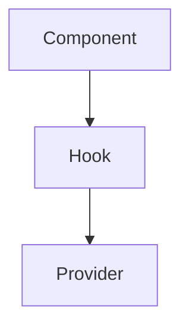
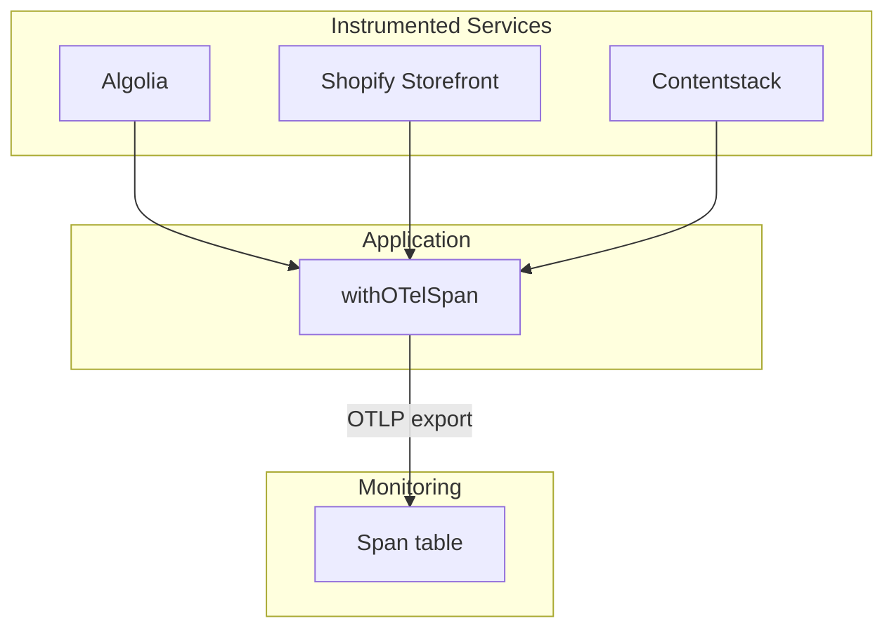
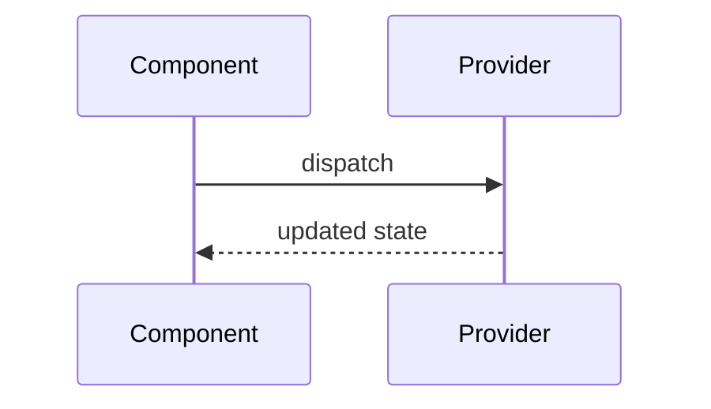
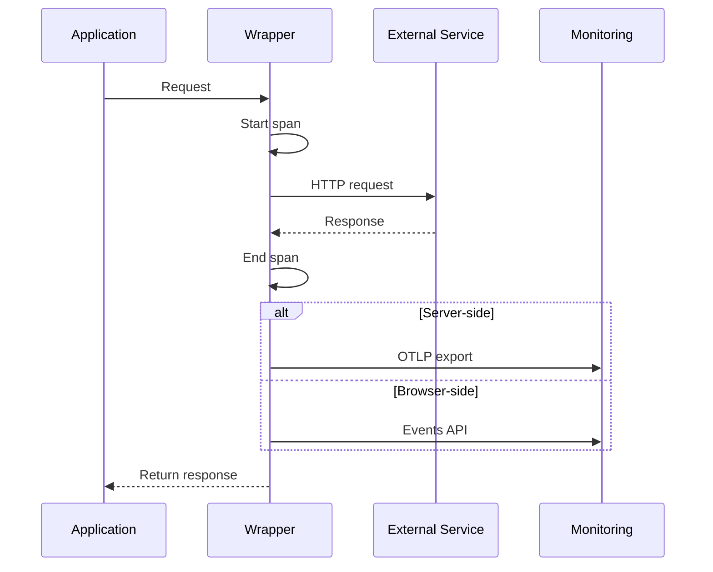

# Mermaid Diagram Guidelines

Create diagrams that accurately represent changes. Complexity should match PR scope.

## Architecture Diagrams

### Simple Component Change

### Multi-Service Integration

## Data Flow Diagrams

### Simple Flow

### Multi-Step Flow with Conditionals

## Tips

- Use subgraphs to group related components
- Use `alt` blocks in sequence diagrams for conditional flows
- Label arrows with actions/data being passed
- Match diagram complexity to PR complexity
- Include all affected services for integration changes
- Mermaid diagrams render natively in GitHub PR descriptions

## When to Include Diagrams

**Include architecture diagram when:**
- Adding new components or services
- Changing how components interact
- Integration with external systems

**Include data flow diagram when:**
- Changing request/response patterns
- Adding new API calls
- Modifying state management

**Skip diagrams when:**
- Simple bug fixes
- Documentation changes
- Minor refactors with no structural changes
