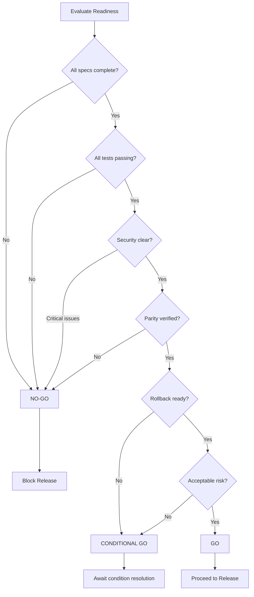

# Delivery Readiness Gate

## Purpose

Makes the final **GO / NO-GO decision** before release by systematically evaluating all readiness criteria. This skill blocks releases that don't meet the bar.

---

## When to Use

- Before release to production
- Before migration cutover
- Before any irreversible deployment

---

## Instructions

### 1. Verify Spec Compliance

All spec behaviors must be implemented and tested:

```markdown
## Spec Compliance Checklist

| Spec ID | Status | Evidence |
|---------|--------|----------|
| AUTH-001 | ✅ PASS | Test suite passing |
| AUTH-002 | ✅ PASS | Test suite passing |
| CART-001 | ⚠️ PARTIAL | Edge case pending |
| CART-002 | ✅ PASS | Test suite passing |

Overall: 3/4 specs complete (75%)
Required: 100%
```

### 2. Verify Migration Parity (if applicable)

Legacy behavior must be preserved:

```markdown
## Parity Checklist

| Behavior | Legacy | New | Match |
|----------|--------|-----|-------|
| Login flow | JWT 24h | JWT 24h | ✅ |
| Cart total | $100.00 | $100.00 | ✅ |
| Error format | {"error": "..."} | {"error": "..."} | ✅ |
```

### 3. Confirm Rollback Readiness

```markdown
## Rollback Checklist

- [x] Database migrations are reversible
- [x] Previous version artifacts available
- [x] Rollback procedure documented
- [x] Rollback tested in staging
- [ ] Rollback time < 15 minutes
```

### 4. Produce GO / NO-GO Decision

```markdown
## Decision: [GO | NO-GO | CONDITIONAL GO]

### Summary
[Brief explanation of decision]

### Blocking Issues (if NO-GO)
1. Issue 1
2. Issue 2

### Conditions (if CONDITIONAL GO)
1. Condition that must be met
2. Condition that must be met

### Risk Assessment
- Technical Risk: LOW / MEDIUM / HIGH
- Business Risk: LOW / MEDIUM / HIGH
- Rollback Risk: LOW / MEDIUM / HIGH
```

---

## Readiness Criteria Matrix

| Category | Criterion | Required | Blocking |
|----------|-----------|----------|----------|
| **Specs** | All HIGH specs implemented | 100% | YES |
| **Specs** | All MEDIUM specs implemented | 80% | NO |
| **Tests** | All critical tests passing | 100% | YES |
| **Tests** | Overall test pass rate | 95% | YES |
| **Security** | Security scan clean | 0 HIGH/CRITICAL | YES |
| **Performance** | P99 latency within target | ≤ 500ms | NO |
| **Parity** | Legacy behavior match | 100% | YES (if migration) |
| **Rollback** | Rollback tested | Complete | YES |
| **Docs** | Release notes ready | Complete | NO |

---

## Decision Logic



---

## Report Template

```markdown
# Delivery Readiness Report

**Project:** [Name]
**Version:** [X.Y.Z]
**Date:** [YYYY-MM-DD]
**Assessor:** [AI/Human]

## Executive Summary
[1-2 sentence decision with rationale]

## Decision: [GO | NO-GO | CONDITIONAL GO]

---

## Readiness Scores

| Category | Score | Required | Status |
|----------|-------|----------|--------|
| Spec Compliance | X% | 100% | ✅/❌ |
| Test Pass Rate | X% | 95% | ✅/❌ |
| Security | X issues | 0 critical | ✅/❌ |
| Parity | X% | 100% | ✅/❌ |
| Rollback | Ready/Not | Ready | ✅/❌ |

---

## Blocking Issues

| ID | Severity | Description | Owner |
|----|----------|-------------|-------|
| B1 | CRITICAL | [description] | [name] |

---

## Recommendations

1. [Action item if conditional/no-go]
2. [Monitoring to add post-release]

---

## Sign-off

- [ ] Engineering Lead
- [ ] Product Owner
- [ ] Security (if required)
```

---

## Inputs

- `regression-and-parity-check` outputs
- `security-and-compliance-baseline` outputs
- Spec traceability matrix
- Test reports

## Outputs

- GO / NO-GO / CONDITIONAL GO decision
- Readiness report with evidence
- Blocking issues list (if any)

---

## Integration

- **Precedes:** Production deployment
- **Follows:** All verification skills
- **Requires:** Human sign-off for production releases

---

## How to provide feedback
- **Be specific**: "The report marks 'Parity' as PASS, but the checkout total rounding logic differs from legacy."
- **Explain why**: "Inaccurate parity reports lead to production financial discrepancies."
- **Suggest alternatives**: "Recommend re-running `regression-and-parity-check` with a higher precision threshold."

Safe releases only.
