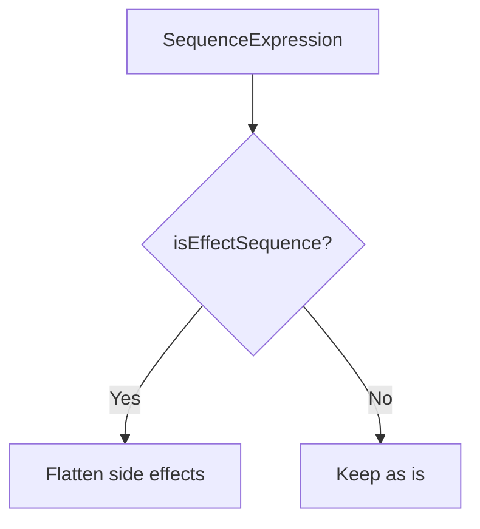

# Documentation Guidelines

Comprehensive guide for writing and maintaining high-quality documentation in the unmangleJS project.

## Purpose

This skill ensures all documentation follows established standards for:
- **Consistency** - Unified style and structure across all docs
- **Maintainability** - Code refactoring won't break documentation
- **Bilingual alignment** - English and Chinese versions stay synchronized
- **Professional quality** - Clear, accurate, and useful documentation

## When to Use This Skill

**Mandatory scenarios:**
1. ✍️ **Creating new documentation** - Pass docs, util docs, guides
2. 🔄 **Updating existing documentation** - Adding features, fixing errors
3. 📝 **Documenting code changes** - After modifying functions/APIs
4. 🔍 **Reviewing documentation** - Before submitting PRs
5. 🌐 **Translating documentation** - Ensuring EN/CN alignment
6. ❓ **Unsure about doc format** - Check guidelines before writing

---

## Core Principles (14 Rules)

### 1. No Line Number References

**Rule**: Never reference specific line numbers in code files

**Why**: Code refactoring changes line numbers, breaking documentation

**Correct**:
- ✅ `src/passes/sequence-flattening.ts` - `transformSequenceExpression()`
- ✅ See `isEffectSequence()` function in `src/utils/readability.ts`

**Incorrect**:
- ❌ `src/passes/sequence-flattening.ts:835-845`
- ❌ `src/utils/readability.ts` (lines 651-669)

---

### 2. Avoid Implementation Details

**Rule**: Describe "what" and "why", not "how"

**Separation of Concerns**:
- **JSDoc/TSDoc**: API signatures, parameter types, implementation quirks
- **Markdown docs**: High-level design, architecture, transformation logic, motivations

**Correct**:
```markdown
## Implementation

- **Detection**: `src/utils/readability.ts` - `isEffectSequence()`
- **Enforcement**: `src/passes/sequence-flattening.ts` - `transformSequenceExpression()`
```

**Incorrect**:
```markdown
## Implementation

First traverse all nodes, use path.parentPath to check parent node type,
then call isEffectSequence() function, store return value in context variable...
```

---

### 3. No Temporary Markers

**Rule**: Never use `NEW`, `FIX`, `OLD`, `TODO`, `FIXME` in docs

**Why**: These are time-sensitive and become noise

**Correct**:
```markdown
#### Logical Expression Right Side

Converts short-circuit conditional execution patterns to if statements.
```

**Incorrect**:
```markdown
#### Logical Expression Right Side (New Feature)

**NEW:** Converts short-circuit conditional execution patterns to if statements.
```

**Note**: TODO belongs in code comments, not documentation

---

### 4. Avoid Content Duplication

**Rule**: Describe content in detail in ONE place; use references elsewhere

**Correct**:
```markdown
## Rule Priority Hierarchy

1. **Return Statement Hard Rule** - Highest priority
2. **Effect Sequence Constitutional Rule**
3. **Readability Scoring System**

See the "Design Priority" subsection in [Effect Sequence Constitutional Rule](#effect-sequence-constitutional-rule).
```

**Incorrect**:
```markdown
## Rule Priority Hierarchy

1. **Return Statement Hard Rule**
2. **Effect Sequence Constitutional Rule**
3. **Readability Scoring System**

### Design Priority

This rule establishes a clear priority hierarchy:
1. **Constitutional rules** - HIGHEST
2. Readability scoring system
3. Semantic-name heuristics
```

---

### 5. Code Example Selection

**When code examples are required**:
- Input/output transformations
- Syntax feature explanations
- Correct vs incorrect usage comparisons

**When NOT needed**:
- Conceptual explanations
- Design principle discussions
- Architecture overviews

**Requirements**:
1. **Brevity**: Prefer 3-5 line examples
2. **Independence**: Self-contained, no external dependencies
3. **Variable naming**:
   - Demonstrating semantics → meaningful names (`data.processed`)
   - Demonstrating structure → simple names (`a`, `b`, `x`)
4. **Language type annotation**: ALWAYS specify language (javascript, typescript, bash, markdown)

**Example**:
````markdown
```javascript
// ✅ Good: Concise and self-contained
if ((a(), b(), c())) {
  console.log("true");
}
```
````

---

### 6. File Reference Format

**Standard format**:
- File + function: `src/passes/sequence-flattening.ts` - `transformSequenceExpression()`
- File + description: `src/utils/readability.ts` - Effect Sequence detection logic
- Internal links: `[Section Name](#anchor)`
- **Cross-doc links**: MUST use relative paths
  - ✅ `[Readability Scoring](readability-scoring.md)`
  - ✅ `[Passes Overview](../passes-overview.md)`
  - ❌ `[Readability Scoring](/docs/en/readability-scoring.md)`

---

### 7. Terminology Consistency

**See**: [Terminology Table](../../../docs/en/documentation-guidelines.md#core-terminology-table) for complete term definitions.

**Quick reference**:
- **Pass** → Keep as "Pass" (don't translate to "转换规则")
- **Passes** → Plural form, keep in English (don't translate to "转换规则集" or similar)

**Usage**:
- First occurrence: **bold** the term
- English docs → English terms
- Chinese docs → Chinese terms (English in parentheses)
- Bilingual docs → accurate correspondence

**Example**:
```markdown
## Effect Sequence Constitutional Rule

An **Effect Sequence** is a **SequenceExpression** whose primary purpose is executing side effects.
```

---

### 8. Documentation Structure

**Standard hierarchy**:
```markdown
## Level 1 (Section)
### Level 2 (Subsection)
#### Level 3 (Sub-subsection)
```

**Organization principles**:
- Clear purpose for each section
- Logical flow: Overview → Background → Features → Implementation → Tests
- Use links, not duplication

**Pass doc template**:
```markdown
# [Pass Name] Pass

## Overview
## Background
## Features
### 1. Main Features
### 2. Edge Cases
## Implementation
## Tests
## Examples
## Related Passes
```

---

### 9. Tone and Voice

**Principle**: Objective, professional, concise

**Correct**:
```markdown
This pass flattens sequence expressions, extracting hidden side effects.

Rationale: Sequence expressions in control-flow headers violate human mental models.
```

**Incorrect**:
```markdown
This pass is super powerful! It flattens sequence expressions.

Note: This feature is pretty cool, you'll love it!
```

**Style**:
- ✅ Declarative sentences ("This pass does X")
- ✅ Active voice ("The pass applies X" not "X is applied")
- ❌ No hyperbole ("amazing", "powerful")
- ❌ No colloquialisms ("pretty cool", "kinda like")

---

### 10. Capitalization and Punctuation

**English docs**:
- Sentence case for sentences
- Proper nouns: JavaScript, Babel, TypeScript
- Code in backticks: `` `SequenceExpression` ``
- No periods in headings
- No punctuation in list items (unless complete sentences)

**Chinese docs**:
- English punctuation for code/English terms: `SequenceExpression` 节点
- Chinese punctuation for Chinese text: 此 pass 扁平化序列表达式
- No punctuation in headings
- Semicolons in lists, final item no punctuation

---

### 11. "Why" Over "What"

**Principle**: Prioritize explaining rationale behind decisions

**Correct**:
```markdown
**Hard Rule**: Return statements with sequences are always flattened.

**Rationale**:

1. **Structural anti-pattern over lexical semantics**: When structure violates human
   control-flow model, token-level heuristics become meaningless.
```

**Incorrect**:
```markdown
This pass flattens sequence expressions in return statements.

It has a hard rule that bypasses readability checks.
```

---

### 12. Bilingual Synchronization

**Checklist** for every doc change:
- [ ] Section structure identical
- [ ] Code examples match (variable names, logic)
- [ ] Technical terms correspond accurately
- [ ] Links and references correct
- [ ] Formatting consistent (headings, lists)

**Example pairing**:

English:
```markdown
## Effect Sequence Constitutional Rule

An **Effect Sequence** is a SequenceExpression whose primary purpose is executing side effects.
```

Chinese:
```markdown
## Effect Sequence 宪治规则

**副作用序列（Effect Sequence）**是指主要目的是执行副作用的序列表达式。
```

---

### 13. Pre-Submission Checklist

**Before submitting documentation changes**:
- [ ] **No line numbers**: All references use function names/sections
- [ ] **No temporary markers**: Removed all `NEW`, `FIX`, `OLD`
- [ ] **No duplication**: Content detailed in one place only
- [ ] **Bilingual synced**: EN/CN structure and content aligned
- [ ] **Code examples correct**: Format proper, concise, **language annotated**
- [ ] **Terminology consistent**: Follow terminology table
- [ ] **File references correct**: `path/to/file.ts` - `functionName()`, **relative links**
- [ ] **Professional tone**: Objective, concise, no colloquialisms
- [ ] **Punctuation correct**: Proper EN/CN punctuation
- [ ] **Diagrams**: Prefer text-based (Mermaid) over binary images

---

### 14. Diagram Guidelines

**Principle**: Prefer text-driven diagram tools, avoid binary images (PNG/JPG)

**Recommended**:
- **Mermaid**: Flowcharts, sequence diagrams, state diagrams
- **SVG**: Architecture diagrams requiring precise styling

**Why**: Text formats are Git-trackable and easier to translate

**Example**:


---

## Special Scenarios

### Describing Unimplemented Features

**Rule**: Clearly mark as unsupported, don't use "TODO"

**Correct**:
```markdown
3. **ForStatement-update** - Update expression (**UNSUPPORTED** - preserved as-is)
```

**Incorrect**:
```markdown
3. **ForStatement-update** - Update expression (TODO: to be implemented)
```

**Note**: TODO belongs in code comments

---

### Describing Design Decisions

**Format**:
```markdown
**Design principle**:

> "When structure itself violates human control-flow model,
> all token/identifier-based readability heuristics should be invalid"
```

---

### Referencing Other Documentation

**Format**:
```markdown
**See**: [Rule Priority Hierarchy](#rule-priority-hierarchy) section

**Related**: [Babel API Gotchas](babel-api-gotchas.md)
```

---

## Tools and Validation

### Pre-commit Checks

```bash
# Check Markdown format (if configured)
npm run lint:docs

# Manual checks
grep -n "^[0-9]\+→" docs/**/*.md  # Check for line numbers
grep -rn "NEW:\|FIX:\|OLD:" docs/**/*.md  # Check for temporary markers
```

### Git Commit Guidelines

Use `docs:` prefix for documentation commits.

**Example**:
```bash
git commit -m "docs: improve code block language annotation guidelines"
```

---

## File Locations

**Guideline documents**:
- English: `docs/en/documentation-guidelines.md`
- Chinese: `docs/zh-CN/documentation-guidelines.md`

**When in doubt**, consult these documents for detailed examples and explanations.

---

## Quick Reference

### Common Mistakes to Avoid

1. ❌ Line number references → ✅ Function names
2. ❌ `NEW:` markers → ✅ Clean descriptions
3. ❌ Duplicate content → ✅ Links and references
4. ❌ Absolute paths `/docs/...` → ✅ Relative paths `file.md`
5. ❌ Implementation details → ✅ Design rationale
6. ❌ Inconsistent terminology → ✅ Follow terminology table
7. ❌ Missing language annotation → ✅ Always specify ```javascript
8. ❌ Code changes without doc updates → ✅ Update both

### Standard File Reference Format

```markdown
- Implementation: `src/passes/sequence-flattening.ts` - `transformSequenceExpression()`
- Detection: `src/utils/readability.ts` - `isEffectSequence()`
- See: [Section Name](#anchor)
- Related: [Other Doc](other-doc.md)
```

---

## Summary

**Golden Rule**: Documentation is as important as code. Treat it with the same care and professionalism.

**Key Principles**:
1. Maintainability over convenience (no line numbers)
2. Rationale over mechanics (explain why)
3. Consistency over creativity (follow standards)
4. Clarity over completeness (concise examples)
5. Bilingual alignment (synchronize EN/CN)

**Remember**:
- Well-written documentation accelerates onboarding
- Poor documentation creates technical debt
- Guidelines exist to serve the project, not constrain it
- When in doubt, ask: "Does this help the user understand?"

---

**Full Guidelines**: [docs/en/documentation-guidelines.md](docs/en/documentation-guidelines.md) | [docs/zh-CN/documentation-guidelines.md](docs/zh-CN/documentation-guidelines.md)
