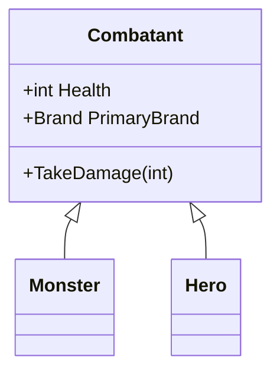
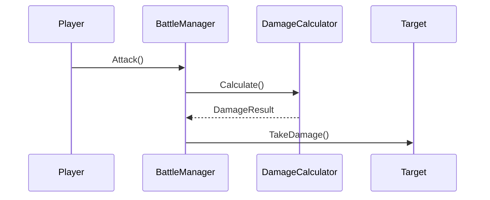
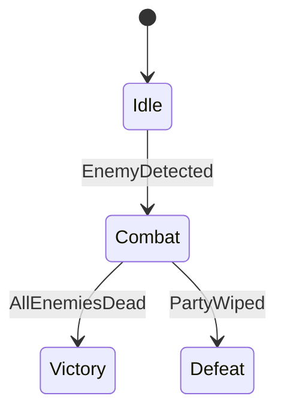
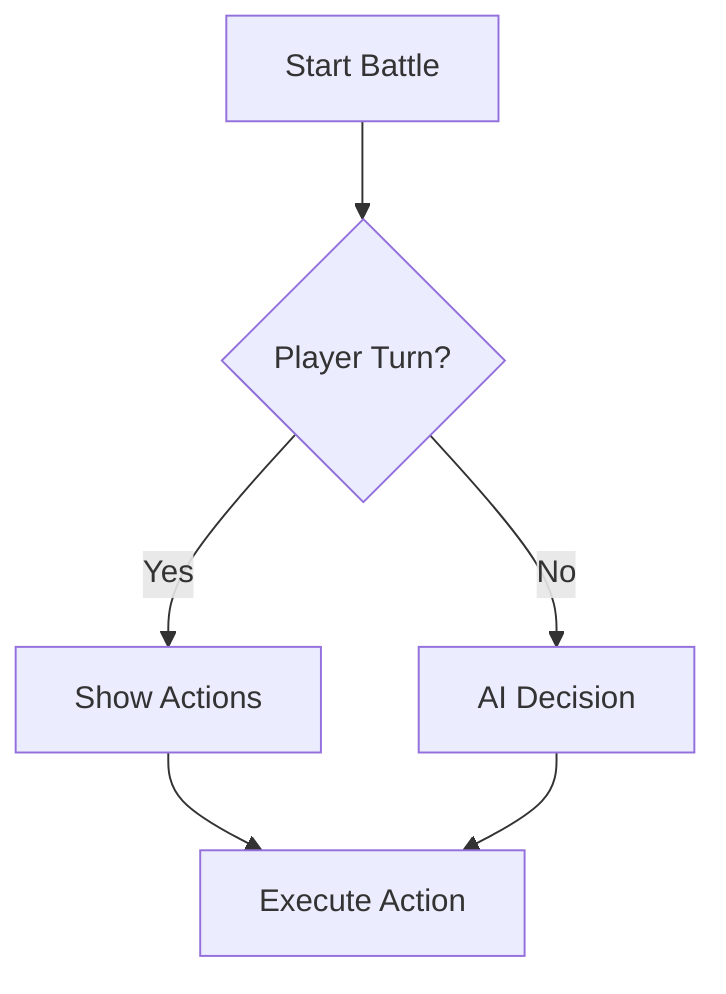

# Architecture Diagram Generator

Visualize systems, data flows, and UI layouts before writing code.

## Diagram Types

### 1. ASCII Box Diagrams (Quick, Terminal-Native)

For component relationships and data flow:

```
┌─────────────────┐
│   Component     │
└────────┬────────┘
         │ event
         ▼
┌─────────────────┐
│   Subscriber    │
└─────────────────┘
```

**Box Characters:**
- Corners: `┌ ┐ └ ┘`
- Lines: `─ │`
- Arrows: `→ ← ↑ ↓ ▶ ◀ ▲ ▼`
- Connectors: `┬ ┴ ├ ┤ ┼`

### 2. Mermaid Diagrams (Detailed, Exportable)

For complex systems - renders in Claude Code and exports to images.

**Class Diagram:**


**Sequence Diagram:**


**State Diagram:**


**Flowchart:**


### 3. ASCII Tables (Data Comparison)

```
┌──────────┬────────┬────────┐
│ Brand    │ Strong │ Weak   │
├──────────┼────────┼────────┤
│ IRON     │ SURGE  │ SAVAGE │
│ SAVAGE   │ IRON   │ LEECH  │
└──────────┴────────┴────────┘
```

## Usage Examples

**User:** `/draw-diagram Show the damage calculation flow`

**Response:**
```
┌─────────────┐
│   Attacker  │
└──────┬──────┘
       │ uses Ability
       ▼
┌─────────────────────────────────────┐
│         DamageCalculator            │
├─────────────────────────────────────┤
│ 1. Base damage (power × ATK)        │
│ 2. Brand effectiveness (0.5x-2x)    │
│ 3. Synergy bonus (0-8%)             │
│ 4. Defense reduction                │
│ 5. Crit check (2x if crit)          │
│ 6. Variance (±5%)                   │
└──────────────┬──────────────────────┘
               │ DamageResult
               ▼
        ┌─────────────┐
        │   Target    │
        │ TakeDamage()│
        └─────────────┘
```

## Best Practices

1. **Max width:** 80 characters (terminal friendly)
2. **Label everything:** No mystery boxes
3. **Show data flow:** Use arrows with labels
4. **Keep it simple:** One concept per diagram
5. **Offer both:** ASCII for quick view, Mermaid for export
