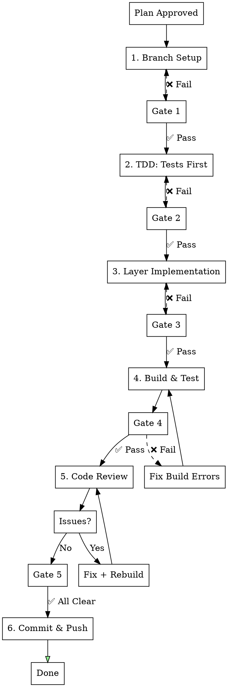

## AUTO-ROUTING TO feature-dev (MANDATORY)

**When this skill is invoked with a feature description, ALWAYS route to feature-dev first:**

```
User: "Implement user settings"
     |
     v
+---------------------------------------------------+
|  STEP 1: Invoke feature-dev skill IMMEDIATELY     |
|                                                   |
|  /feature-dev:feature-dev "{feature description}" |
+---------------------------------------------------+
     |
     v
feature-dev orchestrates -> feature-workflow phases 1-6
```

### Routing Rule
| User Request | Action |
|--------------|--------|
| "Implement X" / "Add Y" / "Create Z" | -> `/feature-dev:feature-dev "{request}"` |
| Phase-specific work (e.g., "fix Phase 3") | -> Continue in current phase |

---

# Feature Implementation Workflow (ssak-flutter-app)

## Overview

Project-specific automated development workflow for ssak-flutter-app (Flutter/Dart).

**Core principle:** Clean Architecture + Riverpod + Freezed + TDD + Code review loop.

## When to Use

- After plan approval: "구현해줘", "implement this"
- Feature requires API, state management, UI screens
- **Recommended**: Use via `/feature-dev:feature-dev` for guided orchestration

---

## feature-dev Integration (Recommended Entry Point)

**Prefer using feature-dev** for enhanced workflow orchestration:

```bash
# feature-dev will automatically:
# 1. Analyze codebase architecture
# 2. Create implementation plan
# 3. Invoke feature-workflow phases in STRICT order
# 4. Delegate to appropriate subagents

/feature-dev:feature-dev "Implement {feature description}"
```

**Direct workflow** (if more control needed):
```bash
# Initialize phase tracker
${CLAUDE_PLUGIN_ROOT}/plugins/feature-workflow/scripts/phase-enforcer.sh init "feature-name"
```

---

## Phase Enforcement (MANDATORY - 절대 건너뛰기 금지)

### 🚨 STRICT PHASE ORDERING - NEVER SKIP PHASES

**Phases MUST be executed in exact order. Skipping is BLOCKED by system.**

> **Note**: Flutter workflow uses **6 phases** (vs 7 phases in React/Go/Next.js).
> This is because Flutter doesn't have a separate "Local Testing" phase.
> Phase 5 = Code Review, Phase 6 = Commit & Push.

```
┌─────────────────────────────────────────────────────────────────┐
│  ❌ BLOCKED: Phase 순서 무시                                      │
│     - Phase 1 완료 전 Phase 2 시작 → BLOCKED                      │
│     - Phase 2 완료 전 Phase 3 시작 → BLOCKED                      │
│     - Phase 5 (Code Review) 전 Phase 6 (Commit) → BLOCKED        │
│                                                                   │
│  ✅ ALLOWED: 순차 진행만 허용                                      │
│     Phase 1 → Phase 2 → Phase 3 → Phase 4 → Phase 5 → Phase 6    │
│                                                                   │
│  ℹ️ Flutter: 6-Phase Workflow (no separate Local Testing phase)   │
└─────────────────────────────────────────────────────────────────┘
```

### Phase Enforcement Commands

```bash
# At workflow start - ALWAYS initialize first
${CLAUDE_PLUGIN_ROOT}/plugins/feature-workflow/scripts/phase-enforcer.sh init "feature-name"

# Before starting each phase - WILL BLOCK IF NOT READY
${CLAUDE_PLUGIN_ROOT}/plugins/feature-workflow/scripts/phase-enforcer.sh start <phase-number>

# Check current status anytime
${CLAUDE_PLUGIN_ROOT}/plugins/feature-workflow/scripts/phase-enforcer.sh status

# Check if phase can be started (returns yes/no)
${CLAUDE_PLUGIN_ROOT}/plugins/feature-workflow/scripts/phase-enforcer.sh can-start <phase-number>
```

### Enforcement Behavior Table
| Attempt | Current Phase | Result | Reason |
|---------|---------------|--------|--------|
| Start Phase 2 | Phase 1 done | ✅ OK | Sequential |
| Start Phase 3 | Phase 1 done | ❌ BLOCKED | Phase 2 skipped |
| Start Phase 5 | Phase 4 done | ✅ OK | Sequential |
| Start Phase 6 | Phase 4 done | ❌ BLOCKED | Phase 5 skipped |

### Self-Check Before Each Phase

```
⚠️ 각 Phase 시작 전 확인:
□ 이전 Phase가 완료되었는가?
□ Gate 조건이 충족되었는가?
□ phase-enforcer.sh start <N> 실행했는가?
```

---

## Workflow



---

## Phase Checkpoint System

### Checkpoint Status Indicators
| Symbol | Status | Meaning |
|--------|--------|---------|
| ⬜ | Pending | Not started |
| 🔄 | In Progress | Currently working |
| ✅ | Passed | Completed & verified |
| ❌ | Failed | Needs fix |
| ⏭️ | Skipped | Intentionally skipped (with reason) |

### TodoWrite Integration (MANDATORY)

**At workflow start, create these todos:**
```
TodoWrite([
  { content: "Phase 1: Branch Setup", status: "pending", activeForm: "Setting up branch" },
  { content: "Phase 2: TDD - Write Tests First", status: "pending", activeForm: "Writing tests" },
  { content: "Phase 3: Layer Implementation", status: "pending", activeForm: "Implementing layers" },
  { content: "Phase 4: Build & Test", status: "pending", activeForm: "Building and testing" },
  { content: "Phase 5: Code Review Loop", status: "pending", activeForm: "Reviewing code" },
  { content: "Phase 6: Commit & Push", status: "pending", activeForm: "Committing changes" },
])
```

---

## Phase 1: Branch Setup

### Steps
```bash
git checkout develop
git pull origin develop
git checkout -b feature/feature-name
```

### Gate 1: Branch Verification

**Verification Commands:**
```bash
# Check 1: On feature branch
git branch --show-current | grep "feature/"

# Check 2: Dependencies installed
flutter pub get
echo "Exit code: $?"

# Check 3: Baseline analyze passes
flutter analyze
echo "Exit code: $?"
```

**Gate Conditions (ALL must pass):**
| Check | Command | Expected |
|-------|---------|----------|
| Branch created | `git branch --show-current` | `feature/feature-name` |
| Dependencies | `flutter pub get` | Exit code 0 |
| Baseline analyze | `flutter analyze` | No issues |

**✅ Gate 1 Passed → Update TodoWrite:**
```
TodoWrite: Phase 1 → completed, Phase 2 → in_progress
```

---

## Phase 2: TDD - Tests First

### 2.1 Unit Tests (Repository/UseCase)

**Location:** `test/features/{feature}/`

**Template:**
```dart
import 'package:flutter_test/flutter_test.dart';
import 'package:mocktail/mocktail.dart';

class MockFeatureRepository extends Mock implements FeatureRepository {}

void main() {
  late FeatureRepository repository;
  late GetFeatureUseCase useCase;

  setUp(() {
    repository = MockFeatureRepository();
    useCase = GetFeatureUseCase(repository);
  });

  group('GetFeatureUseCase', () {
    test('should return data when repository succeeds', () async {
      // Arrange
      when(() => repository.getFeature()).thenAnswer(
        (_) async => const Right(FeatureEntity(id: '1', name: 'Test')),
      );

      // Act
      final result = await useCase();

      // Assert
      expect(result, isA<Right<Failure, FeatureEntity>>());
      verify(() => repository.getFeature()).called(1);
    });
  });
}
```

### 2.2 Widget Tests

**Location:** `test/features/{feature}/presentation/`

**Template:**
```dart
import 'package:flutter_test/flutter_test.dart';
import 'package:flutter_riverpod/flutter_riverpod.dart';

void main() {
  group('FeatureScreen', () {
    testWidgets('should display loading indicator initially', (tester) async {
      await tester.pumpWidget(
        const ProviderScope(
          child: MaterialApp(home: FeatureScreen()),
        ),
      );

      expect(find.byType(CircularProgressIndicator), findsOneWidget);
    });

    testWidgets('should display data when loaded', (tester) async {
      await tester.pumpWidget(
        ProviderScope(
          overrides: [
            featureProvider.overrideWith(
              (ref) => FeatureNotifier()..state = FeatureState.loaded(mockData),
            ),
          ],
          child: const MaterialApp(home: FeatureScreen()),
        ),
      );
      await tester.pumpAndSettle();

      expect(find.text('Test Feature'), findsOneWidget);
    });
  });
}
```

### Gate 2: Tests Written Verification

**Verification Commands:**
```bash
# Check 1: Unit test file exists
test -f "test/features/{feature}/{feature}_test.dart" && echo "✅"

# Check 2: Widget test file exists
test -f "test/features/{feature}/presentation/{feature}_screen_test.dart" && echo "✅"

# Check 3: Test count
grep -c "test\(" "test/features/{feature}/" -r

# Check 4: Tests compile
flutter test --no-pub --reporter=compact test/features/{feature}/ 2>&1 | head -5
```

**Gate Conditions:**
| Check | Condition | Required |
|-------|-----------|----------|
| Unit test file | File exists | YES |
| Widget test file | File exists | YES |
| Test count | At least 3 tests | YES |
| Tests compile | No syntax errors | YES |

**⚠️ Important: Tests SHOULD fail at this point (TDD):**
```bash
flutter test test/features/{feature}/
# Expected: FAILED (feature not implemented yet)
```

**✅ Gate 2 Passed → Update TodoWrite:**
```
TodoWrite: Phase 2 → completed, Phase 3 → in_progress
```

---

## Phase 3: Layer Implementation (Clean Architecture)

### LSP-First Pattern (MANDATORY)

**Before ANY code exploration, STOP and ask: Can LSP do this?**

| Task | LSP Operation | ❌ FORBIDDEN |
|------|---------------|--------------|
| 함수/클래스 정의 찾기 | `LSP goToDefinition` | grep/glob |
| 파일 내 심볼 개요 | `LSP documentSymbol` | cat/read entire file |
| 프로젝트 심볼 검색 | `LSP workspaceSymbol` | grep |
| 참조 추적 | `LSP findReferences` | grep |
| 타입/문서 정보 | `LSP hover` | read entire file |
| 인터페이스 구현체 | `LSP goToImplementation` | grep |
| 호출 그래프 분석 | `LSP incomingCalls`/`outgoingCalls` | manual trace |

**LSP 사용 예시:**
```bash
# Find where class is defined
LSP goToDefinition lib/features/auth/domain/entities/user_entity.dart:10:6

# Get all symbols in a file
LSP documentSymbol lib/features/auth/presentation/screens/login_screen.dart:1:1

# Find all references to a symbol
LSP findReferences lib/features/auth/domain/usecases/login_use_case.dart:15:20

# Find implementations of abstract class
LSP goToImplementation lib/features/auth/domain/repositories/auth_repository.dart:5:10
```

**LSP 미사용 허용 케이스:**
- LSP 서버가 해당 파일 타입 미지원 시 (yaml, json config files)
- 텍스트 검색이 명확히 필요한 경우 (로그 메시지, 주석)

### Implementation Order (Dependencies)

```
1. Domain Layer (no deps)
   └── entities → failures → repository interface → use cases

2. Data Layer (depends on Domain)
   └── models → data sources → repository impl

3. Presentation Layer (depends on Domain)
   └── state → notifier → screens → widgets
```

### 3.1 Domain Layer

#### Entity
**Location:** `lib/features/{feature}/domain/entities/`

```dart
import 'package:freezed_annotation/freezed_annotation.dart';

part 'feature_entity.freezed.dart';

@freezed
class FeatureEntity with _$FeatureEntity {
  const factory FeatureEntity({
    required String id,
    required String name,
    String? description,
  }) = _FeatureEntity;
}
```

#### Repository Interface
**Location:** `lib/features/{feature}/domain/repositories/`

```dart
import 'package:fpdart/fpdart.dart';

abstract class FeatureRepository {
  Future<Either<Failure, FeatureEntity>> getFeature(String id);
  Future<Either<Failure, List<FeatureEntity>>> getFeatures();
}
```

#### Use Case
**Location:** `lib/features/{feature}/domain/usecases/`

```dart
import 'package:fpdart/fpdart.dart';

class GetFeatureUseCase {
  final FeatureRepository _repository;

  GetFeatureUseCase(this._repository);

  Future<Either<Failure, FeatureEntity>> call(String id) {
    return _repository.getFeature(id);
  }
}
```

### 3.2 Data Layer

#### Model (with JSON serialization)
**Location:** `lib/features/{feature}/data/models/`

```dart
import 'package:freezed_annotation/freezed_annotation.dart';

part 'feature_model.freezed.dart';
part 'feature_model.g.dart';

@freezed
class FeatureModel with _$FeatureModel {
  const factory FeatureModel({
    required String id,
    required String name,
    String? description,
  }) = _FeatureModel;

  factory FeatureModel.fromJson(Map<String, dynamic> json) =>
      _$FeatureModelFromJson(json);
}

extension FeatureModelX on FeatureModel {
  FeatureEntity toEntity() => FeatureEntity(
        id: id,
        name: name,
        description: description,
      );
}
```

#### Data Source (Retrofit)
**Location:** `lib/features/{feature}/data/datasources/`

```dart
import 'package:dio/dio.dart';
import 'package:retrofit/retrofit.dart';

part 'feature_api.g.dart';

@RestApi()
abstract class FeatureApi {
  factory FeatureApi(Dio dio, {String baseUrl}) = _FeatureApi;

  @GET('/features/{id}')
  Future<ApiResponse<FeatureModel>> getFeature(@Path('id') String id);

  @GET('/features')
  Future<ApiResponse<List<FeatureModel>>> getFeatures();
}
```

#### Repository Implementation
**Location:** `lib/features/{feature}/data/repositories/`

```dart
import 'package:fpdart/fpdart.dart';

class FeatureRepositoryImpl implements FeatureRepository {
  final FeatureApi _api;

  FeatureRepositoryImpl(this._api);

  @override
  Future<Either<Failure, FeatureEntity>> getFeature(String id) async {
    try {
      final response = await _api.getFeature(id);
      return Right(response.data.toEntity());
    } on DioException catch (e) {
      return Left(ServerFailure(e.message ?? 'Server error'));
    }
  }
}
```

### 3.3 Presentation Layer

#### State (Freezed sealed class)
**Location:** `lib/features/{feature}/presentation/state/`

```dart
import 'package:freezed_annotation/freezed_annotation.dart';

part 'feature_state.freezed.dart';

@freezed
sealed class FeatureState with _$FeatureState {
  const factory FeatureState.initial() = FeatureInitial;
  const factory FeatureState.loading() = FeatureLoading;
  const factory FeatureState.loaded(FeatureEntity data) = FeatureLoaded;
  const factory FeatureState.error(String message) = FeatureError;
}
```

#### Notifier (Riverpod)
**Location:** `lib/features/{feature}/presentation/notifiers/`

```dart
import 'package:riverpod_annotation/riverpod_annotation.dart';

part 'feature_notifier.g.dart';

@riverpod
class FeatureNotifier extends _$FeatureNotifier {
  @override
  FeatureState build() => const FeatureState.initial();

  Future<void> loadFeature(String id) async {
    state = const FeatureState.loading();

    final useCase = ref.read(getFeatureUseCaseProvider);
    final result = await useCase(id);

    state = result.fold(
      (failure) => FeatureState.error(failure.message),
      (data) => FeatureState.loaded(data),
    );
  }
}
```

#### Screen
**Location:** `lib/features/{feature}/presentation/screens/`

```dart
import 'package:flutter/material.dart';
import 'package:flutter_riverpod/flutter_riverpod.dart';

class FeatureScreen extends ConsumerWidget {
  const FeatureScreen({super.key});

  @override
  Widget build(BuildContext context, WidgetRef ref) {
    final state = ref.watch(featureNotifierProvider);

    return Scaffold(
      appBar: AppBar(title: const Text('Feature')),
      body: switch (state) {
        FeatureInitial() => const SizedBox.shrink(),
        FeatureLoading() => const Center(child: CircularProgressIndicator()),
        FeatureLoaded(:final data) => FeatureContent(data: data),
        FeatureError(:final message) => ErrorWidget(message: message),
      },
    );
  }
}
```

### 3.4 Dependency Injection

**Location:** `lib/features/{feature}/di/`

```dart
import 'package:riverpod_annotation/riverpod_annotation.dart';

part 'feature_providers.g.dart';

@riverpod
FeatureApi featureApi(FeatureApiRef ref) {
  final dio = ref.watch(dioProvider);
  return FeatureApi(dio);
}

@riverpod
FeatureRepository featureRepository(FeatureRepositoryRef ref) {
  final api = ref.watch(featureApiProvider);
  return FeatureRepositoryImpl(api);
}

@riverpod
GetFeatureUseCase getFeatureUseCase(GetFeatureUseCaseRef ref) {
  final repository = ref.watch(featureRepositoryProvider);
  return GetFeatureUseCase(repository);
}
```

### Gate 3: Implementation Verification

**Verification Commands:**
```bash
# Domain Layer
echo -n "Gate 3.1 (Entity): "
test -f "lib/features/{feature}/domain/entities/{feature}_entity.dart" && echo "✅" || echo "❌"

echo -n "Gate 3.2 (Repository Interface): "
test -f "lib/features/{feature}/domain/repositories/{feature}_repository.dart" && echo "✅" || echo "❌"

echo -n "Gate 3.3 (Use Case): "
test -f "lib/features/{feature}/domain/usecases/get_{feature}_use_case.dart" && echo "✅" || echo "❌"

# Data Layer
echo -n "Gate 3.4 (Model): "
test -f "lib/features/{feature}/data/models/{feature}_model.dart" && echo "✅" || echo "❌"

echo -n "Gate 3.5 (API): "
test -f "lib/features/{feature}/data/datasources/{feature}_api.dart" && echo "✅" || echo "❌"

echo -n "Gate 3.6 (Repository Impl): "
test -f "lib/features/{feature}/data/repositories/{feature}_repository_impl.dart" && echo "✅" || echo "❌"

# Presentation Layer
echo -n "Gate 3.7 (State): "
test -f "lib/features/{feature}/presentation/state/{feature}_state.dart" && echo "✅" || echo "❌"

echo -n "Gate 3.8 (Notifier): "
test -f "lib/features/{feature}/presentation/notifiers/{feature}_notifier.dart" && echo "✅" || echo "❌"

echo -n "Gate 3.9 (Screen): "
test -f "lib/features/{feature}/presentation/screens/{feature}_screen.dart" && echo "✅" || echo "❌"

# DI
echo -n "Gate 3.10 (Providers): "
test -f "lib/features/{feature}/di/{feature}_providers.dart" && echo "✅" || echo "❌"
```

**Gate Conditions Checklist:**
| # | Check | Layer | Required |
|---|-------|-------|----------|
| 1 | Entity | Domain | YES |
| 2 | Repository Interface | Domain | YES |
| 3 | Use Case | Domain | YES |
| 4 | Model | Data | YES |
| 5 | API (Retrofit) | Data | YES |
| 6 | Repository Impl | Data | YES |
| 7 | State (Freezed) | Presentation | YES |
| 8 | Notifier (Riverpod) | Presentation | YES |
| 9 | Screen | Presentation | YES |
| 10 | Providers (DI) | DI | YES |

**✅ Gate 3 Passed → Update TodoWrite:**
```
TodoWrite: Phase 3 → completed, Phase 4 → in_progress
```

---

## Phase 4: Build & Test

### Steps
```bash
# Generate code (Freezed, Retrofit, Riverpod)
dart run build_runner build --delete-conflicting-outputs

# Analyze
flutter analyze

# Run tests
flutter test

# Run specific test file
flutter test test/features/{feature}/{feature}_test.dart
```

### Gate 4: Build Verification

**Verification Commands:**
```bash
# Check 1: Code generation succeeds
dart run build_runner build --delete-conflicting-outputs
echo "Exit code: $?"

# Check 2: Analyze passes
flutter analyze
echo "Exit code: $?"

# Check 3: Tests pass
flutter test
echo "Exit code: $?"

# Check 4: Generated files exist
test -f "lib/features/{feature}/domain/entities/{feature}_entity.freezed.dart" && echo "✅"
test -f "lib/features/{feature}/data/models/{feature}_model.g.dart" && echo "✅"
test -f "lib/features/{feature}/presentation/notifiers/{feature}_notifier.g.dart" && echo "✅"
```

**Gate Conditions:**
| Check | Command | Expected Exit Code |
|-------|---------|-------------------|
| Code gen | `dart run build_runner build` | 0 |
| Analyze | `flutter analyze` | No issues |
| Tests | `flutter test` | 0 |
| Generated files | test -f | Files exist |

**Must pass all before proceeding.**

**✅ Gate 4 Passed → Update TodoWrite:**
```
TodoWrite: Phase 4 → completed, Phase 5 → in_progress
```

---

## Phase 5: Code Review Loop (Ralph-Loop)

### Ralph-Loop Auto Mode (MANDATORY)

**Code Review는 Ralph-loop를 사용하여 meaningful issue가 없을 때까지 자동 반복합니다.**

```bash
# Ralph-loop 실행 (자동 반복)
/ralph-loop "Code review for {feature-name} implementation (Flutter/Dart).

Instructions:
1. Run code review: Task(superpowers:code-reviewer) with context
2. Count issues by severity (Critical, Important, Minor)
3. If Critical > 0 OR Important > 0:
   - Fix each issue
   - Rebuild (dart run build_runner build && flutter analyze)
   - Continue loop
4. Output <promise>CODE_REVIEW_DONE</promise> when Critical=0 AND Important=0

Context:
- Feature: {feature description}
- Files changed: {file list}
- Base: origin/develop
" --completion-promise "CODE_REVIEW_DONE" --max-iterations 10
```

### Why Ralph-Loop?

| Manual Loop | Ralph-Loop |
|-------------|------------|
| 사람이 매번 재요청 | 자동 반복 |
| Context 유실 가능 | Context 유지 |
| 중간 이탈 가능 | 완료까지 진행 |
| 피드백 누락 가능 | 모든 이슈 처리 |

### Gate 5: Code Review Verification

**Ralph-Loop Process:**
```
┌─────────────────────────────────────────────────────────┐
│  /ralph-loop starts                                     │
│  ↓                                                      │
│  Code Review (superpowers:code-reviewer)                │
│  ↓                                                      │
│  Count Issues:                                          │
│  - Critical: {count}                                    │
│  - Important: {count}                                   │
│  - Minor: {count}                                       │
│  ↓                                                      │
│  Critical > 0 OR Important > 0?                         │
│  ├─ YES → Fix → Rebuild → Loop continues ───────────────┤
│  └─ NO → <promise>CODE_REVIEW_DONE</promise>            │
│          ↓                                              │
│          Gate 5 PASSED ✅                               │
└─────────────────────────────────────────────────────────┘
```

**Verification Checklist (Ralph-loop handles automatically):**
| # | Check | Status | Action if Fail |
|---|-------|--------|----------------|
| 1 | Critical issues = 0 | ⬜ | Ralph auto-fixes, re-reviews |
| 2 | Important issues = 0 | ⬜ | Ralph auto-fixes, re-reviews |
| 3 | Minor issues addressed | ⬜ | Fix or document why skipped |

**Ralph-loop 완료 조건:**
- `meaningfulUnprocessedCount = 0` (Critical + Important = 0)
- `<promise>CODE_REVIEW_DONE</promise>` 출력됨

**✅ Gate 5 Passed → Update TodoWrite:**
```
TodoWrite: Phase 5 → completed, Phase 6 → in_progress
```

---

## Phase 6: Commit & Push

### Steps
```bash
git add -A
git commit -m "feat({scope}): {description}"
git push -u origin feature/{feature-name}
```

### Gate 6: Final Verification

**Verification Commands:**
```bash
# Check 1: All changes staged
git status --porcelain | grep -v "^?" | wc -l

# Check 2: Commit created
git log --oneline -1

# Check 3: Pushed to remote
git status | grep "Your branch is up to date"
```

**✅ Gate 6 Passed → Update TodoWrite:**
```
TodoWrite: Phase 6 → completed
All Phases Complete! ✅
```

---

## Complete Phase Status Summary Template

```
## Feature Workflow Status: {feature-name}

| Phase | Description | Status | Gate | Notes |
|-------|-------------|--------|------|-------|
| 1 | Branch Setup | ⬜/🔄/✅/❌ | ⬜/✅ | |
| 2 | TDD: Tests First | ⬜/🔄/✅/❌ | ⬜/✅ | |
| 3 | Layer Implementation | ⬜/🔄/✅/❌ | ⬜/✅ | |
| 4 | Build & Test | ⬜/🔄/✅/❌ | ⬜/✅ | |
| 5 | Code Review | ⬜/🔄/✅/❌ | ⬜/✅ | Review #{n} |
| 6 | Commit & Push | ⬜/🔄/✅/❌ | ⬜/✅ | |

**Code Review Loop Count:** {n}
**Total Issues Fixed:** Critical: {n}, Important: {n}, Minor: {n}
```

---

## Quick Reference

| Layer | Location | Pattern | Gate Check |
|-------|----------|---------|------------|
| Entity | `domain/entities/` | Freezed immutable | file exists |
| Repository Interface | `domain/repositories/` | Abstract class | file exists |
| Use Case | `domain/usecases/` | Single responsibility | file exists |
| Model | `data/models/` | Freezed + JSON | file + .g.dart |
| Data Source | `data/datasources/` | Retrofit API | file + .g.dart |
| Repository Impl | `data/repositories/` | fpdart Either | file exists |
| State | `presentation/state/` | Freezed sealed | file + .freezed.dart |
| Notifier | `presentation/notifiers/` | Riverpod @riverpod | file + .g.dart |
| Screen | `presentation/screens/` | ConsumerWidget | file exists |
| DI | `di/` | @riverpod providers | file + .g.dart |

---

## Project Constants

```dart
// API Base URL
const baseUrl = 'https://api.ssak.app';

// Local development
const localBaseUrl = 'http://localhost:8100';
```

---

## Implementation Checklist

### 새 Feature 추가 시 (필수)
- [ ] Domain: Entity 정의 (Freezed)
- [ ] Domain: Repository interface 정의
- [ ] Domain: Use case 구현
- [ ] Data: Model 정의 (Freezed + JSON)
- [ ] Data: API 정의 (Retrofit)
- [ ] Data: Repository 구현
- [ ] Presentation: State 정의 (Freezed sealed)
- [ ] Presentation: Notifier 구현 (Riverpod)
- [ ] Presentation: Screen/Widget 구현
- [ ] DI: Provider 등록
- [ ] Code generation: `build_runner build`
- [ ] Tests: Unit + Widget tests

### Code Review 항목 (자동 확인)
- [ ] Clean Architecture 레이어 분리
- [ ] Freezed 사용 (Entity, Model, State)
- [ ] fpdart Either 에러 처리
- [ ] Riverpod @riverpod 패턴
- [ ] sealed class로 State 정의
- [ ] switch expression으로 State 처리

---

## Red Flags - STOP

- ❌ Using grep/glob when LSP can do it (LSP FIRST!)
- ❌ Implementing before writing tests
- ❌ Mixing layers (UI logic in repository, etc.)
- ❌ Using mutable state instead of Freezed
- ❌ Skipping code generation step
- ❌ Committing without code review passing
- ❌ Manual code review loop instead of Ralph-loop
- ❌ Using `dynamic` or `Object` types
- ❌ Not handling error states in UI
- ❌ Proceeding to next phase without gate verification
- ❌ Skipping code review re-run after fixes
- ❌ Not updating TodoWrite status between phases

---

## Automated Gate Check Script

```bash
#!/bin/bash
# .claude/scripts/check-feature-gates.sh

FEATURE_NAME=$1
FEATURE_SNAKE=$(echo "$FEATURE_NAME" | sed 's/-/_/g')

echo "=== Feature Workflow Gate Check: $FEATURE_NAME ==="

# Gate 1: Branch
echo -n "Gate 1 (Branch): "
git branch --show-current | grep -q "feature/" && echo "✅" || echo "❌"

# Gate 2: Tests Written
echo -n "Gate 2 (Unit Test): "
test -f "test/features/${FEATURE_SNAKE}/${FEATURE_SNAKE}_test.dart" && echo "✅" || echo "❌"

# Gate 3: Implementation
echo -n "Gate 3 (Entity): "
test -f "lib/features/${FEATURE_SNAKE}/domain/entities/${FEATURE_SNAKE}_entity.dart" && echo "✅" || echo "❌"
echo -n "Gate 3 (Model): "
test -f "lib/features/${FEATURE_SNAKE}/data/models/${FEATURE_SNAKE}_model.dart" && echo "✅" || echo "❌"
echo -n "Gate 3 (Notifier): "
test -f "lib/features/${FEATURE_SNAKE}/presentation/notifiers/${FEATURE_SNAKE}_notifier.dart" && echo "✅" || echo "❌"
echo -n "Gate 3 (Screen): "
test -f "lib/features/${FEATURE_SNAKE}/presentation/screens/${FEATURE_SNAKE}_screen.dart" && echo "✅" || echo "❌"

# Gate 4: Build & Test
echo -n "Gate 4 (Analyze): "
flutter analyze > /dev/null 2>&1 && echo "✅" || echo "❌"
echo -n "Gate 4 (Tests): "
flutter test > /dev/null 2>&1 && echo "✅" || echo "❌"

echo "=== End Gate Check ==="
```
