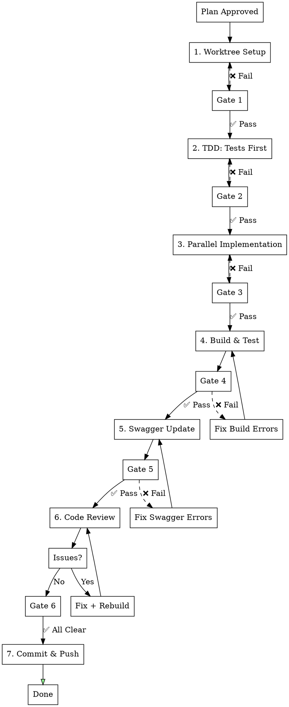

## AUTO-ROUTING TO feature-dev (MANDATORY)

**When this skill is invoked with a feature description, ALWAYS route to feature-dev first:**

```
User: "Implement user settings"
     |
     v
+---------------------------------------------------+
|  STEP 1: Invoke feature-dev skill IMMEDIATELY     |
|                                                   |
|  /feature-dev:feature-dev "{feature description}" |
+---------------------------------------------------+
     |
     v
feature-dev orchestrates -> feature-workflow phases 1-7
```

### Routing Rule
| User Request | Action |
|--------------|--------|
| "Implement X" / "Add Y" / "Create Z" | -> `/feature-dev:feature-dev "{request}"` |
| Phase-specific work (e.g., "fix Phase 3") | -> Continue in current phase |

---

# Feature Implementation Workflow (ssak-backend)

## Overview

Project-specific automated development workflow for ssak-backend (Go/Gin).

**Core principle:** Worktree isolation + TDD + Parallel execution + Mock generation + Code review loop.

## When to Use

- After plan approval: "구현해줘", "implement this"
- Feature requires Handler/Service/Repository pattern
- **Recommended**: Use via `/feature-dev:feature-dev` for guided orchestration

---

## feature-dev Integration (Recommended Entry Point)

**Prefer using feature-dev** for enhanced workflow orchestration:

```bash
# feature-dev will automatically:
# 1. Analyze codebase architecture
# 2. Create implementation plan
# 3. Invoke feature-workflow phases in STRICT order
# 4. Delegate to appropriate subagents

/feature-dev:feature-dev "Implement {feature description}"
```

**Direct workflow** (if more control needed):
```bash
# Initialize phase tracker
${CLAUDE_PLUGIN_ROOT}/plugins/feature-workflow/scripts/phase-enforcer.sh init "feature-name"
```

---

## Phase Enforcement (MANDATORY - 절대 건너뛰기 금지)

### 🚨 STRICT PHASE ORDERING - NEVER SKIP PHASES

**Phases MUST be executed in exact order. Skipping is BLOCKED by system.**

```
┌─────────────────────────────────────────────────────────────────┐
│  ❌ BLOCKED: Phase 순서 무시                                      │
│     - Phase 1 완료 전 Phase 2 시작 → BLOCKED                      │
│     - Phase 2 완료 전 Phase 3 시작 → BLOCKED                      │
│     - Phase 6 (Code Review) 전 Phase 7 (Commit) → BLOCKED        │
│                                                                   │
│  ✅ ALLOWED: 순차 진행만 허용                                      │
│     Phase 1 → Phase 2 → Phase 3 → Phase 4 → Phase 5 → Phase 6 → 7│
└─────────────────────────────────────────────────────────────────┘
```

### Phase Enforcement Commands

```bash
# At workflow start - ALWAYS initialize first
${CLAUDE_PLUGIN_ROOT}/plugins/feature-workflow/scripts/phase-enforcer.sh init "feature-name"

# Before starting each phase - WILL BLOCK IF NOT READY
${CLAUDE_PLUGIN_ROOT}/plugins/feature-workflow/scripts/phase-enforcer.sh start <phase-number>

# Check current status anytime
${CLAUDE_PLUGIN_ROOT}/plugins/feature-workflow/scripts/phase-enforcer.sh status

# Check if phase can be started (returns yes/no)
${CLAUDE_PLUGIN_ROOT}/plugins/feature-workflow/scripts/phase-enforcer.sh can-start <phase-number>
```

### Enforcement Behavior Table
| Attempt | Current Phase | Result | Reason |
|---------|---------------|--------|--------|
| Start Phase 2 | Phase 1 done | ✅ OK | Sequential |
| Start Phase 3 | Phase 1 done | ❌ BLOCKED | Phase 2 skipped |
| Start Phase 5 | Phase 4 done | ✅ OK | Sequential |
| Start Phase 7 | Phase 5 done | ❌ BLOCKED | Phase 6 skipped |

### Self-Check Before Each Phase

```
⚠️ 각 Phase 시작 전 확인:
□ 이전 Phase가 완료되었는가?
□ Gate 조건이 충족되었는가?
□ phase-enforcer.sh start <N> 실행했는가?
```

---

## Workflow



---

## Phase Checkpoint System

### Checkpoint Status Indicators
| Symbol | Status | Meaning |
|--------|--------|---------|
| ⬜ | Pending | Not started |
| 🔄 | In Progress | Currently working |
| ✅ | Passed | Completed & verified |
| ❌ | Failed | Needs fix |
| ⏭️ | Skipped | Intentionally skipped (with reason) |

### TodoWrite Integration (MANDATORY)

**At workflow start, create these todos:**
```
TodoWrite([
  { content: "Phase 1: Worktree Setup", status: "pending", activeForm: "Setting up worktree" },
  { content: "Phase 2: TDD - Write Tests First", status: "pending", activeForm: "Writing tests" },
  { content: "Phase 3: Parallel Implementation", status: "pending", activeForm: "Implementing feature" },
  { content: "Phase 4: Build & Test", status: "pending", activeForm: "Building and testing" },
  { content: "Phase 5: Swagger Update", status: "pending", activeForm: "Updating Swagger docs" },
  { content: "Phase 6: Code Review Loop", status: "pending", activeForm: "Reviewing code" },
  { content: "Phase 7: Commit & Push", status: "pending", activeForm: "Committing changes" },
])
```

---

## Phase 1: Worktree Setup

### Steps
```bash
# Invoke superpowers:using-git-worktrees
git worktree add .worktrees/feature-name -b feature/feature-name
cd .worktrees/feature-name
go mod download
go test ./...  # Baseline
```

### Gate 1: Worktree Verification

**Verification Commands:**
```bash
# Check 1: Worktree exists
git worktree list | grep "feature-name"

# Check 2: On correct branch
git branch --show-current | grep "feature/"

# Check 3: Dependencies downloaded
go mod verify
echo "Exit code: $?"

# Check 4: Baseline tests pass
go test ./... -short
echo "Exit code: $?"
```

**Gate Conditions (ALL must pass):**
| Check | Command | Expected |
|-------|---------|----------|
| Worktree created | `git worktree list` | Shows `.worktrees/feature-name` |
| Branch created | `git branch --show-current` | `feature/feature-name` |
| Dependencies | `go mod verify` | Exit code 0 |
| Baseline tests | `go test ./... -short` | Exit code 0 |

**✅ Gate 1 Passed → Update TodoWrite:**
```
TodoWrite: Phase 1 → completed, Phase 2 → in_progress
```

---

## Phase 2: TDD - Tests First

### 2.1 Handler Tests

**Location:** `internal/handlers/{feature}_handler_test.go`

**Template:**
```go
package handlers

import (
    "context"
    "net/http"
    "testing"

    "github.com/ix-factory/ssak-backend/internal/models"
    "github.com/ix-factory/ssak-backend/internal/testutil"
    "github.com/stretchr/testify/assert"
)

type Mock{Feature}Service struct {
    GetListFunc   func(ctx context.Context, params Params) ([]models.{Feature}, error)
    CreateFunc    func(ctx context.Context, req *Create{Feature}Request) (*models.{Feature}, error)
}

func (m *Mock{Feature}Service) GetList(ctx context.Context, params Params) ([]models.{Feature}, error) {
    if m.GetListFunc != nil {
        return m.GetListFunc(ctx, params)
    }
    return nil, nil
}

func Test{Feature}Handler_GetList_Success(t *testing.T) {
    mockService := &Mock{Feature}Service{
        GetListFunc: func(ctx context.Context, params Params) ([]models.{Feature}, error) {
            return []models.{Feature}{
                {ID: "1", Name: "Test"},
            }, nil
        },
    }

    handler := New{Feature}Handler(mockService)
    router := testutil.SetupTestRouter()
    router.GET("/{feature}", handler.GetList)

    w := testutil.PerformRequest(router, "GET", "/{feature}", nil)

    assert.Equal(t, http.StatusOK, w.Code)
}
```

### 2.2 Service Tests (if complex logic)

**Location:** `internal/services/{feature}_service_test.go`

**Template:**
```go
package services

import (
    "context"
    "testing"

    "github.com/ix-factory/ssak-backend/internal/testutil"
    "github.com/stretchr/testify/assert"
)

func Test{Feature}Service_Create(t *testing.T) {
    tests := []struct {
        name    string
        input   Create{Feature}Request
        want    *models.{Feature}
        wantErr bool
    }{
        {
            name:  "success",
            input: Create{Feature}Request{Name: "Test"},
            want:  &models.{Feature}{Name: "Test"},
        },
        {
            name:    "empty name",
            input:   Create{Feature}Request{Name: ""},
            wantErr: true,
        },
    }

    for _, tt := range tests {
        t.Run(tt.name, func(t *testing.T) {
            mockRepo := &testutil.Mock{Feature}Repository{}
            svc := New{Feature}Service(mockRepo)

            got, err := svc.Create(context.Background(), &tt.input)

            if tt.wantErr {
                assert.Error(t, err)
            } else {
                assert.NoError(t, err)
                assert.Equal(t, tt.want.Name, got.Name)
            }
        })
    }
}
```

### Gate 2: Tests Written Verification

**Verification Commands:**
```bash
# Check 1: Handler test file exists
test -f "internal/handlers/{feature}_handler_test.go" && echo "✅"

# Check 2: Test functions count
grep -c "func Test" "internal/handlers/{feature}_handler_test.go"

# Check 3: Service test file exists (if complex logic)
test -f "internal/services/{feature}_service_test.go" && echo "✅"

# Check 4: Tests compile
go test -c ./internal/handlers -o /dev/null
echo "Exit code: $?"
```

**Gate Conditions:**
| Check | Condition | Required |
|-------|-----------|----------|
| Handler test file | File exists | YES |
| Test functions | At least 2 test cases | YES |
| Service test file | File exists (if complex logic) | CONDITIONAL |
| Tests compile | Go compiles | YES |

**⚠️ Important: Tests SHOULD fail at this point (TDD):**
```bash
go test ./internal/handlers -run Test{Feature}
# Expected: FAILED (feature not implemented yet)
```

**✅ Gate 2 Passed → Update TodoWrite:**
```
TodoWrite: Phase 2 → completed, Phase 3 → in_progress
```

---

## Phase 3: Parallel Implementation

### LSP-First Pattern (MANDATORY)

**Before ANY code exploration, STOP and ask: Can LSP do this?**

| Task | LSP Operation | ❌ FORBIDDEN |
|------|---------------|--------------|
| 함수/struct 정의 찾기 | `LSP goToDefinition` | grep/glob |
| 파일 내 심볼 개요 | `LSP documentSymbol` | cat/read entire file |
| 프로젝트 심볼 검색 | `LSP workspaceSymbol` | grep |
| 참조 추적 | `LSP findReferences` | grep |
| 타입/문서 정보 | `LSP hover` | read entire file |
| 인터페이스 구현체 | `LSP goToImplementation` | grep |
| 호출 그래프 분석 | `LSP incomingCalls`/`outgoingCalls` | manual trace |

**LSP 사용 예시:**
```bash
# Find where function is defined
LSP goToDefinition internal/handlers/user_handler.go:25:10

# Get all symbols in a file
LSP documentSymbol internal/services/auth_service.go:1:1

# Find all references to a symbol
LSP findReferences internal/repository/user_repository.go:15:20

# Find implementations of interface
LSP goToImplementation internal/services/user_service.go:10:6
```

**LSP 미사용 허용 케이스:**
- LSP 서버가 해당 파일 타입 미지원 시 (SQL, config files)
- 텍스트 검색이 명확히 필요한 경우 (로그 메시지, 주석)

### File Creation Order (Dependencies)

```
# Parallel (no deps)
Model + Migration + Mock interface fields

# Sequential (has deps)
Model → Repository interface → Repository impl → Service interface → Service impl → Handler → Router
```

### 3.1 Model

**Location:** `internal/models/{feature}.go`

```go
package models

import (
    "time"
    "github.com/uptrace/bun"
)

type {Feature} struct {
    bun.BaseModel `bun:"table:{feature}s,alias:f"`

    ID        string     `bun:"id,pk,type:uuid,default:gen_random_uuid()" json:"id"`
    Name      string     `bun:"name,notnull" json:"name"`
    CreatedAt time.Time  `bun:"created_at,notnull,default:current_timestamp" json:"created_at"`
    UpdatedAt time.Time  `bun:"updated_at,notnull,default:current_timestamp" json:"updated_at"`
    DeletedAt *time.Time `bun:"deleted_at,soft_delete" json:"-"`
}
```

### 3.2 Migration

**Location:** `migrations/NNNNNN_create_{feature}s.up.sql`

```sql
-- migrations/NNNNNN_create_{feature}s.up.sql
CREATE TABLE IF NOT EXISTS {feature}s (
    id UUID PRIMARY KEY DEFAULT gen_random_uuid(),
    name VARCHAR(255) NOT NULL,
    created_at TIMESTAMP WITH TIME ZONE NOT NULL DEFAULT CURRENT_TIMESTAMP,
    updated_at TIMESTAMP WITH TIME ZONE NOT NULL DEFAULT CURRENT_TIMESTAMP,
    deleted_at TIMESTAMP WITH TIME ZONE
);

CREATE INDEX idx_{feature}s_deleted_at ON {feature}s(deleted_at);
```

**Down migration:** `migrations/NNNNNN_create_{feature}s.down.sql`
```sql
DROP TABLE IF EXISTS {feature}s;
```

### 3.3 Repository Interface + Implementation

**Location:** `internal/repository/{feature}_repository.go`

```go
package repository

import (
    "context"
    "database/sql"
    "errors"

    "github.com/ix-factory/ssak-backend/internal/models"
    "github.com/uptrace/bun"
)

type {Feature}Repository interface {
    Create(ctx context.Context, item *models.{Feature}) error
    GetByID(ctx context.Context, id string) (*models.{Feature}, error)
    GetAll(ctx context.Context) ([]models.{Feature}, error)
    Update(ctx context.Context, item *models.{Feature}) error
    Delete(ctx context.Context, id string) error
}

type {feature}Repository struct {
    db *bun.DB
}

func New{Feature}Repository(db *bun.DB) {Feature}Repository {
    return &{feature}Repository{db: db}
}

func (r *{feature}Repository) GetByID(ctx context.Context, id string) (*models.{Feature}, error) {
    var item models.{Feature}
    err := r.db.NewSelect().
        Model(&item).
        Where("id = ?", id).
        Scan(ctx)
    if err != nil {
        if errors.Is(err, sql.ErrNoRows) {
            return nil, nil  // Not found is not an error
        }
        return nil, err
    }
    return &item, nil
}

// ... other methods
```

### 3.4 Service Interface + Implementation

**Location:** `internal/services/{feature}_service.go`

```go
package services

import (
    "context"

    "github.com/ix-factory/ssak-backend/internal/models"
    "github.com/ix-factory/ssak-backend/internal/repository"
)

type {Feature}Service interface {
    Create(ctx context.Context, req *Create{Feature}Request) (*models.{Feature}, error)
    GetByID(ctx context.Context, id string) (*models.{Feature}, error)
    GetAll(ctx context.Context) ([]models.{Feature}, error)
}

type {feature}Service struct {
    repo repository.{Feature}Repository
}

func New{Feature}Service(repo repository.{Feature}Repository) {Feature}Service {
    return &{feature}Service{repo: repo}
}

func (s *{feature}Service) Create(ctx context.Context, req *Create{Feature}Request) (*models.{Feature}, error) {
    item := &models.{Feature}{
        Name: req.Name,
    }
    if err := s.repo.Create(ctx, item); err != nil {
        return nil, err
    }
    return item, nil
}
```

### 3.5 Handler

**Location:** `internal/handlers/{feature}_handler.go`

```go
package handlers

import (
    "github.com/gin-gonic/gin"
    _ "github.com/ix-factory/ssak-backend/internal/models" // swagger
    "github.com/ix-factory/ssak-backend/internal/services"
)

type {Feature}Handler struct {
    service services.{Feature}Service
}

func New{Feature}Handler(service services.{Feature}Service) *{Feature}Handler {
    return &{Feature}Handler{service: service}
}

// GetList godoc
//
//  @Summary      {Feature} 목록 조회
//  @Description  {Feature} 목록을 조회합니다
//  @Tags         {feature}
//  @Accept       json
//  @Produce      json
//  @Success      200  {object}  Response{data=[]models.{Feature}}
//  @Failure      500  {object}  ErrorResponse
//  @Router       /admin/{feature}s [get]
func (h *{Feature}Handler) GetList(c *gin.Context) {
    items, err := h.service.GetAll(c.Request.Context())
    if err != nil {
        InternalServerError(c, "Failed to get {feature}s")
        return
    }
    Success(c, items)
}

// Create godoc
//
//  @Summary      {Feature} 생성
//  @Description  새로운 {Feature}를 생성합니다
//  @Tags         {feature}
//  @Accept       json
//  @Produce      json
//  @Param        body  body      Create{Feature}Request  true  "{Feature} 생성 요청"
//  @Success      201   {object}  Response{data=models.{Feature}}
//  @Failure      400   {object}  ErrorResponse
//  @Failure      500   {object}  ErrorResponse
//  @Router       /admin/{feature}s [post]
func (h *{Feature}Handler) Create(c *gin.Context) {
    var req Create{Feature}Request
    if err := c.ShouldBindJSON(&req); err != nil {
        BadRequest(c, "Invalid request body")
        return
    }

    item, err := h.service.Create(c.Request.Context(), &req)
    if err != nil {
        InternalServerError(c, "Failed to create {feature}")
        return
    }
    Created(c, item)
}
```

### 3.6 Mock Implementation

**Location:** `internal/testutil/mocks.go` (append to existing file)

```go
// Mock{Feature}Repository is a mock implementation of {Feature}Repository
type Mock{Feature}Repository struct {
    CreateFunc  func(ctx context.Context, item *models.{Feature}) error
    GetByIDFunc func(ctx context.Context, id string) (*models.{Feature}, error)
    GetAllFunc  func(ctx context.Context) ([]models.{Feature}, error)
    UpdateFunc  func(ctx context.Context, item *models.{Feature}) error
    DeleteFunc  func(ctx context.Context, id string) error
}

func (m *Mock{Feature}Repository) Create(ctx context.Context, item *models.{Feature}) error {
    if m.CreateFunc != nil {
        return m.CreateFunc(ctx, item)
    }
    return nil
}

func (m *Mock{Feature}Repository) GetByID(ctx context.Context, id string) (*models.{Feature}, error) {
    if m.GetByIDFunc != nil {
        return m.GetByIDFunc(ctx, id)
    }
    return nil, nil
}

// ... other methods
```

### 3.7 fx Module Registration

**Update:** `internal/app/repository.go`
```go
fx.Provide(repository.New{Feature}Repository),
```

**Update:** `internal/app/service.go`
```go
fx.Provide(services.New{Feature}Service),
```

**Update:** `internal/app/handler.go`
```go
fx.Provide(handlers.New{Feature}Handler),
```

### 3.8 Router Registration

**Update:** `internal/router/router.go`
```go
// Admin routes
adminGroup.GET("/{feature}s", h.{Feature}Handler.GetList)
adminGroup.POST("/{feature}s", h.{Feature}Handler.Create)
adminGroup.GET("/{feature}s/:id", h.{Feature}Handler.GetByID)
adminGroup.PUT("/{feature}s/:id", h.{Feature}Handler.Update)
adminGroup.DELETE("/{feature}s/:id", h.{Feature}Handler.Delete)
```

### Gate 3: Implementation Verification

**Verification Commands:**
```bash
# Check 1: Model exists
test -f "internal/models/{feature}.go" && echo "✅"

# Check 2: Migration exists
ls migrations/*_create_{feature}s.up.sql && echo "✅"

# Check 3: Repository exists
test -f "internal/repository/{feature}_repository.go" && echo "✅"

# Check 4: Service exists
test -f "internal/services/{feature}_service.go" && echo "✅"

# Check 5: Handler exists
test -f "internal/handlers/{feature}_handler.go" && echo "✅"

# Check 6: Mock added
grep -q "Mock{Feature}Repository" internal/testutil/mocks.go && echo "✅"

# Check 7: fx registration (repository)
grep -q "New{Feature}Repository" internal/app/repository.go && echo "✅"

# Check 8: fx registration (service)
grep -q "New{Feature}Service" internal/app/service.go && echo "✅"

# Check 9: fx registration (handler)
grep -q "New{Feature}Handler" internal/app/handler.go && echo "✅"

# Check 10: Router registration
grep -q "/{feature}s" internal/router/router.go && echo "✅"
```

**Gate Conditions Checklist:**
| # | Check | Command | Required |
|---|-------|---------|----------|
| 1 | Model | test -f | YES |
| 2 | Migration | ls | YES |
| 3 | Repository | test -f | YES |
| 4 | Service | test -f | YES |
| 5 | Handler | test -f | YES |
| 6 | Mock | grep in mocks.go | YES |
| 7 | fx repo | grep in repository.go | YES |
| 8 | fx service | grep in service.go | YES |
| 9 | fx handler | grep in handler.go | YES |
| 10 | Router | grep in router.go | YES |

**✅ Gate 3 Passed → Update TodoWrite:**
```
TodoWrite: Phase 3 → completed, Phase 4 → in_progress
```

---

## Phase 4: Build & Test

### Steps
```bash
go build ./...           # Must pass
go test ./... -short     # Unit tests only (fast)
go test ./... -tags=integration  # Include integration tests
make migrate-up          # Apply new migration (if needed)
```

### Gate 4: Build Verification

**Verification Commands:**
```bash
# Check 1: Build succeeds
go build ./...
echo "Exit code: $?"

# Check 2: Vet passes
go vet ./...
echo "Exit code: $?"

# Check 3: Unit tests pass
go test ./... -short
echo "Exit code: $?"

# Check 4: Server can start (dry run)
go build -o /tmp/server ./cmd/server
echo "Exit code: $?"
```

**Gate Conditions:**
| Check | Command | Expected Exit Code |
|-------|---------|-------------------|
| Build | `go build ./...` | 0 |
| Vet | `go vet ./...` | 0 |
| Unit tests | `go test ./... -short` | 0 |
| Server build | `go build -o /tmp/server` | 0 |

**✅ Gate 4 Passed → Update TodoWrite:**
```
TodoWrite: Phase 4 → completed, Phase 5 → in_progress
```

---

## Phase 5: Swagger Update

### Steps
```bash
make swagger        # Regenerate API docs
```

### Gate 5: Swagger Verification

**Verification Commands:**
```bash
# Check 1: Swagger generation succeeds
make swagger
echo "Exit code: $?"

# Check 2: No type definition errors
make swagger 2>&1 | grep -v "cannot find type definition" | grep "error" || echo "✅ No errors"

# Check 3: New endpoint appears
grep -q "/{feature}s" docs/swagger.json && echo "✅"
```

**Gate Conditions:**
| Check | Command | Expected |
|-------|---------|----------|
| Swagger gen | `make swagger` | Exit code 0 |
| No type errors | grep for errors | No errors |
| Endpoint documented | grep in swagger.json | Found |

**Verify:**
- No "cannot find type definition" errors
- New endpoints appear in swagger docs
- All types referenced in handlers are importable

**✅ Gate 5 Passed → Update TodoWrite:**
```
TodoWrite: Phase 5 → completed, Phase 6 → in_progress
```

---

## Phase 6: Code Review Loop (Ralph-Loop)

### Ralph-Loop Auto Mode (MANDATORY)

**Code Review는 Ralph-loop를 사용하여 meaningful issue가 없을 때까지 자동 반복합니다.**

```bash
# Ralph-loop 실행 (자동 반복)
/ralph-loop "Code review for {feature-name} implementation (Go/Gin).

Instructions:
1. Run code review: Task(superpowers:code-reviewer) with context
2. Count issues by severity (Critical, Important, Minor)
3. If Critical > 0 OR Important > 0:
   - Fix each issue
   - Rebuild (go build ./... && go test ./... -short)
   - Continue loop
4. Output <promise>CODE_REVIEW_DONE</promise> when Critical=0 AND Important=0

Context:
- Feature: {feature description}
- Files changed: {file list}
- Base: origin/develop
" --completion-promise "CODE_REVIEW_DONE" --max-iterations 10
```

### Why Ralph-Loop?

| Manual Loop | Ralph-Loop |
|-------------|------------|
| 사람이 매번 재요청 | 자동 반복 |
| Context 유실 가능 | Context 유지 |
| 중간 이탈 가능 | 완료까지 진행 |
| 피드백 누락 가능 | 모든 이슈 처리 |

### Gate 6: Code Review Verification

**Ralph-Loop Process:**
```
┌─────────────────────────────────────────────────────────┐
│  /ralph-loop starts                                     │
│  ↓                                                      │
│  Code Review (superpowers:code-reviewer)                │
│  ↓                                                      │
│  Count Issues:                                          │
│  - Critical: {count}                                    │
│  - Important: {count}                                   │
│  - Minor: {count}                                       │
│  ↓                                                      │
│  Critical > 0 OR Important > 0?                         │
│  ├─ YES → Fix → Rebuild → Loop continues ───────────────┤
│  └─ NO → <promise>CODE_REVIEW_DONE</promise>            │
│          ↓                                              │
│          Gate 6 PASSED ✅                               │
└─────────────────────────────────────────────────────────┘
```

**Verification Checklist (Ralph-loop handles automatically):**
| # | Check | Status | Action if Fail |
|---|-------|--------|----------------|
| 1 | Critical issues = 0 | ⬜ | Ralph auto-fixes, re-reviews |
| 2 | Important issues = 0 | ⬜ | Ralph auto-fixes, re-reviews |
| 3 | Minor issues addressed | ⬜ | Fix or document why skipped |

**Ralph-loop 완료 조건:**
- `meaningfulUnprocessedCount = 0` (Critical + Important = 0)
- `<promise>CODE_REVIEW_DONE</promise>` 출력됨

**✅ Gate 6 Passed → Update TodoWrite:**
```
TodoWrite: Phase 6 → completed, Phase 7 → in_progress
```

---

## Phase 7: Commit & Push

### Steps
```bash
git add -A
git commit -m "feat({scope}): {description}"
git push -u origin feature/{feature-name}
```

### Gate 7: Final Verification

**Verification Commands:**
```bash
# Check 1: All changes staged
git status --porcelain | grep -v "^?" | wc -l

# Check 2: Commit created
git log --oneline -1

# Check 3: Pushed to remote
git status | grep "Your branch is up to date"
```

**✅ Gate 7 Passed → Update TodoWrite:**
```
TodoWrite: Phase 7 → completed
All Phases Complete! ✅
```

---

## Complete Phase Status Summary Template

```
## Feature Workflow Status: {feature-name}

| Phase | Description | Status | Gate | Notes |
|-------|-------------|--------|------|-------|
| 1 | Worktree Setup | ⬜/🔄/✅/❌ | ⬜/✅ | |
| 2 | TDD: Tests First | ⬜/🔄/✅/❌ | ⬜/✅ | |
| 3 | Implementation | ⬜/🔄/✅/❌ | ⬜/✅ | |
| 4 | Build & Test | ⬜/🔄/✅/❌ | ⬜/✅ | |
| 5 | Swagger Update | ⬜/🔄/✅/❌ | ⬜/✅ | |
| 6 | Code Review | ⬜/🔄/✅/❌ | ⬜/✅ | Review #{n} |
| 7 | Commit & Push | ⬜/🔄/✅/❌ | ⬜/✅ | |

**Code Review Loop Count:** {n}
**Total Issues Fixed:** Critical: {n}, Important: {n}, Minor: {n}
```

---

## Quick Reference

| Phase | Files | Pattern | Gate Check |
|-------|-------|---------|------------|
| Model | `internal/models/{f}.go` | bun model with tags | file exists |
| Migration | `migrations/NNNNNN_*.sql` | up + down SQL | files exist |
| Repository | `internal/repository/{f}_repository.go` | Interface + impl | file exists |
| Service | `internal/services/{f}_service.go` | Interface + impl | file exists |
| Handler | `internal/handlers/{f}_handler.go` | Gin handlers + swagger | file exists |
| Mock | `internal/testutil/mocks.go` | Mock implementations | grep Mock |
| fx Module | `internal/app/*.go` | fx.Provide registration | grep New |
| Router | `internal/router/router.go` | Route registration | grep route |
| Tests | `*_test.go` | Table-driven tests | file exists |

---

## Project Constants

```go
// Server
const DEV_PORT = 8080
const PROXY_PORT = 8100  // via Traefik

// Database
const POSTGRES_PORT = 5436

// Redis (optional)
const REDIS_PORT = 6380
```

---

## Implementation Checklist (from CLAUDE.md)

### 새 기능 추가 시 (필수)
- [ ] Model 생성 (`internal/models/`)
- [ ] DB 마이그레이션 작성 (up/down)
- [ ] Repository 인터페이스 + 구현 (`internal/repository/`)
- [ ] Service 인터페이스 + 구현 (`internal/services/`)
- [ ] Handler 생성 (`internal/handlers/`)
- [ ] fx module에 Provide 등록 (`internal/app/`)
- [ ] Router에 route 등록 (`internal/router/router.go`)
- [ ] Mock 생성 (`internal/testutil/mocks.go`)
- [ ] 테스트 작성 (`*_test.go`)
- [ ] **Swagger 검증** (`make swagger` 실행하여 오류 없는지 확인)

### 새 필드 추가 시 (필수)
- [ ] DB 마이그레이션 작성 (up/down)
- [ ] Model 필드 추가 (bun 태그, json 태그)
- [ ] Repository 인터페이스에 메서드 추가 (필요시)
- [ ] Repository 구현 추가
- [ ] **Public endpoint에서 필터링 확인** (is_hidden, status 등 비공개 필드는 공개 API에서 제외)
- [ ] Admin endpoint 추가 (필요시)
- [ ] 라우터에 route 등록
- [ ] Swagger 문서 업데이트

### Code Review 항목 (자동 확인)
- [ ] **Public endpoint 필터링 확인** (GetPublished, GetFeatured 등에서 숨김 필드 체크)
- [ ] **GetByID public endpoint에서도 필터링 적용** (직접 URL 접근 방지)
- [ ] **Swagger annotation 타입 확인** (models.XXX 참조 시 import 확인)
- [ ] 에러 핸들링 일관성 (sql.ErrNoRows → nil, nil)
- [ ] 로깅 적절성
- [ ] SQL injection 방지 (파라미터 바인딩 사용)
- [ ] Mock에 새 인터페이스 메서드 추가 확인

---

## Red Flags - STOP

- ❌ Using grep/glob when LSP can do it (LSP FIRST!)
- ❌ Implementing before writing tests
- ❌ Sequential execution for independent files
- ❌ Committing without code review passing
- ❌ Manual code review loop instead of Ralph-loop
- ❌ Missing mock implementations for new interface methods
- ❌ Missing fx.Provide registration
- ❌ Missing router registration
- ❌ Swagger "cannot find type definition" errors
- ❌ N+1 query patterns (loop 내 DB 호출)
- ❌ sql.ErrNoRows를 에러로 반환
- ❌ Proceeding to next phase without gate verification
- ❌ Skipping code review re-run after fixes
- ❌ Not updating TodoWrite status between phases

---

## Automated Gate Check Script

```bash
#!/bin/bash
# .claude/scripts/check-feature-gates.sh

FEATURE_NAME=$1
FEATURE_PASCAL=$(echo "$FEATURE_NAME" | sed -r 's/(^|_)([a-z])/\U\2/g')

echo "=== Feature Workflow Gate Check: $FEATURE_NAME ==="

# Gate 1: Worktree
echo -n "Gate 1 (Worktree): "
git worktree list | grep -q "$FEATURE_NAME" && echo "✅" || echo "❌"

# Gate 2: Tests Written
echo -n "Gate 2 (Handler Test): "
test -f "internal/handlers/${FEATURE_NAME}_handler_test.go" && echo "✅" || echo "❌"

# Gate 3: Implementation
echo -n "Gate 3 (Model): "
test -f "internal/models/${FEATURE_NAME}.go" && echo "✅" || echo "❌"
echo -n "Gate 3 (Repository): "
test -f "internal/repository/${FEATURE_NAME}_repository.go" && echo "✅" || echo "❌"
echo -n "Gate 3 (Service): "
test -f "internal/services/${FEATURE_NAME}_service.go" && echo "✅" || echo "❌"
echo -n "Gate 3 (Handler): "
test -f "internal/handlers/${FEATURE_NAME}_handler.go" && echo "✅" || echo "❌"

# Gate 4: Build
echo -n "Gate 4 (Build): "
go build ./... > /dev/null 2>&1 && echo "✅" || echo "❌"
echo -n "Gate 4 (Tests): "
go test ./... -short > /dev/null 2>&1 && echo "✅" || echo "❌"

# Gate 5: Swagger
echo -n "Gate 5 (Swagger): "
make swagger > /dev/null 2>&1 && echo "✅" || echo "❌"

echo "=== End Gate Check ==="
```
