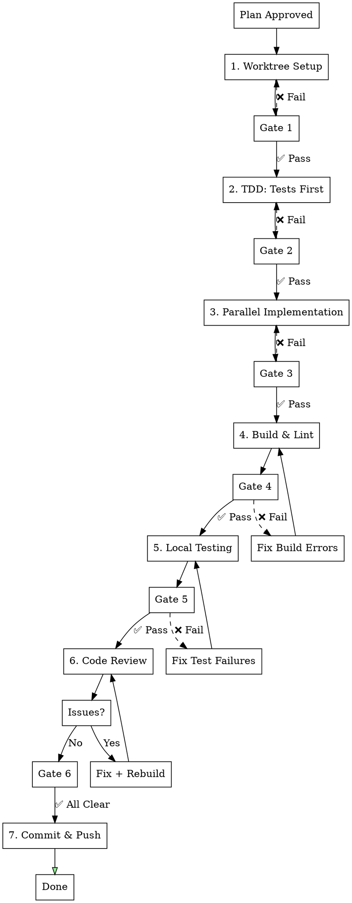

## AUTO-ROUTING TO feature-dev (MANDATORY)

**When this skill is invoked with a feature description, ALWAYS route to feature-dev first:**

```
User: "Implement user settings"
     |
     v
+---------------------------------------------------+
|  STEP 1: Invoke feature-dev skill IMMEDIATELY     |
|                                                   |
|  /feature-dev:feature-dev "{feature description}" |
+---------------------------------------------------+
     |
     v
feature-dev orchestrates -> feature-workflow phases 1-7
```

### Routing Rule
| User Request | Action |
|--------------|--------|
| "Implement X" / "Add Y" / "Create Z" | -> `/feature-dev:feature-dev "{request}"` |
| Phase-specific work (e.g., "fix Phase 3") | -> Continue in current phase |

---

# Feature Implementation Workflow (ssak-user-frontend)

## Overview

Project-specific automated development workflow for ssak-user-frontend (Next.js/React 19).

**Core principle:** Worktree isolation + TDD + Parallel execution + RSC-first + Code review loop.

## When to Use

- After plan approval: "구현해줘", "implement this"
- Feature requires API, hooks, components, pages
- **Recommended**: Use via `/feature-dev:feature-dev` for guided orchestration

---

## feature-dev Integration (Recommended Entry Point)

**Prefer using feature-dev** for enhanced workflow orchestration:

```bash
# feature-dev will automatically:
# 1. Analyze codebase architecture
# 2. Create implementation plan
# 3. Invoke feature-workflow phases in STRICT order
# 4. Delegate to appropriate subagents

/feature-dev:feature-dev "Implement {feature description}"
```

**Direct workflow** (if more control needed):
```bash
# Initialize phase tracker
${CLAUDE_PLUGIN_ROOT}/plugins/feature-workflow/scripts/phase-enforcer.sh init "feature-name"
```

---

## Phase Enforcement (MANDATORY - 절대 건너뛰기 금지)

### 🚨 STRICT PHASE ORDERING - NEVER SKIP PHASES

**Phases MUST be executed in exact order. Skipping is BLOCKED by system.**

```
┌─────────────────────────────────────────────────────────────────┐
│  ❌ BLOCKED: Phase 순서 무시                                      │
│     - Phase 1 완료 전 Phase 2 시작 → BLOCKED                      │
│     - Phase 2 완료 전 Phase 3 시작 → BLOCKED                      │
│     - Phase 6 (Code Review) 전 Phase 7 (Commit) → BLOCKED        │
│                                                                   │
│  ✅ ALLOWED: 순차 진행만 허용                                      │
│     Phase 1 → Phase 2 → Phase 3 → Phase 4 → Phase 5 → Phase 6 → 7│
└─────────────────────────────────────────────────────────────────┘
```

### Phase Enforcement Commands

```bash
# At workflow start - ALWAYS initialize first
${CLAUDE_PLUGIN_ROOT}/plugins/feature-workflow/scripts/phase-enforcer.sh init "feature-name"

# Before starting each phase - WILL BLOCK IF NOT READY
${CLAUDE_PLUGIN_ROOT}/plugins/feature-workflow/scripts/phase-enforcer.sh start <phase-number>

# Check current status anytime
${CLAUDE_PLUGIN_ROOT}/plugins/feature-workflow/scripts/phase-enforcer.sh status

# Check if phase can be started (returns yes/no)
${CLAUDE_PLUGIN_ROOT}/plugins/feature-workflow/scripts/phase-enforcer.sh can-start <phase-number>
```

### Enforcement Behavior Table
| Attempt | Current Phase | Result | Reason |
|---------|---------------|--------|--------|
| Start Phase 2 | Phase 1 done | ✅ OK | Sequential |
| Start Phase 3 | Phase 1 done | ❌ BLOCKED | Phase 2 skipped |
| Start Phase 5 | Phase 4 done | ✅ OK | Sequential |
| Start Phase 7 | Phase 5 done | ❌ BLOCKED | Phase 6 skipped |

### Self-Check Before Each Phase

```
⚠️ 각 Phase 시작 전 확인:
□ 이전 Phase가 완료되었는가?
□ Gate 조건이 충족되었는가?
□ phase-enforcer.sh start <N> 실행했는가?
```

---

## 병렬처리 전략 (MANDATORY)

이 워크플로우는 다음 병렬처리 패턴을 따릅니다:

**Level 1: Phase 간 순차 (Gate 의존성)**
```
Phase 1 → Phase 2 → Phase 3 → Phase 4 → Phase 5 → Phase 6 → Phase 7
```

**Level 2: Phase 내 병렬 (독립 작업)**
```
Phase 2: TDD
├─ [Parallel] Component test file + MSW handlers
└─ [Parallel] API hook test file

Phase 3: Implementation
├─ [Parallel via Subagent] Type definitions + Query keys
├─ [Sequential] API → Hooks (dependency)
└─ [Parallel via Subagent] Page + Components (independent)
```

**병렬 실행 트리거:**
- 독립적인 파일 생성 → Task() 병렬 호출
- 의존성 없는 탐색 → Explore agent 병렬
- 독립적인 컴포넌트 → frontend-architect 병렬

**절대 병렬 실행 금지:**
- types.ts → api.ts (의존성 있음)
- api.ts → hooks (의존성 있음)
- Gate 실패 시 다음 Phase (Gate 의존성)

---

## Workflow



---

## Phase Checkpoint System

### Checkpoint Status Indicators
| Symbol | Status | Meaning |
|--------|--------|---------|
| ⬜ | Pending | Not started |
| 🔄 | In Progress | Currently working |
| ✅ | Passed | Completed & verified |
| ❌ | Failed | Needs fix |
| ⏭️ | Skipped | Intentionally skipped (with reason) |

### TodoWrite Integration (MANDATORY)

**At workflow start, create these todos:**
```
TodoWrite([
  { content: "Phase 1: Worktree Setup", status: "pending", activeForm: "Setting up worktree" },
  { content: "Phase 2: TDD - Write Tests First", status: "pending", activeForm: "Writing tests" },
  { content: "Phase 3: Parallel Implementation", status: "pending", activeForm: "Implementing feature" },
  { content: "Phase 4: Build & Lint", status: "pending", activeForm: "Building and linting" },
  { content: "Phase 5: Local Testing", status: "pending", activeForm: "Running local tests" },
  { content: "Phase 6: Code Review Loop", status: "pending", activeForm: "Reviewing code" },
  { content: "Phase 7: Commit & Push", status: "pending", activeForm: "Committing changes" },
])
```

---

## Phase 1: Worktree Setup

### Steps
```bash
# Invoke superpowers:using-git-worktrees
git worktree add .worktrees/feature-name -b feature/feature-name
cd .worktrees/feature-name
pnpm install
pnpm build  # Baseline
```

### Gate 1: Worktree Verification

**Verification Commands:**
```bash
# Check 1: Worktree exists
git worktree list | grep "feature-name"

# Check 2: On correct branch
git branch --show-current | grep "feature/"

# Check 3: Dependencies installed
test -d node_modules && echo "✅ node_modules exists"

# Check 4: Baseline build passes
pnpm build
```

**Gate Conditions (ALL must pass):**
| Check | Command | Expected |
|-------|---------|----------|
| Worktree created | `git worktree list` | Shows `.worktrees/feature-name` |
| Branch created | `git branch --show-current` | `feature/feature-name` |
| Dependencies | `ls node_modules` | Directory exists |
| Baseline build | `pnpm build` | Exit code 0 |

**✅ Gate 1 Passed → Update TodoWrite:**
```
TodoWrite: Phase 1 → completed, Phase 2 → in_progress
```

---

## Phase 2: TDD - Tests First

### 2.1 Component Tests

**Location:** `src/components/{Feature}/{Feature}.test.tsx`

**Template:**
```tsx
import { render, screen } from '@testing-library/react'
import userEvent from '@testing-library/user-event'
import { describe, it, expect, vi } from 'vitest'
import { {Feature} } from './{Feature}'

describe('{Feature}', () => {
  it('renders correctly', () => {
    render(<{Feature} title="Test" />)
    expect(screen.getByText('Test')).toBeInTheDocument()
  })

  it('calls onClick when clicked', async () => {
    const onClick = vi.fn()
    render(<{Feature} title="Test" onClick={onClick} />)

    await userEvent.click(screen.getByRole('button'))
    expect(onClick).toHaveBeenCalled()
  })
})
```

### 2.2 API Hook Tests

**Location:** `src/lib/api/__tests__/{feature}.test.ts`

**Template:**
```tsx
import { renderHook, waitFor } from '@testing-library/react'
import { QueryClient, QueryClientProvider } from '@tanstack/react-query'
import { describe, it, expect, vi, beforeEach } from 'vitest'
import { use{Feature}List } from '../{feature}'

const createWrapper = () => {
  const queryClient = new QueryClient({
    defaultOptions: { queries: { retry: false } }
  })
  return ({ children }: { children: React.ReactNode }) => (
    <QueryClientProvider client={queryClient}>
      {children}
    </QueryClientProvider>
  )
}

describe('use{Feature}List', () => {
  beforeEach(() => {
    vi.clearAllMocks()
  })

  it('returns data on success', async () => {
    const mockData = [{ id: '1', name: 'Test' }]
    vi.mocked(fetch).mockResolvedValueOnce({
      ok: true,
      json: () => Promise.resolve({ data: mockData })
    } as Response)

    const { result } = renderHook(() => use{Feature}List(), {
      wrapper: createWrapper()
    })

    await waitFor(() => expect(result.current.isSuccess).toBe(true))
    expect(result.current.data).toEqual(mockData)
  })
})
```

### 2.3 MSW Setup for E2E Tests

**MSW (Mock Service Worker)는 테스트에서 백엔드 의존성을 격리합니다.**

**When to use MSW vs Real Backend:**
| 상황 | 사용 |
|-----|-----|
| Phase 2 (TDD) | MSW - 백엔드 없이 테스트 작성 |
| Phase 5 (Local Testing) | Real Backend + MSW 둘 다 |
| CI/CD Tests | MSW - 안정적이고 빠른 테스트 |

**MSW Handler 위치:** `tests/mocks/handlers/{feature}.ts`

> **Note**: API 경로는 프로젝트별로 다릅니다. Next.js (ssak-user-frontend)는 `/api/` prefix를 사용합니다.

**Template:**
```typescript
import { http, HttpResponse } from 'msw'

// Note: API path prefix is project-specific (/api/ for ssak-user-frontend)
export const {feature}Handlers = [
  http.get('/api/{feature}s', () => {
    return HttpResponse.json({
      data: [
        { id: '1', name: 'Test Item 1' },
        { id: '2', name: 'Test Item 2' },
      ],
      pagination: { page: 1, page_size: 10, total_count: 2, total_pages: 1 }
    })
  }),

  http.post('/api/{feature}s', async ({ request }) => {
    const body = await request.json()
    return HttpResponse.json({
      data: { id: '3', ...body }
    }, { status: 201 })
  }),

  http.delete('/api/{feature}s/:id', () => {
    return HttpResponse.json({ success: true })
  }),
]
```

**MSW Server Setup (Next.js):** `tests/mocks/server.ts`
```typescript
import { setupServer } from 'msw/node'
import { {feature}Handlers } from './handlers/{feature}'

export const server = setupServer(...{feature}Handlers)
```

**Vitest Setup:** `vitest.setup.ts`
```typescript
import { server } from './tests/mocks/server'

beforeAll(() => server.listen({ onUnhandledRequest: 'bypass' }))
afterEach(() => server.resetHandlers())
afterAll(() => server.close())
```

---

### Gate 2: Tests Written Verification

**Verification Commands:**
```bash
# Check 1: Component test file exists
test -f "src/components/{Feature}/{Feature}.test.tsx" && echo "✅"

# Check 2: Test cases count
grep -c "it\('" "src/components/{Feature}/{Feature}.test.tsx"

# Check 3: API test file exists (if API feature)
test -f "src/lib/api/__tests__/{feature}.test.ts" && echo "✅"

# Check 4: MSW handlers exist
test -f "tests/mocks/handlers/{feature}.ts" && echo "✅"

# Check 5: Tests compile
pnpm tsc --noEmit
```

**Gate Conditions:**
| Check | Condition | Required |
|-------|-----------|----------|
| Component test file | File exists | YES |
| Test cases | At least 2 test cases | YES |
| API test file | File exists (if API feature) | CONDITIONAL |
| **MSW handlers** | File exists at `tests/mocks/handlers/{feature}.ts` | **YES** |
| Syntax valid | TypeScript compiles | YES |

**⚠️ Important: Tests SHOULD fail at this point (TDD):**
```bash
pnpm test src/components/{Feature}
# Expected: FAILED (feature not implemented yet)
```

**✅ Gate 2 Passed → Update TodoWrite:**
```
TodoWrite: Phase 2 → completed, Phase 3 → in_progress
```

---

## Phase 3: Parallel Implementation

### Subagent 병렬 위임 (MANDATORY)

**Phase 3는 독립적인 작업을 병렬 subagent로 위임합니다.**

**작업 디렉토리 설정 (CRITICAL):**
모든 subagent는 반드시 worktree 경로에서 작업해야 합니다:
```
WORKTREE_PATH=".worktrees/{feature-name}"
```

**병렬 탐색 패턴 (Phase 3 시작 전):**

> **Note**: `||` 는 병렬 실행을 의미합니다. 단일 메시지에서 여러 Task 도구를 호출하면 독립적인 작업이 동시에 실행됩니다.

```markdown
# 단일 메시지로 여러 Task 호출 (병렬 실행)

<Task subagent_type="Explore">
Working directory: ${WORKTREE_PATH}
Find existing patterns for API hooks in src/lib/api/
</Task>

<Task subagent_type="Explore">
Working directory: ${WORKTREE_PATH}
Find component patterns in src/components/
</Task>

<Task subagent_type="Explore">
Working directory: ${WORKTREE_PATH}
Find RSC patterns in src/app/
</Task>
```

**의존성 기반 실행 전략:**
```
Phase 3.1: Parallel Exploration (no deps)
├─ Task(Explore): Find type patterns in src/types/
├─ Task(Explore): Find API hook patterns
└─ Task(Explore): Find CSS Modules patterns

Phase 3.2: Sequential Implementation (types → API → hooks)
└─ 직접 구현 (LSP 사용) - 의존성 있음

Phase 3.3: Parallel Component Implementation (independent)
├─ Task(frontend-architect): Implement {Feature} page at worktree/src/app/
└─ Task(frontend-architect): Implement {Feature} component at worktree/src/components/
```

> **Subagent 호출 예시:**
> ```markdown
> <Task subagent_type="frontend-architect">
> Working directory: .worktrees/{feature-name}
> Implement {Feature} RSC page at src/app/{feature}/page.tsx
> Follow Next.js App Router patterns in src/app/
> </Task>
> ```

**Subagent 유형 선택:**
| 작업 | Agent Type | 용도 |
|-----|-----------|-----|
| 코드 탐색 | `Explore` | 패턴 파악, 기존 코드 분석 |
| UI 구현 | `frontend-architect` | 컴포넌트, 페이지, RSC 구현 |
| API 연동 | `backend-architect` | API 함수, 훅 작성 |
| 리팩토링 | `refactoring-expert` | 코드 구조 개선 |
| 테스트 | `quality-engineer` | 테스트 작성/개선 |
| 보안 기능 | `security-engineer` | 인증/권한 코드 (필수 리뷰) |

---

### LSP-First Pattern (MANDATORY)

**Before ANY code exploration, STOP and ask: Can LSP do this?**

| Task | LSP Operation | ❌ FORBIDDEN |
|------|---------------|--------------|
| 함수/클래스 정의 찾기 | `LSP goToDefinition` | grep/glob |
| 파일 내 심볼 개요 | `LSP documentSymbol` | cat/read entire file |
| 프로젝트 심볼 검색 | `LSP workspaceSymbol` | grep |
| 참조 추적 | `LSP findReferences` | grep |
| 타입/문서 정보 | `LSP hover` | read entire file |
| 인터페이스 구현체 | `LSP goToImplementation` | grep |
| 호출 그래프 분석 | `LSP incomingCalls`/`outgoingCalls` | manual trace |

**LSP 사용 예시:**
```bash
# Find where function is defined
LSP goToDefinition src/lib/api/client.ts:25:10

# Get all symbols in a file
LSP documentSymbol src/app/page.tsx:1:1

# Find all references to a symbol
LSP findReferences src/hooks/useAuth.ts:15:20
```

**LSP 미사용 허용 케이스:**
- LSP 서버가 해당 파일 타입 미지원 시
- 텍스트 검색이 명확히 필요한 경우 (로그 메시지, 주석, 설정 파일)

### File Creation Order (Dependencies)

```
# Parallel (no deps)
types + API functions

# Sequential (has deps)
types → API hooks → Components → Pages
```

### 3.1 Types

**Location:** `src/types/api.ts` or `src/types/{feature}.ts`

```typescript
export interface {Feature} {
  id: string
  name: string
  created_at: string
}

export interface {Feature}ListResponse {
  data: {Feature}[]
  pagination?: {
    page: number
    page_size: number
    total_count: number
    total_pages: number
  }
}

export interface Create{Feature}Request {
  name: string
}
```

### 3.2 API Hooks

**Location:** `src/lib/api/{feature}.ts`

```typescript
import { useQuery, useMutation, useQueryClient } from '@tanstack/react-query'
import { apiClient } from './client'
import type { {Feature}, {Feature}ListResponse, Create{Feature}Request } from '@/types/api'

// Query Keys
export const {feature}Keys = {
  all: ['{feature}'] as const,
  lists: () => [...{feature}Keys.all, 'list'] as const,
  list: (params?: Record<string, unknown>) => [...{feature}Keys.lists(), params] as const,
  details: () => [...{feature}Keys.all, 'detail'] as const,
  detail: (id: string) => [...{feature}Keys.details(), id] as const,
}

// API Functions
export const {feature}Api = {
  getList: async (params?: Record<string, unknown>): Promise<{Feature}[]> => {
    const response = await apiClient.get<{Feature}ListResponse>('/{feature}s', { params })
    return response.data?.data ?? []
  },

  getById: async (id: string): Promise<{Feature} | null> => {
    const response = await apiClient.get<{ data: {Feature} }>(`/{feature}s/${id}`)
    return response.data?.data ?? null
  },

  create: async (data: Create{Feature}Request): Promise<{Feature}> => {
    const response = await apiClient.post<{ data: {Feature} }>('/{feature}s', data)
    if (!response.data?.data) throw new Error('Failed to create {feature}')
    return response.data.data
  },
}

// Hooks
export function use{Feature}List(params?: Record<string, unknown>) {
  return useQuery({
    queryKey: {feature}Keys.list(params),
    queryFn: () => {feature}Api.getList(params),
    staleTime: 1000 * 60 * 5, // 5 minutes
  })
}

export function use{Feature}(id: string) {
  return useQuery({
    queryKey: {feature}Keys.detail(id),
    queryFn: () => {feature}Api.getById(id),
    enabled: !!id,
  })
}

export function useCreate{Feature}() {
  const queryClient = useQueryClient()

  return useMutation({
    mutationFn: {feature}Api.create,
    onSuccess: () => {
      queryClient.invalidateQueries({ queryKey: {feature}Keys.lists() })
    },
  })
}
```

### 3.3 Component

**Location:** `src/components/{Feature}/{Feature}.tsx`

```tsx
'use client'

import { useState } from 'react'
import styles from './{Feature}.module.css'
import colorSet from '@/styles/color'
import typo from '@/styles/typography'

interface {Feature}Props {
  title: string
  description?: string
  onClick?: () => void
}

export function {Feature}({ title, description, onClick }: {Feature}Props) {
  // 1. Hooks
  const [isActive, setIsActive] = useState(false)

  // 2. Handlers
  const handleClick = () => {
    setIsActive(!isActive)
    onClick?.()
  }

  // 3. Render
  return (
    <div
      className={`${styles.container} ${isActive ? styles.active : ''}`}
      onClick={handleClick}
    >
      <h3 style={typo.headingSm}>{title}</h3>
      {description && (
        <p style={{ ...typo.bodyRg, color: colorSet.gray6 }}>
          {description}
        </p>
      )}
    </div>
  )
}
```

### 3.4 Component Styles (CSS Modules)

**Location:** `src/components/{Feature}/{Feature}.module.css`

```css
.container {
  padding: 16px;
  border-radius: 8px;
  background-color: var(--gray-1);
  cursor: pointer;
  transition: background-color 0.2s ease;
}

.container:hover {
  background-color: var(--gray-2);
}

.active {
  background-color: var(--primary-light);
  border: 1px solid var(--primary);
}
```

### 3.5 Component Index Export

**Location:** `src/components/{Feature}/index.ts`

```typescript
export { {Feature} } from './{Feature}'
export type { {Feature}Props } from './{Feature}'
```

### 3.6 Page (App Router)

**Location:** `src/app/{feature}/page.tsx`

```tsx
// Server Component by default
import { Suspense } from 'react'
import { {Feature}List } from '@/components/{Feature}List'
import { {Feature}ListSkeleton } from '@/components/{Feature}List/{Feature}ListSkeleton'

export const metadata = {
  title: '{Feature} | SSAK',
  description: '{Feature} 페이지입니다.',
}

export default function {Feature}Page() {
  return (
    <main>
      <h1>{Feature}</h1>
      <Suspense fallback={<{Feature}ListSkeleton />}>
        <{Feature}List />
      </Suspense>
    </main>
  )
}
```

### 3.7 Client Component (if needed)

**Location:** `src/app/{feature}/{Feature}Client.tsx`

```tsx
'use client'

import { use{Feature}List } from '@/lib/api/{feature}'
import { {Feature}Card } from '@/components/{Feature}Card'
import { Skeleton } from '@/components/ui/Skeleton'

export function {Feature}Client() {
  const { data, isLoading, isError } = use{Feature}List()

  if (isLoading) return <Skeleton />
  if (isError) return <div>에러가 발생했습니다.</div>
  if (!data?.length) return <div>데이터가 없습니다.</div>

  return (
    <div>
      {data.map((item) => (
        <{Feature}Card key={item.id} item={item} />
      ))}
    </div>
  )
}
```

### Gate 3: Implementation Verification

**Verification Commands:**
```bash
# Check 1: Types defined
grep -l "{Feature}" src/types/*.ts

# Check 2: Query keys added
grep "{feature}Keys" src/lib/api/{feature}.ts

# Check 3: API file created
test -f "src/lib/api/{feature}.ts" && echo "✅"

# Check 4: Component created
test -f "src/components/{Feature}/{Feature}.tsx" && echo "✅"

# Check 5: CSS Module created
test -f "src/components/{Feature}/{Feature}.module.css" && echo "✅"

# Check 6: Index export
test -f "src/components/{Feature}/index.ts" && echo "✅"

# Check 7: Page created
test -f "src/app/{feature}/page.tsx" && echo "✅"

# Check 8: Metadata export
grep "export const metadata" src/app/{feature}/page.tsx
```

**Gate Conditions Checklist:**
| # | Check | Command | Required |
|---|-------|---------|----------|
| 1 | Types defined | grep in `src/types/` | YES |
| 2 | Query keys | grep in API file | YES |
| 3 | API file | test -f | YES |
| 4 | Component | test -f | YES |
| 5 | CSS Module | test -f | YES |
| 6 | Index export | test -f | YES |
| 7 | Page | test -f | YES |
| 8 | Metadata | grep metadata | YES |

**✅ Gate 3 Passed → Update TodoWrite:**
```
TodoWrite: Phase 3 → completed, Phase 4 → in_progress
```

---

## Phase 4: Build & Lint

### Steps
```bash
pnpm lint         # ESLint 검사
pnpm build        # TypeScript + Next.js 빌드
```

### Gate 4: Build Verification

**Verification Commands:**
```bash
# Check 1: Lint passes
pnpm lint
echo "Exit code: $?"

# Check 2: Build passes
pnpm build
echo "Exit code: $?"

# Check 3: Build output exists
test -d .next && echo "✅ Build output exists"
```

**Gate Conditions:**
| Check | Command | Expected Exit Code |
|-------|---------|-------------------|
| Lint | `pnpm lint` | 0 |
| Build | `pnpm build` | 0 |
| Output | `test -d .next` | 0 |

**✅ Gate 4 Passed → Update TodoWrite:**
```
TodoWrite: Phase 4 → completed, Phase 5 → in_progress
```

---

## Phase 5: Local Testing

### 테스트 모드 (MUST: 둘 다 통과 필수)

**Mode A: MSW 기반 Tests (빠름, 격리됨)**
```bash
# MSW가 자동으로 활성화됨 (vitest.setup.ts)
pnpm test
```

**Mode B: Real Backend Integration (느림, 실제 통합)**
```bash
# 백엔드 시작
cd ../ssak-backend && go run ./cmd/server

# 프론트엔드 dev 서버
pnpm dev

# 수동 테스트 or E2E with real backend
open http://localhost:5174
```

**When to use each:**
| Phase | Mode | 이유 |
|-------|------|-----|
| Phase 2 Gate | MSW (A) | 백엔드 없이 테스트 검증 |
| Phase 4 Gate | MSW (A) | 빌드 검증용 빠른 테스트 |
| Phase 5 Full | **Both (A+B)** | 격리 + 통합 모두 검증 |
| CI/CD | MSW (A) | 안정적이고 재현 가능 |

### Steps

> **Note**: 아래 명령어는 worktree 디렉토리 (`.worktrees/{feature-name}`) 기준입니다.

```bash
# Step 1: MSW Tests (Mode A) - MUST PASS
pnpm test
# Expected: All tests pass

# Step 2: Real Backend Integration (Mode B) - MUST PASS
# Terminal 1: Start backend (from project root)
(cd ../../ssak-backend && go run ./cmd/server) &

# Terminal 2: Start frontend dev server (from worktree)
pnpm dev &

# Manual verification or E2E tests at http://localhost:5174
```

### Gate 5: Local Testing Verification (MUST: 둘 다 통과)

**Verification Commands:**
```bash
# Check 1: MSW tests pass
pnpm test
echo "Exit code: $?"

# Check 2: Backend is running
curl -s http://localhost:8100/health | grep -q "ok" && echo "✅ Backend healthy"

# Check 3: Frontend dev server is running
curl -s http://localhost:5174 > /dev/null && echo "✅ Frontend running"

# Check 4: Component tests pass with real backend
pnpm test src/components/{Feature}
echo "Exit code: $?"
```

**Gate Conditions:**
| Check | Command | Expected | Required |
|-------|---------|----------|----------|
| **MSW Tests** | `pnpm test` | Exit code 0 | **MUST** |
| Backend health | `curl localhost:8100/health` | "ok" response | **MUST** |
| Frontend running | `curl localhost:5174` | HTTP 200 | **MUST** |
| **Real Backend Tests** | Component tests with real API | Exit code 0 | **MUST** |

**Verify:**
- API calls work with MSW (isolated)
- API calls work with real backend (integrated)
- UI renders correctly
- No console errors

**✅ Gate 5 Passed → Update TodoWrite:**
```
TodoWrite: Phase 5 → completed, Phase 6 → in_progress
```

---

## Phase 6: Code Review Loop (Ralph-Loop)

### Ralph-Loop Auto Mode (MANDATORY)

**Code Review는 Ralph-loop를 사용하여 meaningful issue가 없을 때까지 자동 반복합니다.**

```bash
# Ralph-loop 실행 (자동 반복)
/ralph-loop "Code review for {feature-name} implementation (Next.js).

Instructions:
1. Run code review: Task(superpowers:code-reviewer) with context
2. Count issues by severity (Critical, Important, Minor)
3. If Critical > 0 OR Important > 0:
   - Fix each issue
   - Rebuild (pnpm build && pnpm lint)
   - Continue loop
4. Output <promise>CODE_REVIEW_DONE</promise> when Critical=0 AND Important=0

Context:
- Feature: {feature description}
- Files changed: {file list}
- Base: origin/develop
" --completion-promise "CODE_REVIEW_DONE" --max-iterations 10
```

### Why Ralph-Loop?

| Manual Loop | Ralph-Loop |
|-------------|------------|
| 사람이 매번 재요청 | 자동 반복 |
| Context 유실 가능 | Context 유지 |
| 중간 이탈 가능 | 완료까지 진행 |
| 피드백 누락 가능 | 모든 이슈 처리 |

### Gate 6: Code Review Verification

**Ralph-Loop Process:**
```
┌─────────────────────────────────────────────────────────┐
│  /ralph-loop starts                                     │
│  ↓                                                      │
│  Code Review (superpowers:code-reviewer)                │
│  ↓                                                      │
│  Count Issues:                                          │
│  - Critical: {count}                                    │
│  - Important: {count}                                   │
│  - Minor: {count}                                       │
│  ↓                                                      │
│  Critical > 0 OR Important > 0?                         │
│  ├─ YES → Fix → Rebuild → Loop continues ───────────────┤
│  └─ NO → <promise>CODE_REVIEW_DONE</promise>            │
│          ↓                                              │
│          Gate 6 PASSED ✅                               │
└─────────────────────────────────────────────────────────┘
```

**Verification Checklist (Ralph-loop handles automatically):**
| # | Check | Status | Action if Fail |
|---|-------|--------|----------------|
| 1 | Critical issues = 0 | ⬜ | Ralph auto-fixes, re-reviews |
| 2 | Important issues = 0 | ⬜ | Ralph auto-fixes, re-reviews |
| 3 | Minor issues addressed | ⬜ | Fix or document why skipped |

**Ralph-loop 완료 조건:**
- `meaningfulUnprocessedCount = 0` (Critical + Important = 0)
- `<promise>CODE_REVIEW_DONE</promise>` 출력됨

**✅ Gate 6 Passed → Update TodoWrite:**
```
TodoWrite: Phase 6 → completed, Phase 7 → in_progress
```

---

## Phase 7: Commit & Push

### Steps
```bash
git add -A
git commit -m "feat({scope}): {description}"
git push -u origin feature/{feature-name}
```

### Gate 7: Final Verification

**Verification Commands:**
```bash
# Check 1: All changes staged
git status --porcelain | grep -v "^?" | wc -l

# Check 2: Commit created
git log --oneline -1

# Check 3: Pushed to remote
git status | grep "Your branch is up to date"
```

**✅ Gate 7 Passed → Update TodoWrite:**
```
TodoWrite: Phase 7 → completed
All Phases Complete! ✅
```

---

## Complete Phase Status Summary Template

```
## Feature Workflow Status: {feature-name}

| Phase | Description | Status | Gate | Notes |
|-------|-------------|--------|------|-------|
| 1 | Worktree Setup | ⬜/🔄/✅/❌ | ⬜/✅ | |
| 2 | TDD: Tests First | ⬜/🔄/✅/❌ | ⬜/✅ | |
| 3 | Implementation | ⬜/🔄/✅/❌ | ⬜/✅ | |
| 4 | Build & Lint | ⬜/🔄/✅/❌ | ⬜/✅ | |
| 5 | Local Testing | ⬜/🔄/✅/❌ | ⬜/✅ | |
| 6 | Code Review | ⬜/🔄/✅/❌ | ⬜/✅ | Review #{n} |
| 7 | Commit & Push | ⬜/🔄/✅/❌ | ⬜/✅ | |

**Code Review Loop Count:** {n}
**Total Issues Fixed:** Critical: {n}, Important: {n}, Minor: {n}
```

---

## Quick Reference

| Phase | Files | Pattern | Gate Check |
|-------|-------|---------|------------|
| Types | `src/types/api.ts` | Interface definitions | grep for types |
| API | `src/lib/api/{f}.ts` | Query keys + hooks | file exists |
| Component | `src/components/{F}/{F}.tsx` | 'use client' + hooks | file exists |
| Styles | `src/components/{F}/{F}.module.css` | CSS Modules | file exists |
| Test | `src/components/{F}/{F}.test.tsx` | Vitest + RTL | file exists |
| Page | `src/app/{f}/page.tsx` | RSC default | file exists |
| Client | `src/app/{f}/{F}Client.tsx` | 'use client' component | file exists |

---

## Project Constants

```typescript
// Dev server
const DEV_PORT = 5174

// API proxy (next.config.js)
'/api' -> 'http://localhost:8100'

// Backend
const BACKEND_PORT = 8080 // direct
const PROXY_PORT = 8100   // via Traefik
```

---

## Implementation Checklist

### 새 페이지 추가 시 (필수)
- [ ] `src/app/{route}/page.tsx` 생성
- [ ] metadata export (SEO)
- [ ] Suspense boundary + loading state
- [ ] error.tsx 추가 (필요시)
- [ ] 번역 키 추가 (i18n)

### 새 컴포넌트 추가 시 (필수)
- [ ] `src/components/{Name}/{Name}.tsx` 생성
- [ ] CSS Modules 스타일 파일 생성
- [ ] index.ts barrel export
- [ ] Props 인터페이스 정의
- [ ] 'use client' 선언 (필요시에만)
- [ ] 테스트 파일 생성

### 새 API 연동 시 (필수)
- [ ] 타입 정의 (`src/types/`)
- [ ] Query key factory 정의
- [ ] API 함수 구현
- [ ] TanStack Query 훅 구현
- [ ] staleTime 설정 (기본 5분)

### Code Review 항목 (자동 확인)
- [ ] 'use client' 최소화 (RSC 우선)
- [ ] CSS Modules 사용 (globals.css 의존 최소화)
- [ ] Design tokens 사용 (colorSet, typo)
- [ ] 접근성 (alt, label, semantic HTML)
- [ ] TypeScript strict 준수
- [ ] no any 규칙

---

## Design System Rules

### Styling Priority
1. CSS Modules (`.module.css`) - 컴포넌트 스타일
2. Design Tokens (`colorSet`, `typo`) - 색상, 타이포그래피
3. Tailwind CSS - 유틸리티 클래스 (레이아웃)
4. clsx - 조건부 클래스 결합

### CSS Modules Pattern
```tsx
import styles from './Component.module.css'
import colorSet from '@/styles/color'
import typo from '@/styles/typography'

// Combine CSS Modules + Design Tokens
<div className={styles.container} style={{ ...typo.bodyRg, color: colorSet.gray9 }}>
```

---

## Red Flags - STOP

- ❌ Using grep/glob when LSP can do it (LSP FIRST!)
- ❌ Implementing before writing tests
- ❌ Sequential execution for independent files
- ❌ Skipping local testing with real backend
- ❌ Committing without code review passing
- ❌ Manual code review loop instead of Ralph-loop
- ❌ Using `'use client'` unnecessarily (prefer RSC)
- ❌ Using `any` type
- ❌ Missing CSS Modules for component styles
- ❌ Missing alt attributes on images
- ❌ Using `dangerouslySetInnerHTML`
- ❌ Proceeding to next phase without gate verification
- ❌ Skipping code review re-run after fixes
- ❌ Not updating TodoWrite status between phases

---

## Automated Gate Check Script

```bash
#!/bin/bash
# .claude/scripts/check-feature-gates.sh

FEATURE_NAME=$1
FEATURE_PASCAL=$(echo "$FEATURE_NAME" | sed -r 's/(^|-)([a-z])/\U\2/g')

echo "=== Feature Workflow Gate Check: $FEATURE_NAME ==="

# Gate 1: Worktree
echo -n "Gate 1 (Worktree): "
git worktree list | grep -q "$FEATURE_NAME" && echo "✅" || echo "❌"

# Gate 2: Tests Written
echo -n "Gate 2 (Tests): "
test -f "src/components/${FEATURE_PASCAL}/${FEATURE_PASCAL}.test.tsx" && echo "✅" || echo "❌"

# Gate 3: Implementation
echo -n "Gate 3 (Component): "
test -f "src/components/${FEATURE_PASCAL}/${FEATURE_PASCAL}.tsx" && echo "✅" || echo "❌"
echo -n "Gate 3 (Page): "
test -f "src/app/${FEATURE_NAME}/page.tsx" && echo "✅" || echo "❌"

# Gate 4: Build
echo -n "Gate 4 (Build): "
pnpm build > /dev/null 2>&1 && echo "✅" || echo "❌"

# Gate 5: Tests Pass
echo -n "Gate 5 (Tests Pass): "
pnpm test "src/components/${FEATURE_PASCAL}" > /dev/null 2>&1 && echo "✅" || echo "❌"

echo "=== End Gate Check ==="
```
