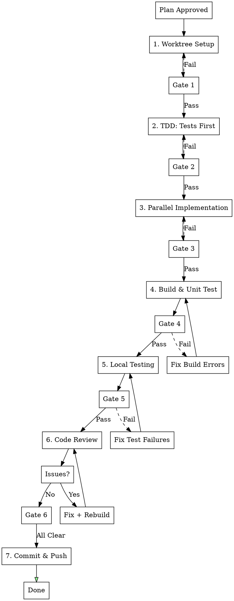

## AUTO-ROUTING TO feature-dev (MANDATORY)

**When this skill is invoked with a feature description, ALWAYS route to feature-dev first:**

```
User: "Implement user settings"
     |
     v
+---------------------------------------------------+
|  STEP 1: Invoke feature-dev skill IMMEDIATELY     |
|                                                   |
|  /feature-dev:feature-dev "{feature description}" |
+---------------------------------------------------+
     |
     v
feature-dev orchestrates -> feature-workflow phases 1-7
```

### Routing Rule
| User Request | Action |
|--------------|--------|
| "Implement X" / "Add Y" / "Create Z" | -> `/feature-dev:feature-dev "{request}"` |
| Phase-specific work (e.g., "fix Phase 3") | -> Continue in current phase |

---

# Feature Implementation Workflow (React + Vite)

## Overview

Project-specific automated development workflow for React + Vite projects.

**Core principle:** Worktree isolation + TDD + Parallel execution + Local testing + Code review loop.

## When to Use

- After plan approval: "implement this"
- Feature requires API, hooks, tests
- **Recommended**: Use via `/feature-dev:feature-dev` for guided orchestration

---

## feature-dev Integration (Recommended Entry Point)

**Prefer using feature-dev** for enhanced workflow orchestration:

```bash
# feature-dev will automatically:
# 1. Analyze codebase architecture
# 2. Create implementation plan
# 3. Invoke feature-workflow phases in STRICT order
# 4. Delegate to appropriate subagents

/feature-dev:feature-dev "Implement {feature description}"
```

**Direct workflow** (if more control needed):
```bash
# Initialize phase tracker
${CLAUDE_PLUGIN_ROOT}/plugins/feature-workflow/scripts/phase-enforcer.sh init "feature-name"
```

---

## Phase Enforcement (MANDATORY - 절대 건너뛰기 금지)

### 🚨 STRICT PHASE ORDERING - NEVER SKIP PHASES

**Phases MUST be executed in exact order. Skipping is BLOCKED by system.**

```
┌─────────────────────────────────────────────────────────────────┐
│  ❌ BLOCKED: Phase 순서 무시                                      │
│     - Phase 1 완료 전 Phase 2 시작 → BLOCKED                      │
│     - Phase 2 완료 전 Phase 3 시작 → BLOCKED                      │
│     - Phase 6 (Code Review) 전 Phase 7 (Commit) → BLOCKED        │
│                                                                   │
│  ✅ ALLOWED: 순차 진행만 허용                                      │
│     Phase 1 → Phase 2 → Phase 3 → Phase 4 → Phase 5 → Phase 6 → 7│
└─────────────────────────────────────────────────────────────────┘
```

### Phase Enforcement Commands

```bash
# At workflow start - ALWAYS initialize first
${CLAUDE_PLUGIN_ROOT}/plugins/feature-workflow/scripts/phase-enforcer.sh init "feature-name"

# Before starting each phase - WILL BLOCK IF NOT READY
${CLAUDE_PLUGIN_ROOT}/plugins/feature-workflow/scripts/phase-enforcer.sh start <phase-number>

# Check current status anytime
${CLAUDE_PLUGIN_ROOT}/plugins/feature-workflow/scripts/phase-enforcer.sh status

# Check if phase can be started (returns yes/no)
${CLAUDE_PLUGIN_ROOT}/plugins/feature-workflow/scripts/phase-enforcer.sh can-start <phase-number>
```

### Enforcement Behavior Table
| Attempt | Current Phase | Result | Reason |
|---------|---------------|--------|--------|
| Start Phase 2 | Phase 1 done | ✅ OK | Sequential |
| Start Phase 3 | Phase 1 done | ❌ BLOCKED | Phase 2 skipped |
| Start Phase 5 | Phase 4 done | ✅ OK | Sequential |
| Start Phase 7 | Phase 5 done | ❌ BLOCKED | Phase 6 skipped |

### Self-Check Before Each Phase

```
⚠️ 각 Phase 시작 전 확인:
□ 이전 Phase가 완료되었는가?
□ Gate 조건이 충족되었는가?
□ phase-enforcer.sh start <N> 실행했는가?
```

---

## 병렬처리 전략 (MANDATORY)

이 워크플로우는 다음 병렬처리 패턴을 따릅니다:

**Level 1: Phase 간 순차 (Gate 의존성)**
```
Phase 1 → Phase 2 → Phase 3 → Phase 4 → Phase 5 → Phase 6 → Phase 7
```

**Level 2: Phase 내 병렬 (독립 작업)**
```
Phase 2: TDD
├─ [Parallel] E2E test file + MSW handlers
└─ [Parallel] Unit test file + API test file

Phase 3: Implementation
├─ [Parallel via Subagent] Type definitions + Query keys
├─ [Sequential] API → Hooks (dependency)
└─ [Parallel via Subagent] Page + Components (independent)
```

**병렬 실행 트리거:**
- 독립적인 파일 생성 → Task() 병렬 호출
- 의존성 없는 탐색 → Explore agent 병렬
- 독립적인 컴포넌트 → frontend-architect 병렬

**절대 병렬 실행 금지:**
- types.ts → api.ts (의존성 있음)
- api.ts → hooks (의존성 있음)
- Gate 실패 시 다음 Phase (Gate 의존성)

---

## Workflow



---

## Phase Checkpoint System

### Checkpoint Status Indicators
| Symbol | Status | Meaning |
|--------|--------|---------|
| (pending) | Pending | Not started |
| (progress) | In Progress | Currently working |
| (pass) | Passed | Completed & verified |
| (fail) | Failed | Needs fix |
| (skip) | Skipped | Intentionally skipped (with reason) |

### TodoWrite Integration (MANDATORY)

**At workflow start, create these todos:**
```
TodoWrite([
  { content: "Phase 1: Worktree Setup", status: "pending", activeForm: "Setting up worktree" },
  { content: "Phase 2: TDD - Write Tests First", status: "pending", activeForm: "Writing tests" },
  { content: "Phase 3: Parallel Implementation", status: "pending", activeForm: "Implementing feature" },
  { content: "Phase 4: Build & Unit Test", status: "pending", activeForm: "Building and testing" },
  { content: "Phase 5: Local Testing", status: "pending", activeForm: "Running local tests" },
  { content: "Phase 6: Code Review Loop", status: "pending", activeForm: "Reviewing code" },
  { content: "Phase 7: Commit & Push", status: "pending", activeForm: "Committing changes" },
])
```

---

## Phase 1: Worktree Setup

### Steps
```bash
# Invoke superpowers:using-git-worktrees
git worktree add .worktrees/feature-name -b feature/feature-name
cd .worktrees/feature-name
pnpm install
pnpm test:e2e  # Baseline
```

### Gate 1: Worktree Verification

**Verification Commands:**
```bash
# Check 1: Worktree exists
git worktree list | grep "feature-name"

# Check 2: On correct branch
git branch --show-current | grep "feature/"

# Check 3: Dependencies installed
test -d node_modules && echo "node_modules exists"

# Check 4: Baseline tests pass
pnpm test:e2e --reporter=list 2>&1 | tail -5
```

**Gate Conditions (ALL must pass):**
| Check | Command | Expected |
|-------|---------|----------|
| Worktree created | `git worktree list` | Shows `.worktrees/feature-name` |
| Branch created | `git branch --show-current` | `feature/feature-name` |
| Dependencies | `ls node_modules` | Directory exists |
| Baseline tests | `pnpm test:e2e` | Exit code 0 |

---

## Phase 2: TDD - Tests First (Parallel)

### 2.1 E2E Tests

**Location:** `tests/e2e/{feature}.spec.ts`

**Template:**
```typescript
import { test, expect } from '@playwright/test'
import { loginAsAdmin } from './helpers/auth'

test.describe('{Feature} E2E Tests', () => {
  test.beforeEach(async ({ page }) => {
    await loginAsAdmin(page)
  })

  test('should perform main action', async ({ page }) => {
    await page.goto('/{route}')
    await page.waitForLoadState('networkidle')

    // Verify page loaded
    await expect(page.getByRole('heading', { name: /title/i })).toBeVisible()

    // Test main functionality
    // ...
  })

  test('should handle empty state', async ({ page }) => {
    await page.goto('/{route}')
    // Verify empty state handling
  })
})
```

### 2.2 Unit Tests (if applicable)

**Location:** `src/api/__tests__/{feature}.test.ts`

**Template:**
```typescript
import { describe, it, expect, vi } from 'vitest'
import { apiClient } from '../client'
import { featureApi } from '../{feature}'

vi.mock('../client')

describe('{Feature} API', () => {
  it('should return expected data', async () => {
    const mockData = { /* ... */ }
    vi.mocked(apiClient.get).mockResolvedValue({ data: { data: mockData } })

    const result = await featureApi.getList()
    expect(result).toEqual(mockData)
  })
})
```

### 2.3 MSW Setup for E2E Tests

**MSW (Mock Service Worker)는 E2E 테스트에서 백엔드 의존성을 격리합니다.**

**When to use MSW vs Real Backend:**
| 상황 | 사용 |
|-----|-----|
| Phase 2 (TDD) | MSW - 백엔드 없이 테스트 작성 |
| Phase 5 (Local Testing) | Real Backend + MSW 둘 다 |
| CI/CD E2E | MSW - 안정적이고 빠른 테스트 |

**MSW Handler 위치:** `tests/mocks/handlers/{feature}.ts`

> **Note**: API 경로는 프로젝트별로 다릅니다. react-vite (admin-frontend)는 `/api/admin/` prefix를 사용합니다.

**Template:**
```typescript
import { http, HttpResponse } from 'msw'

// Note: API path prefix is project-specific (/api/admin/ for admin-frontend)
export const {feature}Handlers = [
  http.get('/api/admin/{feature}s', () => {
    return HttpResponse.json({
      data: [
        { id: '1', name: 'Test Item 1' },
        { id: '2', name: 'Test Item 2' },
      ],
      meta: { total: 2, page: 1, page_size: 10 }
    })
  }),

  http.post('/api/admin/{feature}s', async ({ request }) => {
    const body = await request.json()
    return HttpResponse.json({
      data: { id: '3', ...body }
    }, { status: 201 })
  }),

  http.delete('/api/admin/{feature}s/:id', () => {
    return HttpResponse.json({ success: true })
  }),
]
```

**MSW Browser Setup:** `tests/mocks/browser.ts`
```typescript
import { setupWorker } from 'msw/browser'
import { {feature}Handlers } from './handlers/{feature}'
// Import other handlers...

export const worker = setupWorker(
  ...{feature}Handlers,
  // ...other handlers
)
```

**MSW 활성화 (vite.config.ts or main entry):**
```typescript
// src/main.tsx (development only)
async function enableMocking() {
  if (process.env.NODE_ENV !== 'development') return
  if (import.meta.env.VITE_DISABLE_MSW === 'true') return

  const { worker } = await import('../tests/mocks/browser')
  return worker.start({ onUnhandledRequest: 'bypass' })
}

enableMocking().then(() => {
  // render app
})
```

---

### Gate 2: Tests Written Verification

**Gate Conditions:**
| Check | Condition | Required |
|-------|-----------|----------|
| E2E test file | File exists at `tests/e2e/{feature}.spec.ts` | YES |
| Test cases | At least 2 test cases defined | YES |
| Unit test file | File exists (if API feature) | CONDITIONAL |
| **MSW handlers** | File exists at `tests/mocks/handlers/{feature}.ts` | **YES** |
| Syntax valid | TypeScript compiles | YES |
| Tests FAIL initially | Tests should fail before implementation | EXPECTED |

---

## Phase 3: Parallel Implementation

### Subagent 병렬 위임 (MANDATORY)

**Phase 3는 독립적인 작업을 병렬 subagent로 위임합니다.**

**작업 디렉토리 설정 (CRITICAL):**
모든 subagent는 반드시 worktree 경로에서 작업해야 합니다:
```
WORKTREE_PATH=".worktrees/{feature-name}"
```

**병렬 탐색 패턴 (Phase 3 시작 전):**

> **Note**: `||` 는 병렬 실행을 의미합니다. 단일 메시지에서 여러 Task 도구를 호출하면 독립적인 작업이 동시에 실행됩니다.

```markdown
# 단일 메시지로 여러 Task 호출 (병렬 실행)

<Task subagent_type="Explore">
Working directory: ${WORKTREE_PATH}
Find existing patterns for API hooks in src/api/
</Task>

<Task subagent_type="Explore">
Working directory: ${WORKTREE_PATH}
Find component patterns in src/components/
</Task>

<Task subagent_type="Explore">
Working directory: ${WORKTREE_PATH}
Find query key patterns in src/api/queryKeys.ts
</Task>
```

**의존성 기반 실행 전략:**
```
Phase 3.1: Parallel Exploration (no deps)
├─ Task(Explore): Find type patterns in src/types/
├─ Task(Explore): Find queryKey patterns
└─ Task(Explore): Find test patterns in tests/

Phase 3.2: Sequential Implementation (types → API → hooks)
└─ 직접 구현 (LSP 사용) - 의존성 있음

Phase 3.3: Parallel Component Implementation (independent)
├─ Task(frontend-architect): Implement {Feature}Page at worktree/src/pages/
└─ Task(frontend-architect): Implement {Feature}List at worktree/src/components/
```

> **Subagent 호출 예시:**
> ```markdown
> <Task subagent_type="frontend-architect">
> Working directory: .worktrees/{feature-name}
> Implement {Feature}Page component at src/pages/{Feature}Page.tsx
> Follow existing patterns in src/pages/
> </Task>
> ```

**Subagent 유형 선택:**
| 작업 | Agent Type | 용도 |
|-----|-----------|-----|
| 코드 탐색 | `Explore` | 패턴 파악, 기존 코드 분석 |
| UI 구현 | `frontend-architect` | 컴포넌트, 페이지 구현 |
| API 연동 | `backend-architect` | API 함수, 훅 작성 |
| 리팩토링 | `refactoring-expert` | 코드 구조 개선 |
| 테스트 | `quality-engineer` | 테스트 작성/개선 |
| 보안 기능 | `security-engineer` | 인증/권한 코드 (필수 리뷰) |

---

### LSP-First Pattern (MANDATORY)

**Before ANY code exploration, STOP and ask: Can LSP do this?**

| Task | LSP Operation | ❌ FORBIDDEN |
|------|---------------|--------------|
| 함수/클래스 정의 찾기 | `LSP goToDefinition` | grep/glob |
| 파일 내 심볼 개요 | `LSP documentSymbol` | cat/read entire file |
| 프로젝트 심볼 검색 | `LSP workspaceSymbol` | grep |
| 참조 추적 | `LSP findReferences` | grep |
| 타입/문서 정보 | `LSP hover` | read entire file |
| 인터페이스 구현체 | `LSP goToImplementation` | grep |
| 호출 그래프 분석 | `LSP incomingCalls`/`outgoingCalls` | manual trace |

**LSP 사용 예시:**
```bash
# Find where function is defined
LSP goToDefinition src/api/client.ts:25:10

# Get all symbols in a file
LSP documentSymbol src/pages/HomePage.tsx:1:1

# Find all references to a symbol
LSP findReferences src/hooks/useAuth.ts:15:20
```

**LSP 미사용 허용 케이스:**
- LSP 서버가 해당 파일 타입 미지원 시
- 텍스트 검색이 명확히 필요한 경우 (로그 메시지, 주석, 설정 파일)

### File Creation Order (Dependencies)

```
# Parallel (no deps)
types.ts + queryKeys.ts update

# Sequential (has deps)
types.ts -> api.ts -> hooks (useQuery) -> Page component
```

### 3.1 Types

**Location:** `src/types/api.ts` or `src/types/{feature}.ts`

```typescript
export interface {Feature}Item {
  id: string
  name: string
  // ... fields
}

export interface {Feature}ListResponse {
  data: {Feature}Item[]
  meta: PaginationMeta
}

export interface Create{Feature}Request {
  name: string
  // ... fields
}
```

### 3.2 Query Keys

**Location:** `src/api/queryKeys.ts`

```typescript
export const {feature}Keys = {
  all: ['{feature}'] as const,
  lists: () => [...{feature}Keys.all, 'list'] as const,
  list: (params: Record<string, unknown>) => [...{feature}Keys.lists(), params] as const,
  details: () => [...{feature}Keys.all, 'detail'] as const,
  detail: (id: string) => [...{feature}Keys.details(), id] as const,
}
```

### 3.3 API Functions + Hooks

**Location:** `src/api/{feature}.ts`

```typescript
import { useQuery, useMutation, useQueryClient } from '@tanstack/react-query'
import { useTranslation } from 'react-i18next'
import { apiClient } from './client'
import { {feature}Keys } from './queryKeys'
import { useToast } from '@/hooks/use-toast'
import type { {Feature}ListResponse, Create{Feature}Request } from '@/types/api'

// API Functions
export const {feature}Api = {
  getList: async (params?: Record<string, unknown>): Promise<{Feature}Item[]> => {
    const { data } = await apiClient.get<ApiResponse<{Feature}Item[]>>('/admin/{endpoint}', { params })
    return data.data ?? []
  },

  create: async (data: Create{Feature}Request): Promise<{Feature}Item> => {
    const { data: response } = await apiClient.post<ApiResponse<{Feature}Item>>('/admin/{endpoint}', data)
    if (!response.data) throw new Error('API response data is missing')
    return response.data
  },
}

// Hooks
export const use{Feature}List = (params?: Record<string, unknown>) => {
  return useQuery({
    queryKey: {feature}Keys.list(params ?? {}),
    queryFn: () => {feature}Api.getList(params),
    staleTime: 1000 * 60, // 1 minute
  })
}

export const useCreate{Feature} = () => {
  const queryClient = useQueryClient()
  const { t } = useTranslation()
  const { toast } = useToast()

  return useMutation({
    mutationFn: {feature}Api.create,
    onSuccess: () => {
      queryClient.invalidateQueries({ queryKey: {feature}Keys.lists() })
      toast({ description: t('{feature}.createSuccess') })
    },
    onError: (error: Error) => {
      toast({ variant: 'destructive', description: error.message })
    },
  })
}
```

### 3.4 Page Component

**Location:** `src/pages/{Feature}Page.tsx`

```typescript
import { useTranslation } from 'react-i18next'
import { use{Feature}List } from '@/api/{feature}'
import { AdminLayout } from '@/components/layout'
import { LoadingSpinner } from '@/components/ui'

export default function {Feature}Page() {
  const { t } = useTranslation()
  const { data, isLoading, isError } = use{Feature}List()

  if (isLoading) return <LoadingSpinner />
  if (isError) return <div>{t('common.error')}</div>

  return (
    <AdminLayout>
      <h1>{t('nav.{feature}')}</h1>
      {/* Content */}
    </AdminLayout>
  )
}
```

### 3.5 Route + Navigation

**Update:** `src/App.tsx`
```typescript
const {Feature}Page = lazy(() => import('./pages/{Feature}Page'))

// In routes:
<Route path="/{route}" element={<{Feature}Page />} />
```

**Update:** `src/components/layout/AdminLayout.tsx`
```typescript
// Add to navigation items
{ path: '/{route}', label: t('nav.{feature}'), icon: IconComponent }
```

### 3.6 Translations

**Update:** `src/locales/ko.json` and `src/locales/en.json`
```json
{
  "nav": {
    "{feature}": "Feature Name"
  },
  "{feature}": {
    "title": "Title",
    "createSuccess": "Created successfully",
    "deleteSuccess": "Deleted successfully"
  }
}
```

### Gate 3: Implementation Verification

**Gate Conditions Checklist:**
| # | Check | Command | Required |
|---|-------|---------|----------|
| 1 | Types defined | grep in `src/types/` | YES |
| 2 | Query keys | grep in `queryKeys.ts` | YES |
| 3 | API file | test -f | YES |
| 4 | Hooks exported | grep useXxx | YES |
| 5 | Page component | test -f | YES |
| 6 | Route added | grep in App.tsx | YES |
| 7 | Navigation added | grep in AdminLayout | YES |
| 8 | Translation (ko) | grep in ko.json | YES |
| 9 | Translation (en) | grep in en.json | YES |
| 10 | Toast in mutations | grep toast | YES (if mutation) |

---

## Phase 4: Build & Unit Test

### Steps
```bash
pnpm build    # Must pass
pnpm test:e2e # All tests pass (if applicable)
```

### Gate 4: Build Verification

**Gate Conditions:**
| Check | Command | Expected Exit Code |
|-------|---------|-------------------|
| TypeScript | `pnpm tsc --noEmit` | 0 |
| Build | `pnpm build` | 0 |
| Lint | `pnpm lint` | 0 |
| Output | `test -d dist` | 0 |

---

## Phase 5: Local Testing

**Invoke:** `local-testing` skill

### 테스트 모드 (MUST: 둘 다 통과 필수)

**Mode A: MSW 기반 E2E (빠름, 격리됨)**
```bash
# MSW 활성화된 dev 서버
pnpm dev  # MSW worker 자동 시작

# E2E 테스트 실행
pnpm test:e2e
```

**Mode B: Real Backend E2E (느림, 실제 통합)**
```bash
# 백엔드 시작
cd ../ssak-backend && go run ./cmd/server

# 프론트엔드 (MSW 비활성화)
VITE_DISABLE_MSW=true pnpm dev

# E2E 테스트 실행 (real backend)
pnpm test:e2e:real  # or pnpm test:e2e with MSW disabled
```

**When to use each:**
| Phase | Mode | 이유 |
|-------|------|-----|
| Phase 2 Gate | MSW (A) | 백엔드 없이 테스트 검증 |
| Phase 4 Gate | MSW (A) | 빌드 검증용 빠른 테스트 |
| Phase 5 Full | **Both (A+B)** | 격리 + 통합 모두 검증 |
| CI/CD | MSW (A) | 안정적이고 재현 가능 |

### Steps

> **Note**: 아래 명령어는 worktree 디렉토리 (`.worktrees/{feature-name}`) 기준입니다.

```bash
# Step 1: MSW E2E (Mode A) - MUST PASS
pnpm dev &
pnpm test:e2e
# Expected: All tests pass

# Step 2: Real Backend E2E (Mode B) - MUST PASS
# Terminal 1: Start backend (from project root)
(cd ../../ssak-backend && go run ./cmd/server) &

# Terminal 2: Start frontend with MSW disabled (from worktree)
VITE_DISABLE_MSW=true pnpm dev &

# Run E2E tests
pnpm test:e2e
# Expected: All tests pass
```

### Gate 5: Local Testing Verification (MUST: 둘 다 통과)

**Gate Conditions:**
| Check | Command | Expected | Required |
|-------|---------|----------|----------|
| **MSW E2E tests** | `pnpm test:e2e` | Exit code 0 | **MUST** |
| Backend health | `curl localhost:8100/health` | "ok" response | **MUST** |
| Frontend running | `curl localhost:3001` | HTTP 200 | **MUST** |
| **Real Backend E2E** | `VITE_DISABLE_MSW=true pnpm test:e2e` | Exit code 0 | **MUST** |
| Feature tests (MSW) | `pnpm test:e2e tests/e2e/{feature}.spec.ts` | Exit code 0 | **MUST** |
| Feature tests (Real) | Same with MSW disabled | Exit code 0 | **MUST** |

---

## Phase 6: Code Review Loop (Ralph-Loop)

### Ralph-Loop Auto Mode (MANDATORY)

**Code Review는 Ralph-loop를 사용하여 meaningful issue가 없을 때까지 자동 반복합니다.**

```bash
# Ralph-loop 실행 (자동 반복)
/ralph-loop "Code review for {feature-name} implementation.

Instructions:
1. Run code review: Task(superpowers:code-reviewer) with context
2. Count issues by severity (Critical, Important, Minor)
3. If Critical > 0 OR Important > 0:
   - Fix each issue
   - Rebuild (pnpm build && pnpm lint)
   - Continue loop
4. Output <promise>CODE_REVIEW_DONE</promise> when Critical=0 AND Important=0

Context:
- Feature: {feature description}
- Files changed: {file list}
- Base: origin/develop
" --completion-promise "CODE_REVIEW_DONE" --max-iterations 10
```

### Why Ralph-Loop?

| Manual Loop | Ralph-Loop |
|-------------|------------|
| 사람이 매번 재요청 | 자동 반복 |
| Context 유실 가능 | Context 유지 |
| 중간 이탈 가능 | 완료까지 진행 |
| 피드백 누락 가능 | 모든 이슈 처리 |

### Gate 6: Code Review Verification

**Ralph-Loop Process:**
```
┌─────────────────────────────────────────────────────────┐
│  /ralph-loop starts                                     │
│  ↓                                                      │
│  Code Review (superpowers:code-reviewer)                │
│  ↓                                                      │
│  Count Issues:                                          │
│  - Critical: {count}                                    │
│  - Important: {count}                                   │
│  - Minor: {count}                                       │
│  ↓                                                      │
│  Critical > 0 OR Important > 0?                         │
│  ├─ YES → Fix → Rebuild → Loop continues ───────────────┤
│  └─ NO → <promise>CODE_REVIEW_DONE</promise>            │
│          ↓                                              │
│          Gate 6 PASSED ✅                               │
└─────────────────────────────────────────────────────────┘
```

**Verification Checklist (Ralph-loop handles automatically):**
| # | Check | Status | Action if Fail |
|---|-------|--------|----------------|
| 1 | Critical issues = 0 | | Ralph auto-fixes, re-reviews |
| 2 | Important issues = 0 | | Ralph auto-fixes, re-reviews |
| 3 | Minor issues addressed | | Fix or document why skipped |

**Ralph-loop 완료 조건:**
- `meaningfulUnprocessedCount = 0` (Critical + Important = 0)
- `<promise>CODE_REVIEW_DONE</promise>` 출력됨

---

## Phase 7: Commit & Push

### Steps
```bash
git add -A
git commit -m "feat({scope}): {description}"
git push -u origin feature/{feature-name}
```

### Gate 7: Final Verification

**Gate Conditions:**
| Check | Command | Expected |
|-------|---------|----------|
| No unstaged changes | `git status --porcelain` | Empty or only untracked |
| Commit exists | `git log --oneline -1` | Shows feat commit |
| Pushed | `git push -u origin feature/xxx` | Exit code 0 |
| Remote branch | `git ls-remote` | Branch listed |

---

## Quick Reference

| Phase | Files | Pattern | Gate Check |
|-------|-------|---------|------------|
| E2E Test | `tests/e2e/{f}.spec.ts` | `loginAsAdmin()` + Playwright | File exists + test cases |
| Unit Test | `src/api/__tests__/{f}.test.ts` | vitest + mocked apiClient | File exists |
| Types | `src/types/api.ts` | Interface definitions | grep for types |
| Query Keys | `src/api/queryKeys.ts` | `{feature}Keys` factory | grep for keys |
| API + Hooks | `src/api/{f}.ts` | `apiClient` + useQuery/useMutation | exports exist |
| Page | `src/pages/{F}Page.tsx` | lazy() import | File exists |
| Route | `src/App.tsx` | `<Route path="/{route}">` | grep in file |
| Nav | `AdminLayout.tsx` | Navigation item | grep in file |
| i18n | `src/locales/*.json` | Translation keys | grep both files |

---

## Red Flags - STOP

- ❌ Using grep/glob when LSP can do it (LSP FIRST!)
- ❌ Implementing before writing tests
- ❌ Sequential execution for independent files
- ❌ Skipping local-testing with real backend
- ❌ Committing without code review passing
- ❌ Manual code review loop instead of Ralph-loop
- ❌ Missing toast notifications for mutations
- ❌ Missing translations for new UI text
- ❌ Missing sidebar navigation for new pages
- ❌ Proceeding to next phase without gate verification
- ❌ Skipping code review re-run after fixes
- ❌ Not updating TodoWrite status between phases
