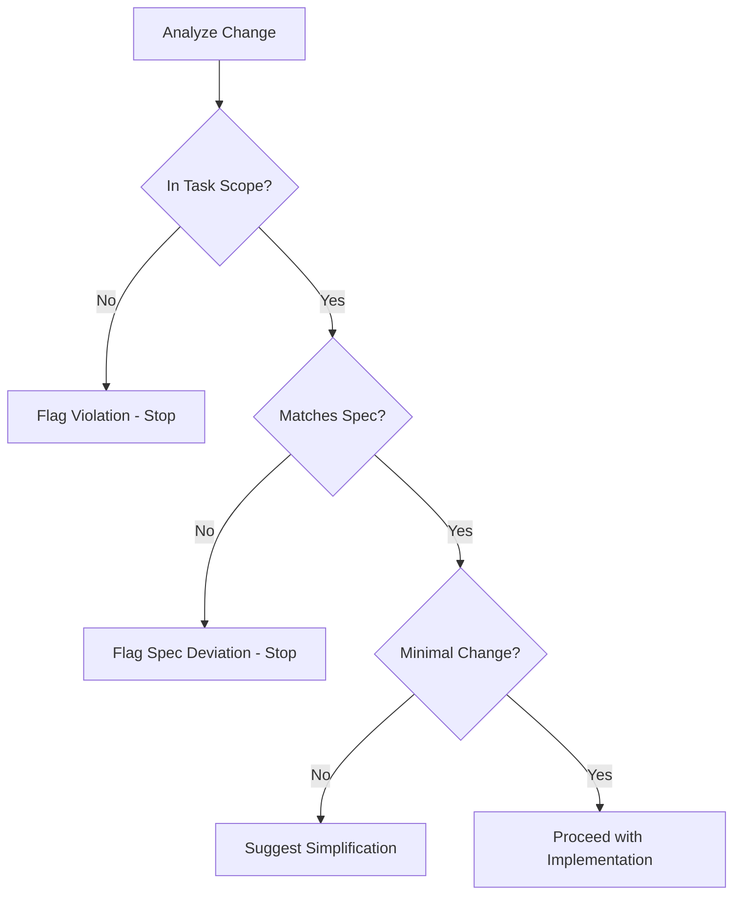

# Implementation Boundary Guard

## Purpose

Ensures that implementation stays **strictly within the defined task scope**. Prevents scope creep, unauthorized changes, and deviation from the spec.

## When to Use

- At the start of any implementation task
- Continuously during coding
- Before committing changes

## Guarding Steps

1. **Load Task Boundaries**: Confirm what is IN and OUT of scope.
2. **Validate Each Change**: Check every modified file and logical block against the scope.
3. **Flag Boundary Violations**: Stop implementation if unrelated code is touched.
4. **Request Scope Expansion**: If a boundary must be crossed, request explicit approval.

## Decision Tree

## Review Checklist

1. **Scope**: Do all changed files belong to the assigned task?
2. **Alignment**: Does every logic change have a corresponding Spec requirement ID?
3. **Focus**: Are there any "while I'm here" improvements or refactors?
4. **Purity**: Are new dependencies strictly necessary and approved?

## How to provide feedback
- **Be specific**: "The changes to `db_config.py` are out of scope for the 'User Auth' task."
- **Explain why**: "Touching shared config files without a task mandate risks breaking other modules."
- **Suggest alternatives**: "Revert `db_config.py` and implement the change in a separate dedicated task."

Stay in your lane.
