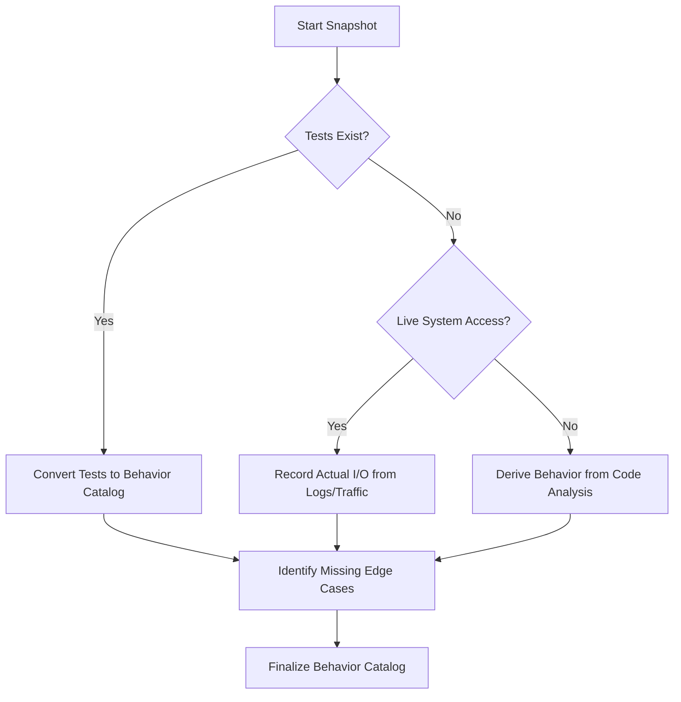

# Legacy Behavior Snapshot

## Purpose

Captures a complete record of existing system behavior before any migration work begins. This snapshot becomes the **source of truth** for validating that the new system maintains parity with the old.

## When to Use

- Starting a migration project
- Replacing a legacy system
- Significant refactoring of critical paths

## Snapshot Steps

1. **Identify Behavior Scope**: Enumerate APIs, user flows, edge cases, and side effects.
2. **Capture Behavior Evidence**: Document input, output, and evidence source for each behavior.
3. **Create Baseline Tests**: Convert catalog entries into executable tests (`Given/When/Then`).
4. **Document Unknowns**: Flag undocumented or non-deterministic behaviors explicitly.

## Decision Tree

## Review Checklist

1. **Determinism**: Are non-deterministic outputs (IDs, timestamps) handled in tests?
2. **Completeness**: Are 4xx and 5xx error states included in the catalog?
3. **Evidence**: Is there a clear source (e.g. "observed in logs") for each behavior?
4. **Parity Readiness**: Are inputs/outputs detailed enough to use for `regression-and-parity-check`?

## How to provide feedback
- **Be specific**: "The snapshot for 'Checkout' misses the 'Apply Coupon' side-effect on the `discounts` table."
- **Explain why**: "Missing side-effects lead to silent data discrepancies in the new system."
- **Suggest alternatives**: "Recommend adding a 'Side Effects' section to the checkout behavior ID: CART-001."

Blameless documentation of existing reality.
