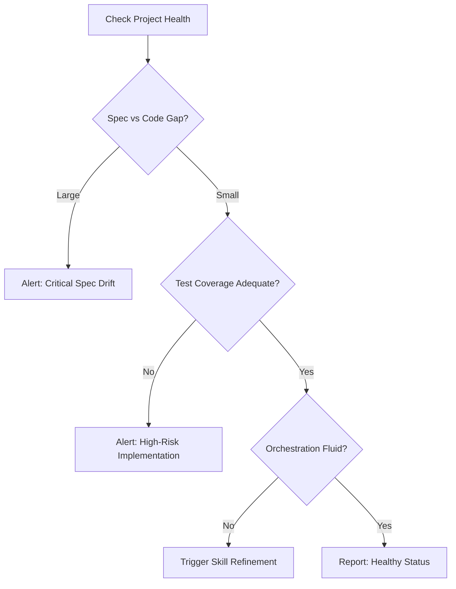

# Lifecycle Health Monitor

## Purpose

Provides a macro-view of the project's long-term viability. It detects "rot" in the form of outdated specs, falling test coverage, or increasing complexity that slows down development.

## When to use this skill
- During monthly or quarterly project reviews
- After reaching a major milestone
- When development velocity noticeably drops

## Monitoring Steps

1. **Evaluate Spec Drift**: Compare the latest `implementation_plan.md` files against the master `spec`. Are updates being backported?
2. **Evaluate Test Coverage Relevance**: Is coverage high in critical logic areas, or just in utility functions?
3. **Evaluate Orchestration Efficiency**: Are certain skills being bypassed or overridden frequently? (Inputs from `skill-evolution-engine`).
4. **Flag Systemic Risks**: Look for single points of failure in the architecture or process.

## Decision Tree

## Review Checklist

1. **Aging**: Are there tasks that have been "in progress" for more than 2 weeks?
2. **Quality**: Is the bug-fix vs new-feature ratio increasing?
3. **Documentation**: Is the `README.md` and `SKILL_INDEX.md` up to date?
4. **Alignment**: Does the current implementation still match the `Project Vision`?

## How to provide feedback
- **Be specific**: "Spec drift detected in the Payment module; 3 new fields added to code are not in the spec."
- **Explain why**: "Outdated specs lead to incorrect test generation and security misses."
- **Suggest alternatives**: "Recommend a `spec-auto-updater` session for the Payment module."

Healthy systems age gracefully.
