# Diagram Generation Guide

Mermaid patterns for architecture visualization in Linear issues and audit reports.

---

## Best Practices

- **Target 5-15 nodes per diagram** (readable, not overwhelming)
- **Use multiple small diagrams** over one massive one
- **Hand-craft when needed** - layer output is a starting point
- **Include data flow diagrams** for full-stack features
- **Add sequence diagrams** for interaction-heavy features
- **Use visual indicators**: green=done, yellow=pending, red=issue

---

## Diagram Assembly Workflow

1. Generate a base graph (layer or outline)
2. Prune to the smallest set of nodes that explain the change
3. Rename nodes to match domain language from the issue
4. Annotate arrows with verbs (fetch, write, validate, render)
5. Add a short legend if color or status is used

---

## Generation Commands

```bash
# Package-level dependencies (monorepos)
layer . --mode=packages --format=mermaid

# File-level import graph
layer . --mode=files --format=mermaid

# Pipe specific files to layer
fd -e ts . src/hooks src/components | layer --stdin --mode=files --format=mermaid

# Focused on specific package/area
layer . --focus="packages/auth" --depth=2 --format=mermaid

# Show what depends ON a package (upstream)
layer . --dependents="lib" --format=mermaid

# Show what a package depends ON (downstream)
layer . --dependencies="services/api" --format=mermaid

# Create shareable gist
layer . --mode=files --format=mermaid --gist --gist-description="$ISSUE_ID architecture"

# Call graph from outline (narrow scope)
outline --graph --format=mermaid src/**/*.ts
```

---

## Diagram Templates

### Package Dependencies

From `layer --mode=packages`:

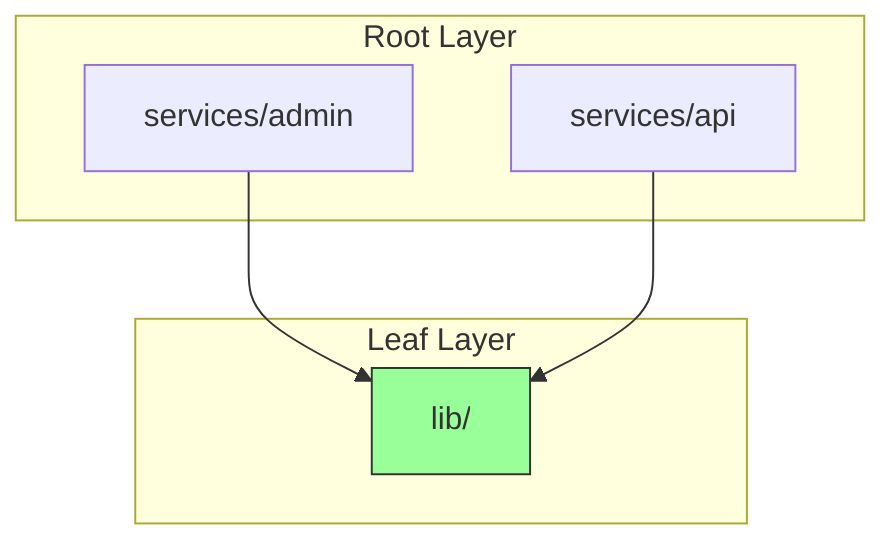

### Data Flow

Hand-crafted based on analysis:

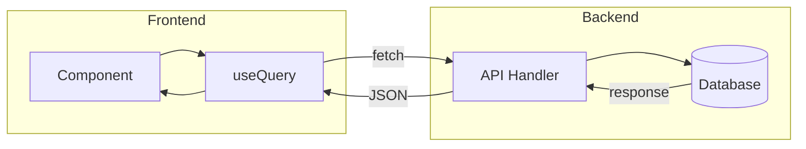

### Implementation Steps

Step-by-step visualization:

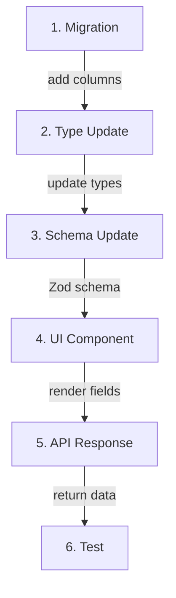

### Sequence Diagram

For interaction-heavy features:

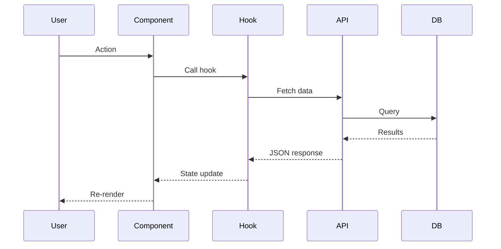

### ER Diagram

For schema changes:

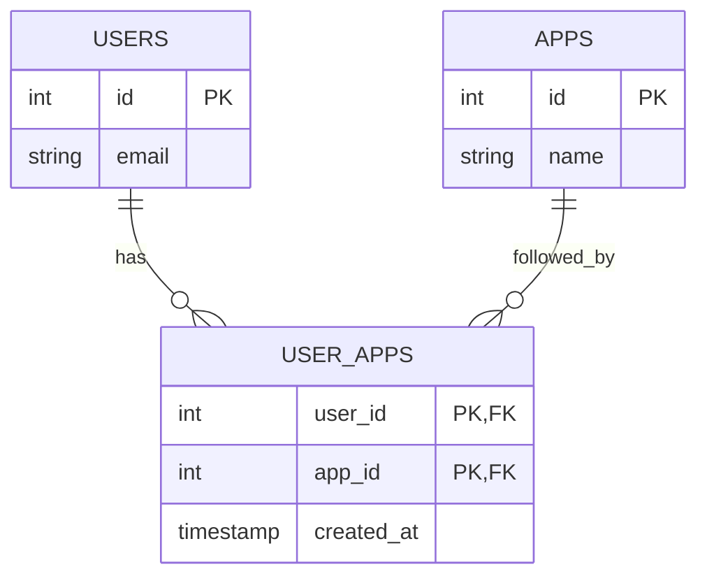

### C4 Context (Lightweight)

Use when the issue crosses multiple systems:

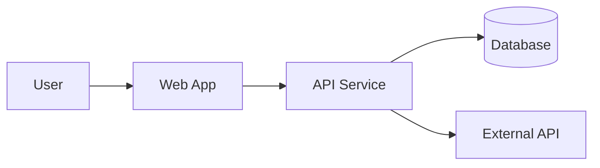

### State Diagram

For stateful UI or workflow transitions:

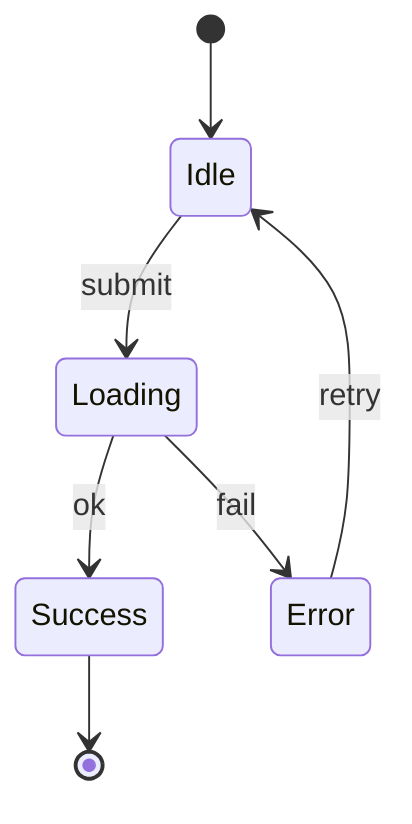

### Call Graph

Use for narrow code paths to show function flow:

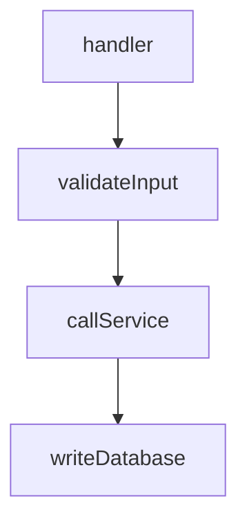

### Legend Pattern

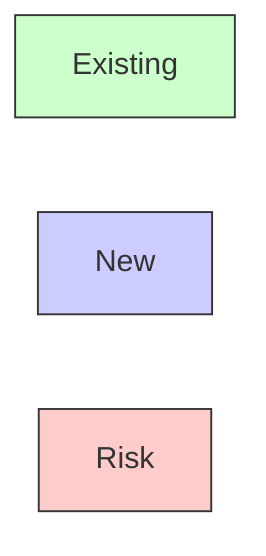

---

## Audit Report Diagrams

### Issue Distribution

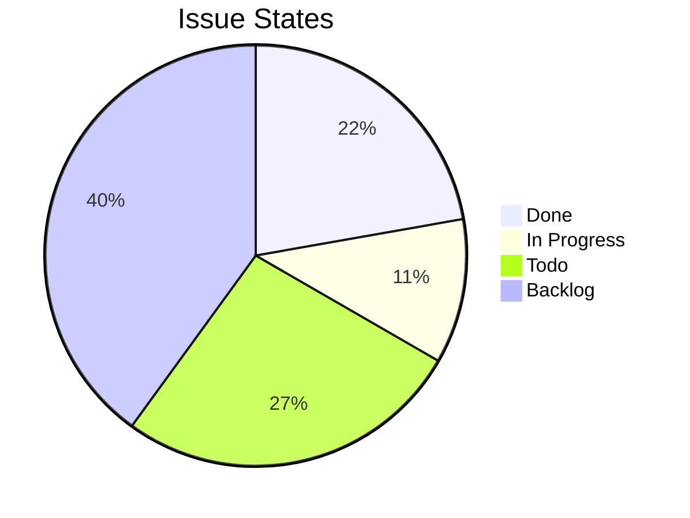

### Architecture Overview

```mermaid
flowchart TD
  subgraph apps
    app[apps/app]
    daemon[apps/daemon]
  end
  subgraph packages
    backend[@repo/backend]
    design[@repo/design]
    auth[@repo/auth]
  end
  app --> backend
  app --> design
  app --> auth
  daemon --> backend
```

### V1 Gap Visualization

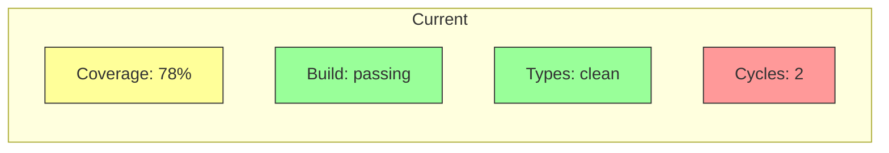

---

## Diagram Selection Decision Tree

```
What does the issue touch?
├── Data transformation
│   └── Sequence diagram (flow of data)
├── Component interaction
│   └── Flowchart (component boundaries)
├── State changes
│   └── State diagram (transitions)
├── System architecture
│   └── C4/layer diagram (dependencies)
├── API changes
│   └── Sequence + entity diagram
├── Schema changes
│   └── ER diagram
└── Multiple areas
    └── Combine relevant diagrams (max 3)
```

---

## Concrete Values

| value | meaning |
|-------|---------|
| nodes per diagram | 5-15 (readable) |
| max diagrams per issue | 3 (avoid overload) |
| diagram types | flowchart, sequence, ER, state, pie |
| legend usage | when using color/status |
