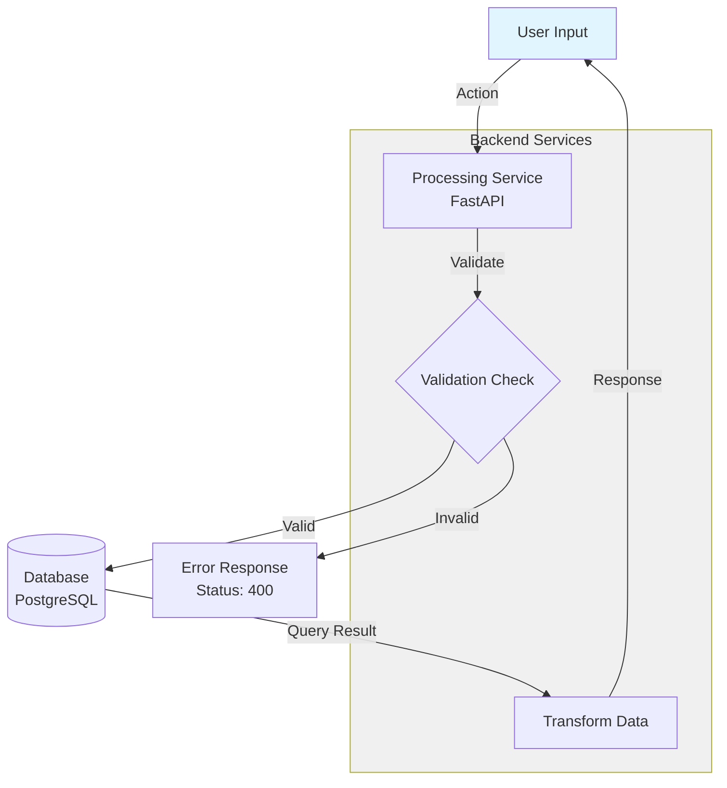
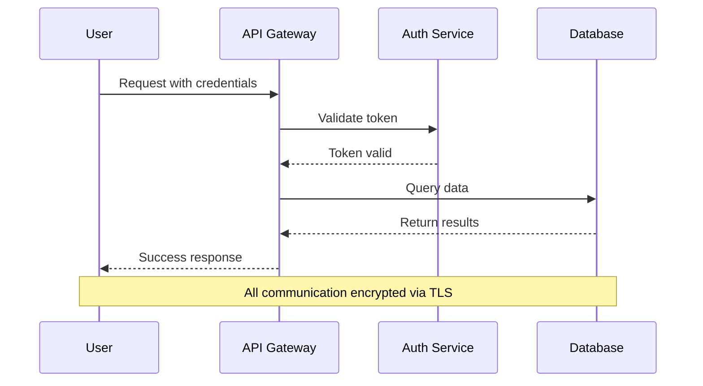
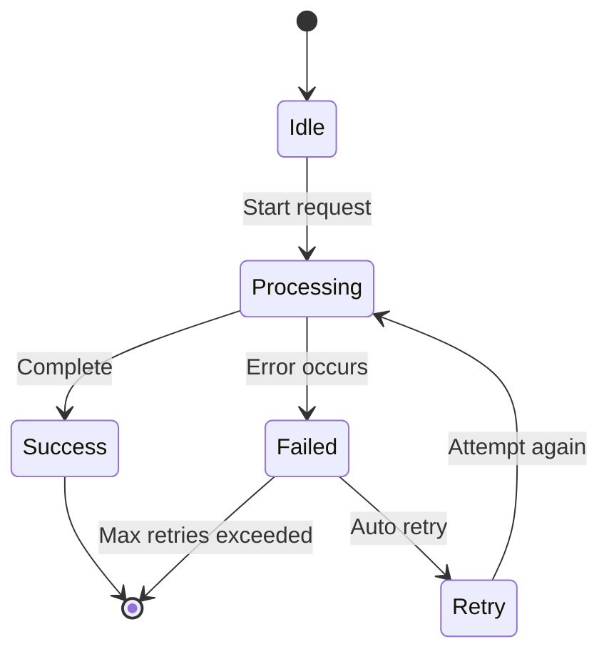
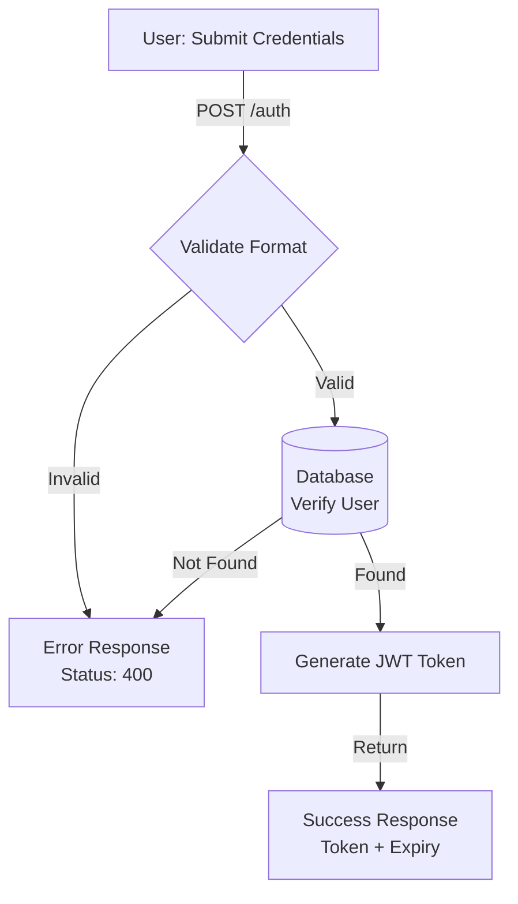
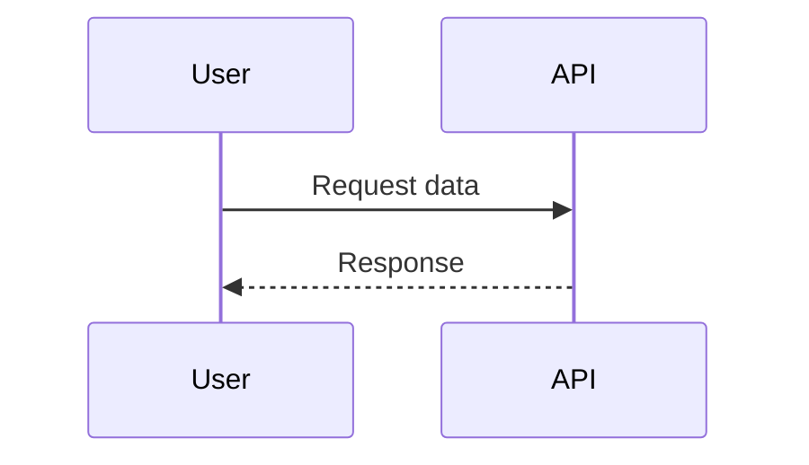
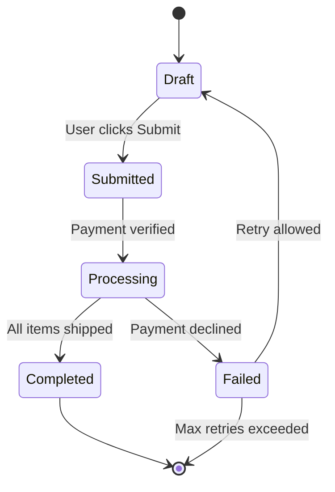
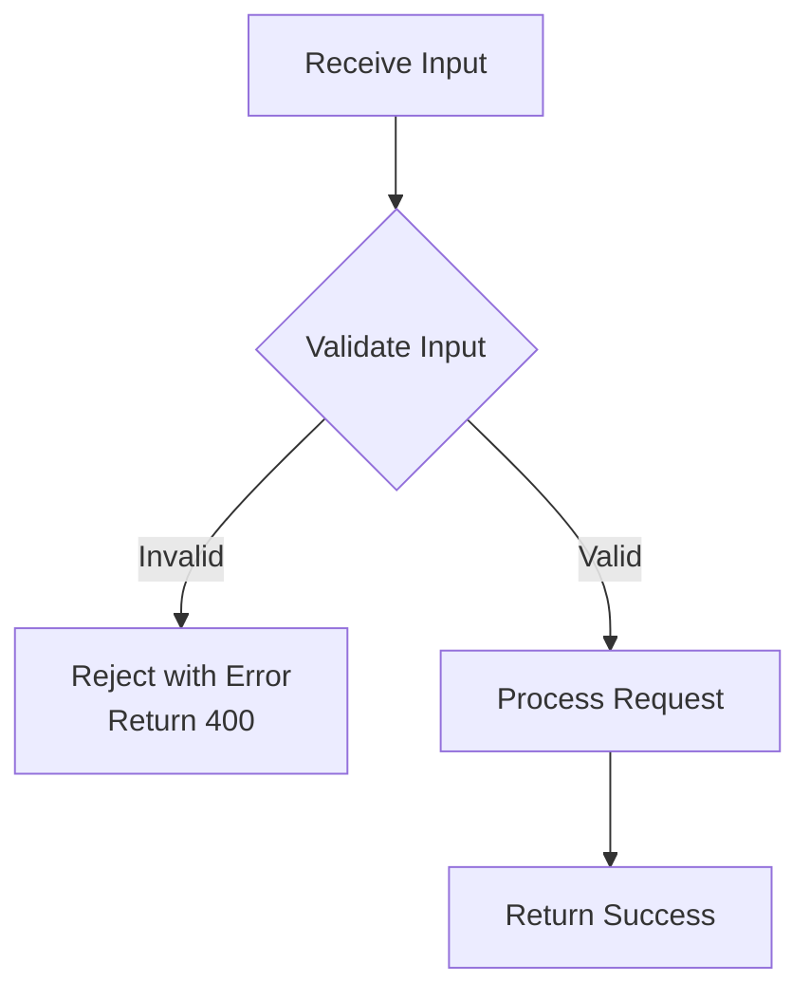
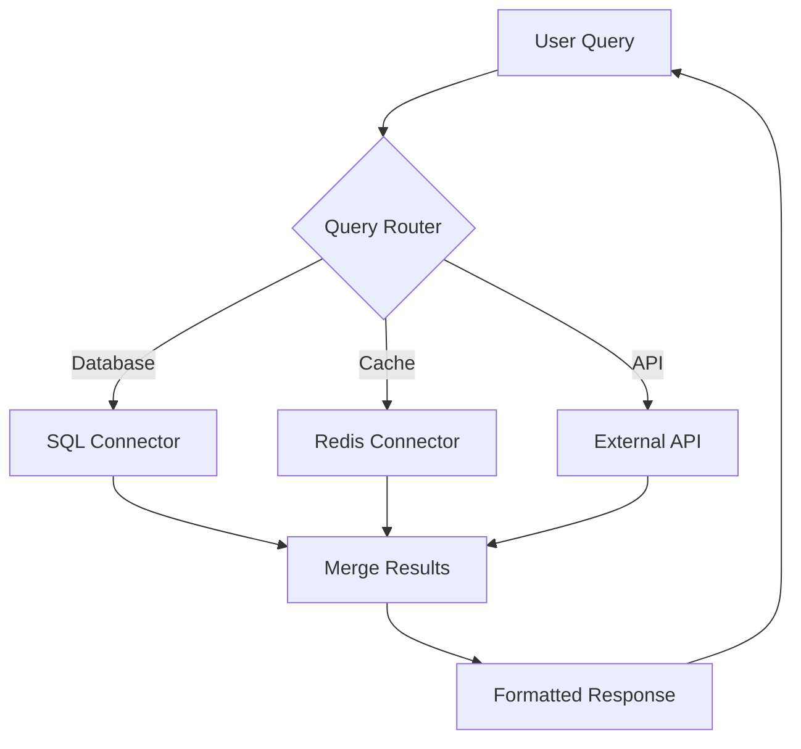
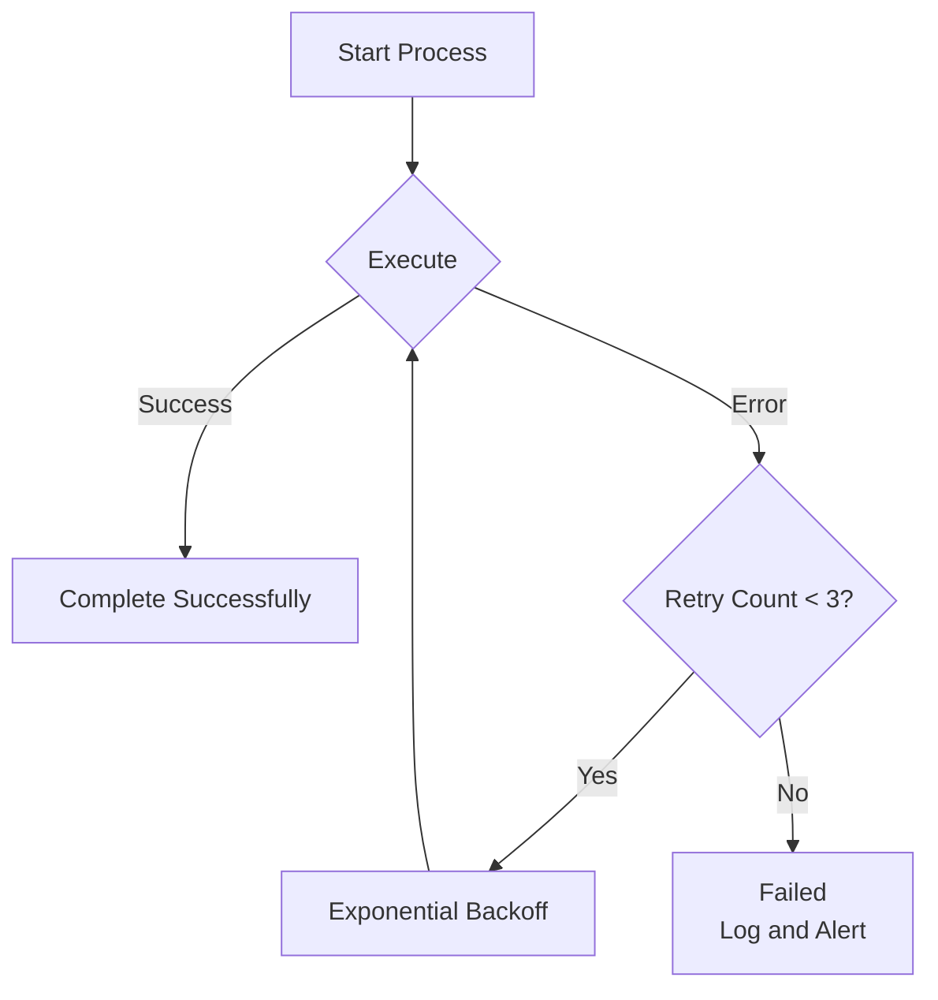
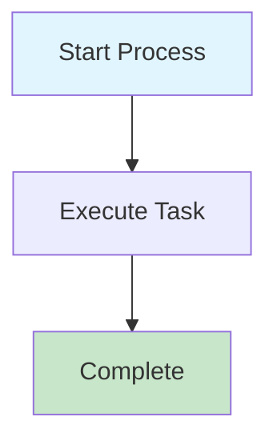

# Mermaid Diagramming and Generation Skill

This skill provides comprehensive guidelines and best practices for generating error-free Mermaid diagrams, ensuring that diagrams render correctly and adhere to syntax rules.

## Purpose

The `mermaid-diagramming-and-generation` skill offers expert guidance for creating syntactically correct Mermaid diagrams while avoiding common parsing errors that cause rendering failures. This skill focuses on diagram syntax correctness and best practices.

**Key Benefits**:
- **Error Prevention**: Avoid nested quotes, special character issues, and malformed syntax.
- **Syntax Mastery**: Apply correct patterns for flowcharts, sequence diagrams, state machines, etc.
- **Quality Assurance**: Validate diagrams before rendering using proven templates.
- **Troubleshooting**: Diagnose and fix parse errors systematically.
- **Best Practices**: Follow standardized naming, styling, and structure conventions.

## When to Use This Skill

**Use this skill when**:
- Creating new Mermaid diagrams (flowcharts, sequence diagrams, state machines, etc.)
- Fixing parse errors or rendering issues in existing diagrams
- Converting written descriptions into Mermaid syntax
- Validating diagram syntax before committing to documentation
- Debugging "Expecting X, got Y" parse errors
- Migrating diagrams from other formats to Mermaid
- Need best practice guidance for node naming, styling, subgraphs

**Do NOT use this skill when**:
- Creating simple tables or text-based lists (use markdown tables)
- Need diagram file management or SVG generation (use a separate skill for that)
- Creating data visualization charts (bar, pie, line - use charting libraries)
- Need Gantt charts or Git graphs (outside core focus)
- Diagram is already working perfectly (no changes needed)

## Skill Inputs

### Required Inputs

| Input | Description | Example |
|-------|-------------|---------|
| **Diagram Type** | Type of Mermaid diagram | `flowchart`, `sequence`, `state`, `class` |
| **Diagram Purpose** | What the diagram represents | "Agent communication flow", "State machine transitions" |
| **Content Description** | Key elements and relationships | "3 agents, 1 database, request/response flow" |

### Optional Inputs

| Input | Description | Default |
|-------|-------------|---------|
| **Existing Code** | Current Mermaid code (if fixing) | None (creating new) |
| **Error Message** | Parse error from renderer | None |
| **Styling Preferences** | Color scheme, layout direction | Project defaults |
| **Naming Convention** | Node ID format | `camelCase` |

## Skill Workflow

Follow this 5-step process to create or fix Mermaid diagrams:

### Step 1: Understand Requirements
- Identify diagram type (flowchart, sequence, state, class, etc.)
- List all nodes/entities that need to be represented
- Identify relationships and connections
- Determine flow direction (TD, LR, etc.)
- Note any grouping needs (subgraphs)

### Step 2: Plan Node Structure
- Create meaningful node IDs (camelCase, no spaces)
- Keep display labels concise but descriptive
- Identify decision points (diamond shapes)
- Plan database/storage nodes (cylinder shapes)
- Determine which nodes need special shapes

### Step 3: Apply Syntax Rules (Critical)
- **Remove nested quotes** from all node labels.
- **Wrap multi-line labels** (with `<br/>`) in double quotes.
- **Keep edge labels simple** - no quotes unless necessary.
- **Use ID/label syntax** for subgraphs with special characters.
- **Separate node IDs from labels**: `NodeID[Display Label]`.

### Step 4: Build Diagram with Template
- Start with appropriate template (flowchart, sequence, state).
- Add nodes with correct syntax.
- Define relationships/edges with proper arrow types.
- Group related nodes in subgraphs (if needed).
- Add styling directives AFTER all nodes defined.
- Include comments (`%%`) for complex sections.

### Step 5: Validate and Test
- Check for nested quotes in any labels.
- Verify subgraph IDs match style references.
- Confirm all node IDs are unique.
- Test in Mermaid Live Editor (https://mermaid.live).
- Validate all relationships resolve correctly.
- Ensure rendering succeeds without errors.

## Common Mermaid Syntax Errors & Solutions

### 1. Quotes in Node Labels
**❌ WRONG - Nested quotes cause parse errors:**
```mermaid
User[User: "What is the status?"] --> System
Response["Message: "Success""] --> User
```
**✅ CORRECT - Remove inner quotes or escape properly:**
```mermaid
User[User: What is the status?] --> System
Response["Message: Success"] --> User
```

### 2. Multi-line Nodes with Special Characters
**❌ WRONG - Decimals and special chars without quotes:**
```mermaid
Results[Top Results:<br/>1. system_arch.md (0.89)<br/>2. safety.yaml (0.84)]
```
**✅ CORRECT - Wrap in double quotes when using <br/> with numbers/decimals:**
```mermaid
Results["Top Results:<br/>1. system_arch.md (0.89)<br/>2. safety.yaml (0.84)"]
```

### 3. Edge Labels with Quotes
**❌ WRONG - Quotes in edge labels:**
```mermaid
A -->|"Execute"| B
A -->|"Cancel" or Timeout| C
```
**✅ CORRECT - Remove quotes from edge labels:**
```mermaid
A -->|Execute| B
A -->|Cancel or Timeout| C
```

### 4. Subgraph Names with Special Characters in Style Directives
**❌ WRONG - Ampersands and special chars in style references:**
```mermaid
subgraph "Audit & Compliance"
    Node1
end
style Audit & Compliance fill:#fff
```
**✅ CORRECT - Use ID/label syntax for subgraphs:**
```mermaid
subgraph AuditCompliance["Audit & Compliance"]
    Node1
end
style AuditCompliance fill:#fff
```

### 5. Node IDs vs Display Labels
**✅ CORRECT - Separate IDs from labels:**
```mermaid
UserNode[User: Query the system] --> ProcessNode[Processing Service]
ProcessNode --> DBNode[(Database)]
```

## Mermaid Chart Templates

### Flowchart Template


### Sequence Diagram Template


### State Diagram Template


## Troubleshooting Guide

### Error: "Expecting 'SQE', got 'STR'"
- **Cause:** Nested quotes in node labels.
- **Fix:** Remove inner quotes or wrap entire label in quotes.

### Error: "Expecting 'SPACE', got 'AMP'"
- **Cause:** Special character (&, /, etc.) in style directive.
- **Fix:** Use subgraph ID/label syntax: `subgraph ID["Name"]`.

### Error: "Parse error on line X"
- **Cause:** Usually quote-related or malformed syntax.
- **Fix:** Check for nested quotes, verify node/edge syntax.

### Chart not rendering
- **Cause:** Invalid node IDs, broken references, or syntax errors.
- **Fix:** Validate in Mermaid Live Editor, check node ID consistency.

## Quality Gates (Definition of Done)

### Syntax Validation Gates
- [ ] **No nested quotes**: All node labels checked for nested quote issues.
- [ ] **Multi-line syntax**: Labels with `<br/>` wrapped in double quotes.
- [ ] **Edge labels clean**: No unnecessary quotes in edge labels (between `|...|`).
- [ ] **Subgraph IDs valid**: Subgraphs with special chars use ID/label syntax.
- [ ] **Node IDs unique**: No duplicate node IDs in diagram.
- [ ] **Node ID format**: All IDs use camelCase with no spaces.

### Structure Validation Gates
- [ ] **Diagram renders**: Successfully renders in Mermaid Live Editor.
- [ ] **All relationships resolve**: No broken node references.
- [ ] **Flow direction correct**: TD, LR, RL, BT specified appropriately.
- [ ] **Subgraphs organized**: Related nodes grouped logically.
- [ ] **Styling applied**: Style directives added AFTER all nodes defined.

### Quality Assurance Gates
- [ ] **Labels concise**: Display labels descriptive but not verbose.
- [ ] **Comments added**: Complex sections documented with `%%` comments.
- [ ] **Appropriate diagram type**: Using correct type (flowchart vs sequence vs state).
- [ ] **Visual clarity**: Diagram is readable and understandable.
- [ ] **Documentation integration**: Title/caption added if embedding in docs.

## Example Usage

### Example 1: Create New Flowchart
**User Request**:
> "Create a flowchart showing the authentication flow: user submits credentials, system validates, checks database, returns token or error"

**Skill Actions**:
1. **Identify type**: Flowchart (process flow with decisions).
2. **Plan nodes**: User, Validator, Database, TokenService, Error, Success.
3. **Plan flow**: User → Validate → Decision → Database OR Error → Success OR Error.
4. **Apply syntax rules**:
   - Node IDs: `userInput`, `validator`, `dbCheck`, `tokenService`, `errorResponse`, `successResponse`.
   - Remove nested quotes from all labels.
   - Use decision diamond for validation check.
5. **Build from template**: Use Flowchart Template.
6. **Validate**: Test in Mermaid Live Editor.

**Result**:


### Example 2: Fix Parse Error
**User Request**:
> "My sequence diagram won't render. Error: 'Expecting SQE, got STR'. Here's the code: `User->>API: Request "data"`"

**Skill Actions**:
1. **Diagnose error**: "Expecting SQE, got STR" = nested quotes issue.
2. **Locate problem**: Edge label has nested quotes: `Request "data"`.
3. **Apply fix**: Remove inner quotes: `Request data`.
4. **Validate**: Test corrected syntax in Mermaid Live Editor.
5. **Return fixed code**.

**Result**:


### Example 3: Create State Machine with Complex Labels
**User Request**:
> "Create a state diagram for order processing: Draft → Submitted → Processing → Completed or Failed. Include transition conditions."

**Skill Actions**:
1. **Identify type**: State diagram (state transitions).
2. **Plan states**: Draft, Submitted, Processing, Completed, Failed.
3. **Plan transitions**: With labeled conditions.
4. **Apply syntax rules**:
   - Use `stateDiagram-v2` syntax.
   - State IDs: `Draft`, `Submitted`, `Processing`, `Completed`, `Failed`.
   - Transition labels with conditions (no quotes).
5. **Build from template**: Use State Diagram Template.
6. **Validate**: Test in Mermaid Live Editor.

**Result**:


## Common Patterns

### Decision Flow Pattern


### Multi-Source Integration Pattern


### Error Handling Pattern


## Output Format

### Generated Artifacts
When using the `mermaid-diagramming-and-generation` skill, the primary output is:

**Mermaid Diagram Code Block**:
- Format: Markdown code block with `mermaid` language identifier.
- Content: Syntactically valid Mermaid diagram code.
- Validation: Tested in Mermaid Live Editor before delivery.
- Structure: Includes comments, styling, and proper node/edge syntax.

**Example Output**:
````markdown

````

## Integration with Project Workflow

### Relationship to Other Skills
- **charts-flow Skill**: Manages diagram files, generates SVG, embeds in documents.
- **mermaid-diagramming-and-generation**: Ensures diagram syntax is correct before file creation.
- **Use together**: `charts-flow` skill calls `mermaid-diagramming-and-generation` for diagram generation.

### Documentation Standards Alignment
- Focus on technical implementation (not marketing language).
- Cost optimization considerations (lightweight SVG format).
- Performance focus (separate diagram files for faster rendering).
- Security considerations (no executable code in diagrams).

**Best Practice Integration**:
- Use `mermaid-diagramming-and-generation` for syntax correctness.
- Use `charts-flow` for file management and performance optimization.
- Follow project naming conventions for node IDs.
- Validate all diagrams before committing to version control.

## Version
- **Version:** 1.0
- **Last Updated:** 2025-11-05
- **Lessons Learned From:** ADR Architecture Flow diagram fixes

## Related Documentation
- [