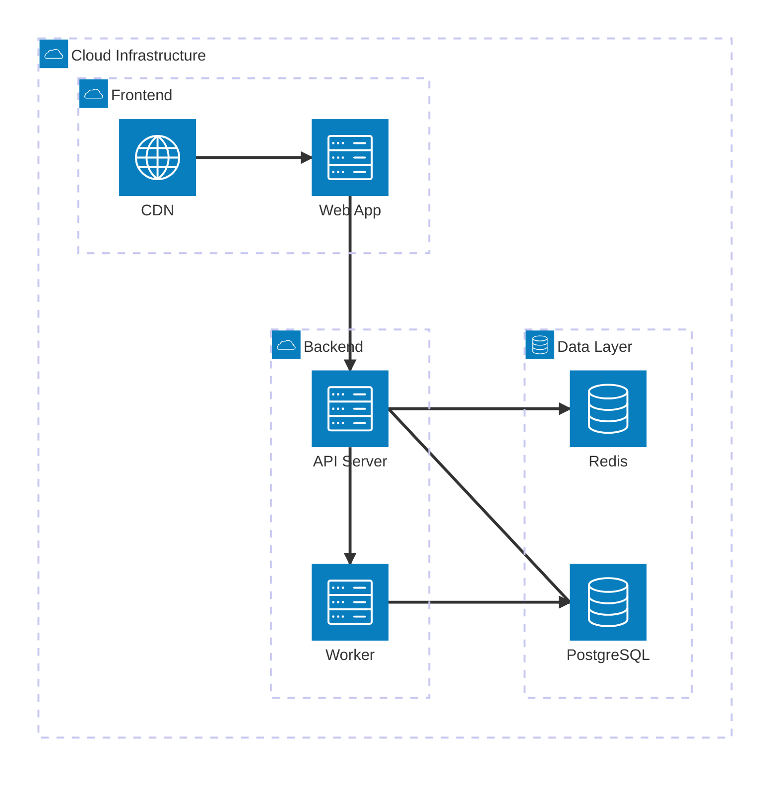

# Architecture Diagram Reference

Architecture diagrams show cloud/infrastructure relationships.

## Declaration

```
architecture-beta
```

## Groups

Containers for organizing services:

```
group api(cloud)[API Layer]
group db(database)[Data Layer]
group nested(cloud)[Nested] in api
```

## Services

Individual nodes:

```
service server(server)[Web Server]
service database(database)[PostgreSQL] in db
```

## Built-in Icons

`cloud`, `database`, `disk`, `internet`, `server`

## Custom Icons

Use iconify format: `service lambda(logos:aws-lambda)[Lambda]`

## Edges

Connect services with direction hints:

```
%% Basic connection
server:R -- L:database

%% With arrow direction
server:R --> L:database
server:R <-- L:database

%% Direction options: T (top), B (bottom), L (left), R (right)
```

## Junctions

Multi-directional connection points:

```
junction hub
service a(server)[A]
service b(server)[B]
service c(server)[C]

a:R -- L:hub
b:R -- L:hub
hub:R -- L:c
```

## Example


