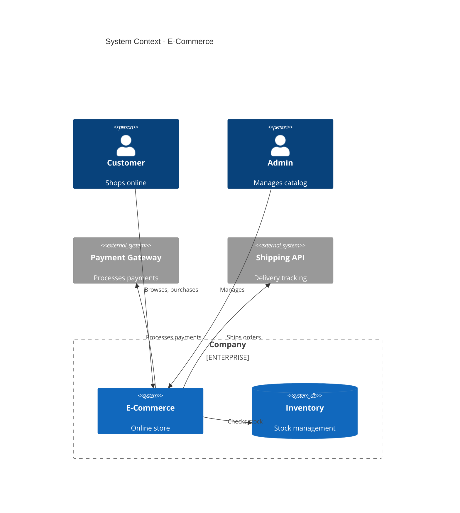
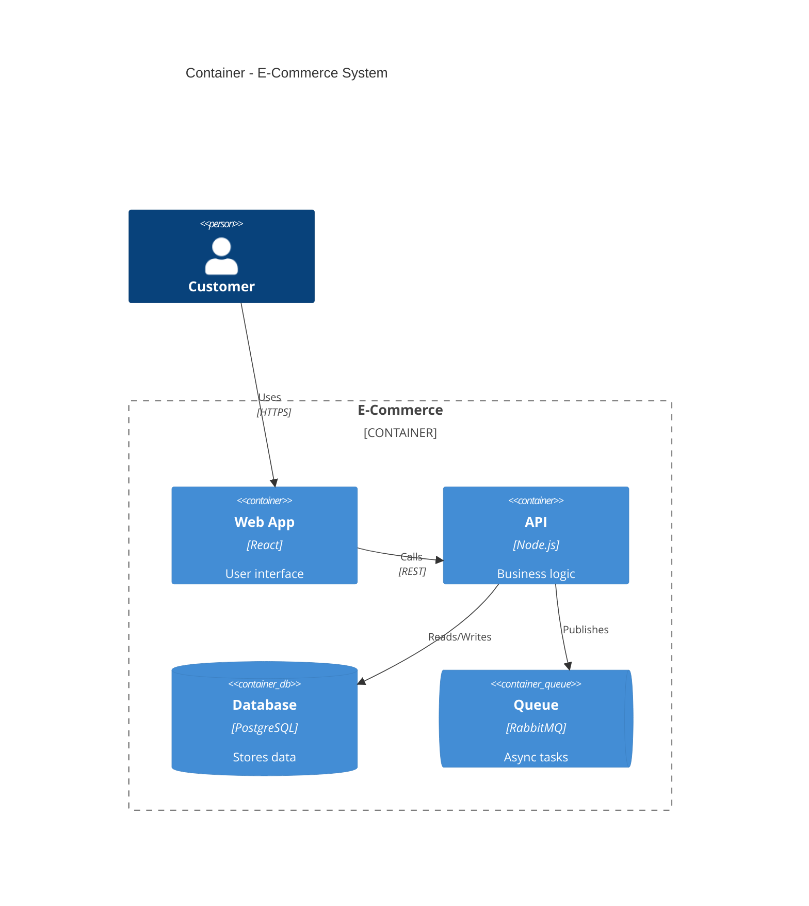

# C4 Diagram Reference

C4 diagrams visualize software architecture at different abstraction levels.

## Diagram Types

| Type | Use Case |
|------|----------|
| `C4Context` | System context - users and external systems |
| `C4Container` | Containers within a system |
| `C4Component` | Components within a container |
| `C4Dynamic` | Runtime interactions |
| `C4Deployment` | Deployment infrastructure |

## Elements

### People and Systems

```
Person(id, "Label", "Description")
Person_Ext(id, "Label", "Description")  %% External

System(id, "Label", "Description")
System_Ext(id, "Label", "Description")

SystemDb(id, "Label", "Description")     %% Database
SystemQueue(id, "Label", "Description")  %% Queue
```

### Containers

```
Container(id, "Label", "Technology", "Description")
ContainerDb(id, "Label", "Technology", "Description")
ContainerQueue(id, "Label", "Technology", "Description")
```

### Components

```
Component(id, "Label", "Technology", "Description")
ComponentDb(id, "Label", "Technology", "Description")
```

## Boundaries

```
Enterprise_Boundary(id, "Label") {
    %% elements
}

System_Boundary(id, "Label") {
    %% containers
}

Container_Boundary(id, "Label") {
    %% components
}
```

## Relationships

```
Rel(from, to, "Label")
Rel(from, to, "Label", "Technology")

BiRel(from, to, "Label")  %% Bidirectional

%% Directional hints
Rel_U(from, to, "Label")  %% Up
Rel_D(from, to, "Label")  %% Down
Rel_L(from, to, "Label")  %% Left
Rel_R(from, to, "Label")  %% Right
```

## Styling

```
UpdateElementStyle(id, $fontColor="red", $bgColor="grey")
UpdateRelStyle(from, to, $textColor="blue", $lineColor="blue")
UpdateLayoutConfig($c4ShapeInRow="3", $c4BoundaryInRow="1")
```

## System Context Example



## Container Example


