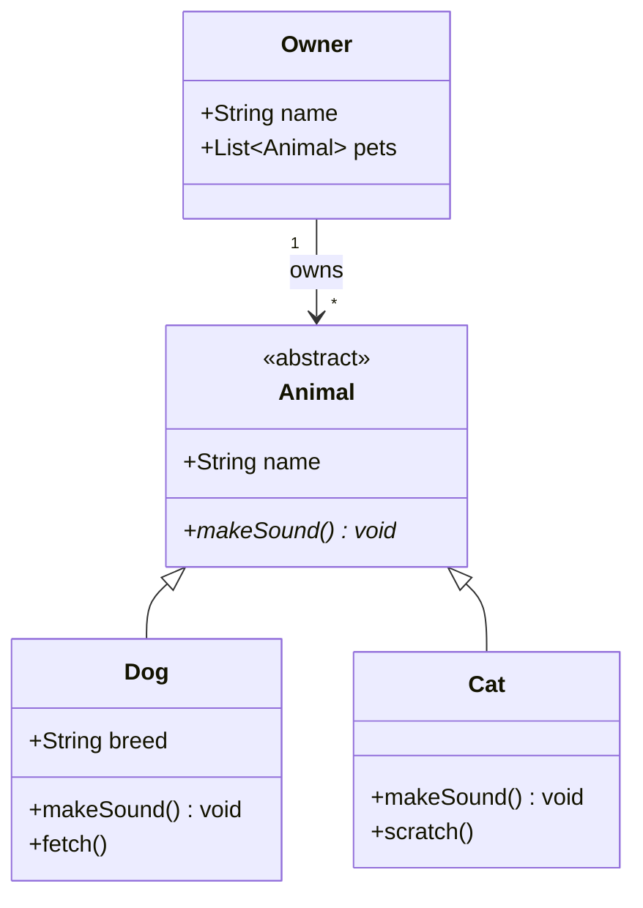

# Class Diagram Reference

## Declaration

```
classDiagram
    direction LR  %% Optional: LR, RL, TB, BT
```

## Class Definition

```
class Animal {
    +String name
    +int age
    +makeSound() void
    -privateMethod()
}
```

## Visibility

| Symbol | Meaning |
|--------|---------|
| `+` | Public |
| `-` | Private |
| `#` | Protected |
| `~` | Package |

## Method Modifiers

| Symbol | Meaning |
|--------|---------|
| `*` | Abstract |
| `$` | Static |

Example: `+getInstance()$ Animal*`

## Relationships

| Symbol | Type |
|--------|------|
| `<\|--` | Inheritance |
| `*--` | Composition |
| `o--` | Aggregation |
| `-->` | Association |
| `..>` | Dependency |
| `..\|>` | Realization |

## Cardinality

```
Customer "1" --> "*" Order
Student "1" --> "1..*" Course
```

Options: `1`, `0..1`, `1..*`, `*`, `n`

## Labels

```
Animal <|-- Dog : extends
Dog --> "1" Owner : belongs to
```

## Annotations

```
class Shape {
    <<interface>>
    +draw()
}

class Color {
    <<enumeration>>
    RED
    GREEN
    BLUE
}
```

## Generics

```
class List~T~ {
    +add(item T)
    +get(index int) T
}
```

## Notes

```
note "This is a note"
note for MyClass "Class note"
```

## Namespaces

```
namespace Models {
    class User
    class Order
}
```

## Example


