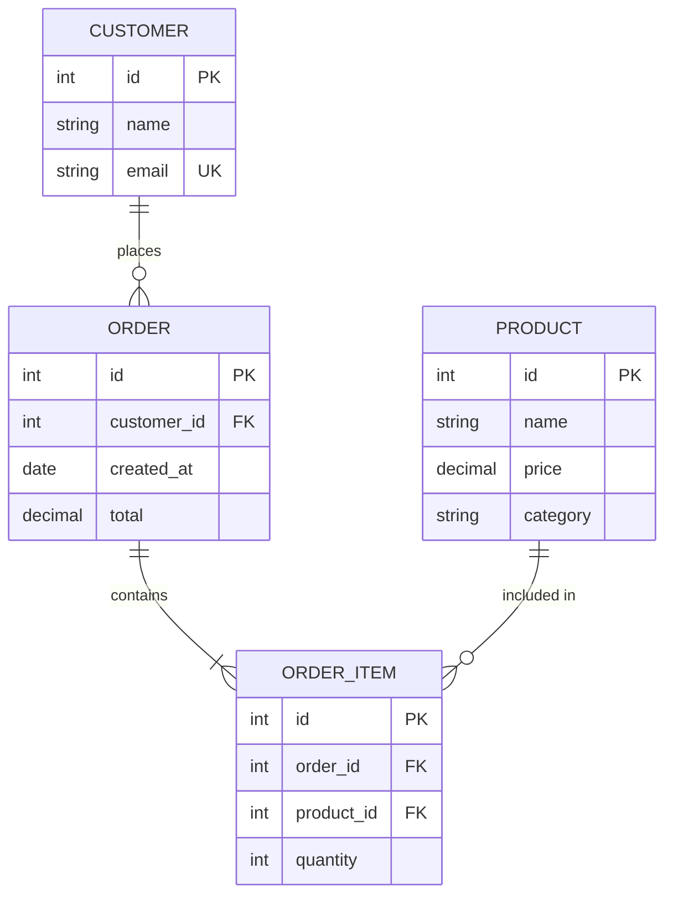

# Entity Relationship Diagram Reference

## Declaration

```
erDiagram
    direction LR  %% Optional: LR, RL, TB, BT
```

## Entities

```
CUSTOMER
ORDER
PRODUCT
```

With attributes:
```
CUSTOMER {
    int id PK
    string name
    string email UK
}
```

## Attribute Modifiers

| Modifier | Meaning |
|----------|---------|
| `PK` | Primary Key |
| `FK` | Foreign Key |
| `UK` | Unique Key |

Combine: `int user_id PK, FK`

Add comments: `string name "Customer full name"`

## Relationships

Syntax: `ENTITY1 ||--o{ ENTITY2 : "label"`

### Cardinality Symbols

| Left | Right | Meaning |
|------|-------|---------|
| `\|o` | `o\|` | Zero or one |
| `\|\|` | `\|\|` | Exactly one |
| `}o` | `o{` | Zero or more |
| `}\|` | `\|{` | One or more |

### Line Types

| Symbol | Type |
|--------|------|
| `--` | Identifying (solid) |
| `..` | Non-identifying (dashed) |

## Common Patterns

```
%% One-to-many
CUSTOMER ||--o{ ORDER : places

%% Many-to-many (via junction)
STUDENT }|--|| ENROLLMENT : has
ENROLLMENT ||--|{ COURSE : for

%% Optional relationship
EMPLOYEE |o--o| PARKING_SPOT : assigned
```

## Example


