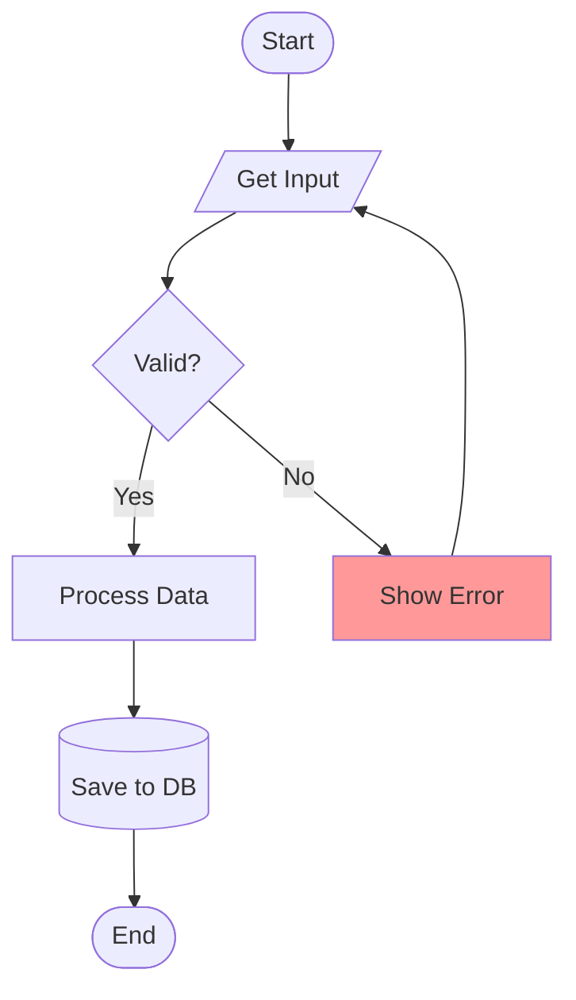

# Flowchart Reference

## Declaration

```
flowchart LR    %% Left to Right
flowchart TD    %% Top Down (default)
flowchart BT    %% Bottom to Top
flowchart RL    %% Right to Left
```

## Node Shapes

| Shape | Syntax | Use Case |
|-------|--------|----------|
| Rectangle | `A[text]` | Process/action |
| Rounded | `A(text)` | Start/end |
| Stadium | `A([text])` | Pill shape |
| Cylinder | `A[(text)]` | Database |
| Circle | `A((text))` | Connector |
| Diamond | `A{text}` | Decision |
| Hexagon | `A{{text}}` | Preparation |
| Parallelogram | `A[/text/]` | Input/output |
| Subroutine | `A[[text]]` | Subroutine |
| Double circle | `A(((text)))` | Double connector |

## Links

| Type | Syntax | Description |
|------|--------|-------------|
| Arrow | `A --> B` | Solid with arrow |
| Open | `A --- B` | Solid no arrow |
| Text | `A -->|label| B` | With label |
| Dotted | `A -.-> B` | Dashed arrow |
| Thick | `A ==> B` | Bold arrow |
| Bidirectional | `A <--> B` | Two-way |

## Subgraphs

```
subgraph title
    A --> B
end

subgraph id [Display Title]
    direction LR
    C --> D
end
```

## Styling

```
%% Inline style
style A fill:#f9f,stroke:#333,stroke-width:2px

%% Class definition
classDef highlight fill:#ff0,stroke:#333
A:::highlight --> B

%% Multiple nodes
class A,B,C highlight
```

## Example


