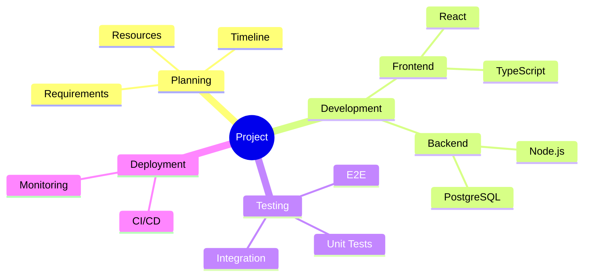

# Mindmap Reference

Mindmaps visualize hierarchical information using indentation.

## Declaration

```
mindmap
```

## Basic Structure

Indentation defines hierarchy:

```
mindmap
    Root
        Branch A
            Leaf 1
            Leaf 2
        Branch B
            Leaf 3
```

## Node Shapes

| Shape | Syntax |
|-------|--------|
| Default | `text` |
| Square | `[text]` |
| Rounded | `(text)` |
| Circle | `((text))` |
| Bang | `))text((` |
| Cloud | `)text(` |
| Hexagon | `{{text}}` |

## Icons

```
mindmap
    Root
        Node
        ::icon(fa fa-book)
```

Supports Font Awesome and Material Design Icons.

## Markdown Formatting

```
mindmap
    id["`**Bold** and *italic*`"]
```

## Example



## Design Tips

1. Keep root node as the main topic
2. Limit depth to 3-4 levels for readability
3. Use consistent node shapes per level
4. Balance branches when possible
