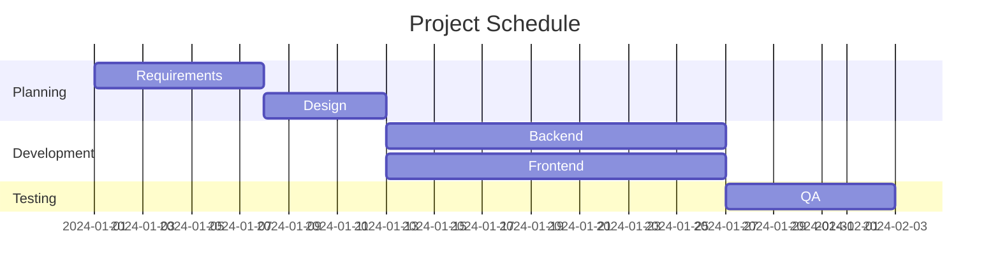
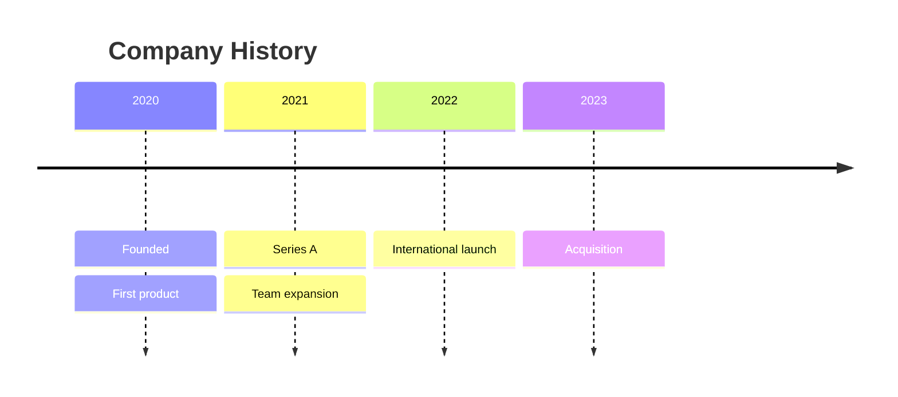
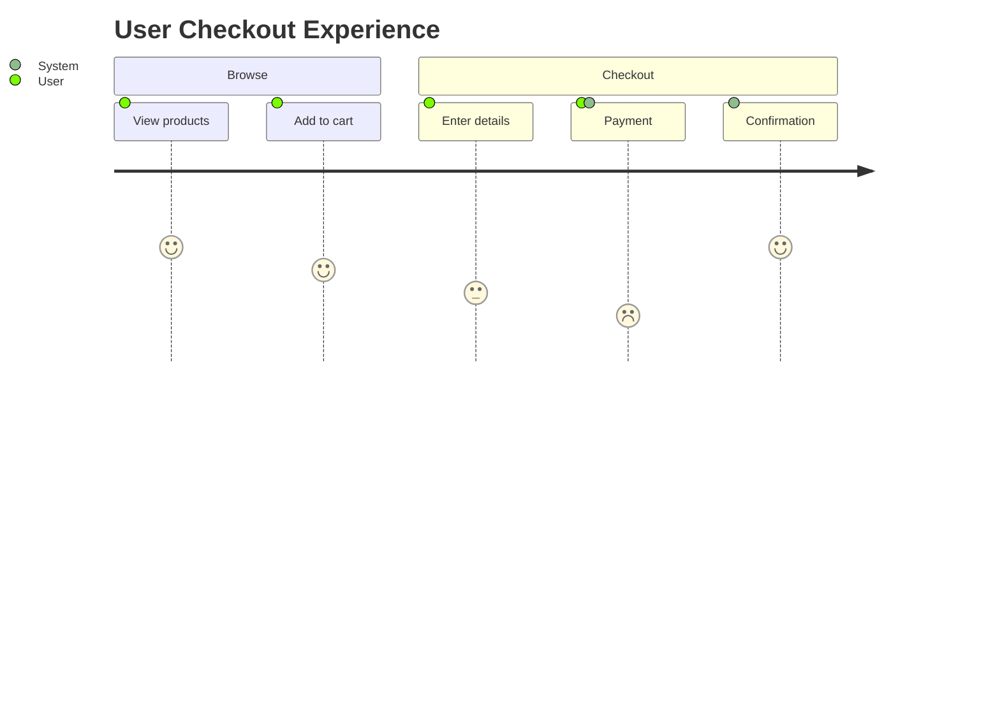
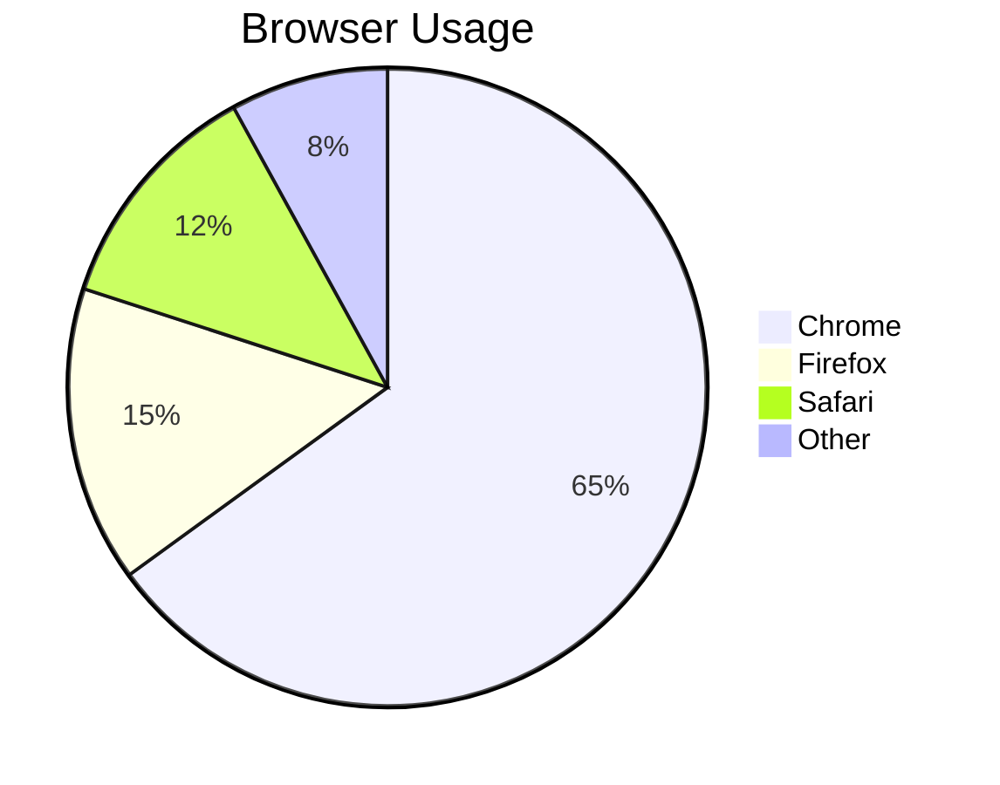
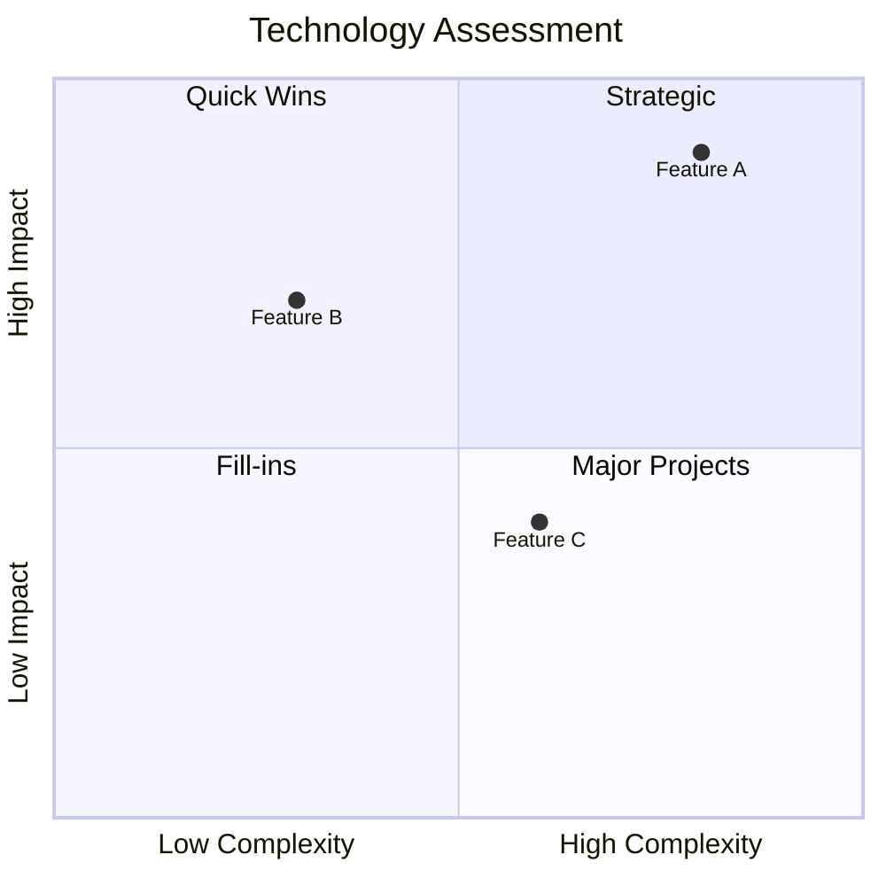
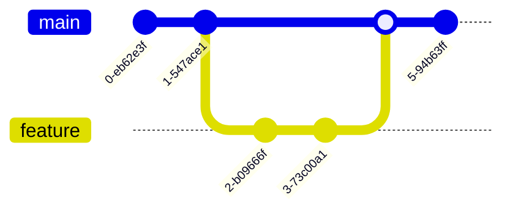
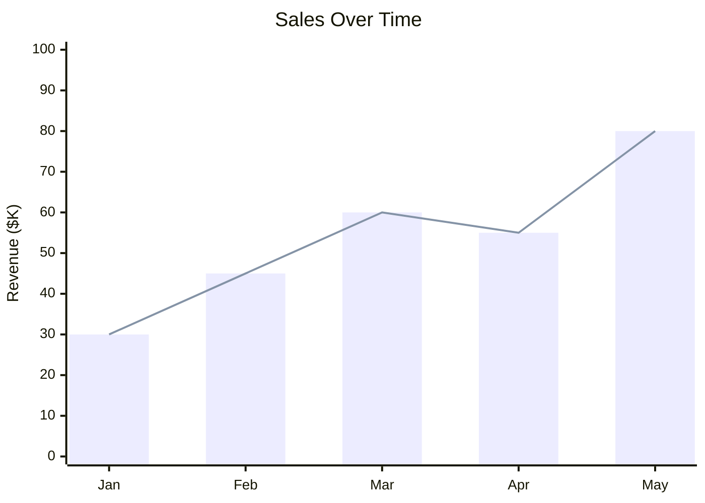
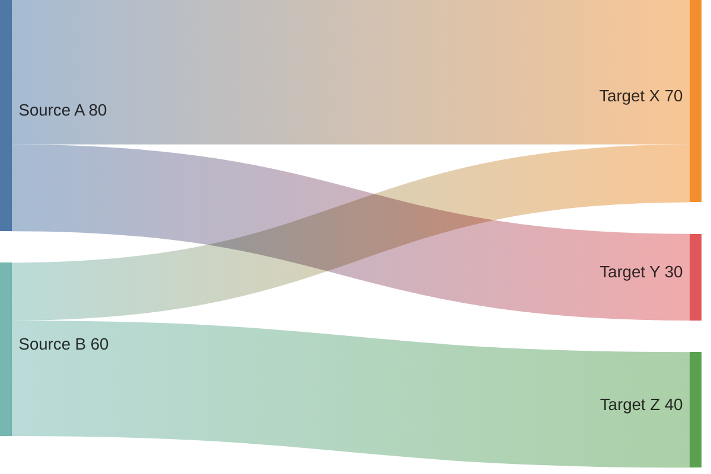

# Other Diagram Types

Quick reference for additional Mermaid diagram types.

## Gantt Chart

Project timelines and scheduling.

Key syntax:
- `dateFormat YYYY-MM-DD`
- `section Name`
- `Task :id, start, duration` or `Task :id, after other_id, duration`
- Modifiers: `done`, `active`, `crit`

## Timeline

Chronological events.

## User Journey

User experience flows.

Format: `Task: score: actors` (score 1-5, 5 is best)

## Pie Chart

## Quadrant Chart

2x2 matrix for analysis.

## Git Graph

Visualize git history.

## XY Chart

Data visualization.

## Sankey

Flow/distribution diagrams.

