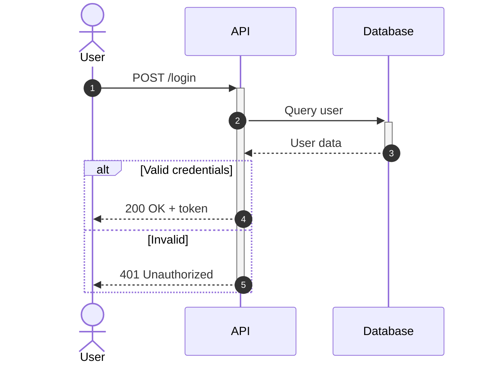

# Sequence Diagram Reference

## Declaration

```
sequenceDiagram
```

## Participants

```
participant A as Alice
actor U as User
```

Participant types: `participant`, `actor`

## Messages

| Arrow | Description |
|-------|-------------|
| `->` | Solid line, no arrow |
| `-->` | Dotted line, no arrow |
| `->>` | Solid line with arrow |
| `-->>` | Dotted line with arrow |
| `-x` | Solid with cross |
| `-)` | Solid with open arrow (async) |

## Activation

```
Alice->>+John: Request    %% Activate John
John-->>-Alice: Response  %% Deactivate John
```

Or explicit:
```
activate John
deactivate John
```

## Notes

```
Note right of Alice: Single note
Note over Alice,John: Spanning note
```

## Control Flow

### Loops
```
loop Every minute
    A->>B: Check status
end
```

### Alternatives
```
alt Success
    A->>B: OK
else Failure
    A->>B: Error
end
```

### Optional
```
opt Extra processing
    A->>B: Process
end
```

### Parallel
```
par Task 1
    A->>B: Request 1
and Task 2
    A->>C: Request 2
end
```

### Critical
```
critical Establish connection
    Service->>DB: Connect
option Timeout
    Service->>Service: Retry
end
```

## Grouping

```
box Blue Team
    participant A
    participant B
end
```

## Numbering

```
autonumber
Alice->>Bob: First
Bob->>Alice: Second
```

## Example


