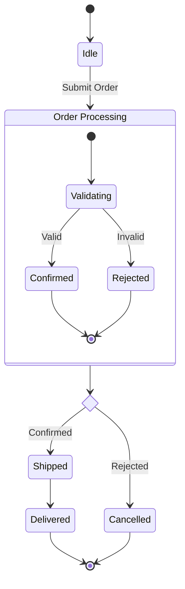

# State Diagram Reference

## Declaration

```
stateDiagram-v2
    direction LR  %% Optional: LR, TB
```

## States

```
%% Simple
StateA

%% With description
state "Long description" as s1

%% Colon notation
s2 : State description
```

## Transitions

```
StateA --> StateB
StateA --> StateB : Event / Action
```

## Special States

```
%% Start
[*] --> FirstState

%% End
LastState --> [*]
```

## Composite States

```
state ParentState {
    [*] --> ChildA
    ChildA --> ChildB
    ChildB --> [*]
}
```

## Choice (Conditional)

```
state decision <<choice>>
[*] --> decision
decision --> PathA : condition A
decision --> PathB : condition B
```

## Fork and Join (Concurrency)

```
state fork_state <<fork>>
state join_state <<join>>

[*] --> fork_state
fork_state --> Task1
fork_state --> Task2
Task1 --> join_state
Task2 --> join_state
join_state --> [*]
```

## Concurrent Regions

```
state Container {
    [*] --> Region1
    --
    [*] --> Region2
}
```

## Notes

```
note right of State1
    Multi-line note
    with details
end note

note left of State2 : Inline note
```

## Styling

```
classDef active fill:#0f0
class StateA active
StateB:::active
```

## Example


