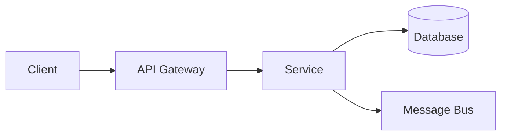
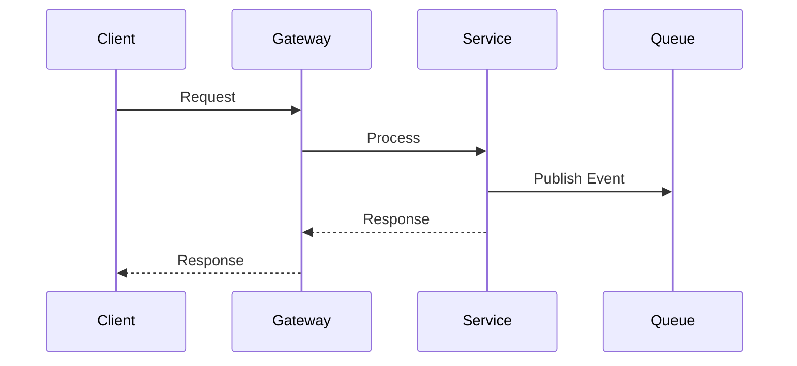

# Microservices Design Templates

Templates for feature intake, design output, and operational documentation.

---

## Feature Intake Template

Use this template to gather requirements before designing a microservice or feature.

```markdown
# Feature Intake: [Feature Name]

## Feature Request
<!-- Paste the original request verbatim -->


## Constraints

| Constraint | Value |
|------------|-------|
| **Environments** | (dev, staging, prod, etc.) |
| **Performance** | (latency SLA, throughput requirements) |
| **Data sensitivity** | (PII, financial, public) |
| **Jurisdiction** | (regions, regulatory requirements) |
| **Sync required?** | No (default) / Yes (justify) |
| **Existing services touched** | |
| **Existing repos touched** | |

## Expected Outputs

| Output | Description |
|--------|-------------|
| **APIs** | (endpoints, protocols) |
| **Messages** | (events, commands to publish/consume) |
| **Storage** | (new tables, caches, views) |
| **Observability** | (metrics, dashboards, alerts) |
| **Operational knobs** | (feature flags, circuit breakers) |
| **Rollback plan** | (how to undo if needed) |
```

---

## Design Output Template

Structure for the complete design document produced for every feature.

```markdown
# Design: [Feature Name]

**Author:** [Name]
**Date:** [YYYY-MM-DD]
**Status:** Draft | In Review | Approved | Implemented

---

## 1. Summary

<!-- 2-3 sentence overview of what this design accomplishes -->


## 2. Context

### 2.1 Problem Statement
<!-- What problem are we solving? -->

### 2.2 Current State
<!-- How does the system work today? Include diagram if helpful -->

### 2.3 Requirements
<!-- Functional and non-functional requirements -->


## 3. Design

### 3.1 High-Level Architecture

<!-- Mermaid diagram showing components and flow -->


### 3.2 Message Flows

<!-- Sequence diagram for key flows -->


### 3.3 Schemas

#### Events
```yaml
OrderCreated:
  type: event
  version: 1
  fields:
    order_id: string (UUID)
    customer_id: string (UUID)
    total: decimal
    created_at: timestamp
```

#### Commands
```yaml
CreateOrder:
  type: command
  version: 1
  fields:
    customer_id: string (UUID)
    items: array[OrderItem]
```

### 3.4 Idempotency Strategy

<!-- How do we handle duplicate requests? -->
- **Idempotency key:** [Header/field used]
- **Storage:** [Where keys are stored]
- **TTL:** [How long keys are retained]

### 3.5 Failure Modes

| Failure | Impact | Detection | Recovery |
|---------|--------|-----------|----------|
| Database down | Cannot write orders | Health check fails | Retry with backoff, circuit breaker |
| Message bus unavailable | Events not published | Connection error | Outbox pattern, retry |
| Downstream service timeout | Degraded response | Latency spike | Circuit breaker, fallback |


## 4. Operability

### 4.1 Observability

#### Metrics
| Metric | Type | Alert Threshold |
|--------|------|-----------------|
| `orders_created_total` | Counter | N/A |
| `order_creation_latency_seconds` | Histogram | p99 > 500ms |
| `order_creation_errors_total` | Counter | > 10/min |

#### Logs
| Event | Level | Fields |
|-------|-------|--------|
| Order created | INFO | order_id, customer_id, total |
| Order creation failed | ERROR | order_id, error, stack_trace |

#### Traces
- Span: `CreateOrder`
- Attributes: order_id, customer_id

### 4.2 Alerting

| Alert | Condition | Severity | Runbook |
|-------|-----------|----------|---------|
| High error rate | errors > 10/min for 5min | Page | [link] |
| High latency | p99 > 1s for 10min | Ticket | [link] |
| Service down | health check fails | Page | [link] |

### 4.3 Operational Knobs

| Knob | Type | Default | Purpose |
|------|------|---------|---------|
| `orders.enabled` | Feature flag | true | Kill switch |
| `orders.rate_limit` | Config | 1000/min | Rate limiting |
| `orders.circuit_breaker.enabled` | Feature flag | true | Resilience |


## 5. Safety

### 5.1 Bulkheading Strategy

<!-- How is this isolated from other components? -->
- Thread pool: Dedicated pool for order processing
- Connection pool: Separate DB connection pool
- Message queue: Dedicated queue per service

### 5.2 Blast Radius Analysis

<!-- What happens if this component fails? -->
| Component Failure | Affected | Not Affected |
|-------------------|----------|--------------|
| Order service down | Order creation | Existing orders, other services |
| Database failure | All order operations | Read replicas (eventually) |

### 5.3 Rollback Plan

1. **Immediate:** Disable feature flag `orders.enabled`
2. **Code rollback:** Revert to previous deployment
3. **Data rollback:** [Procedure if needed]


## 6. Tests

### 6.1 Unit Tests
- [ ] Order creation logic
- [ ] Validation rules
- [ ] Idempotency handling

### 6.2 Integration Tests
- [ ] Database operations
- [ ] Message publishing
- [ ] API contract

### 6.3 Contract Tests
- [ ] Consumer contracts with downstream services
- [ ] Provider contract tests for our API

### 6.4 Operational Tests
- [ ] Health check responds correctly
- [ ] Metrics are emitted
- [ ] Feature flag toggles work
- [ ] Circuit breaker trips correctly


## 7. Implementation Plan

### Phase 1: Foundation
- [ ] Create service skeleton
- [ ] Set up observability (metrics, logs, traces)
- [ ] Implement health checks

### Phase 2: Core Logic
- [ ] Implement order creation
- [ ] Add database persistence
- [ ] Publish domain events

### Phase 3: Resilience
- [ ] Add circuit breakers
- [ ] Implement retry logic
- [ ] Configure bulkheads

### Phase 4: Deployment
- [ ] Deploy to staging
- [ ] Run integration tests
- [ ] Canary deploy to production


## 8. Open Questions

<!-- Unresolved decisions or questions -->
- [ ] Question 1
- [ ] Question 2


## 9. References

- [Related design doc]
- [Architecture diagram]
- [API specification]
```

---

## Operational Runbook Template

```markdown
# Runbook: [Service/Component Name]

## Overview
Brief description of the service and its purpose.

## Quick Reference

| Item | Value |
|------|-------|
| **Service name** | |
| **Repository** | |
| **Dashboard** | [link] |
| **Logs** | [link] |
| **On-call** | [team/channel] |

## Health Checks

| Endpoint | Expected Response | Failure Action |
|----------|-------------------|----------------|
| `/health/live` | 200 OK | Restart pod |
| `/health/ready` | 200 OK | Remove from LB |

## Common Issues

### Issue: High Latency

**Symptoms:**
- p99 latency > 1s
- Alert: `HighLatency` firing

**Diagnosis:**
1. Check downstream service health
2. Check database query performance
3. Check resource utilization

**Resolution:**
1. Scale up if CPU/memory bound
2. Enable circuit breaker if downstream issue
3. Increase connection pool if DB-bound

### Issue: High Error Rate

**Symptoms:**
- Error rate > 1%
- Alert: `HighErrorRate` firing

**Diagnosis:**
1. Check logs for error patterns
2. Check recent deployments
3. Check downstream dependencies

**Resolution:**
1. Rollback if deployment related
2. Increase timeout if downstream slow
3. Enable fallback if dependency down

## Operational Knobs

| Knob | How to Change | Effect |
|------|---------------|--------|
| Feature flag | [Console/API] | Enable/disable feature |
| Rate limit | Config update | Throttle requests |
| Circuit breaker | Config update | Fail fast on dependency |

## Escalation

| Level | Contact | When |
|-------|---------|------|
| L1 | On-call engineer | Initial response |
| L2 | Service team lead | 30min unresolved |
| L3 | Platform team | Infrastructure issue |
```

---

## API Design Template

```markdown
# API Design: [API Name]

## Overview
Brief description of the API purpose.

## Endpoints

### POST /api/v1/orders

**Purpose:** Create a new order

**Request:**
```json
{
  "customer_id": "uuid",
  "items": [
    {
      "product_id": "uuid",
      "quantity": 1
    }
  ]
}
```

**Response (201 Created):**
```json
{
  "order_id": "uuid",
  "status": "created",
  "total": 99.99,
  "created_at": "2024-01-15T12:00:00Z"
}
```

**Errors:**

| Code | Reason |
|------|--------|
| 400 | Invalid request body |
| 401 | Not authenticated |
| 403 | Not authorized |
| 429 | Rate limit exceeded |
| 500 | Internal error |

**Idempotency:**
- Header: `Idempotency-Key`
- Duplicate requests within 24h return cached response

## Rate Limits

| Tier | Limit |
|------|-------|
| Default | 100 req/min |
| Premium | 1000 req/min |

## Versioning

- Version in URL path: `/api/v1/`
- Breaking changes require new version
- Old versions supported for 12 months
```
