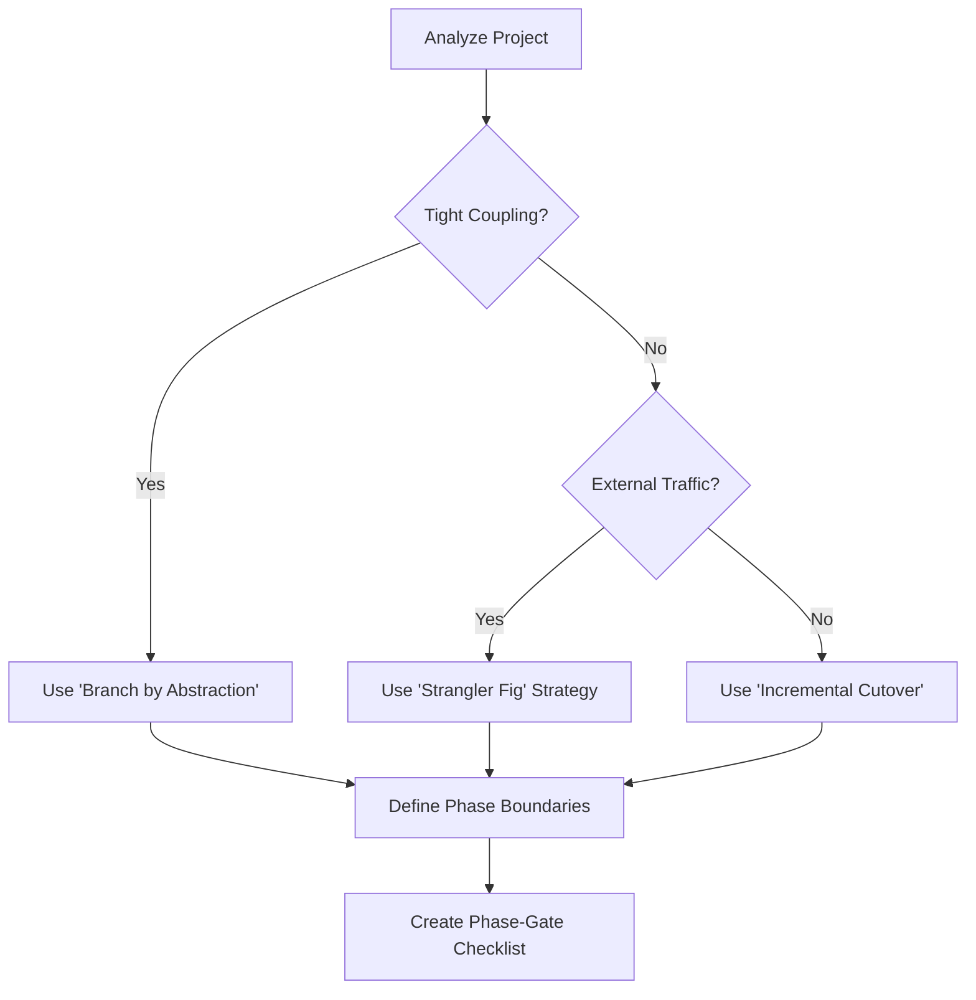

# Migration Scope Partitioner

## Purpose

Breaks large migration efforts into **safe, incremental phases** that can be delivered and validated independently. Prevents big-bang migrations and ensures continuous delivery of value.

## When to Use

- Planning a system migration
- Large-scale refactoring
- Technology stack replacement

## Partitioning Steps

1. **Assess Migration Scope**: Gather behavior snapshots and dependency graphs.
2. **Identify Natural Boundaries**: Look for domain, data, API, or user journey boundaries.
3. **Define Phases**: Ensure each phase is independent, valuable, testable, and reversible.
4. **Establish Phase Gates**: Define GO/NO-GO criteria between phases.

## Decision Tree

## Review Checklist

1. **Independence**: Can Phase 1 be deployed and rolled back without Phase 2?
2. **Value**: Does Phase 1 provide immediate feedback or utility?
3. **Risk**: Is the blast radius of a phase failure minimized?
4. **Timeframe**: Is each phase small enough to complete within 2 weeks?

## How to provide feedback
- **Be specific**: "Phase 2 includes both User Profiles and Payment logic, which are tightly coupled."
- **Explain why**: "Including too much in a single phase increases the risk of a combined failure."
- **Suggest alternatives**: "Recommend splitting Phase 2 into Phase 2a (Profiles) and Phase 2b (Payments)."

Small steps, continuous validation, always reversible.
