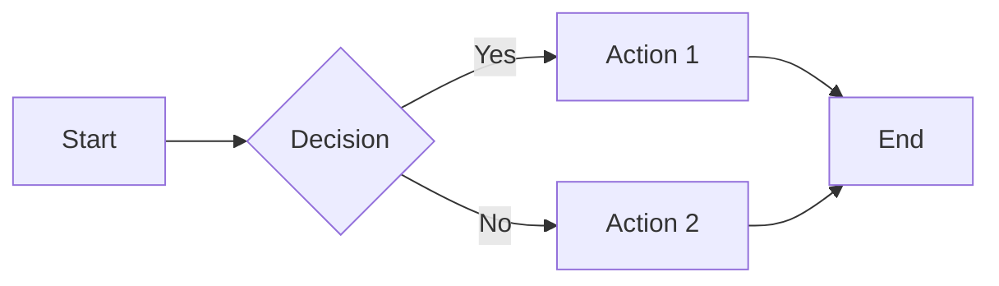
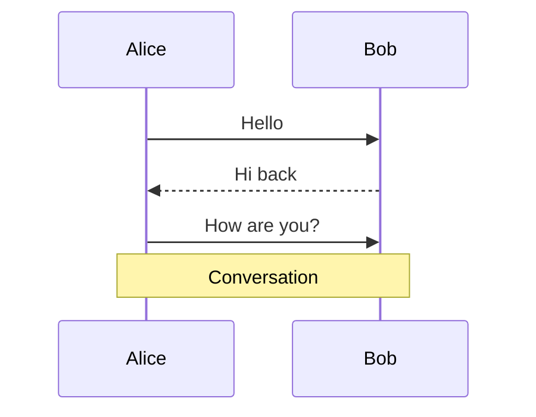
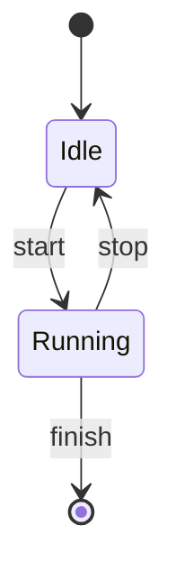
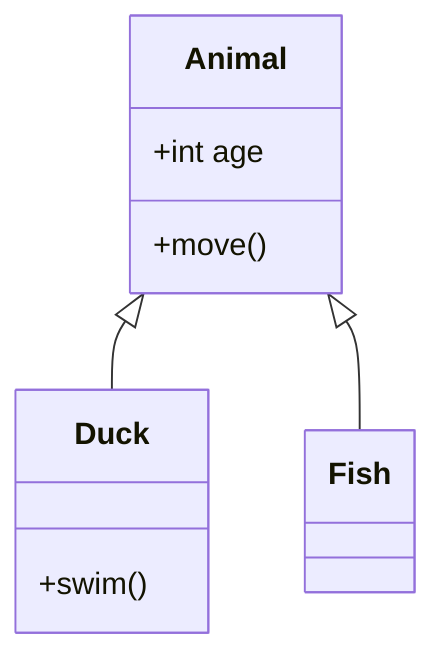
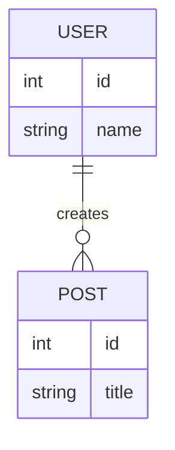

# Mermaid Diagrams

## Configuration

```yaml
# mkdocs.yml
markdown_extensions:
  - pymdownx.superfences:
      custom_fences:
        - name: mermaid
          class: mermaid
          format: !!python/name:pymdownx.superfences.fence_code_format
```

## Syntax

All diagrams use mermaid code fence:

````markdown
```mermaid
[diagram code]
```
````

## Flowcharts



**Direction:** `TB` (top-bottom), `BT`, `LR` (left-right), `RL`

**Node shapes:**
- `[text]` - rectangle
- `(text)` - rounded
- `{text}` - diamond
- `((text))` - circle

## Sequence Diagrams



**Arrows:** `->>` solid, `-->>` dashed, `-x` cross end

## State Diagrams



## Class Diagrams



## Entity-Relationship



**Relationships:** `||` one, `o{` many, `|{` one-or-more
