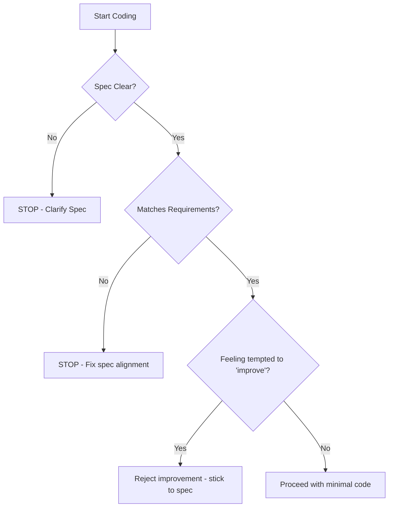

# No Guess Implementation

## Purpose

Implements code **strictly according to specification**. No invented behavior, no assumptions, no "improvements" beyond what the spec states.

## When to Use

- Writing any production code
- Making changes to existing code
- Anytime spec-governed behavior is involved

## Implementation Steps

1. **Follow Spec Literally**: Use the exact constants, types, and logic flow from the spec.
2. **Do Not Invent Behavior**: Reject any ad-hoc "nice-to-have" features not in the spec.
3. **Flag Conflicts Immediately**: Stop if the spec is unclear or contradictory.
4. **Comment Assumptions**: If a minor convention-based assumption is made, document it explicitly.

## Decision Tree

## Review Checklist

1. **Literalness**: Does the code use the exact IDs and values from the spec?
2. **Absence**: Are there any features or fields in the code NOT mentioned in the spec?
3. **Integrity**: Did you resist the urge to add "common sense" checks that aren't specified?
4. **Escalation**: Did you stop the moment an ambiguity was found?

## How to provide feedback
- **Be specific**: "You added a 'last_login' field, but Spec AUTH-001 only asks for token generation."
- **Explain why**: "Adding unrequested fields creates 'Ghost Features' that aren't documented or tested."
- **Suggest alternatives**: "Remove the 'last_login' field and keep the response minimal as per spec."

If unsure → stop and escalate.
