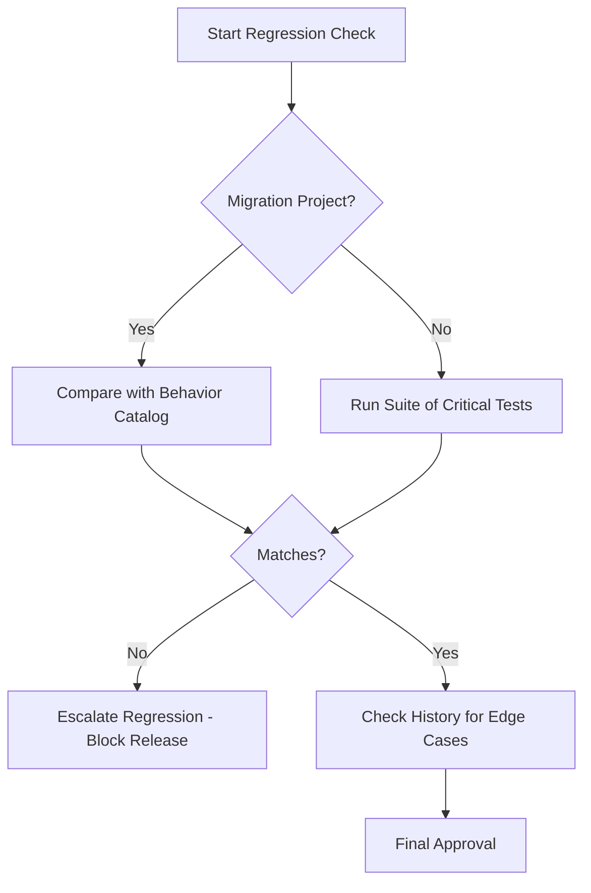

# Project Regression Checklist

## Purpose

Systematically verifies that new changes haven't broken existing, critical functionality. This is the final safety check before a feature is considered "Done".

## When to use this skill
- Immediately after a task implementation is complete
- Before submitting a feature for release readiness
- When high-risk refactoring has occurred

## Regression Steps

1. **Validate Critical Flows**: Run the standard happy-path tests for CORE features.
2. **Check Historical Bug Areas**: Review the project history for recurring issues and verify they haven't re-emerged.
3. **Compare Behavior**: For migrations, use the `behavior-catalog` to ensure 100% parity.
4. **Escalate Immediately**: If a regression is found, classification must happen via `autonomous-test-runner` immediately.

## Decision Tree

## Review Checklist

1. **Side Effects**: Does this change affect modules not explicitly mentioned in the task?
2. **Performance**: Is there any observable slowdown in critical paths?
3. **Compatibility**: Does this break any existing API contracts or data formats?
4. **Coverage**: Are all regressions paths covered by automated tests?

## How to provide feedback
- **Be specific**: "The login flow now takes 2s longer than the baseline."
- **Explain why**: "Performance regression in the hashing algorithm affects user experience."
- **Suggest alternatives**: "Recommend profiling the password hashing module updated in this PR."

No regression is acceptable without approval.
