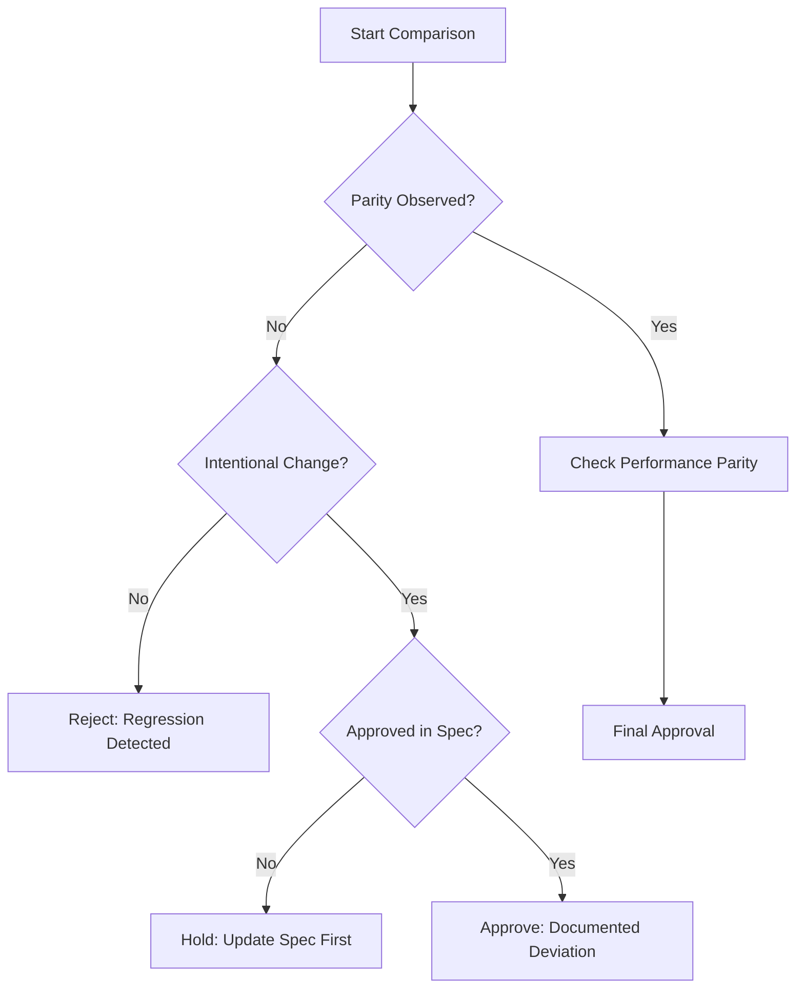

# Regression and Parity Check

## Purpose

Ensures that the new solution is at least as good as the old one. In migrations, it guarantees functional parity; in new features, it ensures existing paths remain unaffected.

## When to use this skill
- During the final stage of feature implementation
- Before cutover in a migration project
- When refactoring critical path logic

## Verification Steps

1. **Compare Behavior, Not Code**: Focus on the observable output and side effects defined in the `behavior-catalog`.
2. **Identify Mismatches**: Flag any difference in status codes, data formats, or side-effect ordering.
3. **Classify Deviations**:
   - **Bug**: Unintended change. (Fix needed)
   - **Spec Gap**: Implementation is better/different but spec wasn't updated. (Update spec)
   - **Accepted Deviation**: Intentional change due to new constraints. (Document)
4. **Enforce Parity**: Rejection is the default for any unclassified mismatch.

## Decision Tree

## Review Checklist

1. **Input Parity**: Does the system handle all legacy input formats?
2. **Error Parity**: Are error messages and codes consistent (unless intentionally improved)?
3. **Side-Effect Parity**: Are emails/logs/DB updates still happening as expected?
4. **Performance Parity**: Is the new system within 10% of legacy latency?

## How to provide feedback
- **Be specific**: "The parity check failed on 'Order Cancel'; old system returned 204, new returns 200."
- **Explain why**: "Client libraries may depend on the specific 204 No Content status."
- **Suggest alternatives**: "Update the controller to return a 204 for cancel operations to maintain parity."

Parity is success.
