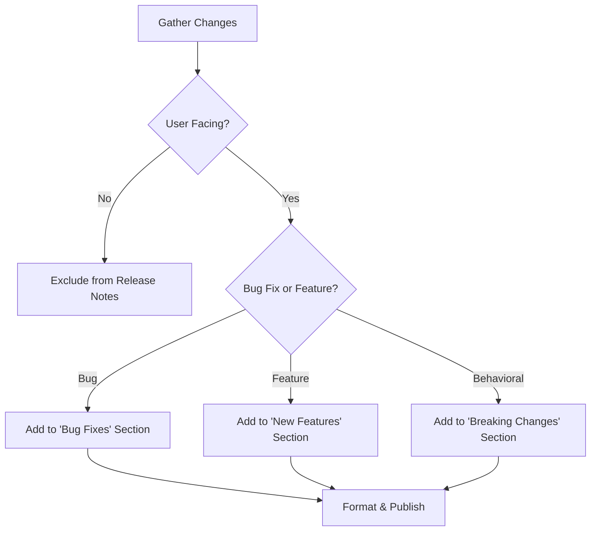

# Release Notes Generator

## Purpose

Communicates the value and impact of changes to the end users and stakeholders. It ensures that every release is documented accurately and professionally.

## When to use this skill
- During the final stage of a release cycle
- When preparing documentation for a production deployment
- After a major feature or bug fix has been merged

## Generation Steps

1. **Extract Approved Changes**: Pull data from `implementation_plan.md` and approved `spec` updates.
2. **Categorize Changes**:
   - **New Features**: User-facing additions.
   - **Bug Fixes**: Resolved issues.
   - **Behavior Changes**: Critical for existing users to know.
3. **Exclude Internal Noise**: Ignore refactors, internal tooling updates, and minor formatting changes.
4. **Format for Audience**: Use clear, non-technical language where possible.

## Decision Tree

## Review Checklist

1. **Accuracy**: Do the notes match the actual behavior of the code?
2. **Clarity**: Are the descriptions understandable to someone not involved in the code?
3. **Completeness**: Are any critical behavior changes missing?
4. **Tone**: Is the language professional and helpful?

## How to provide feedback
- **Be specific**: "The note for 'Fast Login' doesn't mention that it requires a new client version."
- **Explain why**: "Users on old clients will be confused when the feature doesn't work."
- **Suggest alternatives**: "Add 'Requires Client v1.2.0+' to the feature description."

Release notes are a contract with users.
