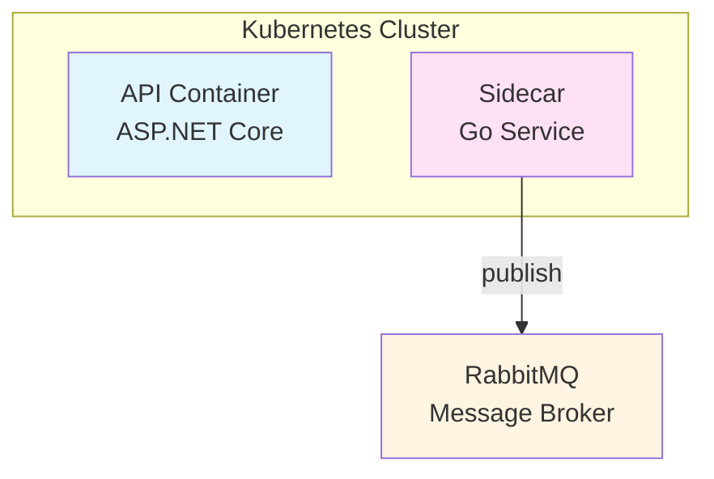

# Repository Documentation Generator

Generate high-quality, consistent documentation following team standards.

## Overview

Creates documentation that follows the tiered document requirements, uses proper status indicators, includes visual diagrams, and maintains cross-references between documents.

## Document Tiers

### Tier 1: Essential (All Projects)

| Document | Purpose | Location |
|----------|---------|----------|
| **CLAUDE.md** | AI assistant context for codebase | Root |
| **README.md** | Project overview, quick start | Root |
| **ARCHITECTURE.md** | System architecture with diagrams | `docs/` |
| **DESIGN_DECISIONS.md** | Technical rationale, axioms | `docs/` |

### Tier 2: Operational (Deployed Systems)

| Document | Purpose | Location |
|----------|---------|----------|
| **DEPLOYMENT-[ENV].md** | Environment-specific deployment | `docs/` |
| **MONITORING.md** | Observability, metrics, alerting | `docs/` |
| **RELIABILITY.md** | Fault tolerance, SLAs, recovery | `docs/` |
| **TESTING-STRATEGY.md** | Testing approaches, coverage | `docs/` |

### Tier 3: Supporting (As Needed)

| Document | Purpose | Location |
|----------|---------|----------|
| **AI_ONBOARDING.md** | AI assistant quick start | Root |
| **GITOPS-STRATEGY.md** | CI/CD, automation | `docs/` |
| **[TOPIC]-GUIDE.md** | Deep-dives on topics | `docs/` |
| **diagrams/README.md** | Diagram rendering | `docs/diagrams/` |

## Universal Document Structure

Every document MUST begin with:

```markdown
# Document Title

Brief 1-2 sentence description of what this document covers.

## Table of Contents

- [Section 1](#section-1)
- [Section 2](#section-2)

---

## Section 1
```

## Status Indicators

Use consistently throughout all documents:

| Emoji | Meaning | Usage |
|-------|---------|-------|
| ✅ | Complete/Working | Feature complete, test passing |
| ⚠️ | Partial/Warning | Needs attention, partial impl |
| ❌ | Missing/Failed | Not implemented, blocker |
| 📊 | Diagram/Visual | Cross-reference to visual |

**Example:**
```markdown
| Component | Status | Notes |
|-----------|--------|-------|
| Auth Service | ✅ Complete | v2.1.0 deployed |
| Rate Limiter | ⚠️ POC Only | Production needs Redis |
| Circuit Breaker | ❌ Not Implemented | Required for prod |
```

## Cross-Reference Pattern

Always link related documents:

```markdown
> 📊 **Visual Diagram**: See [Architecture Overview](diagrams/architecture-overview.png)

For deployment details, see **[DEPLOYMENT-EKS.md](DEPLOYMENT-EKS.md)**.

**Related Documents:**
- [ARCHITECTURE.md](ARCHITECTURE.md) - System design
- [RELIABILITY.md](RELIABILITY.md) - Fault tolerance
```

## Heading Depth Rules

- **Maximum 4 levels** (`#` to `####`)
- Use `##` for main sections
- Use `###` for subsections
- Use `####` sparingly
- Use **bold text** instead of `#####` or `######`

## Content Patterns

See [PATTERNS.md](PATTERNS.md) for detailed content patterns:
- Axioms Pattern (principles with rationale)
- Trade-offs Pattern (pros/cons tables)
- Command Examples Pattern (copy-paste ready)
- Configuration Pattern (YAML with comments)
- Troubleshooting Pattern (symptom-based)
- Version History Pattern (evolution tracking)

## Visual Standards

### Required Diagrams

| Diagram Type | Purpose | Format |
|--------------|---------|--------|
| Architecture Overview | High-level system | Mermaid |
| Component Interaction | Message/data flow | Mermaid Sequence |
| Deployment Topology | Infrastructure | Graphviz DOT |

### Mermaid Style Guidelines



**Colors:**
- Blue (`#e1f5ff`) - APIs
- Pink (`#ffe1f5`) - Services
- Yellow (`#fff4e1`) - Infrastructure

## Document Templates

See [TEMPLATES.md](TEMPLATES.md) for complete templates:
- CLAUDE.md template
- README.md template
- ARCHITECTURE.md template
- DESIGN_DECISIONS.md template
- MONITORING.md template
- AI_ONBOARDING.md template

## Quality Checklist

See [CHECKLIST.md](CHECKLIST.md) before finalizing any document.

## Generation Process

1. **Identify document type** - Which tier and template?
2. **Gather context** - Read existing code/docs
3. **Apply template** - Use appropriate structure
4. **Add diagrams** - Mermaid for architecture
5. **Cross-reference** - Link related documents
6. **Validate** - Run through checklist
