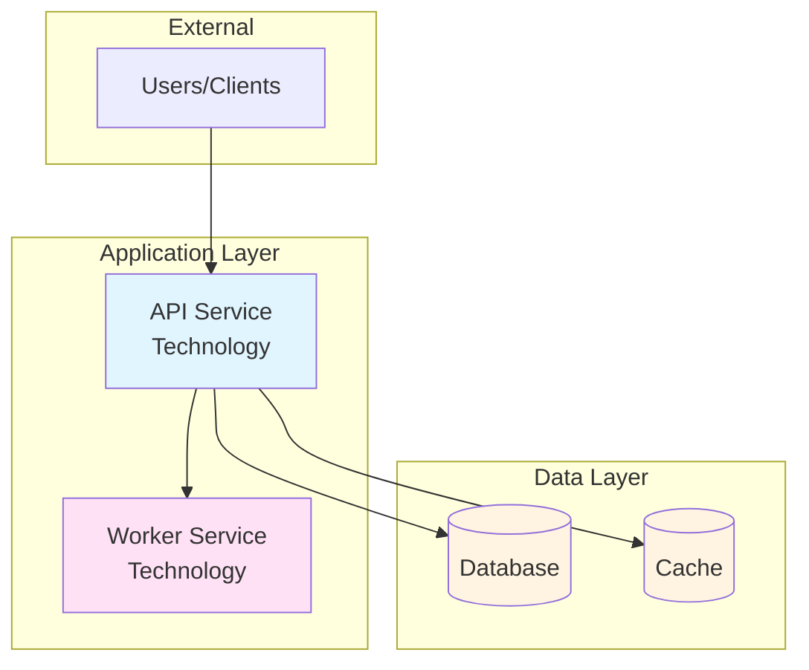
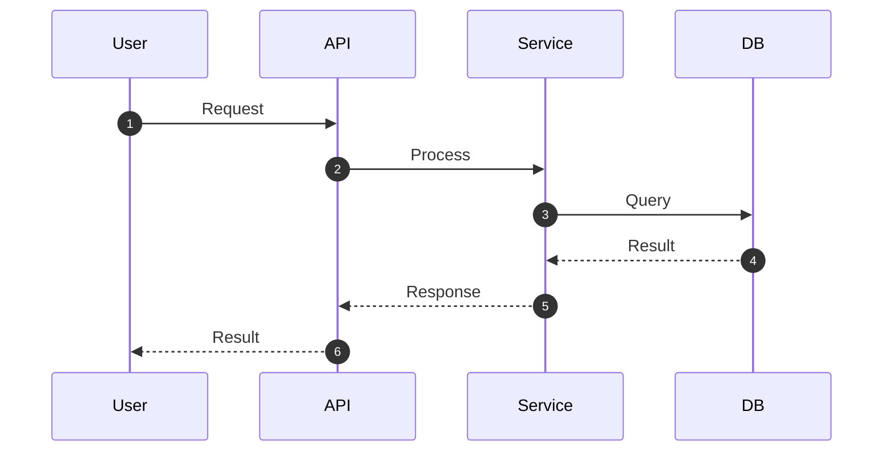
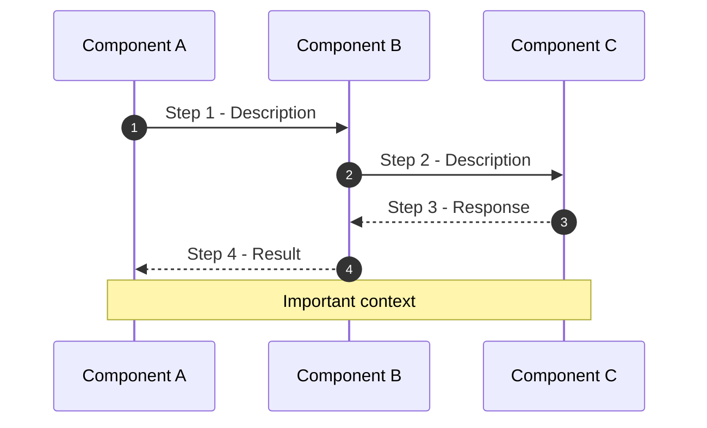
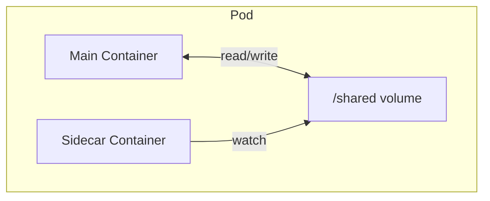

# Document Templates

Complete templates for all required document types. Copy and customize.

---

## CLAUDE.md Template

The primary AI assistant context document.

````markdown
# CLAUDE.md

This file provides guidance to Claude Code (claude.ai/code) when working with code in this repository.

## Project Overview

[2-3 sentence summary with current phase/status]

**Key Components:**
- [Component 1 with technology]
- [Component 2 with technology]
- [Component 3 with technology]

## Repository Structure

```
.
├── [directory]/    # Description
│   └── [sub]/      # Sub-description
├── [directory]/    # Description
└── docs/           # Documentation
```

## Development Commands

### [Technology/Component]

```bash
# Build
[command]

# Run tests
[command]

# Deploy
[command]
```

## Architecture

### [Pattern Name]

```
[Simple ASCII flow diagram]
```

### Key Patterns
- **Pattern 1**: Description
- **Pattern 2**: Description

## [Technology] Resources

| Resource | Purpose |
|----------|---------|
| File 1 | Description |
| File 2 | Description |

## Common Issues

**Issue Description:**
- Cause 1
- Cause 2
- Solution

## Documentation

- `docs/FILE.md` - Description
- `docs/FILE.md` - Description
````

---

## README.md Template

````markdown
# Project Name

Brief 1-2 sentence description of what this project does.

## Table of Contents

- [Quick Start](#quick-start)
- [Features](#features)
- [Installation](#installation)
- [Usage](#usage)
- [Configuration](#configuration)
- [Documentation](#documentation)
- [Contributing](#contributing)

---

## Quick Start

```bash
# Clone the repository
git clone [url]
cd [project]

# Install dependencies
[command]

# Run the application
[command]
```

## Features

- ✅ Feature 1 - Description
- ✅ Feature 2 - Description
- ⚠️ Feature 3 - In progress

## Installation

### Prerequisites

- [Prerequisite 1] v[version]+
- [Prerequisite 2] v[version]+

### Setup

```bash
# Step 1: Description
[command]

# Step 2: Description
[command]
```

## Usage

### Basic Usage

```bash
[basic command]
```

### Advanced Usage

```bash
[advanced command with options]
```

## Configuration

### Environment Variables

| Variable | Description | Default |
|----------|-------------|---------|
| `VAR_NAME` | What it does | `value` |

### Configuration File

```yaml
# config.yaml
setting1: value
setting2: value
```

## Documentation

- [Architecture](docs/ARCHITECTURE.md) - System design
- [Design Decisions](docs/DESIGN_DECISIONS.md) - Technical rationale
- [Deployment](docs/DEPLOYMENT.md) - Deployment guide

## Contributing

See [CONTRIBUTING.md](CONTRIBUTING.md) for guidelines.

## License

[License type] - See [LICENSE](LICENSE)
````

---

## ARCHITECTURE.md Template

````markdown
# Architecture Documentation

High-level system architecture and component design.

## Overview

[2-3 sentences describing the system purpose and key patterns]

## Visual Architecture Diagrams

- 📊 **[Architecture Overview](diagrams/architecture-overview.png)** - High-level view
- 📊 **[Message Flow](diagrams/message-flow.png)** - Data/message paths

## Table of Contents

- [System Architecture](#system-architecture)
- [Component Details](#component-details)
- [Message Flow](#message-flow)
- [Data Models](#data-models)
- [Deployment Architecture](#deployment-architecture)

---

## System Architecture

### High-Level Architecture



### Component Interactions



## Component Details

### [Component Name]

**Technology Stack:**
- [Technology 1]
- [Technology 2]

**Responsibilities:**
1. [Responsibility 1]
2. [Responsibility 2]

**Key Functions:**
| Function | Purpose |
|----------|---------|
| `function1()` | Description |
| `function2()` | Description |

**Configuration:**
```yaml
component:
  setting1: value
  setting2: value
```

### [Component Name 2]

[Repeat structure]

## Message Flow

### [Flow Name]

**Trigger:** [What initiates this flow]



## Data Models

### [Model Name]

**Purpose:** [What this model represents]

```json
{
  "id": "uuid - Unique identifier",
  "field1": "string - Description",
  "field2": "number - Description",
  "metadata": {
    "version": "string - Schema version",
    "timestamp": "ISO8601 - Creation time"
  }
}
```

**Validation Rules:**
- `field1`: Required, max 255 characters
- `field2`: Required, positive integer

## Deployment Architecture

### Container Architecture



### Resource Requirements

| Component | Memory Request | Memory Limit | CPU Request | CPU Limit |
|-----------|----------------|--------------|-------------|-----------|
| Main | 256Mi | 512Mi | 250m | 500m |
| Sidecar | 64Mi | 128Mi | 50m | 100m |

## References

- [External Documentation](url)
- [API Reference](url)
````

---

## DESIGN_DECISIONS.md Template

````markdown
# Design Decisions & Axioms

This document explains the "why" behind key technical decisions.

## Table of Contents

- [Axioms](#axioms)
- [Trade-Offs Summary](#trade-offs-summary)
- [Evolution](#evolution)

---

## Axioms

### [Decision/Pattern Name]

**Axiom**: [Clear statement of the principle]

**Examples**:
- `example1` - Description
- `example2` - Description

**Rationale**:
1. **Benefit 1**: Explanation
2. **Benefit 2**: Explanation
3. **Benefit 3**: Explanation

**Anti-patterns**:
- ❌ `anti-example` - Why it's wrong
- ❌ `anti-example` - Why it's wrong

---

### [Decision/Pattern Name 2]

[Repeat structure]

---

## Trade-Offs Summary

| Decision | Pros | Cons | Mitigation |
|----------|------|------|------------|
| [Decision 1] | Benefit | Drawback | How addressed |
| [Decision 2] | Benefit | Drawback | How addressed |
| [Decision 3] | Benefit | Drawback | How addressed |

---

## Evolution

This section tracks how decisions evolved during development.

### v[X.Y.Z] → v[X.Y.Z]: [Change Name]

**Change**: What was changed

**Problem**: What problem it solved

**Solution**: How it was solved

```[language]
// Before
[old code]

// After
[new code]
```

**Result**: Outcome
**Status**: ✅ Verified on [environment]

---

### [Earlier Version Change]

[Repeat structure]
````

---

## MONITORING.md Template

````markdown
# Monitoring and Observability

Operational visibility for all system components.

## Axiom: "Nothing Unwatched Exists"

All components include monitoring configuration for operational visibility.

## Table of Contents

- [Monitoring Stack](#monitoring-stack)
- [Metrics Configuration](#metrics-configuration)
- [Health Endpoints](#health-endpoints)
- [Dashboards](#dashboards)
- [Alerting](#alerting)
- [Troubleshooting](#troubleshooting)

---

## Monitoring Stack

| Tool | Purpose | Location |
|------|---------|----------|
| [Tool 1] | Metrics collection | [endpoint] |
| [Tool 2] | Log aggregation | [endpoint] |
| [Tool 3] | Alerting | [endpoint] |

## Metrics Configuration

### Service Annotations

```yaml
metadata:
  annotations:
    prometheus.io/scrape: "true"
    prometheus.io/port: "9090"
    prometheus.io/path: "/metrics"
```

### Key Metrics

| Metric | Type | Description |
|--------|------|-------------|
| `app_requests_total` | Counter | Total requests |
| `app_request_duration_seconds` | Histogram | Request latency |
| `app_active_connections` | Gauge | Current connections |

## Health Endpoints

| Endpoint | Method | Response | Use Case |
|----------|--------|----------|----------|
| `/health` | GET | 200 OK | K8s liveness |
| `/ready` | GET | 200 OK | K8s readiness |
| `/metrics` | GET | Prometheus format | Metrics scraping |

## Dashboards

### [Dashboard Name]

**Purpose:** [What it monitors]

**Panels:**
- Request rate (requests/second)
- Error rate (%)
- P99 latency (ms)
- Active connections

**Queries:**
```promql
# Request rate
rate(app_requests_total[5m])

# Error rate
rate(app_requests_total{status=~"5.."}[5m]) / rate(app_requests_total[5m])
```

## Alerting

### Critical Alerts

| Alert | Condition | Action |
|-------|-----------|--------|
| HighErrorRate | Error rate > 5% for 5m | Page on-call |
| ServiceDown | No healthy pods | Page on-call |

### Warning Alerts

| Alert | Condition | Action |
|-------|-----------|--------|
| HighLatency | P99 > 500ms for 10m | Slack notification |
| LowDiskSpace | < 20% free | Slack notification |

## Troubleshooting

### [Symptom]

**Diagnostic Steps:**
```bash
# Step 1: Check [thing]
[command]

# Step 2: Verify [thing]
[command]

# Step 3: Look for [pattern]
[command]
```

**Common Causes:**
- [Cause 1]
- [Cause 2]

**Resolution:**
```bash
[fix command]
```
````

---

## AI_ONBOARDING.md Template

````markdown
# AI Assistant Onboarding Guide

**Welcome!** This document helps AI assistants quickly understand this codebase.

## What This Repository Is

[2-3 sentence summary of purpose and key patterns]

## Quick Start for AI Assistants

### 1. Read These Documents First (in order)

1. **ARCHITECTURE.md** - System design
2. **DESIGN_DECISIONS.md** - Technical rationale
3. **RELIABILITY.md** - Fault tolerance

### 2. Understand the Core Components

```
┌─────────────────────────────────────────┐
│              [Component 1]              │
│                   │                     │
│         ┌────────┴────────┐             │
│         ▼                 ▼             │
│   [Component 2]     [Component 3]       │
│         │                 │             │
│         └────────┬────────┘             │
│                  ▼                      │
│           [Component 4]                 │
└─────────────────────────────────────────┘
```

### 3. Key Technical Concepts

#### [Concept Name]

[Explanation]

```[language]
// Example code
[code]
```

### 4. Directory Structure

```
project/
├── src/           # Source code
│   ├── api/       # API endpoints
│   └── services/  # Business logic
├── tests/         # Test files
├── docs/          # Documentation
└── k8s/           # Kubernetes manifests
```

### 5. Common Tasks and Patterns

#### [Task Name]

```bash
# Step 1: Description
[command]

# Step 2: Description
[command]
```

### 6. Critical Configuration Files

#### **[filename]** - IMPORTANT

[Why this file matters]

Key settings:
- `setting1`: [what it controls]
- `setting2`: [what it controls]

### 7. Common Gotchas for AI Assistants

1. **[Gotcha 1]** - [explanation and how to avoid]
2. **[Gotcha 2]** - [explanation and how to avoid]
3. **[Gotcha 3]** - [explanation and how to avoid]

### 8. Questions to Ask Yourself

Before making changes:
- [ ] Have I read the relevant architecture docs?
- [ ] Does this follow existing patterns in the codebase?
- [ ] Have I considered the impact on other components?
- [ ] Are there tests I should update?

## Getting Help

- **Architecture questions**: Read ARCHITECTURE.md
- **Why decisions were made**: Read DESIGN_DECISIONS.md
- **Deployment issues**: Read DEPLOYMENT.md
- **Monitoring**: Read MONITORING.md
````

---

## diagrams/README.md Template

````markdown
# Architecture Diagrams

Visual representations of system architecture.

## Available Diagrams

| File | Description | Format |
|------|-------------|--------|
| architecture-overview.mmd | High-level system view | Mermaid |
| message-flow.mmd | Message routing | Mermaid |
| deployment-topology.dot | Infrastructure layout | Graphviz |

## Rendering Instructions

### Prerequisites

```bash
# macOS
brew install graphviz
npm install -g @mermaid-js/mermaid-cli

# Ubuntu/Debian
apt-get install graphviz
npm install -g @mermaid-js/mermaid-cli
```

### Render Commands

```bash
# Mermaid to PNG
mmdc -i diagram.mmd -o diagram.png -t dark

# Graphviz to PNG
dot -Tpng diagram.dot -o diagram.png

# Graphviz to SVG (for web)
dot -Tsvg diagram.dot -o diagram.svg
```

## Updating Diagrams

1. Edit source file (`.mmd` or `.dot`)
2. Re-render PNG/SVG
3. Commit both source and rendered files

## Style Guide

### Mermaid Colors

| Color | Hex | Usage |
|-------|-----|-------|
| Blue | `#e1f5ff` | APIs, user-facing |
| Pink | `#ffe1f5` | Services, workers |
| Yellow | `#fff4e1` | Infrastructure |
| Green | `#e1ffe1` | External systems |

### Graphviz Colors

```dot
node [style=filled];
api [fillcolor="#e1f5ff"];
service [fillcolor="#ffe1f5"];
database [fillcolor="#fff4e1"];
```
````
