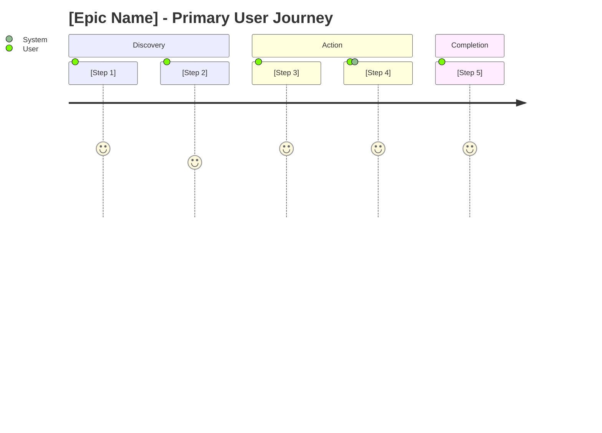

# Epic Specification Template

Use this structure for generating epic/feature specification documents. Adapt technology references to the project's actual stack.

## Template

Filename: `Epics-[FeatureName].md`
Example: `Epics-UserOnboarding.md`

```markdown
---
title: "[Epic Name] - Epic Specification"
description: "Detailed specification for the [Epic Name] epic"
epic_id: EP-XX
product: [Product Name]
date: [DD/MM/YYYY]
version: 1.0
author: [Author from PRD or user]
status: Draft
related_requirements: [FR-XX-001, FR-XX-002, FR-XX-003]
related_personas: [Primary Persona, Secondary Persona]
technology_stack: [Array from PRD/FRD]
---

# EP-XX: [Epic Name]

## 1. Epic Overview

### 1.1 Description
[2-3 sentence description of what this epic delivers and why it matters]

### 1.2 Business Value
| Value Driver | Description | Metric |
|--------------|-------------|--------|
| User Value | [How this helps users] | [KPI] |
| Business Value | [How this helps the business] | [KPI] |
| Technical Value | [How this improves the system] | [Metric] |

### 1.3 Scope

**In Scope:**
- [Feature/capability included]
- [Feature/capability included]

**Out of Scope:**
- [Explicitly excluded item]
- [Future phase item]

### 1.4 Success Criteria

| Criteria | Target | Measurement |
|----------|--------|-------------|
| [Criterion 1] | [Specific target] | [How to measure] |
| [Criterion 2] | [Specific target] | [How to measure] |

---

## 2. Target Personas

### 2.1 Primary Persona: [Name]

**Context**: [Why this epic matters to this persona]

**Current Pain Points Addressed**:
1. [Pain point] → [How this epic solves it]
2. [Pain point] → [How this epic solves it]

**Expected Outcome**: [What success looks like for this persona]

### 2.2 Secondary Persona: [Name]
[Same structure if applicable]

---

## 3. User Stories

### US-[ABBREV]-001: [Story Title]

**As a** [role]
**I want to** [action/capability]
**So that** [benefit/value]

| Attribute | Value |
|-----------|-------|
| Priority | Must Have / Should Have / Could Have |
| Story Points | [Estimate] |
| Related FR | FR-XX-001 |
| Dependencies | US-XX-000 / None |

**Acceptance Criteria:**

```
GIVEN: [Specific precondition with state details]
WHEN: [User performs specific action]
THEN: [Specific, testable outcome]
  AND: [Additional outcome if applicable]
```

```
GIVEN: [Alternative scenario precondition]
WHEN: [User performs action]
THEN: [Expected outcome]
```

**Edge Cases:**
- [Edge case 1]: [Expected behavior]
- [Edge case 2]: [Expected behavior]

---

### US-[ABBREV]-002: [Story Title]
[Same structure as US-001]

---

## 4. Functional Requirements Mapping

| FR ID | Requirement | User Stories | Priority | Status |
|-------|-------------|--------------|----------|--------|
| FR-XX-001 | [Requirement name] | US-XX-001, US-XX-002 | P0 | Draft |
| FR-XX-002 | [Requirement name] | US-XX-003 | P1 | Draft |

---

## 5. User Journeys

### 5.1 Happy Path Journey



**Journey Narrative:**
1. **[Step Name]**: [Description of what happens]
2. **[Step Name]**: [Description of what happens]
3. **[Step Name]**: [Description of what happens]

### 5.2 Alternative Journeys

| Scenario | Trigger | Path | Outcome |
|----------|---------|------|---------|
| [Scenario name] | [What causes it] | [Steps] | [Result] |

---

## 6. Dependencies

### 6.1 Internal Dependencies

| Dependency | Type | Status | Impact if Delayed |
|------------|------|--------|-------------------|
| EP-01: [Other Epic] | Must complete first | In Progress | Blocks user stories 1-3 |
| API: [Endpoint] | Required | Available | Blocks all stories |

### 6.2 External Dependencies

| Dependency | Owner | Status | Mitigation |
|------------|-------|--------|------------|
| [Third-party API] | [Vendor] | TBD | [Fallback plan] |

### 6.3 Technical Dependencies

| Dependency | Required For | Notes |
|------------|--------------|-------|
| [Data model/entity] | Data storage | Create before frontend work |
| [Shared component/service] | [Feature] | Shared across components |

---

## 7. Technical Considerations

### 7.1 Architecture Impact
[How this epic affects system architecture - adapt to project's stack]

### 7.2 Data Model Changes

| Entity | Change Type | Fields |
|--------|-------------|--------|
| [Entity] | New | field1, field2, field3 |
| [Entity] | Modified | +newField, ~modifiedField |

### 7.3 API Changes

| Endpoint | Method | Change | Breaking |
|----------|--------|--------|----------|
| /api/[resource] | POST | New endpoint | No |
| /api/[resource]/:id | PUT | New field | No |

### 7.4 Performance Considerations
- [Consideration 1 with mitigation]
- [Consideration 2 with mitigation]

---

## 8. Risks and Mitigations

| Risk ID | Risk | Likelihood | Impact | Mitigation | Owner |
|---------|------|------------|--------|------------|-------|
| R-001 | [Description] | High/Med/Low | High/Med/Low | [Strategy] | [Name] |
| R-002 | [Description] | High/Med/Low | High/Med/Low | [Strategy] | [Name] |

---

## 9. Implementation Phases

### Phase 1: [Name] (Sprint X-Y)

**Scope**: [What's included]

**User Stories**:
- US-XX-001: [Title]
- US-XX-002: [Title]

**Deliverables**:
- [ ] [Deliverable 1]
- [ ] [Deliverable 2]

**Exit Criteria**:
- [Criterion 1]
- [Criterion 2]

### Phase 2: [Name] (Sprint Y-Z)
[Same structure]

---

## 10. Related Workflows

| Workflow ID | Title | Relationship |
|-------------|-------|--------------|
| WF-XX-001 | [Title] | Implements US-XX-001 |
| WF-XX-002 | [Title] | Implements US-XX-002, US-XX-003 |

---

## 11. Open Questions

| ID | Question | Owner | Due Date | Status |
|----|----------|-------|----------|--------|
| Q-001 | [Question] | [Name] | [Date] | Open/Resolved |

---

## 12. Revision History

| Version | Date | Author | Changes |
|---------|------|--------|---------|
| 1.0 | [Date] | [Author] | Initial draft |
```

## Epic Writing Guidelines

**Epic Naming**:
- Use noun phrases: "User Onboarding", "Job Discovery", "Profile Management"
- Avoid verbs: Not "Onboard Users" but "User Onboarding"

**User Story Format**:
- Role should match defined personas
- Action should be specific and achievable
- Benefit should connect to business value

**Story Prioritization (MoSCoW)**:
- **Must Have**: Core functionality, MVP requirement
- **Should Have**: Important but not critical for launch
- **Could Have**: Desirable if time permits
- **Won't Have**: Explicitly excluded from this phase

**Acceptance Criteria Quality**:
- One primary Given/When/Then per criterion
- Specific values, not ranges
- Testable by QA without interpretation
- Cover happy path + key error scenarios

**Technical Dependencies**:
- Use generic terms (data model, API endpoint, shared service)
- Reference actual technology only when extracted from PRD/FRD
- Don't assume specific frameworks
