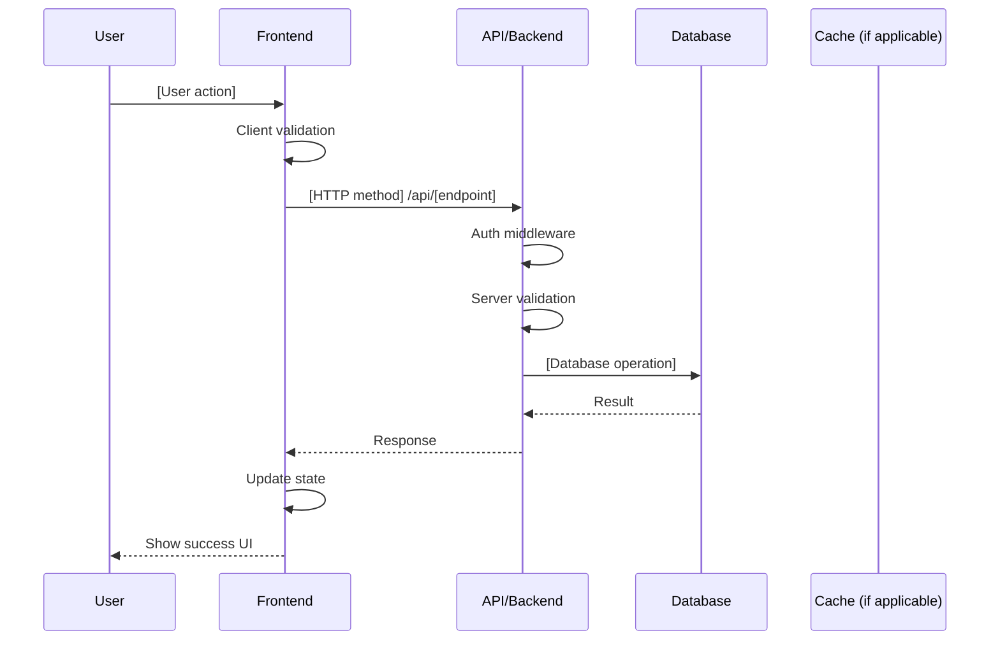

# Workflow Template

Use this structure for generating workflow specifications. Adapt all technical examples to the project's actual technology stack.

## Workflow Index Template (README.md)

```markdown
---
title: "Workflows Index"
description: "Implementation-ready workflows for [Product Name]"
product: [Product Name]
date: [DD/MM/YYYY]
version: 1.0
author: [Author]
status: Draft
---

# Workflows Index

Implementation-ready workflows derived from PRD and FRD with full technical specifications.

## Technology Stack

| Layer | Technology | Version |
|-------|------------|---------|
| Frontend | [Framework] | [Version] |
| UI | [Component Library] | [Version] |
| Backend | [Framework/Platform] | [Version] |
| Database | [Database] | [Version] |
| Cache | [Cache solution] | [Version] |

## Epics and Workflows

| Epic ID | Epic Name | Workflow ID | Workflow Title | Related FRs | Personas | Status |
|---------|-----------|-------------|----------------|-------------|----------|--------|
| EP-01 | [Epic] | WF-01-001 | [Title] | FR-XX-001 | [Persona] | Draft |
| EP-01 | [Epic] | WF-01-002 | [Title] | FR-XX-002 | [Persona] | Draft |
| EP-02 | [Epic] | WF-02-001 | [Title] | FR-XX-003 | [Persona] | Draft |

**Status Legend**: Draft → Approved → In Progress → Complete → Deprecated

## Related Documentation

- [PRD](../PRD.md) - Product Requirements Document
- [FRD](../FRD.md) - Functional Requirements Document
```

## Individual Workflow Template

Filename: `WF-[Epic#]-[Seq]-[kebab-slug].md`
Example: `WF-02-001-user-registration.md`

```markdown
---
title: "[Workflow Name]"
description: "[Short description of workflow purpose]"
workflow_id: WF-[Epic#]-[Seq]
epic: [Epic Name] (EP-XX)
related_requirements: [FR-XX-001, FR-XX-002]
related_personas: [Primary Persona, Secondary Persona]
product: [Product Name]
date: [DD/MM/YYYY]
version: 1.0
author: [Author]
status: Draft
technology_stack: [Array from PRD/FRD]
---

# WF-[Epic#]-[Seq]: [Workflow Title]

## 1. Workflow Overview

| Attribute | Description |
|-----------|-------------|
| **Purpose** | [What this workflow accomplishes] |
| **Scope** | [Boundaries - what's included/excluded] |
| **Primary Actor** | [Main user role] |
| **Secondary Actors** | [Other roles involved] |
| **Trigger** | [What initiates this workflow] |
| **Expected Outcome** | [End state when successful] |

## 2. Prerequisites and Dependencies

### Required Services
[List services based on the project's technology stack]
- [Backend API/service] (running)
- [Database] (connected)
- [Cache/session store] (if applicable)
- [Authentication service]

### Workflow Dependencies
| Dependency | Type | Required |
|------------|------|----------|
| WF-01-001 User Authentication | Workflow | Yes |
| [Other workflow] | Workflow | No |
| [External API] | External | Yes |

### Data Prerequisites
- [Required data state before workflow starts]

## 3. Workflow Steps

| Step | Actor | Action | System Response | Validation | Error Handling |
|------|-------|--------|-----------------|------------|----------------|
| 1 | User | Navigate to [page] | Display [component] | - | Show 404 if route invalid |
| 2 | User | Enter [data] | Validate in real-time | [Rules] | Inline error messages |
| 3 | User | Click [button] | POST to /api/[endpoint] | Server validation | Toast error, preserve form |
| 4 | System | Process request | Create/update [entity] | Business rules | Log error, return 4xx/5xx |
| 5 | System | Send confirmation | Return success response | - | Retry with backoff |
| 6 | User | View confirmation | Redirect to [destination] | - | Show error recovery UI |

## 4. Technical Specifications

### 4.1 Frontend

[Adapt structure to project's frontend framework]

**Component Structure**:
```
[Typical directory structure for the framework]
```

**State Management**:
[Describe approach based on framework - Redux, Pinia, Zustand, Context, etc.]

**Key Patterns**:
[Include code snippets relevant to the framework]

### 4.2 Backend

[Adapt to project's backend framework/platform]

**Data Model**:
```
[Schema definition in format appropriate to the stack]
```

**API Endpoints**:

| Method | Endpoint | Description | Auth |
|--------|----------|-------------|------|
| GET | /api/[resources] | List with pagination | [Auth method] |
| GET | /api/[resources]/:id | Get single | [Auth method] |
| POST | /api/[resources] | Create new | [Auth method] |
| PUT | /api/[resources]/:id | Update | [Auth method] |
| DELETE | /api/[resources]/:id | Delete | [Auth method] |

**Business Logic**:
[Controller/service layer patterns appropriate to framework]

### 4.3 Data Flow



## 5. Validation & Error Handling

### Client-Side Validation

| Field | Rule | Error Message |
|-------|------|---------------|
| email | Required, valid email | "Please enter a valid email address" |
| password | Min 8 chars, 1 uppercase, 1 number | "Password must be at least 8 characters with 1 uppercase and 1 number" |

### Server-Side Validation

| Check | Response | HTTP Code |
|-------|----------|-----------|
| Missing required field | `{ error: "field is required" }` | 400 |
| Invalid format | `{ error: "Invalid format for field" }` | 400 |
| Duplicate entry | `{ error: "Already exists" }` | 409 |
| Unauthorized | `{ error: "Unauthorized" }` | 401 |
| Forbidden | `{ error: "Forbidden" }` | 403 |

### Error States

| Error Type | User Experience | Recovery Action |
|------------|-----------------|-----------------|
| Network error | Toast: "Connection error" | Auto-retry with backoff |
| Validation error | Inline field errors | User corrects input |
| Server error | Toast: "Something went wrong" | Retry button |
| Session expired | Redirect to login | Re-authenticate |

### Edge Cases

| Scenario | Handling |
|----------|----------|
| Concurrent edits | Optimistic locking with version field |
| Large file upload | Chunked upload with progress |
| Slow network | Loading states, timeout handling |
| Browser back button | Preserve form state |

## 6. Performance Requirements

| Metric | Target | Measurement |
|--------|--------|-------------|
| Page load (LCP) | < 2.5s | Lighthouse |
| Form submission | < 500ms | APM |
| API response (P95) | < 200ms | [APM tool] |
| Core Web Vitals | Pass | CI/CD check |

**Caching Strategy**:
- Static assets: CDN with appropriate cache headers
- API responses: [Cache solution] with appropriate TTL
- Client state: [State persistence strategy]

## 7. Security & Compliance

### Authentication & Authorization
[Describe auth approach based on project stack]
- [Token type] with [expiry]
- [Authorization model - RBAC, ABAC, etc.]

### Data Protection
- PII encrypted at rest
- TLS for all API traffic
- Input sanitization against XSS
- CSRF protection for state-changing operations

### Audit Trail
```json
{
  "action": "create|update|delete",
  "entity": "[feature]",
  "entityId": "[id]",
  "userId": "[id]",
  "timestamp": "ISO8601",
  "changes": { "field": { "old": "value", "new": "value" } }
}
```

## 8. Testing Strategy

### Unit Tests
[Framework-appropriate test example]

### Integration Tests
- Mock API responses for component testing
- Test error handling paths
- Verify state updates

### E2E Tests
[E2E framework appropriate to stack - Playwright, Cypress, etc.]

### Accessibility Tests
- Automated a11y testing integration
- Keyboard navigation testing
- Screen reader compatibility

## 9. KPIs

| Category | Metric | Baseline | Target | Measurement |
|----------|--------|----------|--------|-------------|
| Conversion | Workflow completion rate | N/A | > 80% | Analytics |
| Quality | Error rate | N/A | < 5% | [Error tracking tool] |
| Performance | P95 latency | N/A | < 500ms | APM |
| Engagement | Time to complete | N/A | < 2 min | Analytics |

## 10. Implementation Checklist

### Backend
- [ ] Create/update data models
- [ ] Implement API endpoints
- [ ] Add validation rules
- [ ] Configure authorization
- [ ] Write API tests

### Frontend
- [ ] Create page/view component
- [ ] Build form component with validation
- [ ] Implement API integration
- [ ] Set up state management
- [ ] Add loading and error states

### Styling
- [ ] Apply styling framework classes
- [ ] Ensure responsive design
- [ ] Implement dark mode (if applicable)
- [ ] Verify accessibility (WCAG 2.1 AA)

### Testing
- [ ] Unit tests for business logic
- [ ] Integration tests for API
- [ ] E2E tests for critical paths
- [ ] Accessibility audit

### Security
- [ ] Input validation (client + server)
- [ ] Authentication checks
- [ ] Authorization policies
- [ ] XSS prevention
- [ ] CSRF protection

### Documentation
- [ ] API endpoint documentation
- [ ] Component documentation
- [ ] Deployment notes

## 11. Related Documentation

| Document | Link | Description |
|----------|------|-------------|
| Related Workflows | [WF-XX-XXX](./WF-XX-XXX-name.md) | [Relationship] |
| API Documentation | [Link] | Full API reference |
| Design Specs | [Link] | UI/UX designs |
```

## Workflow Derivation Rules

1. **One workflow per discrete user journey** - Don't combine unrelated flows
2. **Name reflects outcome** - "User Registration" not "Registration Process"
3. **Include all actors** - System actions count as steps
4. **Cover error paths** - Every step needs error handling
5. **Link to FRs** - Every workflow maps to specific requirements
6. **Adapt to stack** - Technical specs must match the project's actual technology

## Stack-Specific Adaptation Guide

When generating workflows, adapt technical specifications based on the detected stack:

| Stack Component | Adapt These Sections |
|-----------------|---------------------|
| Frontend Framework | 4.1 Component structure, state management, patterns |
| Backend Framework | 4.2 Data models, controllers, middleware |
| Database | 4.2 Schema syntax, query patterns |
| Auth Solution | 7. Security section, auth middleware |
| Testing Tools | 8. Test examples and patterns |
| CSS Framework | 10. Styling checklist items |
