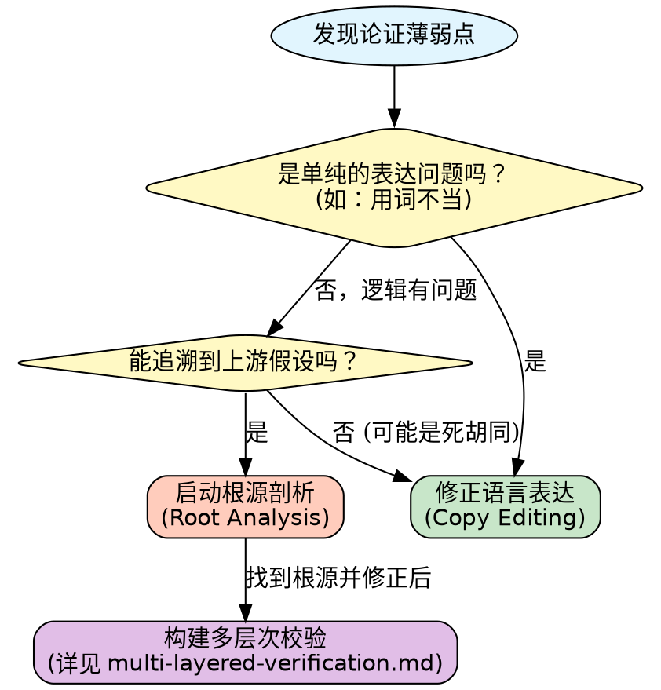

# 研究问题的根源剖析 (Research Problem Root Analysis)

## 概述

在学术论文写作中，逻辑谬误往往深埋在论证链的底层——例如基于过时的理论假设、错误引用的文献，或定义不清的核心概念。作者的本能反应往往是修正结论部分的措辞，但这属于“治标不治本”。

**核心原则：** 必须向后回溯论证链，直到找到最初的理论触发点或假设源头，并在那里进行修正。

## 何时使用

当遇到以下情况时，应启动根源剖析：

- **审稿人反馈**指出论证逻辑跳跃或缺乏依据。
- **自我审查**发现结论部分显得牵强，必须使用大量修辞来弥补逻辑空缺。
- **理论框架**似乎无法完全支撑实验数据的解释。
- 不清楚某个具体的推论错误是源于数据分析还是文献综述。

### 决策流程图

## 剖析过程 (The Traceback Process)

### 1. 识别逻辑断裂 (Identify the Logical Gap)
**症状：** 结论 $C$ 在语境 $Z$ 下显得不稳固。
**示例：** “因此，该算法在所有网络条件下都能提升效率。”（但在高延迟环境下并未验证）

### 2. 寻找直接前件 (Trace Immediate Antecedents)
**问题：** 什么直接导致了这个结论？
**分析：** “因为推导 $D$ 使用了参数 $P$（网络稳定性假设）。”

### 3. 追溯理论支撑 (Trace Theoretical Underpinnings)
**问题：** 推导 $D$ 或参数 $P$ 的依据是什么？
**链条分析：**
- 推导 $D$ 依赖于理论模型 $T$。
- 理论模型 $T$ 引用了文献 $S$ (Smith et al., 2018)。
- 文献 $S$ 基于假设 $A$（“节点始终在线”）。
- **发现问题：** 假设 $A$ 在本研究的边缘计算场景中已被证伪。

### 4. 验证核心假设 (Verify Core Premises)
**问题：** 传递下来的值或假设是否依然有效？
- 假设 $A$ = "节点连接是持续可靠的"。
- 现状 = 本研究涉及移动自组网，连接是间歇性的。
- **结论：** 这就是逻辑谬误的根源。

### 5. 在源头修正 (Fix at the Source)
**行动：** 不要只修改结论。回到**引言**或**方法**部分：
- **选项 A（调整范围）：** 明确声明本研究仅适用于“稳定连接”场景。
- **选项 B（修正模型）：** 引入适应间歇性连接的新参数 $P'$。
- **选项 C（承认局限）：** 在“讨论”部分明确指出这是未来工作的方向。

## 关键原则

1.  **绝不只修表面 (Never Just Fix the Symptom)**
    - 如果发现结论有误，修改结论措辞通常是掩耳盗铃。必须检查推导出该结论的**前设 (Premise)**。

2.  **向后回溯 (Trace Backwards)**
    - 像调试代码一样调试论文。从报错点（弱结论）一步步向上游（方法、综述、引言）查找。

3.  **多层防御 (Defense in Depth)**
    - 一旦找到根源并修正，请参考 [多层次论证校验](multi-layered-verification.md) 防止类似问题再次发生。

## 常见反模式 (Anti-patterns)

- **❌ 强行连接：** 使用“显然”、“毫无疑问”等强力词汇试图掩盖逻辑跳跃。
- **❌ 循环论证：** 结论本身被用作证明前提的一部分。
- **❌ 引用堆砌：** 引用大量无关文献来支撑一个脆弱的论点，而不检查引文的实际适用性。
