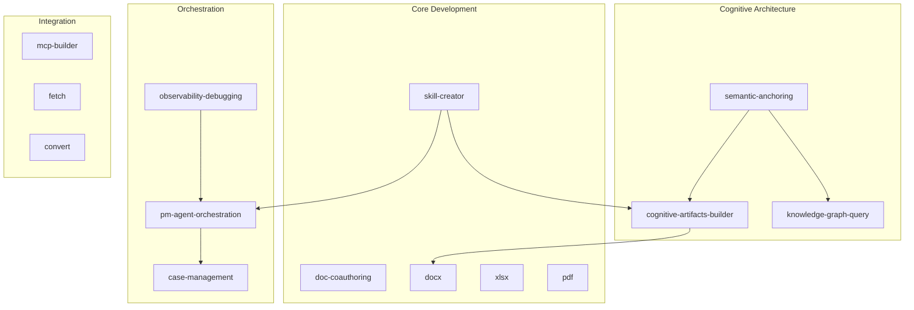
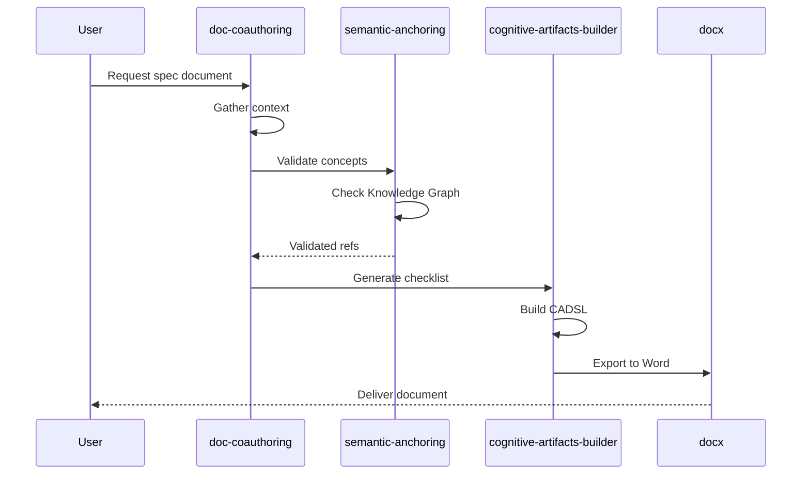

# Skill Recipes

Composable patterns for advanced skill usage in SEA-Forge™. Recipes combine multiple skills and patterns into reusable workflows.

**For reference:** [Skill Creator](../skill-creator/SKILL.md) | [PM-Agent Orchestration](../pm-agent-orchestration/SKILL.md)

---

## Recipe Catalog

| Recipe | Purpose | Ingredients |
|--------|---------|-------------|
| **Skill Chaining** | Connect skills in pipelines | skill-creator + pm-agent |
| **Skill Telemetry** | Observe skill execution | observability-debugging + semantic-anchoring |
| **Visual Catalog** | Map skill relationships | cognitive-artifacts-builder + semantic-anchoring |
| **Skill Versioning** | Track skill evolution | skill-creator + semantic-anchoring |

---

## Recipe 1: Skill Chaining

**Purpose**: Connect skills in pipelines where one skill's output triggers another.

### Pattern: Sequential Chain

```yaml
# chain-definition.yaml
chain:
  name: "spec-to-artifact"
  description: "Generate cognitive artifact from specification"
  
  steps:
    - skill: "doc-coauthoring"
      trigger: "user requests spec document"
      output: "spec.md"
      
    - skill: "semantic-anchoring"
      trigger: "spec.md created"
      input: "spec.md"
      output: "anchored-spec.md"
      
    - skill: "cognitive-artifacts-builder"
      trigger: "anchored-spec.md created"
      input: "anchored-spec.md"
      output: "project-checklist.cadsl"
```

### Pattern: Conditional Chain

```yaml
chain:
  name: "document-pipeline"
  
  steps:
    - skill: "doc-coauthoring"
      output: "document.md"
      
    - condition: "document.type == 'technical'"
      then:
        skill: "docx"
        template: "technical-report"
      else:
        skill: "cognitive-artifacts-builder"
        artifactType: "Notebook"
```

### Pattern: Fan-Out/Fan-In

```yaml
chain:
  name: "multi-skill-analysis"
  
  steps:
    - skill: "research-agent"
      output: "context.json"
      
    - parallel:  # Fan-out
        - skill: "semantic-anchoring"
          input: "context.json"
          output: "concepts.yaml"
          
        - skill: "knowledge-graph-query"
          input: "context.json"
          output: "relationships.json"
          
    - skill: "cognitive-artifacts-builder"  # Fan-in
      inputs: ["concepts.yaml", "relationships.json"]
      artifactType: "MindMap"
```

### Implementation

Add to your skill's SKILL.md:

```markdown
## Chain Triggers

This skill can be triggered by:
- `spec.md` file creation (from doc-coauthoring)
- `case.created` event (from case-management)

This skill outputs:
- `artifact.cadsl` → triggers cognitive-artifacts-builder
- `concepts.yaml` → triggers semantic-anchoring
```

---

## Recipe 2: Skill Telemetry

**Purpose**: Instrument skills with OpenTelemetry for observability.

### Pattern: Span per Skill Invocation

```python
# skill_instrumentation.py
from opentelemetry import trace
from opentelemetry.trace import SpanKind

tracer = trace.get_tracer("sea-forge.skills")

def instrument_skill(skill_name: str):
    """Decorator to instrument skill invocations."""
    def decorator(func):
        async def wrapper(*args, **kwargs):
            with tracer.start_as_current_span(
                f"skill.{skill_name}",
                kind=SpanKind.INTERNAL,
                attributes={
                    "skill.name": skill_name,
                    "skill.version": "1.0.0",
                    "sea.component": "skill-engine",
                }
            ) as span:
                try:
                    result = await func(*args, **kwargs)
                    span.set_attribute("skill.success", True)
                    span.set_attribute("skill.output_type", type(result).__name__)
                    return result
                except Exception as e:
                    span.set_attribute("skill.success", False)
                    span.set_attribute("skill.error", str(e))
                    span.record_exception(e)
                    raise
        return wrapper
    return decorator

# Usage
@instrument_skill("cognitive-artifacts-builder")
async def generate_artifact(request):
    # Skill logic here
    pass
```

### Pattern: Metrics per Skill

```python
from opentelemetry import metrics

meter = metrics.get_meter("sea-forge.skills")

# Counters
skill_invocations = meter.create_counter(
    "skill.invocations",
    description="Number of skill invocations",
    unit="1"
)

# Histograms
skill_duration = meter.create_histogram(
    "skill.duration",
    description="Skill execution duration",
    unit="ms"
)

# Usage
skill_invocations.add(1, {"skill.name": "cognitive-artifacts-builder"})
skill_duration.record(duration_ms, {"skill.name": "cognitive-artifacts-builder"})
```

### Semantic Envelope Integration

```yaml
# skill-telemetry-envelope.yaml
envelope:
  traceId: "abc123"
  spanId: "def456"
  
  semantic:
    skill:
      name: "cognitive-artifacts-builder"
      version: "1.0.0"
      chain: "spec-to-artifact"
      step: 3
      
    artifact:
      type: "Checklist"
      conceptIds:
        - "sea:Deployment"
        - "sea:QualityGate"
        
    case:
      id: "case-2026-042"
      stage: "execution"
```

### Dashboard Query (OpenObserve)

```sql
-- Skill success rate
SELECT 
  json_extract(attributes, '$.skill.name') as skill,
  COUNT(*) as total,
  SUM(CASE WHEN json_extract(attributes, '$.skill.success') = true THEN 1 ELSE 0 END) as success,
  ROUND(100.0 * SUM(CASE WHEN json_extract(attributes, '$.skill.success') = true THEN 1 ELSE 0 END) / COUNT(*), 2) as success_rate
FROM traces
WHERE json_extract(attributes, '$.sea.component') = 'skill-engine'
GROUP BY skill
ORDER BY total DESC
```

---

## Recipe 3: Visual Skill Catalog

**Purpose**: Generate visual maps of skill relationships using Mermaid diagrams.

### Pattern: Skill Dependency Graph

```yaml
# catalog-definition.yaml
artifactType: SkillCatalog

metadata:
  title: "SEA-Forge™ Skill Catalog"
  generatedBy: "skill-recipes"
  
visualization:
  type: "mermaid"
  diagram: "flowchart"
```

**Generated Mermaid:**



### Pattern: Skill Chain Visualization



### Generate Catalog

Generate a skill catalog diagram:

```bash
just skill-catalog             # Mermaid format (default)
just skill-catalog list        # List format
just skill-list                # Quick skill listing
```

---

## Recipe 4: Skill Versioning

**Purpose**: Track skill evolution with semantic versioning and lineage.

### Pattern: Version Metadata

```yaml
# SKILL.md frontmatter
---
name: cognitive-artifacts-builder
version: 2.0.0
replaces: cognitive-artifacts-builder@1.5.0
changes:
  - type: "feature"
    description: "Added 5 new artifact types (Notebook, Tracker, Outliner, Dashboard, Scorecard)"
  - type: "breaking"
    description: "web-artifacts-builder merged into this skill"
semanticRefs:
  - conceptId: "sea:SkillDefinition"
  - conceptId: "sea:CognitiveArtifact"
---
```

### Pattern: Lineage Tracking

```yaml
lineage:
  skill: "cognitive-artifacts-builder"
  
  versions:
    - version: "1.0.0"
      date: "2025-06-15"
      status: "deprecated"
      
    - version: "1.5.0"
      date: "2025-11-20"
      status: "deprecated"
      changes:
        - "Added Timeline and Kanban artifacts"
        
    - version: "2.0.0"
      date: "2026-01-06"
      status: "current"
      replaces: "1.5.0"
      absorbs: ["web-artifacts-builder@1.0.0"]
      changes:
        - "Added Notebook, Tracker, Outliner, Dashboard, Scorecard"
        - "Merged web-artifacts-builder functionality"
        - "Added CADSL to React mapping"
```

### Pattern: Migration Guide

```markdown
## Migrating from v1.5 to v2.0

### Breaking Changes

1. **web-artifacts-builder removed**
   - Use `cognitive-artifacts-builder` instead
   - Scripts are identical: `scripts/init-artifact.sh`

### New Features

1. **5 new artifact types**
   - Notebook, Tracker, Outliner, Dashboard, Scorecard
   - See "Artifact Type Catalog" section

### Deprecated

1. **None** - All v1.5 features carry forward
```

### Check Skill Version

```bash
just skill-version-check cognitive-artifacts-builder

# Output:
# 🔍 Checking skill: cognitive-artifacts-builder
#   Version:  2.0.0
#   Replaces: 1.5.0
#   ⚠️  Contains breaking changes
#     - web-artifacts-builder merged into this skill
```

---

## Combining Recipes

Recipes can be combined for complex workflows:

```yaml
# combined-recipe.yaml
name: "instrumented-skill-chain"

recipes:
  - skill-chaining:
      chain: "spec-to-artifact"
      
  - skill-telemetry:
      spans: true
      metrics: true
      envelope: true
      
  - visual-catalog:
      include-chain: true
      format: mermaid
```

---

## References

- [Skill Creator Skill](../skill-creator/SKILL.md)
- [PM-Agent Orchestration Skill](../pm-agent-orchestration/SKILL.md)
- [Observability Debugging Skill](../observability-debugging/SKILL.md)
- [Cognitive Artifacts Builder Skill](../cognitive-artifacts-builder/SKILL.md)
- [Observability Handbook](../../../docs/handbooks/Observability_Handbook/README.md)
