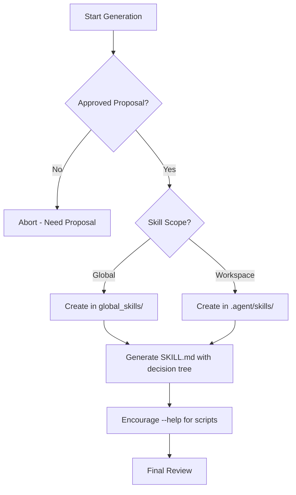

# Skill Scaffold Generator

## Purpose

Ensures that every new skill in the Antigravity ecosystem starts with a high-quality, standardized structure. This skill prevents "thin" or "vague" skills from entering the codebase.

## When to use this skill
- Immediately after a `skill-evolution-proposal` is approved
- When manually adding a new capability to the system
- When refactoring a large skill into smaller, focused ones

## Scaffolding Steps

1. **Create Directory**: Establish the folder in either `global_skills/` or `.agent/skills/`.
2. **Generate frontmatter**: Include `name`, `description`, `triggers`, `outputs`, and `depends_on`.
3. **Draft SKILL.md**: Use the standard sections: Purpose, When to Use, Instructions (Steps), Decision Tree, Review Checklist, and Feedback Guidelines.
4. **Register for Audit**: Trigger `orchestrator-self-auditor` to update the controller.

## Decision Tree

## Review Checklist

1. **Focus**: Does the new skill do exactly one thing?
2. **Completeness**: Are all 6 standard sections present in the `SKILL.md`?
3. **Logic**: Is there a Mermaid decision tree for complex paths?
4. **Black Box Compliance**: If scripts exist, is the `--help` instruction included?

## How to provide feedback
- **Be specific**: "The generated skill is missing the 'How to provide feedback' section."
- **Explain why**: "Standardized feedback ensures the Agent provides actionable advice during development."
- **Suggest alternatives**: "Recommend re-running the generator with the '--template-v2' flag."

Generated skills must follow antigravity standards.
