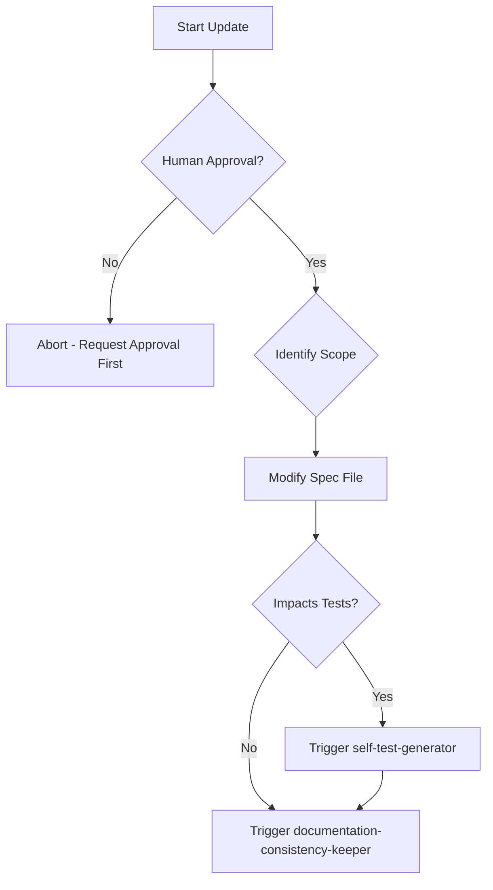

# Spec Auto Updater

## Purpose

Keeps specifications in sync with the actual, approved state of the implementation. This prevents the spec from becoming "dead documentation".

## When to use this skill
- After a spec change proposal has been approved by a human
- When intentional code behavior needs to be codified back into the spec
- After a `spec-violation-detector` session where "Update Spec" was the decided path

## Update Steps

1. **Locate Affected Sections**: Use IDs (e.g., AUTH-001) to find exactly where the change applies.
2. **Update Behavior Definitions**: Rewrite the Trigger, Action, or Postcondition to match reality.
3. **Preserve History**: Update the "Change Log" section of the spec with the version and reason.
4. **Flag Downstream Impacts**: Identify if this change requires updating tests or other documents via `documentation-consistency-keeper`.

## Decision Tree

## Review Checklist

1. **Traceability**: Does the update preserve the original requirement IDs?
2. **Clarity**: Is the new behavior described as clearly as the old one?
3. **Completeness**: Were all occurrences of the old behavior updated?
4. **Impact**: Does the change summary clearly state what was modified?

## How to provide feedback
- **Be specific**: "The change in AUTH-001 removes the timeout parameter without documenting the new default."
- **Explain why**: "Future developers won't know the default timeout is now 30s."
- **Suggest alternatives**: "Add 'Default timeout: 30s' to the revised AUTH-001 clause."

Specs must always match reality.
