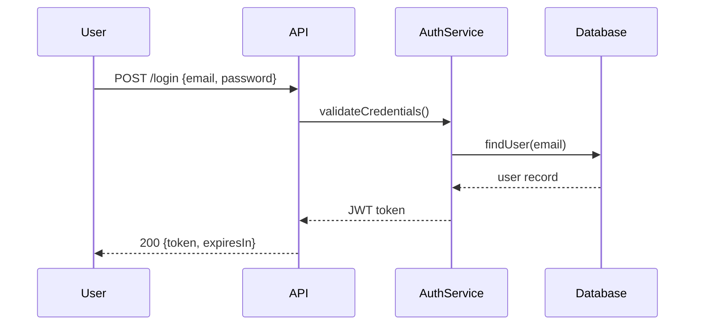

# Spec Driven Planning

## Purpose

Transforms vague requirements into **precise, implementable specifications**. The spec becomes the single source of truth that all implementation and testing is derived from.

---

## When to Use

- New features
- MVP definition
- High-risk changes
- Any work that needs explicit acceptance criteria

---

## Instructions

### 1. Define Goals and Non-Goals

Clearly state what is IN scope and what is OUT:

```markdown
## Goals
- User can authenticate with email/password
- Session persists for 24 hours
- Failed attempts are rate-limited

## Non-Goals
- Social login (deferred to Phase 2)
- Multi-factor authentication (out of scope)
- Password reset via SMS
```

### 2. Freeze Assumptions

Document all assumptions explicitly:

```markdown
## Assumptions (FROZEN)

| ID | Assumption | Rationale | Risk if Wrong |
|----|------------|-----------|---------------|
| A1 | Users have valid email addresses | Required for auth flow | HIGH - breaks registration |
| A2 | Network latency < 500ms | Standard SLA | MEDIUM - timeout issues |
| A3 | Database supports transactions | PostgreSQL confirmed | LOW - already verified |
```

### 3. Describe System Interactions

Map how components communicate:



### 4. Define Behaviors with IDs

Each behavior gets a unique ID for traceability:

```markdown
## Behaviors

### AUTH-001: User Login
**Trigger:** POST /api/login with valid credentials
**Precondition:** User exists in database
**Action:** Validate password, generate token
**Postcondition:** Return JWT with 24h expiry
**Error:** 401 if credentials invalid

### AUTH-002: Rate Limiting
**Trigger:** 5 failed login attempts in 1 minute
**Action:** Block further attempts for 5 minutes
**Postcondition:** Return 429 Too Many Requests
```

### 5. Block Coding Until Spec is Stable

```
⚠️ SPEC STATUS: DRAFT
Do not begin implementation until status changes to FROZEN.
```

---

## Spec Template

```markdown
# Specification: [Feature Name]

**Version:** 1.0
**Status:** DRAFT | REVIEW | FROZEN
**Author:** [name]
**Date:** [date]

## Overview
Brief description of what this spec covers.

## Goals
- Goal 1
- Goal 2

## Non-Goals
- Explicitly out of scope item 1
- Explicitly out of scope item 2

## Assumptions
| ID | Assumption | Risk Level |
|----|------------|------------|
| A1 | ... | HIGH/MEDIUM/LOW |

## Behaviors

### [FEATURE-001]: [Behavior Name]
- **Trigger:** What initiates this behavior
- **Precondition:** What must be true before
- **Action:** What happens
- **Postcondition:** What is true after
- **Errors:** What can go wrong

### [FEATURE-002]: [Next Behavior]
...

## Data Models

### [Entity Name]
| Field | Type | Constraints | Description |
|-------|------|-------------|-------------|
| id | UUID | PK, auto-gen | Unique identifier |
| ... | ... | ... | ... |

## API Contracts

### POST /api/[endpoint]
**Request:**
```json
{
  "field": "type"
}
```

**Response (200):**
```json
{
  "result": "type"
}
```

**Errors:**
- 400: Invalid request
- 401: Unauthorized
- 500: Server error

## Open Questions
- [ ] Question that needs resolution before FROZEN

## Change Log
| Version | Date | Author | Changes |
|---------|------|--------|---------|
| 1.0 | YYYY-MM-DD | Name | Initial draft |
```

---

## Spec Lifecycle

```
DRAFT → REVIEW → FROZEN → (AMENDED if changes needed)
  │        │        │
  ▼        ▼        ▼
Write   Validate  Implement
```

| Status | Meaning |
|--------|---------|
| DRAFT | Work in progress, expect changes |
| REVIEW | Ready for stakeholder review |
| FROZEN | Locked, implementation may begin |
| AMENDED | Changed after freeze (requires approval) |

---

## Integration

- **Precedes:** `controlled-task-decomposition`, `implementation-boundary-guard`
- **Follows:** `project-vision-normalizer`, `mvp-scope-guard`
- **Validated by:** `workspace-spec-linter`

---

## Constraints

- NO coding until spec is FROZEN
- ALL assumptions must be explicit
- ALL behaviors must have IDs
- Spec changes after freeze require `spec-auto-updater`

Specs are the single source of truth.
