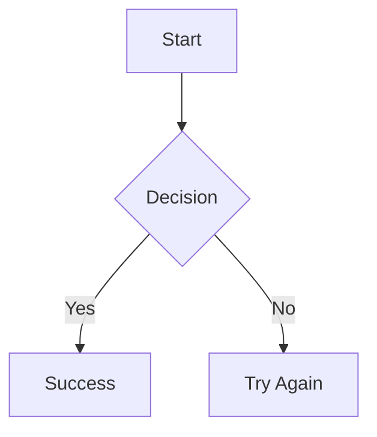

# Streamdown API Reference

Complete reference for Streamdown props, types, and plugin configurations.

## StreamdownProps Interface

```typescript
interface StreamdownProps {
  // Content
  children: string;                              // Markdown content to render

  // Streaming
  isAnimating?: boolean;                         // Disable controls during streaming (default: false)
  mode?: 'streaming' | 'static';                 // Rendering mode (default: 'streaming')
  parseIncompleteMarkdown?: boolean;             // Enable remend preprocessor (default: true)

  // Theming
  shikiTheme?: [BundledTheme, BundledTheme];     // [lightTheme, darkTheme]
  className?: string;                            // Container CSS class

  // Features
  controls?: ControlsConfig | boolean;           // Interactive button visibility
  mermaid?: MermaidOptions;                      // Diagram configuration
  components?: Partial<Components>;              // Custom element overrides

  // Plugins
  remarkPlugins?: Pluggable[];                   // Markdown preprocessing
  rehypePlugins?: Pluggable[];                   // HTML processing

  // Advanced
  BlockComponent?: React.ComponentType<BlockProps>;
  parseMarkdownIntoBlocksFn?: (markdown: string) => string[];
}
```

## ControlsConfig Interface

```typescript
type ControlsConfig = {
  code?: boolean;           // Copy button on code blocks (default: true)
  table?: boolean;          // Download button on tables (default: true)
  mermaid?: MermaidControls | boolean;
};

type MermaidControls = {
  copy?: boolean;           // Copy diagram source (default: true)
  download?: boolean;       // Download as SVG (default: true)
  fullscreen?: boolean;     // Fullscreen view (default: true)
  panZoom?: boolean;        // Pan/zoom controls (default: true)
};
```

**Examples:**

```tsx
// Enable all controls
<Streamdown controls={true}>{content}</Streamdown>

// Disable all controls
<Streamdown controls={false}>{content}</Streamdown>

// Granular control
<Streamdown
  controls={{
    code: true,
    table: false,
    mermaid: { fullscreen: true, download: true, copy: false, panZoom: false },
  }}
>
  {content}
</Streamdown>
```

## MermaidOptions Interface

```typescript
interface MermaidOptions {
  config?: MermaidConfig;
  errorComponent?: React.ComponentType<MermaidErrorComponentProps>;
}

interface MermaidErrorComponentProps {
  error: string;            // Error message from Mermaid
  chart: string;            // Original diagram source
  retry: () => void;        // Function to retry rendering
}

// MermaidConfig is the official Mermaid configuration type
interface MermaidConfig {
  theme?: 'default' | 'dark' | 'forest' | 'neutral' | 'base';
  themeVariables?: {
    fontFamily?: string;
    fontSize?: string;
    primaryColor?: string;
    primaryTextColor?: string;
    primaryBorderColor?: string;
    lineColor?: string;
    secondaryColor?: string;
    tertiaryColor?: string;
    // ... many more theme variables
  };
  flowchart?: {
    nodeSpacing?: number;
    rankSpacing?: number;
    curve?: 'basis' | 'linear' | 'cardinal';
  };
  sequence?: {
    actorMargin?: number;
    boxMargin?: number;
    boxTextMargin?: number;
  };
  // ... other diagram-specific configs
}
```

## Default Plugins

### Default Remark Plugins

Access via `import { defaultRemarkPlugins } from 'streamdown'`:

| Plugin | Purpose | Configuration |
|--------|---------|---------------|
| `gfm` | GitHub Flavored Markdown | Tables, task lists, strikethrough, autolinks |
| `math` | Math syntax support | `{ singleDollarTextMath: false }` |
| `cjkFriendly` | CJK text emphasis | Handles ideographic punctuation |
| `cjkFriendlyGfmStrikethrough` | CJK strikethrough | Proper strikethrough with CJK chars |

```tsx
import { defaultRemarkPlugins } from 'streamdown';

// Access individual plugins
const plugins = [
  defaultRemarkPlugins.gfm,
  defaultRemarkPlugins.math,
  defaultRemarkPlugins.cjkFriendly,
  defaultRemarkPlugins.cjkFriendlyGfmStrikethrough,
];

// Or use all defaults
const allPlugins = Object.values(defaultRemarkPlugins);
```

### Default Rehype Plugins

Access via `import { defaultRehypePlugins } from 'streamdown'`:

| Plugin | Purpose | Configuration |
|--------|---------|---------------|
| `raw` | HTML support | Preserves raw HTML in markdown |
| `katex` | Math rendering | `{ errorColor: 'var(--color-muted-foreground)' }` |
| `harden` | Security hardening | Link/image protocol restrictions |

```tsx
import { defaultRehypePlugins } from 'streamdown';

// Access individual plugins
const plugins = [
  defaultRehypePlugins.raw,
  defaultRehypePlugins.katex,
  defaultRehypePlugins.harden,
];
```

### Harden Plugin Options

```typescript
interface HardenOptions {
  allowedImagePrefixes?: string[];    // Default: ['*'] (all allowed)
  allowedLinkPrefixes?: string[];     // Default: ['*'] (all allowed)
  allowedProtocols?: string[];        // Default: ['*'] (all allowed)
  defaultOrigin?: string;             // Origin for relative URLs
  allowDataImages?: boolean;          // Default: true
}
```

## Custom Components

Override any markdown element via the `components` prop:

```typescript
interface Components {
  // Headings
  h1: React.ComponentType<HeadingProps>;
  h2: React.ComponentType<HeadingProps>;
  h3: React.ComponentType<HeadingProps>;
  h4: React.ComponentType<HeadingProps>;
  h5: React.ComponentType<HeadingProps>;
  h6: React.ComponentType<HeadingProps>;

  // Text
  p: React.ComponentType<ParagraphProps>;
  strong: React.ComponentType<StrongProps>;
  em: React.ComponentType<EmphasisProps>;

  // Links & Code
  a: React.ComponentType<AnchorProps>;
  code: React.ComponentType<CodeProps>;
  pre: React.ComponentType<PreProps>;

  // Lists
  ul: React.ComponentType<ListProps>;
  ol: React.ComponentType<ListProps>;
  li: React.ComponentType<ListItemProps>;

  // Blocks
  blockquote: React.ComponentType<BlockquoteProps>;
  hr: React.ComponentType<HRProps>;

  // Tables
  table: React.ComponentType<TableProps>;
  thead: React.ComponentType<TheadProps>;
  tbody: React.ComponentType<TbodyProps>;
  tr: React.ComponentType<TRProps>;
  th: React.ComponentType<THProps>;
  td: React.ComponentType<TDProps>;

  // Media
  img: React.ComponentType<ImageProps>;

  // Other
  sup: React.ComponentType<SupProps>;
  sub: React.ComponentType<SubProps>;
  section: React.ComponentType<SectionProps>;
}
```

**Example: Custom Link Component**

```tsx
<Streamdown
  components={{
    a: ({ href, children, ...props }) => {
      const isExternal = href?.startsWith('http');
      return (
        <a
          href={href}
          target={isExternal ? '_blank' : undefined}
          rel={isExternal ? 'noopener noreferrer' : undefined}
          className="text-primary hover:underline"
          {...props}
        >
          {children}
          {isExternal && ' ↗'}
        </a>
      );
    },
  }}
>
  {content}
</Streamdown>
```

## Data Attributes for CSS

Streamdown adds `data-streamdown` attributes for CSS targeting:

| Selector | Element |
|----------|---------|
| `[data-streamdown="heading-1"]` | h1 |
| `[data-streamdown="heading-2"]` | h2 |
| `[data-streamdown="heading-3"]` | h3 |
| `[data-streamdown="heading-4"]` | h4 |
| `[data-streamdown="heading-5"]` | h5 |
| `[data-streamdown="heading-6"]` | h6 |
| `[data-streamdown="strong"]` | strong/bold |
| `[data-streamdown="link"]` | anchor links |
| `[data-streamdown="inline-code"]` | inline code |
| `[data-streamdown="ordered-list"]` | ol |
| `[data-streamdown="unordered-list"]` | ul |
| `[data-streamdown="list-item"]` | li |
| `[data-streamdown="blockquote"]` | blockquote |
| `[data-streamdown="horizontal-rule"]` | hr |
| `[data-streamdown="code-block"]` | code block container |
| `[data-streamdown="mermaid-block"]` | mermaid diagram container |
| `[data-streamdown="table-wrapper"]` | table container |
| `[data-streamdown="table"]` | table |
| `[data-streamdown="table-header"]` | thead |
| `[data-streamdown="table-body"]` | tbody |
| `[data-streamdown="table-row"]` | tr |
| `[data-streamdown="table-header-cell"]` | th |
| `[data-streamdown="table-cell"]` | td |
| `[data-streamdown="superscript"]` | sup |
| `[data-streamdown="subscript"]` | sub |

**Example CSS:**

```css
/* Custom code block styling */
[data-streamdown="code-block"] {
  border: 1px solid hsl(var(--border));
  border-radius: var(--radius);
  background-color: hsl(var(--muted));
}

/* Custom blockquote */
[data-streamdown="blockquote"] {
  border-left: 3px solid hsl(var(--primary));
  padding-left: 1rem;
  font-style: italic;
}
```

## Shiki Themes

Common theme pairs for `shikiTheme`:

```typescript
import type { BundledTheme } from 'shiki';

// Popular combinations
const themes: Record<string, [BundledTheme, BundledTheme]> = {
  github: ['github-light', 'github-dark'],
  vitesse: ['vitesse-light', 'vitesse-dark'],
  nord: ['nord', 'nord'],
  dracula: ['min-light', 'dracula'],
  monokai: ['min-light', 'monokai'],
  oneDark: ['one-light', 'one-dark-pro'],
};
```

See [Shiki Themes](https://shiki.style/themes) for the complete list.

## Math Syntax

Streamdown uses double `$` delimiters (single `$` disabled to avoid currency conflicts):

```markdown
Inline math: $E = mc^2$

Block math:
$$
\int_{-\infty}^{\infty} e^{-x^2} dx = \sqrt{\pi}
$$
```

## Mermaid Diagram Types

Supported diagram types:

- Flowchart (`graph TD/LR/BT/RL`)
- Sequence diagram (`sequenceDiagram`)
- State diagram (`stateDiagram-v2`)
- Class diagram (`classDiagram`)
- Entity relationship (`erDiagram`)
- Gantt chart (`gantt`)
- Pie chart (`pie`)
- Git graph (`gitGraph`)

````markdown

````
