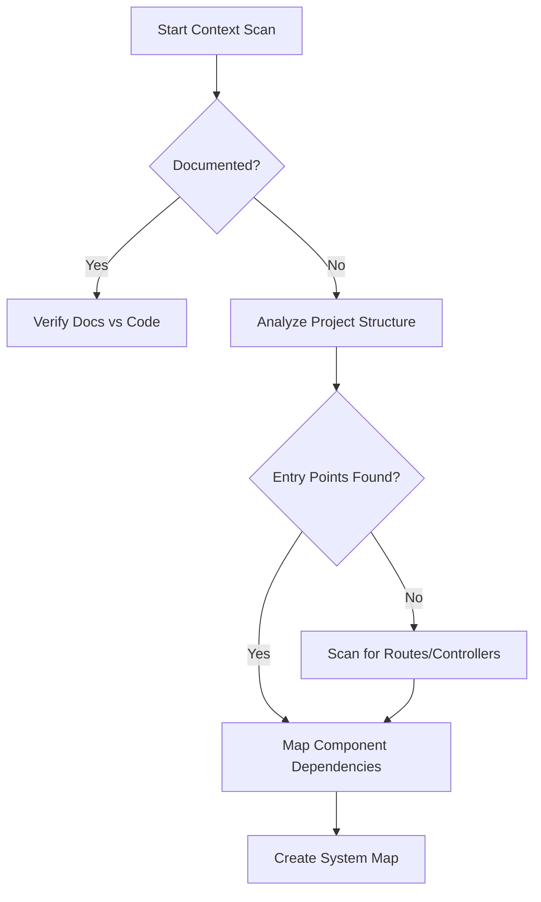

# System Context Extractor

## Purpose

Builds a comprehensive understanding of a system's structure and environment. This skill separates "the signal from the noise" in a legacy codebase, allowing for safer modifications.

## When to use this skill
- When first encountering a legacy or inherited codebase
- Before starting a multi-module migration
- When auditing a system for security or performance

## Extraction Steps

1. **Identify System Boundaries**: Where does the system interact with the outside world? (APIs, DBs, 3rd party services).
2. **Separate Concerns**: Identify which folders/files handle Business Logic vs. Infrastructure (Logging, ORM) vs. Tooling (CI/CD).
3. **Identify Critical Components**: Which modules, if broken, would cause a total system failure?
4. **Record Unknowns**: Explicitly list files or patterns that are not yet understood.

## Decision Tree

## Review Checklist

1. **Hierarchy**: Is the relationship between parent and child components clear?
2. **Ownership**: Is it clear which service "owns" which data?
3. **Communication**: Are the protocols (REST, gRPC, Pub/Sub) documented?
4. **Tech Stack**: Are all languages, frameworks, and versions identified?

## How to provide feedback
- **Be specific**: "The context map misses the background worker that processes the 'order-queue'."
- **Explain why**: "Without identifying this worker, we might break asynchronous order processing during migration."
- **Suggest alternatives**: "Recommend scanning for `BullMQ` or `RabbitMQ` listener signatures."

Do not propose improvements. Observation only.
