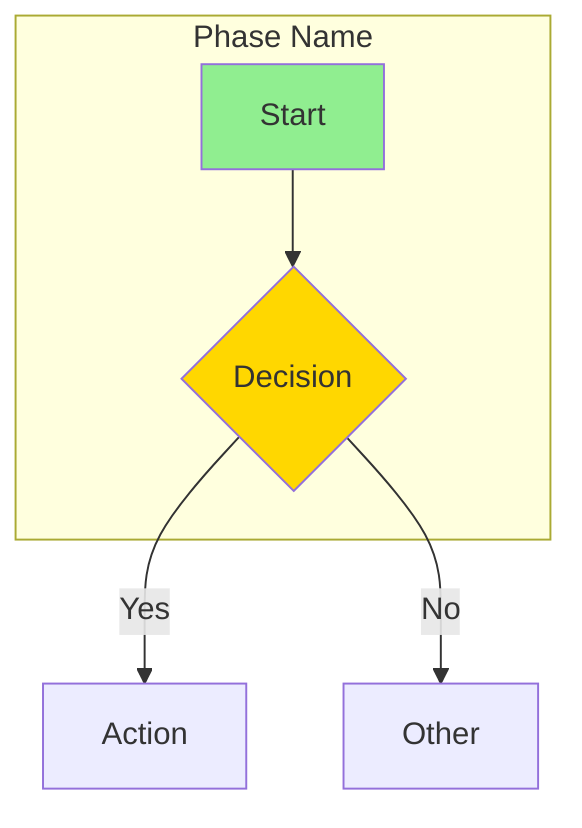
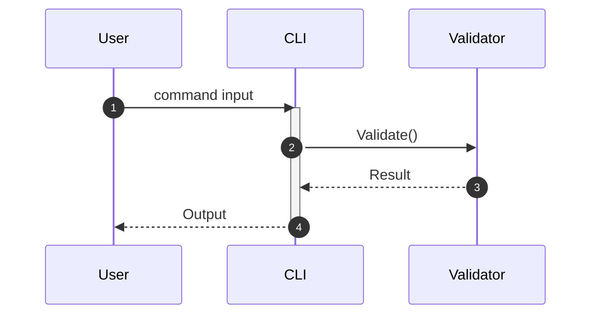

# Technical Writer Skill

Expert communication craftsperson for the morphir-dotnet project. Master of Hugo/Docsy, Mermaid/PlantUML diagrams, and technical writing.

## Overview

This skill provides comprehensive documentation capabilities including:
- Hugo static site generator configuration and troubleshooting
- Docsy theme customization and navigation
- Mermaid and PlantUML diagram creation
- API documentation (XML docs)
- Tutorial and guide writing
- Style guide enforcement
- Content governance and auditing

## Files

### Core
- **SKILL.md** - Main skill prompt with documentation guidelines, decision trees, and playbooks
- **README.md** - This quick reference guide
- **MAINTENANCE.md** - Quarterly review and evolution process

### Scripts (`.claude/skills/technical-writer/scripts/`)
| Script | Purpose | Savings |
|--------|---------|---------|
| link-validator.fsx | Validate documentation links | ~600 tokens |
| example-freshness.fsx | Check code examples compile | ~800 tokens |
| doc-coverage.fsx | Analyze API documentation coverage | ~700 tokens |
| style-checker.fsx | Check documentation style consistency | ~500 tokens |
| hugo-doctor.fsx | Diagnose Hugo build issues | ~1000 tokens |
| diagram-validator.fsx | Validate Mermaid/PlantUML diagrams | ~700 tokens |
| common.fsx | Shared utilities | - |

### Templates (`templates/`)
- **content/** - API docs, tutorials, ADRs, What's New, troubleshooting
- **hugo/** - Section index, frontmatter guide, shortcode examples
- **diagrams/** - Mermaid and PlantUML templates

### Patterns (`patterns/`)
- **content/** - API documentation, code examples, CLI docs, configuration
- **hugo-docsy/** - Navigation, landing pages, customization, troubleshooting
- **visual/** - Diagram selection, Mermaid best practices, visual storytelling

## Usage

### Using the Skill

To invoke the Technical Writer skill in Claude Code:

```
@skill technical-writer
Please help me fix this Hugo build error
```

```
@skill technical-writer
Create a sequence diagram showing the IR validation flow
```

```
@skill technical-writer
Document the new CLI command we just added
```

### Running Scripts

```bash
# Validate documentation links
dotnet fsi .claude/skills/technical-writer/scripts/link-validator.fsx

# Check if code examples still compile
dotnet fsi .claude/skills/technical-writer/scripts/example-freshness.fsx

# Diagnose Hugo build issues
dotnet fsi .claude/skills/technical-writer/scripts/hugo-doctor.fsx
```

### Common Hugo Commands

```bash
cd docs

# Start development server
hugo server -D

# Build with verbose output
hugo --verbose

# Update modules
hugo mod get -u

# Clean modules
hugo mod tidy

# Clear cache
rm -rf resources/_gen/
```

## Quick Reference

### Decision Tree: What diagram type?

| You're Showing | Use |
|----------------|-----|
| Process/workflow | Mermaid Flowchart |
| Component interactions | Mermaid Sequence |
| Type relationships | Mermaid Class |
| State transitions | Mermaid State |
| Data relationships | Mermaid ER |
| Architecture (high-level) | Mermaid Flowchart + subgraphs |
| Architecture (detailed) | PlantUML Component |
| Timeline | Mermaid Gantt |

### Decision Tree: Hugo not building?

| Error mentions | Check |
|----------------|-------|
| "module" | Run `hugo mod tidy && hugo mod get -u` |
| "template"/"shortcode" | Verify closing tags, check `{}` vs `` |
| "frontmatter"/"YAML" | Check YAML syntax, ensure `title` exists |
| "page not found" | Verify path, check case sensitivity |
| Site looks wrong | Clear `resources/_gen/`, check SCSS |
| Navigation wrong | Check `_index.md` files, verify `weight` |

### Hugo Frontmatter Template

```yaml
---
title: "Descriptive Page Title"
linkTitle: "Short Title"
description: "One-line description"
weight: 10
date: 2025-01-15
toc: true
---
```

### Mermaid Flowchart Template



### Mermaid Sequence Template



## Playbooks

### 1. New Feature Documentation
Document a new feature with API docs, guides, and examples.

### 2. Hugo/Docsy Troubleshooting
Diagnose and fix Hugo build failures.

### 3. Creating Effective Diagrams
Create clear, compelling visualizations.

### 4. Documentation Audit
Quarterly review of documentation health.

### 5. Release Documentation
Prepare What's New and update version references.

See **SKILL.md** for detailed playbook steps.

## Integration

### With Release Manager
- Prepare release notes and What's New
- Review changelog formatting
- Update version references

### With QA Tester
- Verify documentation matches behavior
- Update test documentation
- Document test procedures

### With AOT Guru
- Maintain AOT/trimming documentation
- Document patterns discovered

### With Development Agents
- Sync API docs with code changes
- Update examples when APIs change

## Best Practices

1. **Every section needs `_index.md`** - Required for Hugo navigation
2. **Use `weight` for ordering** - Lower numbers appear first
3. **Keep diagrams focused** - Under 15 nodes, split if larger
4. **Test all examples** - Code that doesn't work erodes trust
5. **Use relative links** - More portable than absolute URLs
6. **Clear cache when stuck** - `rm -rf resources/_gen/`
7. **Style via SCSS, not Docsy** - Never modify theme directly

## Examples

### Fix Hugo Build Error
```
@skill technical-writer
I'm getting "failed to extract shortcode: template for shortcode 'alert' not found"
```

### Create Diagram
```
@skill technical-writer
Create a diagram showing how the morphir CLI processes an IR file through validation
```

### Document API
```
@skill technical-writer
Add XML documentation to the SchemaValidator class in Morphir.Tooling
```

### Audit Documentation
```
@skill technical-writer
Run a documentation audit and report any issues
```

## See Also

- [SKILL.md](./SKILL.md) - Full skill documentation
- [Requirements Document](../../../docs/content/contributing/design/technical-writer-skill-requirements.md)
- [Hugo Configuration](../../../docs/hugo.toml)
- [AGENTS.md](../../../AGENTS.md) - Primary guidance
- [Hugo Docs](https://gohugo.io/documentation/)
- [Docsy Docs](https://www.docsy.dev/docs/)
- [Mermaid Docs](https://mermaid.js.org/intro/)
