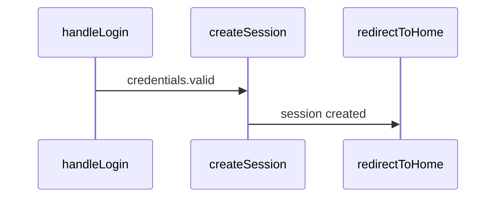

# UltraCode Tracing — Claude Code Skill

**Auto-activated for**: Debugging, "why not called", flow analysis, state dependencies

Static analysis of code execution flow without running the code.

## When to Use

| Question | Tool | Returns |
|----------|------|---------|
| "How does code get from A to B?" | `trace_flow` | Paths, states, conditions, Mermaid |
| "Why isn't this method called?" | `trace_backwards` | Callers, blocking conditions, diagnosis |
| "How does data affect state?" | `trace_data_flow` | Sources, transformations, behavior matrix |
| "What changes with different values?" | `analyze_state_impact` | Scenarios, conflicts, ripple effects |
| "What conditions affect this scenario?" | `find_decision_points` | Decision points with classification |

---

## trace_flow — Trace from A to B

Find all execution paths between two points:

```typescript
trace_flow({
  from: "handleLogin",
  to: "redirectToHome",
  trackStates: true,     // Track state changes
  trackConditions: true, // Track branches
  maxDepth: 15,
  format: "mermaid"      // sequence | tree | graph | mermaid
})
```

**Returns:**
- Paths with confidence scores
- State changes at each step
- Conditions and branches
- Mermaid sequence diagram

---

## trace_backwards — Why Not Called?

Understand why a method isn't being called:

```typescript
trace_backwards({
  target: "FinishTask",
  question: "why_not_called", // | "what_affects" | "dependencies"
  depth: 15,
  includeStates: true
})
```

**Question types:**
- `why_not_called` — find blocking conditions
- `what_affects` — all dependencies
- `dependencies` — full dependency graph

**Returns:**
- List of callers with probability (always/conditional/rare)
- Blocking conditions with recommendations
- State dependencies
- Call chains
- Diagnosis with suggested debug points

---

## trace_data_flow — Data Flow

Trace how data affects target state:

```typescript
trace_data_flow({
  entryPoint: "AppInit",
  targetState: "startPage",
  dataSources: ["config", "api:fetchUser"], // auto-detect if empty
  trackTransformations: true
})
```

**Data sources (auto-detect):**
- API: fetch, axios, http
- Storage: localStorage, database
- Props: props, input, param
- State: state, store, redux
- Config: config, settings, env

**Returns:**
- Data flows from sources
- Transformations (parse, map, validate)
- Branches based on data
- Behavior matrix for different inputs

---

## analyze_state_impact — State Impact

Understand how state affects different scenarios:

```typescript
analyze_state_impact({
  state: "user.isAuthenticated",
  scenarios: [
    { value: true, label: "logged in" },
    { value: false, label: "logged out" }
  ]
})
```

**Returns:**
- All state usages (read/write/condition)
- For each scenario:
  - Available paths
  - Blocked paths
  - Enabled features
- Conflicts (multiple writers, race conditions)
- Ripple effects (direct and indirect)

---

## find_decision_points — Decision Points

Find all places where code makes decisions:

```typescript
find_decision_points({
  scenario: "checkout flow",
  includeGuards: true,
  includeEffects: true,
  groupBy: "impact" // | "location" | "type"
})
```

**Decision point types:**
- `validation` — input validation
- `api_response` — API response handling
- `state_mutation` — state changes
- `guard` — guard conditions (early return)
- `loop` — loop control
- `error_handling` — try-catch
- `feature_flag` — feature toggles

**Impact levels:**
- `critical` — blocks execution
- `high` — significant impact
- `medium` — moderate impact
- `low` — minimal impact

**Returns:**
- Decision points with classification
- Mermaid flowchart
- Summary: total, critical, possible outcomes

---

## Usage Examples

### Debugging: Why Doesn't It Fire?

```typescript
// Step 1: Find blocking conditions
trace_backwards({
  target: "sendNotification",
  question: "why_not_called"
})
// → Finds: "user.preferences.notifications === false" blocks

// Step 2: Check setting impact
analyze_state_impact({
  state: "user.preferences.notifications",
  scenarios: [
    { value: true, label: "enabled" },
    { value: false, label: "disabled" }
  ]
})
// → Shows which paths are open/closed for each value
```

### Understanding: How Does Data Affect UI?

```typescript
trace_data_flow({
  entryPoint: "loadDashboard",
  targetState: "dashboardData"
})
// → Shows: API → parse → validate → setState
// → Matrix: if API error → fallback state
```

### Refactoring: Where to Change Logic?

```typescript
find_decision_points({
  scenario: "user authentication",
  groupBy: "impact"
})
// → List of all if/switch/guards related to auth
// → Grouped by importance
```

---

## Output Formats

### Text (default)
```
═══ Trace Flow: handleLogin → redirectToHome ═══

Found 2 path(s):

─── Path 1 (confidence: 85%) ───
Summary: Login flow via session creation

  1. → handleLogin (/src/auth.ts:10)
     └─ if: credentials.valid
  2. → createSession (/src/session.ts:5)
     └─ isAuthenticated: false → true
  3. → redirectToHome (/src/router.ts:100)

─── States ───
Modified: isAuthenticated, currentSession
```

### Mermaid


---

## Semantic Integration

Tracing automatically uses semantic search (if available) for:
- Fuzzy search of entry/exit points by description
- Improved analysis quality
- Natural language queries

```typescript
trace_flow({
  from: "user login handler",  // Semantic search finds handleLogin
  to: "home page redirect"     // Finds redirectToHome
})
```

---

## Tool Reference

### `trace_flow`

| Param | Type | Default | Description |
|-------|------|---------|-------------|
| `from` | string | **required** | Starting point (function or semantic query) |
| `to` | string | **required** | Ending point |
| `format` | enum | "sequence" | `sequence` / `tree` / `graph` / `mermaid` |
| `maxDepth` | number | 15 | Maximum traversal depth |
| `trackStates` | boolean | true | Track state changes |
| `trackConditions` | boolean | true | Track conditions/branches |

### `trace_backwards`

| Param | Type | Default | Description |
|-------|------|---------|-------------|
| `target` | string | **required** | Target method |
| `question` | enum | **required** | `why_not_called` / `what_affects` / `dependencies` |
| `depth` | number | 15 | Backward traversal depth |
| `includeStates` | boolean | true | Include state dependencies |
| `includeEffects` | boolean | true | Include side effects |

### `trace_data_flow`

| Param | Type | Default | Description |
|-------|------|---------|-------------|
| `entryPoint` | string | **required** | Entry point function |
| `targetState` | string | **required** | Target state to trace |
| `dataSources` | string[] | auto | Data sources to analyze |
| `trackTransformations` | boolean | true | Track data transformations |

### `analyze_state_impact`

| Param | Type | Default | Description |
|-------|------|---------|-------------|
| `state` | string | **required** | State variable |
| `scenarios` | object[] | **required** | `[{value, label}]` |
| `scope` | string | - | Analysis scope (semantic query) |

### `find_decision_points`

| Param | Type | Default | Description |
|-------|------|---------|-------------|
| `scenario` | string | **required** | Scenario to analyze |
| `groupBy` | enum | "impact" | `impact` / `location` / `type` |
| `includeGuards` | boolean | true | Include guard conditions |
| `includeEffects` | boolean | true | Include side effects |

---

## Related Skills

- **`ultracode`** — Code analysis, semantic search, refactoring, code modification
- **`ultracode-autodoc`** — Working with `.autodoc/` directory
